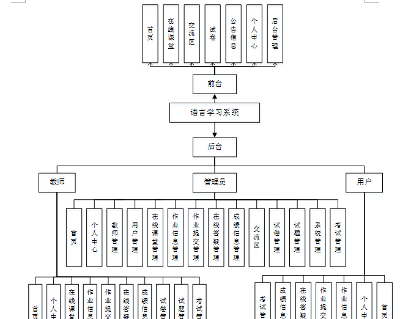

ssm+Vue计算机毕业设计语言学习系统（程序+LW文档）

**项目运行**

**环境配置：**

**Jdk1.8 + Tomcat7.0 + Mysql + HBuilderX** **（Webstorm也行）+ Eclispe（IntelliJ
IDEA,Eclispe,MyEclispe,Sts都支持）。**

**项目技术：**

**SSM + mybatis + Maven + Vue** **等等组成，B/S模式 + Maven管理等等。**

**环境需要**

**1.** **运行环境：最好是java jdk 1.8，我们在这个平台上运行的。其他版本理论上也可以。**

**2.IDE** **环境：IDEA，Eclipse,Myeclipse都可以。推荐IDEA;**

**3.tomcat** **环境：Tomcat 7.x,8.x,9.x版本均可**

**4.** **硬件环境：windows 7/8/10 1G内存以上；或者 Mac OS；**

**5.** **是否Maven项目: 否；查看源码目录中是否包含pom.xml；若包含，则为maven项目，否则为非maven项目**

**6.** **数据库：MySql 5.7/8.0等版本均可；**

**毕设帮助，指导，本源码分享，调试部署** **(** **见文末** **)**

### 总体设计

根据语言学习系统功能需求，进行系统设计。

CSS+DIV进行页面布局。CSS+DIV
是一种网页的布局方法,这一种网页布局方法有别于传统的HTML网页设计语言中的表格（Table）定位方式,真正地达到了w3c内容与表现相分离，但是不是很兼容老版本的浏览器。

使用 JAVA 母版页可以为应用程序中的页创建一致的布局，各个模块继承母版页。

后台由管理员，教师和用户三个角色组成，主要功能包括首页，个人中心，教师管理，用户管理，在线课堂管理，作业信息管理，作业提交管理，在线答疑管理，成绩信息管理，交流区，试卷管理，试题管理，系统管理，考试管理等；

系统对这些功能进行整合，产生的功能结构图如下：

图4-1 系统总体结构图

### 4.2数据库设计

#### 4.2.1概念模型设计

概念模型是对现实中的问题出现的事物的进行描述，ER图是由实体及其关系构成的图，通过E-R图可以清楚地描述系统涉及到的实体之间的相互关系。

教师管理实体图如图4-2所示：

图4-2教师管理实体图

用户管理实体图如图4-3所示：

图4-3用户管理实体图

在线课堂管理实体图如图4-4所示：

图4-4在线课堂管理实体图

### 登录功能模块

运行系统，首先进入登录界面，按照登录界面的要求填写相应的“用户名”和“密码”以及用户类型，点击“登录”然后系统判断填写是否正确，若正确进入相应的界面，否则给出要求先注册信息。具体流程如图5-1所示

图5-1登录流程图

### 5.2系统功能模块

语言学习系统登录后，可以对首页，在线课堂，交流区，试卷，公告信息，个人中心，后台管理等功能进行相应的操作管理，如图5-2所示。

图5-2系统首页界面图

用户注册，在用户注册页面可以填写用户账号，密码，再次密码，用户姓名，手机号码等信息进行注册操作，如图5-3所示。

图5-3用户注册界面图

在线课堂，在在线课堂页面可以对课程名称，课程简介，发布时间，教师工号，教师姓名，听说播放，读写播放，课程文件等内容进行在线答疑或下载等操作，如图5-4所示

图5-4在线课堂界面图

个人中心，在个人中心页面可以对用户账号，密码，用户姓名，上传图片，性别，手机号码等内容进行更新信息操作，还可以对我的发布，考试记录和错题本进行详细的操作，如图5-5所示。

图5-5个人中心界面图

### 5.3 管理员功能模块

管理员进行登录，进入系统前在登录页面根据要求填写用户名和密码，选择角色等信息，点击登录进行登录操作，如图5-6所示。

图5-6管理员登录界面图

管理员登录系统后，可以对首页，个人中心，教师管理，用户管理，在线课堂管理，作业信息管理，作业提交管理，在线答疑管理，成绩信息管理，交流区，试卷管理，试题管理，系统管理，考试管理等功能进行相应的操作管理，如图5-7所示。

图5-7管理员功能界面图

教师管理，在教师管理页面可以对索引，教师编号，头像，教师姓名，性别，手机号码，邮箱，职务等内容进行详情,修改和删除操作，如图5-8所示。

图5-8教师管理界面图

用户管理，在用户管理页面可以对索引，用户账号，用户姓名，头像，性别，手机号码等信息进行详情，修改和删除操作，如图5-9所示。

图5-9用户管理界面图

在线课堂管理，在在线课堂管理页面可以对索引，课程名称，封面，听说播放，读写播放，课程文件，发布时间，教师工号，教师姓名等信息进行详和删除操作，如图5-10所示。

图5-10在线课堂管理界面图

作业信息管理，在作业信息管理页面可以对索引，课程名称，作业名称，作业文件，发布时间，教师工号，教师姓名等内容进行详情和删除操作，如图5-11所示。

图5-11作业信息管理界面图

考试管理，在考试记页面可以对姓名，试卷，考试得分等内容进行查看详情操作，还可以对试卷列表和错题本进行详细的操作，如图5-12所示。

图5-12考试管理界面图

#### **JAVA** **毕设帮助，指导，源码分享，调试部署**

