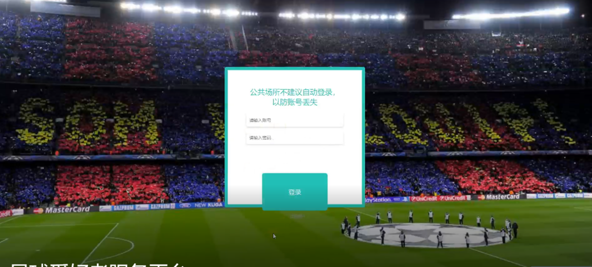

ssm+Vue计算机毕业设计足球爱好者服务平台（程序+LW文档）

**项目运行**

**环境配置：**

**Jdk1.8 + Tomcat7.0 + Mysql + HBuilderX** **（Webstorm也行）+ Eclispe（IntelliJ
IDEA,Eclispe,MyEclispe,Sts都支持）。**

**项目技术：**

**SSM + mybatis + Maven + Vue** **等等组成，B/S模式 + Maven管理等等。**

**环境需要**

**1.** **运行环境：最好是java jdk 1.8，我们在这个平台上运行的。其他版本理论上也可以。**

**2.IDE** **环境：IDEA，Eclipse,Myeclipse都可以。推荐IDEA;**

**3.tomcat** **环境：Tomcat 7.x,8.x,9.x版本均可**

**4.** **硬件环境：windows 7/8/10 1G内存以上；或者 Mac OS；**

**5.** **是否Maven项目: 否；查看源码目录中是否包含pom.xml；若包含，则为maven项目，否则为非maven项目**

**6.** **数据库：MySql 5.7/8.0等版本均可；**

**毕设帮助，指导，本源码分享，调试部署** **(** **见文末** **)**

### 功能结构

为了更好的去理清本系统整体思路，对该系统以结构图的形式表达出来，设计实现该足球爱好者服务平台的功能结构图如下所示：

图4-1 系统总体结构图

### 4.2 数据库设计

#### 4.2.1 数据库E/R图

ER图是由实体及其关系构成的图，通过E/R图可以清楚地描述系统涉及到的实体之间的相互关系。在系统中对一些主要的几个关键实体如下图：

(1) 用户注册E/R图如下所示：

图4-2用户注册E/R图

(2)我的订单E/R图如下所示：

图4-3我的订单E/R图

(3) 购物车E/R图如下所示：

图4-4购物车E/R图

### 系统功能模块

足球爱好者服务平台，在网站首页可以查看首页，商品信息，比赛信息，场地信息，球队信息，动态论坛，公告咨询，意见反馈，个人中心，后台管理，购物车等内容，并进行详细操作；如图5-1所示。

图5-1网站首页界面图

用户注册，在用户注册页面通过填写用户名，密码，确认密码，姓名，手机，邮箱等信息进行注册操作，如图5-2所示。

图5-2用户注册界面图

我的发布，在我的发布页面可以查看标题，发布时间详情等内容，并进行修改，删除

操作，如图5-3所示。

图5-3我的发布界面图

我的地址，在我的地址页面通过填写联系人，手机号码，地址，默认等内容进行修改，删除等操作；如图5-4所示。

图5-4我的地址界面图

购物车，在购物车页面可以查看购买商品，价格，数量，总价等内容，并进行点击购买或删除等操作；如图5-5所示。

图5-5购物车界面图

### 5.2后台功能模块

后台登录，管理员和用户进入系统前在登录页面根据要求填写用户名和密码，选择角色等信息，点击登录进行登录操作，如图5-6所示。

图5-6后台登录界面图

#### 5.2.1管理员功能

管理员登录系统后，可以对首页，个人中心，商品分类管理，商品信息管理，比赛信息管理，场地信息管理，球队信息管理，场地预约管理，加入球队管理，退出球队管理，意见反馈等功能进行相应的操作，如图5-7所示。

图5-7管理员功能界面图

商品分类管理，在商品分类界管理页面可以对索引，商品分类等内容进行详情，修改和删除等操作，如图5-8所示。

图5-8商品分类管理界面图

商品信息管理，在商品信息管理页面可以对索引，商品名称，商品分类，商品图片，商品规格，商品品牌，价格，单限，库存等信息进行详情，修改，查看评论和删除等操作，如图5-9所示。

图5-9商品信息管理界面图

比赛信息管理，在比赛信息管理页面可以对索引，比赛名称，比赛类型，比赛图片，比赛赛果，比赛集锦，发布日期等内容进行详情，修改，查看评论和删除等操作，如图5-10所示。

图5-10比赛信息管理界面图

场地信息管理，在场地信息管理页面可以对索引，场地名称，场地类型，场地图片，场地状态，场地位置，场地价格，可约时间，更新日期等内容进行详情，修改和删除等操作；如图5-11所示。

图5-11场地信息管理界面图

球队信息管理，在已支付订单页面可以对索引，球队名称，所属地区，球队图片，负责人，联系电话，球队地址等内容进行详情，发货和删除操作，如图5-12所示。

图5-12球队信息管理界面图

#### **JAVA** **毕设帮助，指导，源码分享，调试部署**

