ssm+Vue计算机毕业设计迎新管理系统（程序+LW文档）

**项目运行**

**环境配置：**

**Jdk1.8 + Tomcat7.0 + Mysql + HBuilderX** **（Webstorm也行）+ Eclispe（IntelliJ
IDEA,Eclispe,MyEclispe,Sts都支持）。**

**项目技术：**

**SSM + mybatis + Maven + Vue** **等等组成，B/S模式 + Maven管理等等。**

**环境需要**

**1.** **运行环境：最好是java jdk 1.8，我们在这个平台上运行的。其他版本理论上也可以。**

**2.IDE** **环境：IDEA，Eclipse,Myeclipse都可以。推荐IDEA;**

**3.tomcat** **环境：Tomcat 7.x,8.x,9.x版本均可**

**4.** **硬件环境：windows 7/8/10 1G内存以上；或者 Mac OS；**

**5.** **是否Maven项目: 否；查看源码目录中是否包含pom.xml；若包含，则为maven项目，否则为非maven项目**

**6.** **数据库：MySql 5.7/8.0等版本均可；**

**毕设帮助，指导，本源码分享，调试部署** **(** **见文末** **)**

### 系统结构设计

系统设计主要是管理员登录后对整个系统相关操作进行处理，可进行管理员的添加和删除，学生管理、宿舍信息管理、费用信息管理、请假信息管理、迎新公告管理、学籍异地管理、站内新闻管理等操作管理。

系统的功能结构图如下图所示。

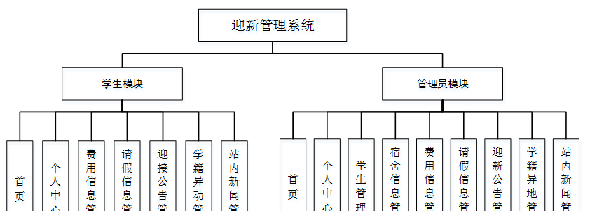

图4-1系统功能结构图

###

###

#### 4.3.1 E-R图设计

概念设计是整个数据库设计的关键，在概念设计阶段，由需求分析得到了E-
R模型。E-R图是识别功能模型与数据模型间关联关系的，在主题数据库的抽取和规范化的过程中，采用的是简化的E-R图表示方法，从而避免过繁过细的E-
R图表示影响规划的直观和可用性。是对现实世界的抽象和概括，是数据库设计人员进行数据可设计的有力工具，能够方便直接地表达应用中的各种语义知识，令一方面它简单、清晰、易于用户理解。

管理员实体包括管理员名称、密码和权限三个属性。

管理员体ER图如下图所示。

图4-4管理员ER图

费用信息管理ER图如下图所示。

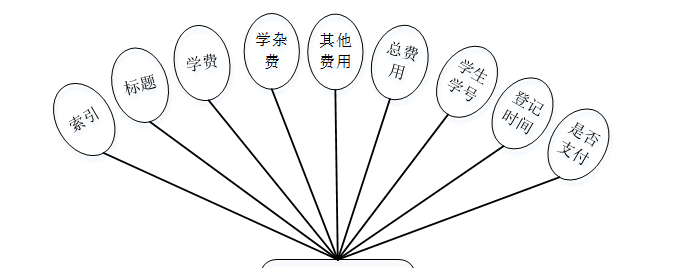

图4-5费用信息管理ER图

请假信息管理ER图如下图所示。

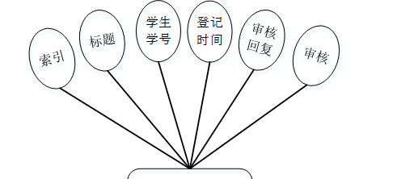

图4-6请假信息管理ER图

### 登录模块的实现

系统登录模块，为确保系统安全性，系统操作员只有在登录界面输入正确的管理员名、密码、权限以及验证码，单击“登录”按钮后才能够进入本系统的主界面。

管理员登录流程图如下所示。

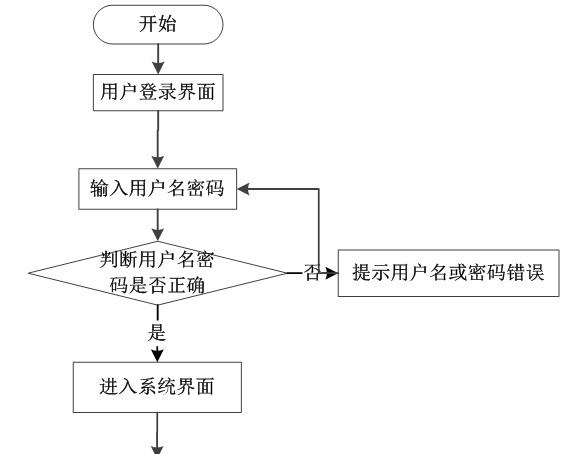

图5-1管理员登录流程图

登录界面如下图所示。

图5-2登录界面图

### 5.2管理员功能模块

管理员登录进入迎新管理系统可以查看首页、个人中心、学生管理、宿舍信息管理、费用信息管理、请假信息管理、迎新公告管理、学籍异地管理、站内新闻管理等内容进行详细操作，如图5-3所示。

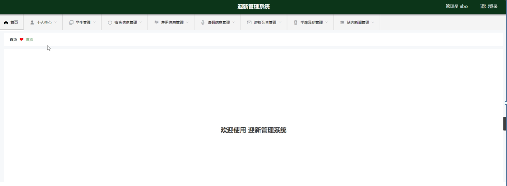

图5-3管理员功能界面图

学生管理，在学生管理页面可以对索引、学生学号、学生姓名、性别、密码、联系电话、身份证、宿舍编号等信息进行详情、费用、学籍异动、修改或删除等详情操作，如图5-4所示。

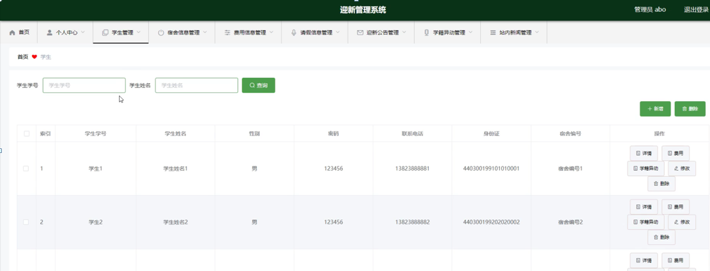

图5-4学生管理界面图

宿舍信息管理，在宿舍信息管理页面可以对索引、宿舍编号、地址等信息进行详情、修改或删除等操作，如图5-5所示。

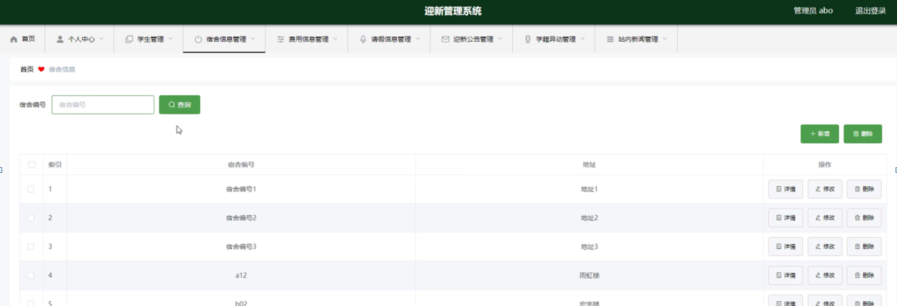

图5-5宿舍信息管理界面图

费用信息管理，在费用信息管理页面可以对索引、标题、学费、学杂费、其他费用、总费用、学生学号、登记时间、是否支付等信息进行详情，修改或删除等操作，如图5-6所示。

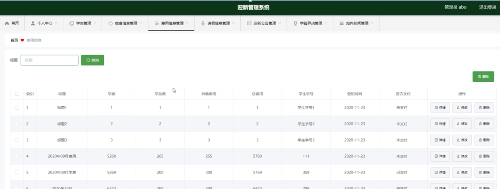

图5-6费用信息管理界面图

请假信息管理，在请假信息管理页面可以对索引、标题、学生学号、登记时间、审核回复、审核等信息进行详情，修改或删除等操作，如图5-7所示。

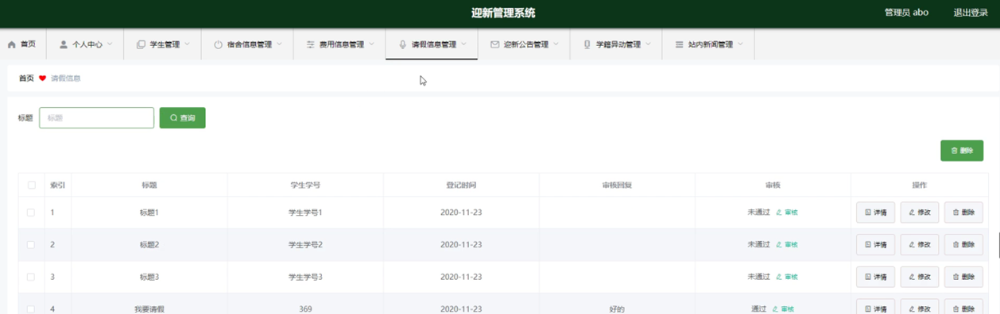

图5-7请假信息管理界面图

迎新公告管理，在迎新公告管理页面可以对索引、标题、登记时间等信息进行修改或删除等操作，如图5-8所示。

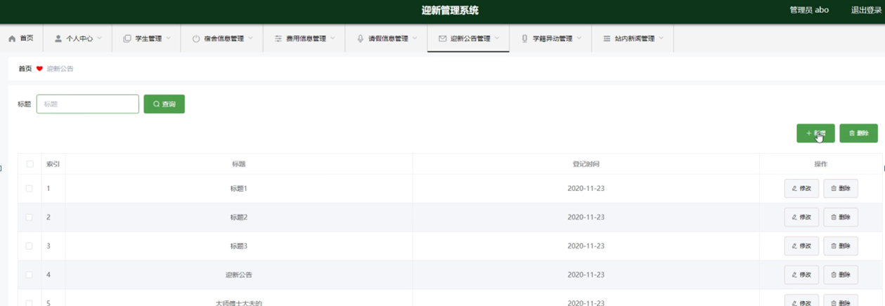

图5-8迎新公告管理界面图

学籍异地管理，在学籍异地管理页面可以对索引、标题、类型、学生学号、登记时间、备注等信息进行详情，修改或删除等操作，如图5-9所示。

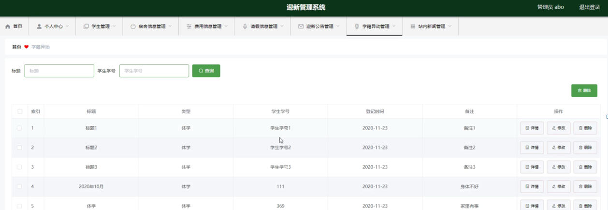

图5-9学籍异地管理界面图

站内新闻管理，在站内新闻管理页面可以对索引、标题、发布时间等信息进行详情，修改或删除等操作，如图5-10所示。

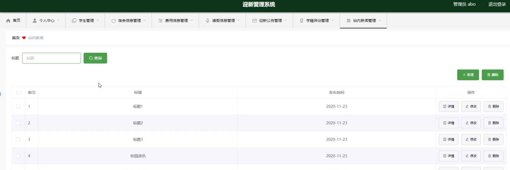

图5-10站内新闻管理界面图

### 5.3学生功能模块

学生登录进入迎新管理系统可以查看首页、个人中心、费用信息管理、请假信息管理、迎接公告管理、学籍异动管理、站内新闻管理等内容进行详细操作，如图5-11所示。

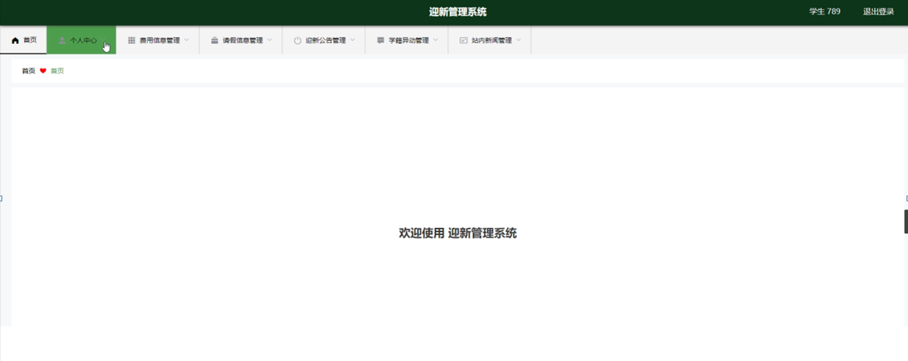

图5-11学生功能界面图

个人中心，在个人中心页面可以填写学生学号、学生姓名、性别、密码、联系电话、身份证、宿舍编号等信息进行个人信息修改操作，如图5-12所示。

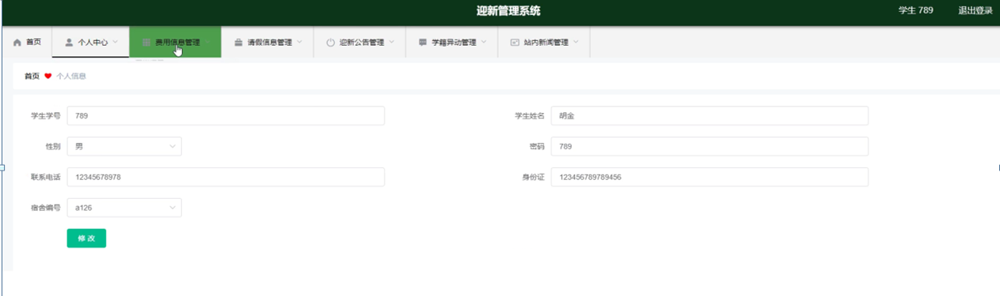

图5-12个人中心界面图

#### **JAVA** **毕设帮助，指导，源码分享，调试部署**

