ssm+Vue计算机毕业设计迎新系统（程序+LW文档）

**项目运行**

**环境配置：**

**Jdk1.8 + Tomcat7.0 + Mysql + HBuilderX** **（Webstorm也行）+ Eclispe（IntelliJ
IDEA,Eclispe,MyEclispe,Sts都支持）。**

**项目技术：**

**SSM + mybatis + Maven + Vue** **等等组成，B/S模式 + Maven管理等等。**

**环境需要**

**1.** **运行环境：最好是java jdk 1.8，我们在这个平台上运行的。其他版本理论上也可以。**

**2.IDE** **环境：IDEA，Eclipse,Myeclipse都可以。推荐IDEA;**

**3.tomcat** **环境：Tomcat 7.x,8.x,9.x版本均可**

**4.** **硬件环境：windows 7/8/10 1G内存以上；或者 Mac OS；**

**5.** **是否Maven项目: 否；查看源码目录中是否包含pom.xml；若包含，则为maven项目，否则为非maven项目**

**6.** **数据库：MySql 5.7/8.0等版本均可；**

**毕设帮助，指导，本源码分享，调试部署** **(** **见文末** **)**

**总体设计**

迎新系统采用了结构化开发的方法。这种开发方法的优点是控制性比较强，开发过程中采用了结构化和模块化的设计思想，自顶向下，从总体到部分，合理划分系统的结构和模块。结构化开发时使用模块式开发，各模块之间互不影响，方便系统的开发与管理。

本系统的设计是基于
B/S架构的三层体系结构，也就是浏览器和服务器结构。计算机技术发展的速度非常快，以前的设计结构都以C/S的模式为主，也就是学生端和服务端模式。但随着网页技术的发展，越来越多的学生习惯于使用浏览器。现在的网页技术可以在浏览器中实现非常漂亮的效果，以前的单一低调的学生端页面已经无法满足学生的需求。在B/S这种结构下，技术人员可以很轻松的设计出学生所需要的工作界面，页面代码通过浏览器进行解析展示，在浏览器中不做过多的事务逻辑的处理。主要的事务逻辑放在服务端进行处理。这样学生的电脑就不会承载过多的东西，只需要浏览器展示即可。对于开发人员也很方便进行系统的维护和升级。开发人员只需要在服务端进行系统的维护就可以了。使用JSP这样的跨平台性非常好的技术，这样的开发模式更加的方便，高效。本系统合理的进行了模块划分和组合，因此由于各个模块之间基本上是相互独立的，所以每个模块都可以独立的被解释、执行、调试和修改，让繁琐的系统设计工作简单化。

如图4.1是该系统软件的功能结构图：

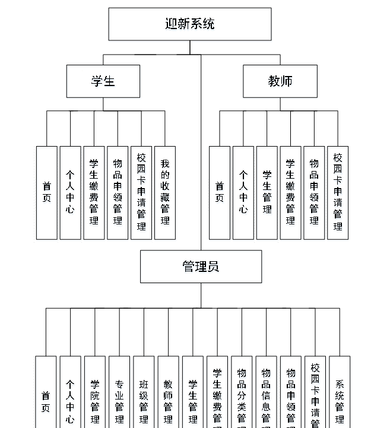

图4.1 功能结构图

4.3 系统数据库的设计

4.3.1数据库E/R图

ER图是由实体及其关系构成的图，通过E/R图可以清楚地描述系统涉及到的实体之间的相互关系。在系统中对一些主要的几个关键实体如下图：

(1) 管理员信息E/R图如下所示：

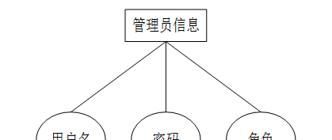

图4.2管理员信息E/R图

(2)物品信息E/R图如下所示：

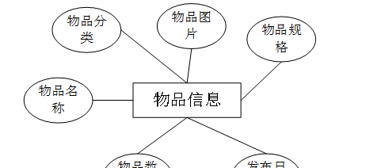

图4.3物品信息E/R图

(3) 教师信息E/R图如下所示：

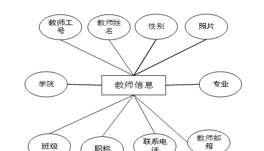

图4.4教师信息E/R图

（4）学生信息E/R图如下所示：

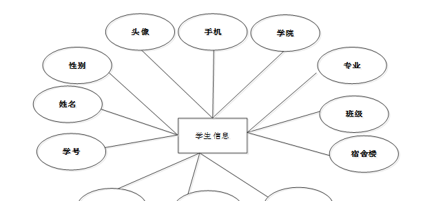

图4.5学生信息E/R图

### 管理员功能模块

管理员登录，管理员通过登录页面输入用户名，密码和角色，点击登录进入系统进行操作，如图5-1所示。

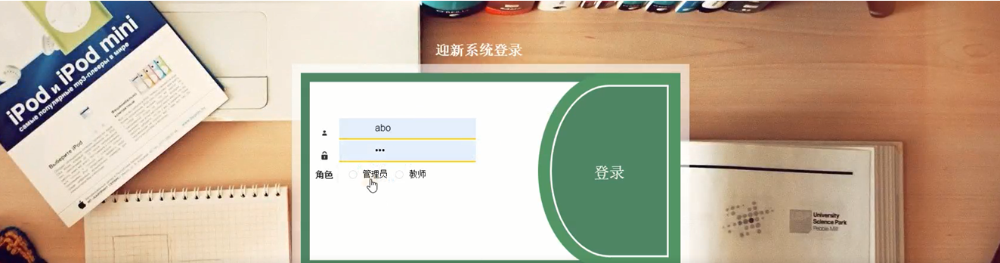

图5-1管理员登录界图面

管理员登陆系统后，可以查看首页、个人中心、学院管理、专业管理、班级管理、教师管理、学生管理、学生缴费管理、物品分类管理、物品信息管理、物品申领管理、校园卡申请管理、系统管理等功能，还能对每个功能逐一进行相应操作，如图5-2所示。

图5-2管理员功能界图面

学生管理，在学生管理页面查看学号、姓名、性别、头像、手机、学院、专业、班级、宿舍楼、房号、邮箱、教师工号等内容，进行修改、删除等操作，如图5-3所示。

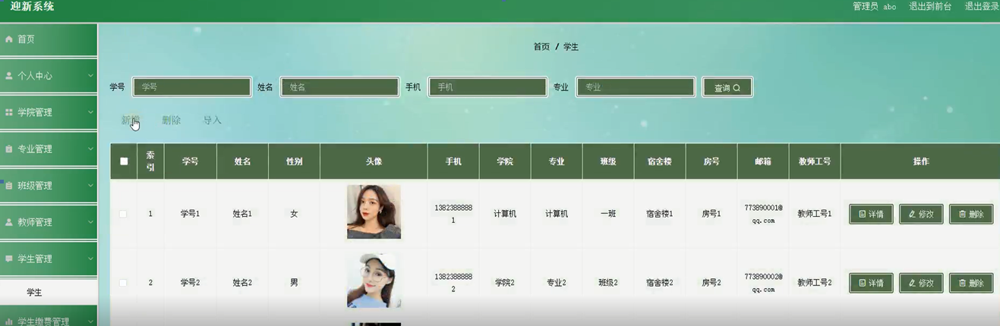

图5-3学生管理界面图

教师管理，在教师管理页面查看教师工号、教师姓名、性别、照片、学院、专业、班级、职称、联系电话、教师邮箱等内容进行修改、删除等操作，如图5-4所示。

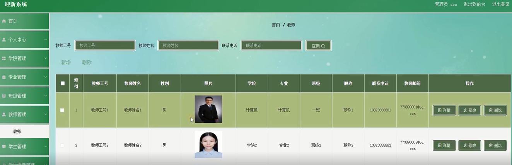

图5-4教师管理界面图

学生缴费管理，在学生缴费管理页面查看缴费单号、缴费名称、缴费类型、缴费票据、缴费备注、发布日期、缴费金额、学号、姓名、学院、专业、班级、手机、教师工号、是否支付等内容进行修改、删除等操作，如图5-5所示。

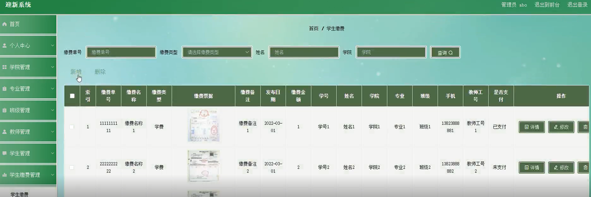

图5-5学生缴费管理界面图

物品信息管理，在物品信息管理页面查看物品名称、物品分类、物品图片、物品规格、物品数量、发布日期等内容进行修改、删除等操作，如图5-6所示。

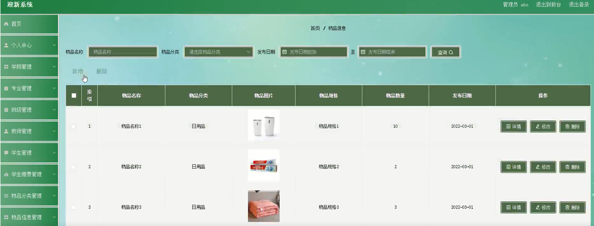

图5-6物品信息管理界面图

校园卡申请管理，在校园卡申请管理页面查看申请编号、学号、姓名、手机、学院、专业、班级、教师工号、申请内容、申请日期、审核回复、审核状态等内容进行修改、删除等操作，如图5-7所示。

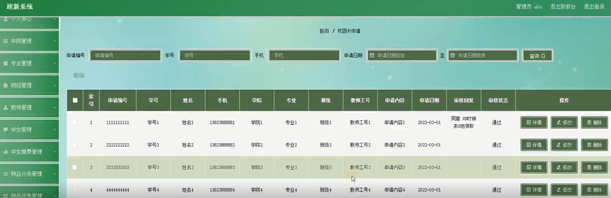

图5-7校园卡申请管理界面图

### 5.2学生功能模块

学生登陆系统后，可以查看首页、个人中心、学生缴费管理、物品申领管理、校园卡申请管理、我的收藏管理等功能，还能对每个功能逐一进行相应操作，如图5-8所示。

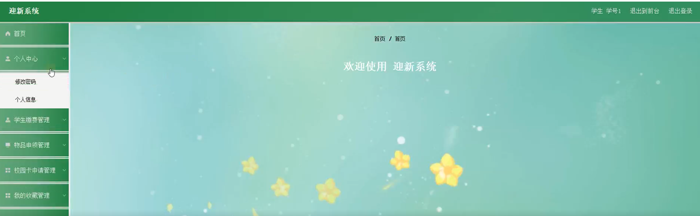

图5-8学生功能界图面

学生缴费管理，在学生缴费管理页面查看缴费单号、缴费名称、缴费类型、缴费票据、缴费备注、发布日期、缴费金额、学号、姓名、学院、专业、班级、手机、教师工号、是否支付等内容，进行详情等操作，如图5-9所示。

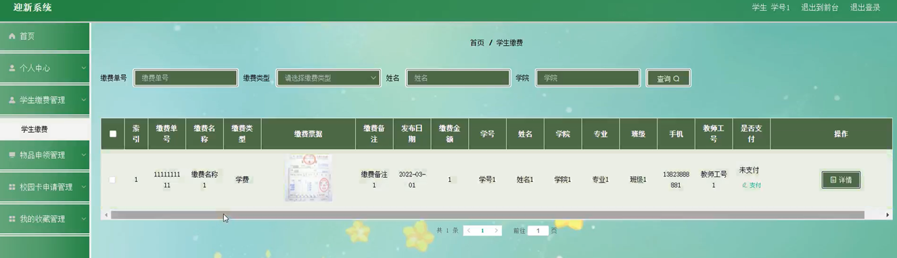

图5-9学生缴费管理界面图

物品申领管理，在物品申领管理页面查看申领单号、物品名称、物品分类、物品图片、物品规格、物品数量、申请说明、申请日期、学号、姓名、手机、学院、专业、班级、教师工号、审核回复、审核状态等内容，进行详情等操作，如图5-10所示。

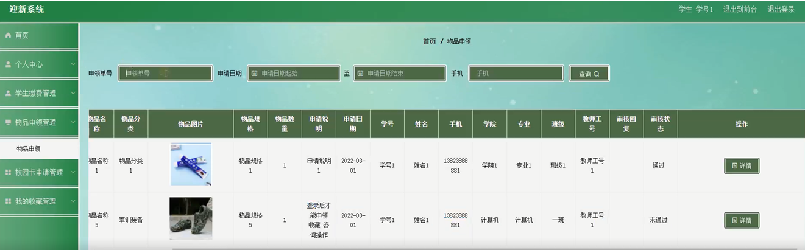

图5-10物品申领管理界面图

校园卡申请管理，在校园卡申请管理页面查看申请编号、学号、姓名、手机、学院、专业、班级、教师工号、申请内容、申请日期、审核回复、审核状态等内容，进行详情等操作，如图5-11所示。

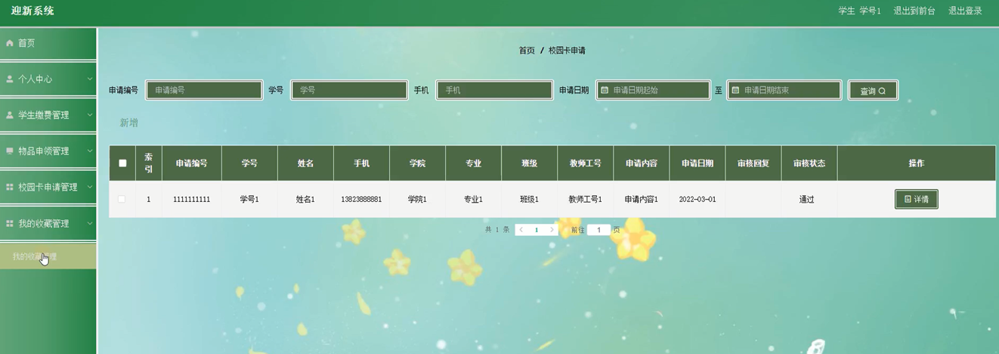

图5-11校园卡申请管理界面图

### 5.3教师功能模块

教师登录，教师通过登录页面输入用户名，密码和角色，点击登录进入系统进行操作，如图5-12所示。

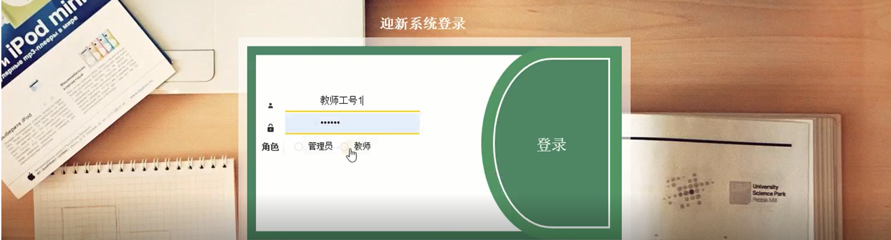

图5-12教师登录界图面

**JAVA** **毕设帮助，指导，源码分享，调试部署**

