ssm+Vue计算机毕业设计邢台市公寓式月亮酒店管理系统（程序+LW文档）

**项目运行**

**环境配置：**

**Jdk1.8 + Tomcat7.0 + Mysql + HBuilderX** **（Webstorm也行）+ Eclispe（IntelliJ
IDEA,Eclispe,MyEclispe,Sts都支持）。**

**项目技术：**

**SSM + mybatis + Maven + Vue** **等等组成，B/S模式 + Maven管理等等。**

**环境需要**

**1.** **运行环境：最好是java jdk 1.8，我们在这个平台上运行的。其他版本理论上也可以。**

**2.IDE** **环境：IDEA，Eclipse,Myeclipse都可以。推荐IDEA;**

**3.tomcat** **环境：Tomcat 7.x,8.x,9.x版本均可**

**4.** **硬件环境：windows 7/8/10 1G内存以上；或者 Mac OS；**

**5.** **是否Maven项目: 否；查看源码目录中是否包含pom.xml；若包含，则为maven项目，否则为非maven项目**

**6.** **数据库：MySql 5.7/8.0等版本均可；**

**毕设帮助，指导，本源码分享，调试部署** **(** **见文末** **)**

### 系统体系结构

邢台市公寓式月亮酒店管理系统开发系统的结构图4-1所示：

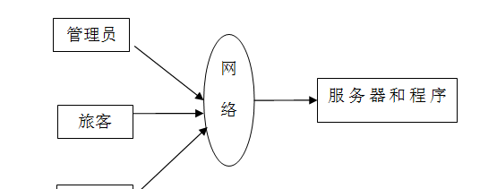

图4-1 系统结构

模块包括主界面，首页、个人中心、旅客管理、员工管理、部门信息管理、客房信息管理、入住预约管理、入住登记管理、结账功能管理、财务统计管理、房间统计管理、消费统计管理等进行相应的操作。

登录系统结构图，如图4-2所示：

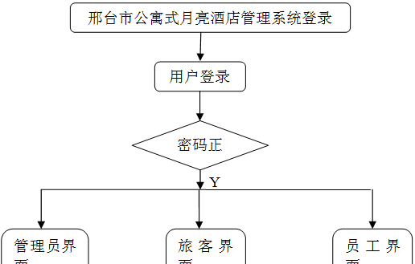

图4-2 登录结构图

这些功能可以充分满足邢台市公寓式月亮酒店管理系统的需求。此系统功能较为全面如下图系统功能结构如图4-3所示。

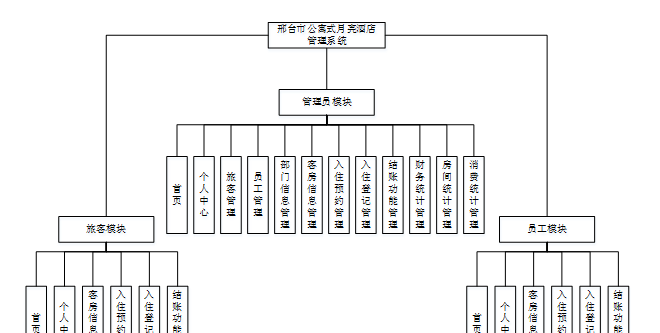

图4-3系统功能结构图

### 4.2 数据库设计原则

每个数据库的应用它们都是和区分开的，当运行到一定的程序当中，它就会与自己相关的协议与客户端进行通讯。那么这个系统就会对使这些数据进行连接。当我们选择哪个桥段的时候，接下来就会简单的叙述这个数据库是如何来创建的。当点击完成按钮的时候就会自动在对话框内弹出数据源的名称，在进行点击下一步即可，直接在输入相对应的身份验证和登录密码。

邢台市公寓式月亮酒店管理系统的数据流程：

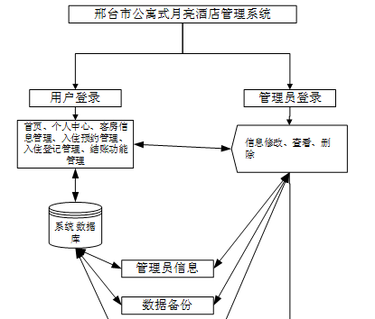

图4-4 系统数据流程图

入住预约管理实体E-R图，如图4-5所示。

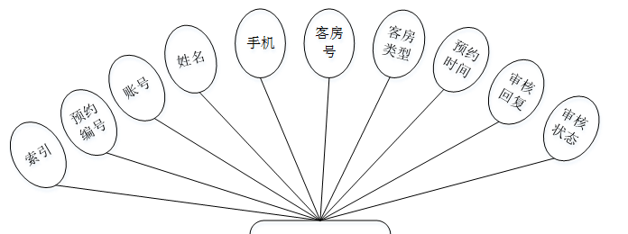

图4-5入住预约管理E-R图

结账功能管理E-R图，如图4-6所示。

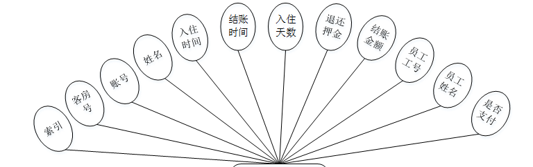

图4-6结账功能管理E-R图

### 管理员功能模块

管理员登录，通过填写注册时输入的用户名和密码，选择角色进行登录，如图5-1所示。

图5-1管理员登录界面图

管理员登录进入邢台市公寓式月亮酒店管理系统可以查看首页、个人中心、旅客管理、员工管理、部门信息管理、客房信息管理、入住预约管理、入住登记管理、结账功能管理、财务统计管理、房间统计管理、消费统计管理等信息,如图5-2所示。

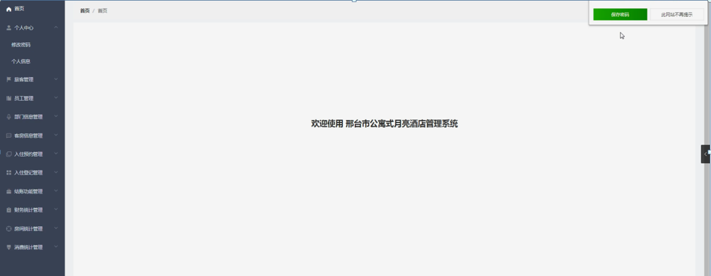

图5-2管理员功能界面图

旅客管理，在旅客管理页面中可以对索引、账号、姓名、性别、手机、邮箱、身份证、照片、地址等内容进行详情、修改或删除等操作，如图5-3所示。

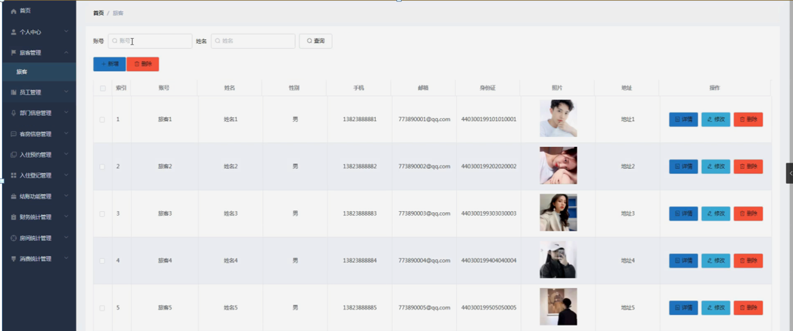

图5-3旅客管理界面图

员工管理，在员工管理页面中可以对索引、员工工号、员工姓名、部门信息、性别、联系电话、邮箱、身份证、家庭住址、图片等内容进行详情、修改或删除等操作，如图5-4所示。

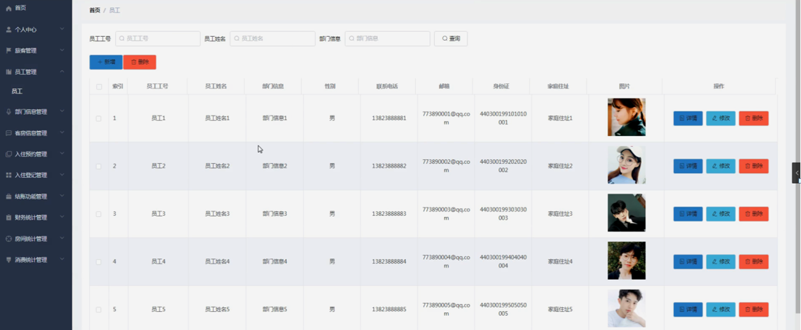

图5-4员工管理界面图

部门信息管理，在部门信息管理页面中可以对索引、部门等内容进行修改或删除等操作，如图5-5所示。

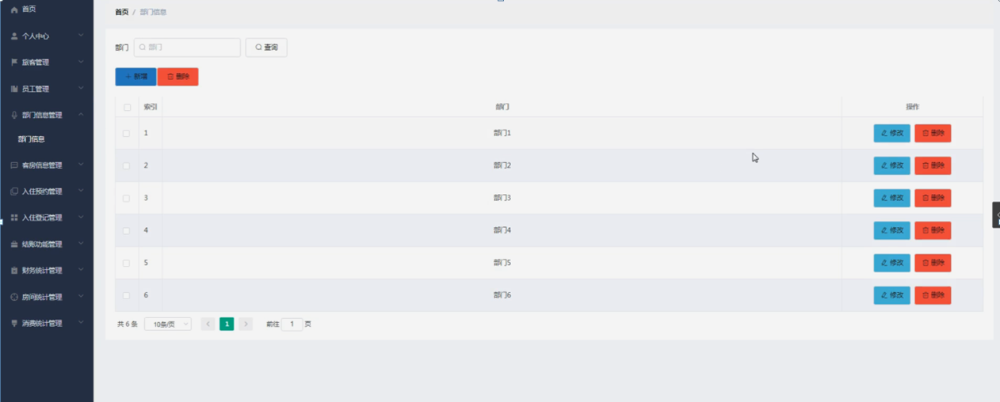

图5-5部门信息管理界面图

客房信息管理，在客房信息管理页面中可以对索引、客房号、客房类型、客房设施、客房价格、客房状态、可约时间、客房位置、图片等内容进行详情、修改或删除等操作，如图5-6所示。

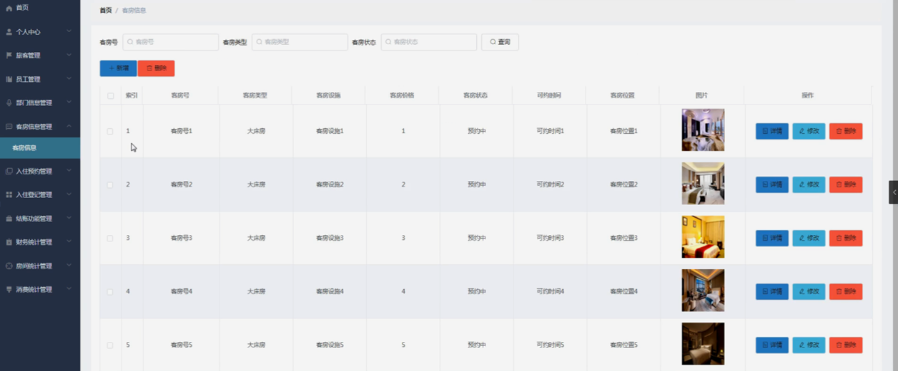

图5-6客房信息管理界面图

入住预约管理，在入住预约管理页面中可以对索引、预约编号、账号、姓名、手机、客房号、客房类型、预约时间、审核回复、审核状态等内容进行详情或删除等操作，如图5-7所示。

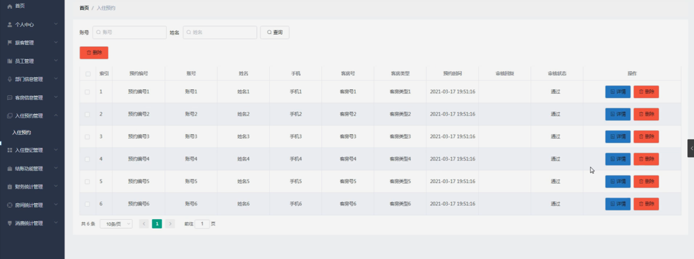

图5-7入住预约管理界面图

入住登记管理，在入住登记管理页面中可以对索引、客房号、账号、姓名、身份证、手机、押金、发放门卡、入住时间、入住次数、优惠政策、类型、员工工号、员工姓名等内容进行详情或删除等操作，如图5-8所示。

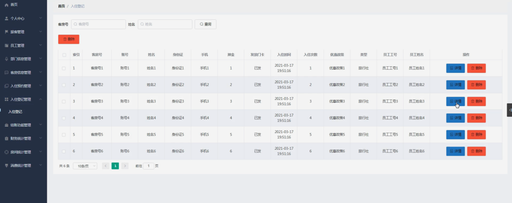

图5-8入住登记管理界面图

结账功能管理，在结账功能管理页面中可以对索引、客房号、账号、姓名、入住时间、结账时间、入住天数、退还押金、结账金额、员工工号、员工姓名、是否支付等内容进行修改或删除等操作，如图5-9所示。

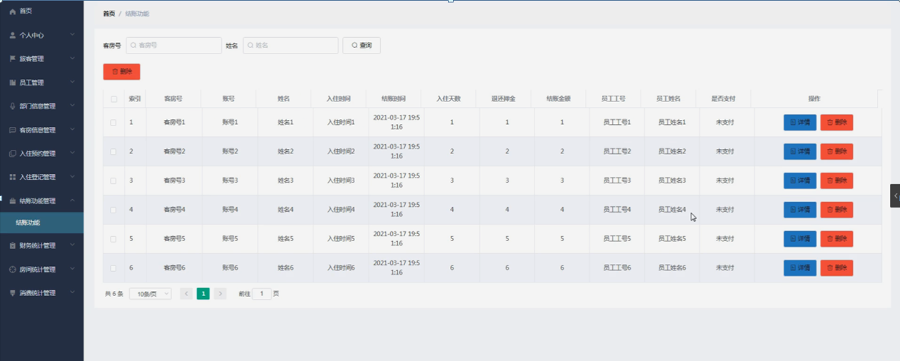

图5-9结账功能管理界面图

财务统计管理，在财务统计管理页面中可以对索引、账号、姓名、身份证、手机、客房号、入住时间、结账时间、结账金额等内容进行详情、修改或删除等操作，如图5-10所示。

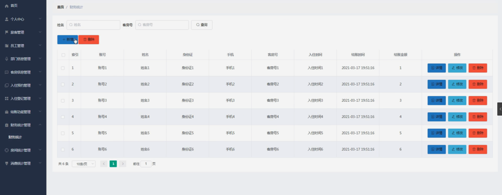

图5-10财务统计管理界面图

房间统计管理，在房间统计管理页面中可以对索引、客房号、客房类型、入住人数、当月收入、月份、统计时间、登记人等内容进行详情、修改或删除等操作，如图5-11所示。

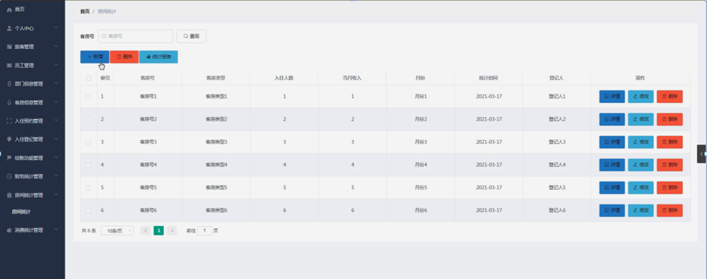

图5-11房间统计管理界面图

消费统计管理，在消费统计管理页面中可以对索引、账号、姓名、身份证、手机、客房号、消费项目、消费金额、时间段等内容进行详情、修改或删除等操作，如图5-12所示。

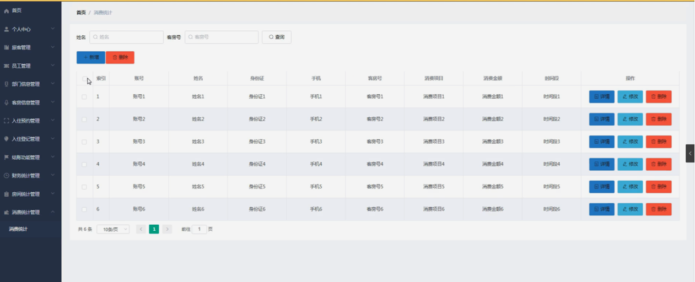

图5-12消费统计管理界面图

#### **JAVA** **毕设帮助，指导，源码分享，调试部署**

