ssm+Vue计算机毕业设计郑州市智慧农贸市场管理系统（程序+LW文档）

**项目运行**

**环境配置：**

**Jdk1.8 + Tomcat7.0 + Mysql + HBuilderX** **（Webstorm也行）+ Eclispe（IntelliJ
IDEA,Eclispe,MyEclispe,Sts都支持）。**

**项目技术：**

**SSM + mybatis + Maven + Vue** **等等组成，B/S模式 + Maven管理等等。**

**环境需要**

**1.** **运行环境：最好是java jdk 1.8，我们在这个平台上运行的。其他版本理论上也可以。**

**2.IDE** **环境：IDEA，Eclipse,Myeclipse都可以。推荐IDEA;**

**3.tomcat** **环境：Tomcat 7.x,8.x,9.x版本均可**

**4.** **硬件环境：windows 7/8/10 1G内存以上；或者 Mac OS；**

**5.** **是否Maven项目: 否；查看源码目录中是否包含pom.xml；若包含，则为maven项目，否则为非maven项目**

**6.** **数据库：MySql 5.7/8.0等版本均可；**

**毕设帮助，指导，本源码分享，调试部署** **(** **见文末** **)**

### 功能结构

为了更好的去理清本系统整体思路，对该系统以结构图的形式表达出来，设计实现该郑州市智慧农贸市场管理系统的功能结构图如下所示：

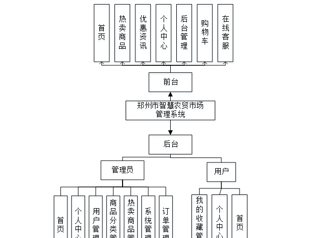

图4-1 系统总体结构图

### 4.2数据库设计

#### 4.2.1数据库E/R图

ER图是由实体及其关系构成的图，通过E/R图可以清楚地描述系统涉及到的实体之间的相互关系。在系统中对一些主要的几个关键实体如下图：

(1) 用户注册E/R图如下所示：

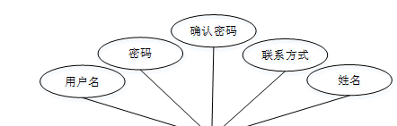

图4-2用户注册E/R图

(2)热卖商品E/R图如下所示：

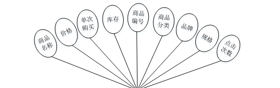

图4-3热卖商品E/R图

### 系统功能模块

郑州市智慧农贸市场管理系统，在系统首页可以查看首页，热卖商品，优惠资讯，个人中心，后台管理，购物车，在线客服等内容，并进行详细操作；如图5-1所示。

图5-1系统首页界面图

用户注册，在用户注册页面通过填写用户账号，密码，确认密码，姓名，联系方式等信息进行注册操作，如图5-2所示。

图5-2用户注册界面图

热卖商品，在热卖商品页面可以查看商品名称，价格，单次购买，库存，商品编号，商品分类，品牌，规格，点击次数等内容，并进行赞一下，踩一下，评论，点我收藏等操作，如图5-3所示。

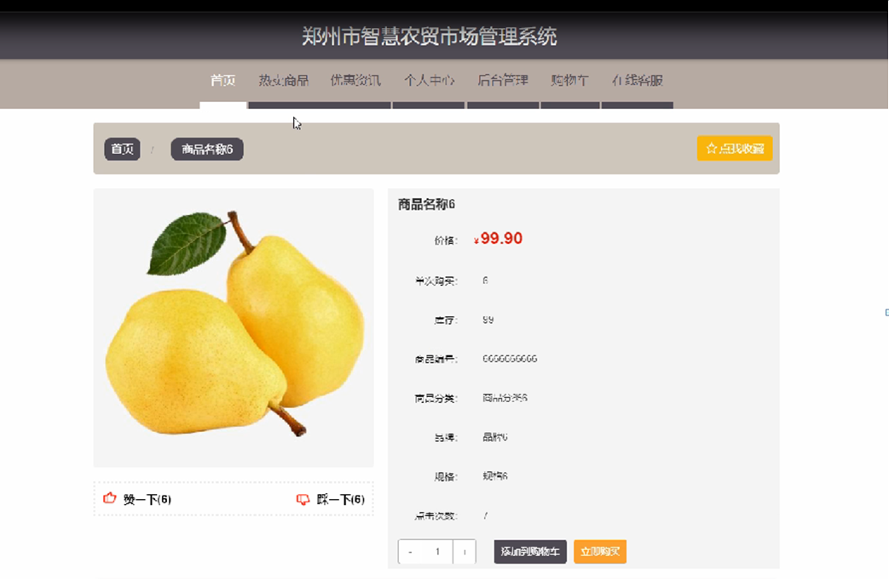

图5-3热卖商品界面图

个人中心，在个人中心页面通过填写用户账号，密码，用户姓名，性别，联系方式，余额等内容进行更新信息操作，并根据需要对我的订单，我的地址，我的收藏进行详细操作；如图5-4所示。

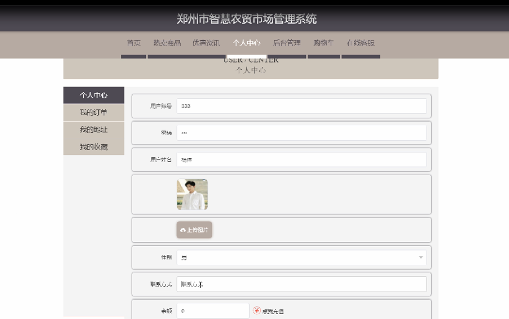

图5-4个人中心界面图

### 5.2后台登录模块

后台登录，管理员，用户进入系统前在登录页面根据要求填写账号，密码，验证码和选择角色等信息，点击登录进行登录操作，如图5-5所示。

图5-5后台登录界面图

#### 5.2.1管理员功能

管理员登陆系统后，可以查看首页，个人中心，用户管理，商品分类管理，热卖商品管理，系统管理，订单管理等功能，还能对每个功能逐一进行相应操作，如图5-6所示。

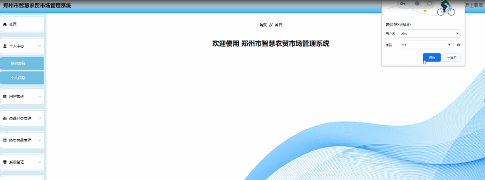

图5-6管理员功能界面图

用户管理，在用户管理页面可以对索引，用户账号，用户姓名，头像，性别，联系方式等内容进行详情，修改和删除操作，如图5-7所示。

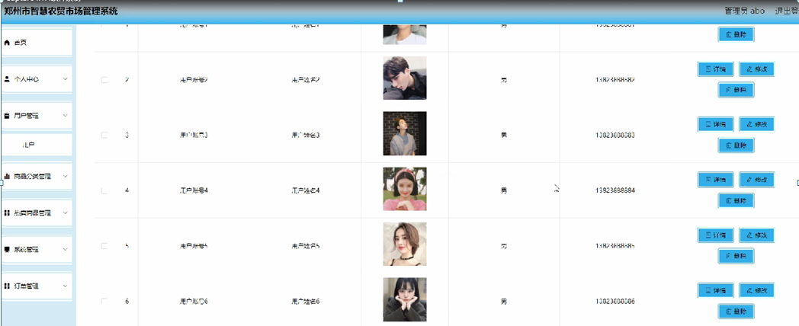

图5-7用户管理界面图

热卖商品管理，在热卖商品管理页面可以对索引，商品编号，商品名称，封面，商品分类，品牌，规格，价格，单限，库存等内容进行详情，修改，查看评论和删除等操作，如图5-8所示。

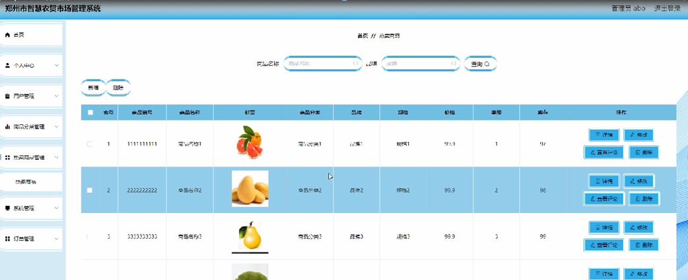

图5-8热卖商品管理界面图

订单管理，在已支付订单页面可以对已支付订单
索引，订单编号，商品名称，商品图片，购买数量，价格，折扣价格，总价格，折扣总价格，支付类型，状态，地址，电话，收货人，商品类型，下单时间等内容进行详情，发货，删除等操作，如图5-9所示。

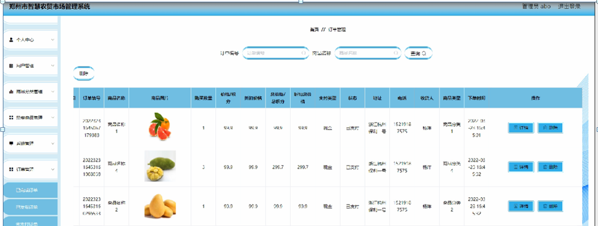

图5-9订单管理界面图

#### 5.2.2用户功能

用户登陆系统，可以查看首页，个人中心，我的收藏管理等功能，还能对每个功能逐一进行相应操作，如图5-10所示。

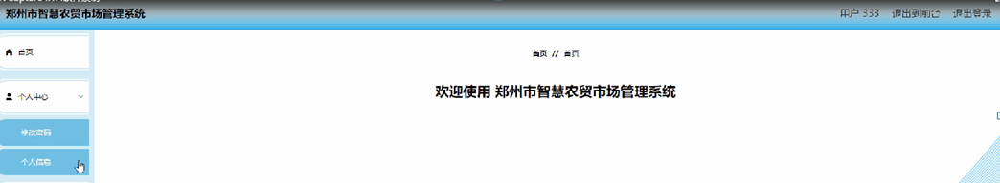

图5-10用户功能界面图

个人中心，在个人信息页面通过填写用户账号，用户姓名，照片，性别，联系方式等内容进行个人信息修改操作，如图5-11所示。

图5-11个人中心界面图

我的收藏管理，在我的收藏管理页面可以对索引，收藏名称，收藏图片，推荐类型等内容进行详情，修改和删除等操作，如图5-12所示。

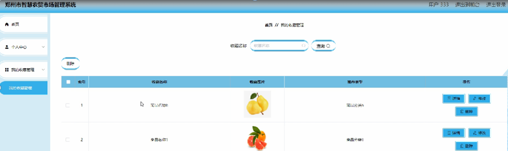

图5-12我的收藏管理界面图

#### **JAVA** **毕设帮助，指导，源码分享，调试部署**

