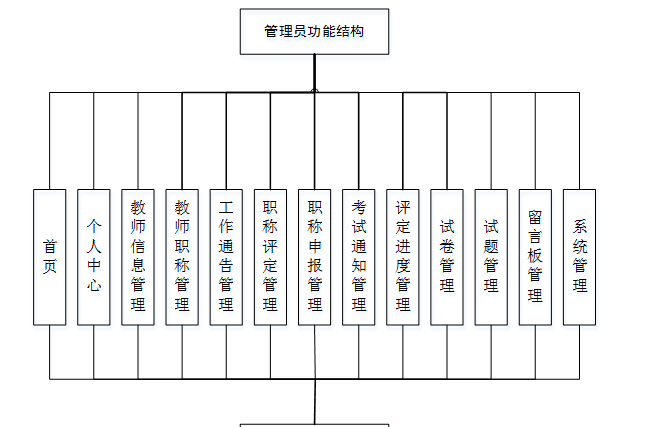

ssm+Vue计算机毕业设计重工教师职称管理系统（程序+LW文档）

**项目运行**

**环境配置：**

**Jdk1.8 + Tomcat7.0 + Mysql + HBuilderX** **（Webstorm也行）+ Eclispe（IntelliJ
IDEA,Eclispe,MyEclispe,Sts都支持）。**

**项目技术：**

**SSM + mybatis + Maven + Vue** **等等组成，B/S模式 + Maven管理等等。**

**环境需要**

**1.** **运行环境：最好是java jdk 1.8，我们在这个平台上运行的。其他版本理论上也可以。**

**2.IDE** **环境：IDEA，Eclipse,Myeclipse都可以。推荐IDEA;**

**3.tomcat** **环境：Tomcat 7.x,8.x,9.x版本均可**

**4.** **硬件环境：windows 7/8/10 1G内存以上；或者 Mac OS；**

**5.** **是否Maven项目: 否；查看源码目录中是否包含pom.xml；若包含，则为maven项目，否则为非maven项目**

**6.** **数据库：MySql 5.7/8.0等版本均可；**

**毕设帮助，指导，本源码分享，调试部署** **(** **见文末** **)**

**系统结构**

本系统架构网站系统，本系统的具体功能如下：

图4-2系统功能结构图

管理员功能结构图，如图4-3所示：

图4-3 管理员功能结构图

教师结构图，如图4-4所示：

图4-4 教师界面结构图

### 4.3. 数据库设计

#### 4.3.1 数据库实体

管理员信息结构图，如图4-5所示：

图4-5 管理员信息实体结构图

教师职称管理实体属性图，如图4-6所示：

图4-6教师职称管理实体属性图

职称评定管理实体属性图如图4-7所示。

图4-7职称评定管理实体属性图

### 系统功能模块

重工教师职称管理系统注册，在系统注册页面可以填写教师工号、姓名、密码、教师岗位、qq、邮箱、联系电话、身份证、住址等内容进行注册操作，如图5-1所示。

图5-1重工教师职称管理系统注册界面图

重工教师职称管理系统，在系统首页可以查看首页、教师职称、工作通告、职称评定、考试通知、试卷列表、留言反馈、个人中心、后台管理、在线客服等内容进行操作，如图5-2所示。

图5-2系统首页界面图

个人中心，在个人中心页面可以填写教师工号、姓名、密码、性别、教师岗位、qq、邮箱、联系电话、出生年月、图片、身份证、住址等内容进行信息更新操作，还可以根据需要对考试记录，错题本进行相应操作；如图5-3所示。

图5-3个人中心界面图

### 5.2管理员功能模块

管理员登录，管理员通过输入用户，密码，角色，验证码等信息进行系统登录，如图5-4所示。

图5-4管理员登录界面图

管理员登录进入重工教师职称管理系统可以查看首页、个人中心、教师信息管理、教师职称管理、工作通告管理、职称评定管理、职称申报管理、考试通知管理、评定进度管理、试卷管理、试题管理、留言板管理、系统管理等内容进行操作，如图5-5所示。

图5-5管理员功能界面图

教师信息管理，在教师信息管理页面可以对索引、教师工号、姓名、密码、性别、教师岗位、qq、邮箱、联系电话、出生年月、头像、身份证、住址等信息进行详情，修改或删除等操作，如图5-6所示。

图5-6教师信息管理界面图

教师职称管理，在教师职称管理页面可以对索引、教师职称、教师工号、姓名、qq、头像等信息进行详情，修改或删除等操作，如图5-7所示。

图5-7教师职称管理界面图

工作通告管理，在工作通告管理页面可以对索引、公告标题、公告简介、发布时间、发布人、公告封面等信息进行详情，修改或删除等操作，如图5-8所示。

图5-8工作通告管理界面图

职称评定管理，在职称评定管理页面可以对索引、教师工号、姓名、密码、性别、教师岗位、qq、邮箱、联系电话、出生年月、头像、身份证、住址等信息进行详情，修改或删除等操作，如图5-9所示。

图5-9教师信息管理界面图

职称申报管理，在职称申报管理页面可以对索引、教师工号、姓名、职称申报、申报时间等信息进行详情操作，如图5-10所示。

图5-10职称申报管理界面图

考试通知管理，在考试通知管理页面可以对索引、标题、摘要、报名开始、报名截止、封面等信息进行详情，修改或删除等操作，如图5-11所示。

图5-11考试通知管理界面图

评定进度管理，在评定进度管理页面可以对索引、教师工号、姓名、考试成绩、备注、审核回复、审核状态、审核等信息进行详情，修改或删除等操作，如图5-12所示。

图5-12评定进度管理界面图

**JAVA毕设帮助，指导，源码获取，调试部署**

