ssm+Vue计算机毕业设计重庆工商大学失物招领系统（程序+LW文档）

**项目运行**

**环境配置：**

**Jdk1.8 + Tomcat7.0 + Mysql + HBuilderX** **（Webstorm也行）+ Eclispe（IntelliJ
IDEA,Eclispe,MyEclispe,Sts都支持）。**

**项目技术：**

**SSM + mybatis + Maven + Vue** **等等组成，B/S模式 + Maven管理等等。**

**环境需要**

**1.** **运行环境：最好是java jdk 1.8，我们在这个平台上运行的。其他版本理论上也可以。**

**2.IDE** **环境：IDEA，Eclipse,Myeclipse都可以。推荐IDEA;**

**3.tomcat** **环境：Tomcat 7.x,8.x,9.x版本均可**

**4.** **硬件环境：windows 7/8/10 1G内存以上；或者 Mac OS；**

**5.** **是否Maven项目: 否；查看源码目录中是否包含pom.xml；若包含，则为maven项目，否则为非maven项目**

**6.** **数据库：MySql 5.7/8.0等版本均可；**

**毕设帮助，指导，本源码分享，调试部署** **(** **见文末** **)**

### 系统设计主要功能

通过市场调研及咨询研究，了解了用户及管理者的使用需求，于是制定了管理员和用户等模块。功能结构图如下所示：

图4-1系统功能结构图

### 4.2 数据库设计

#### 4.2.1 数据库设计规范

数据可设计要遵循职责分离原则，即在设计时应该要考虑系统独立性，即每个系统之间互不干预不能混乱数据表和系统关系。

数据库命名也要遵循一定规范，否则容易混淆，数据库字段名要尽量做到与表名类似，多使用小写英文字母和下划线来命名并尽量使用简单单词。

#### 4.2.2 E/R图

举报信息E/R图，如下所示：

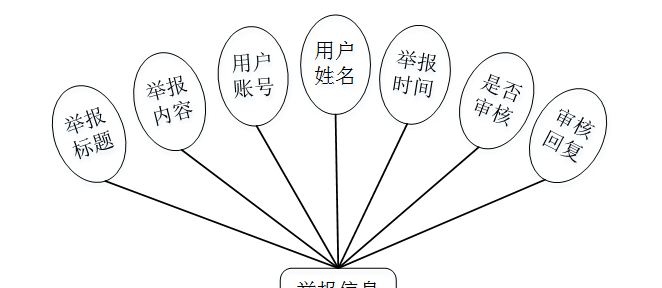

图4-2举报信息E/R图

用户E/R图，如下所示：

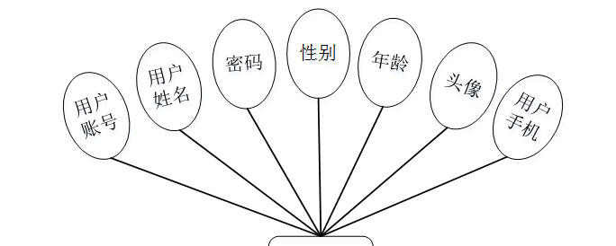

图4-3用户E/R图

系统公告E/R图，如下所示。

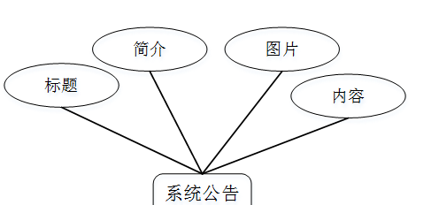

图4-4系统公告E/R图

### 系统功能模块

重庆工商大学失物招领系统，在系统首页可以查看首页，寻物启事，失物招领，系统公告，留言反馈，个人中心，后台管理等内容，并进行详细操作；如图5-1所示。

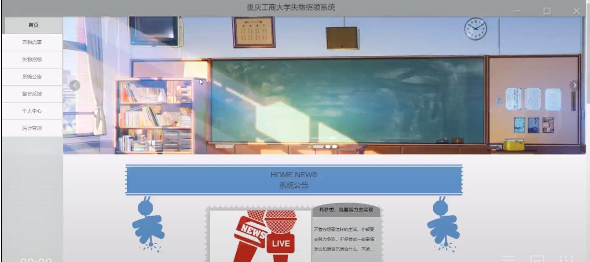

图5-1系统首页界面图

用户注册，在用户注册页面通过填写用户账号，密码，确认密码，用户姓名，年龄，用户手机等信息进行注册操作，如图5-2所示。

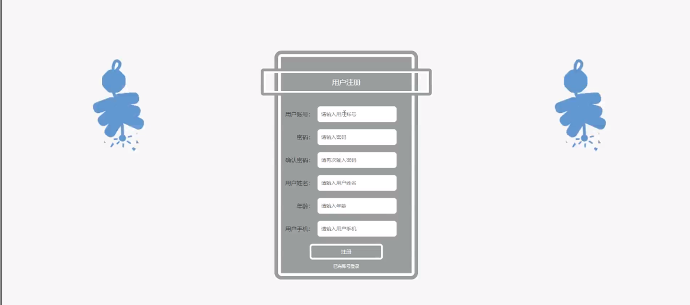

图5-2用户注册界面图

寻物启事，在寻物启事页面可以查看物品名称，丢失地方，丢失时间，用户账号，用户姓名，用户手机，找回状态等内容，如图5-3所示。

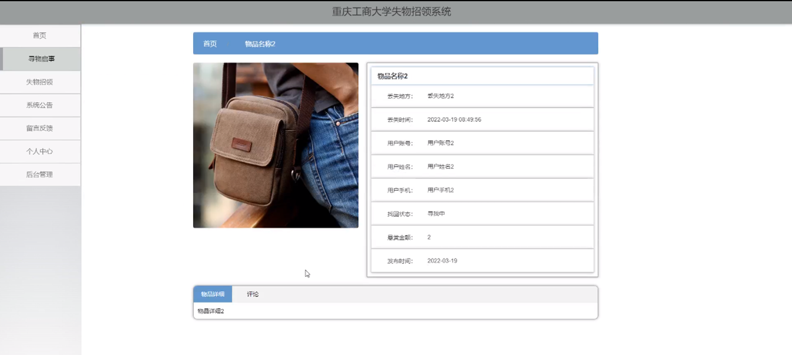

图5-3寻物启事界面图

留言反馈，在留言反馈页面可以通过填写留言内容，上传图片来提交留言，如图5-4所示。

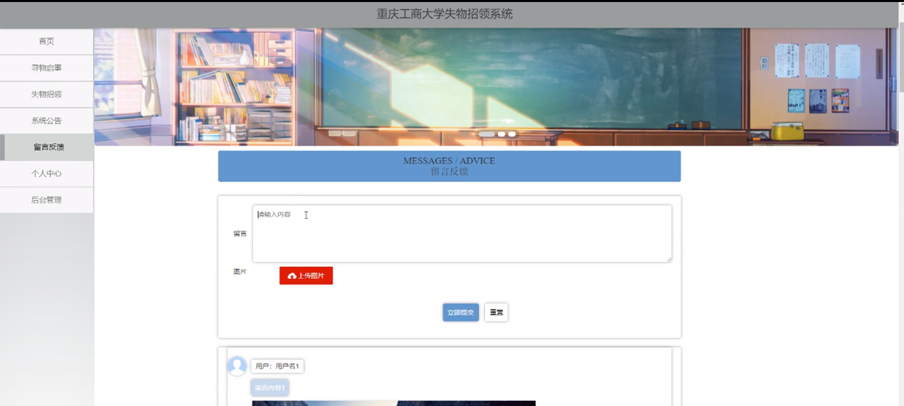

图5-4留言反馈界面图

个人中心，在个人中心页面通过填写用户账号，密码，用户姓名，性别，年龄，上传图片等内容进行更新信息，如图5-5所示。

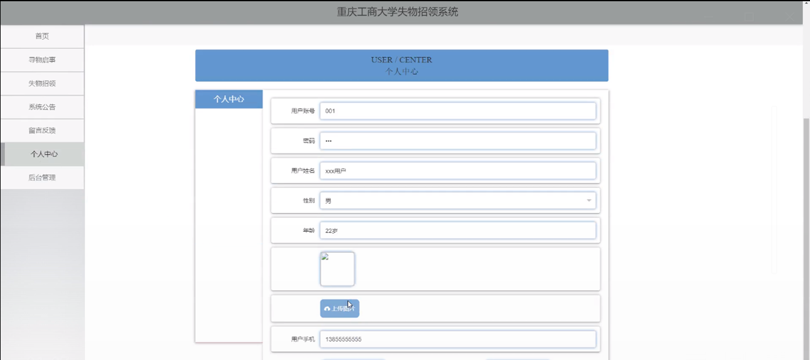

图5-5个人中心界面图

### 5.2管理员功能模块

管理员进行登录，进入系统前在登录页面根据要求填写用户名和密码，选择角色等信息，点击登录进行登录操作，如图5-6所示。

图5-6管理员登录界面图

管理员登录系统后，可以对首页，个人中心，用户管理，寻物启事管理，失物招领管理，举报信息管理，留言反馈，系统管理等功能进行相应的操作管理，如图5-7所示。

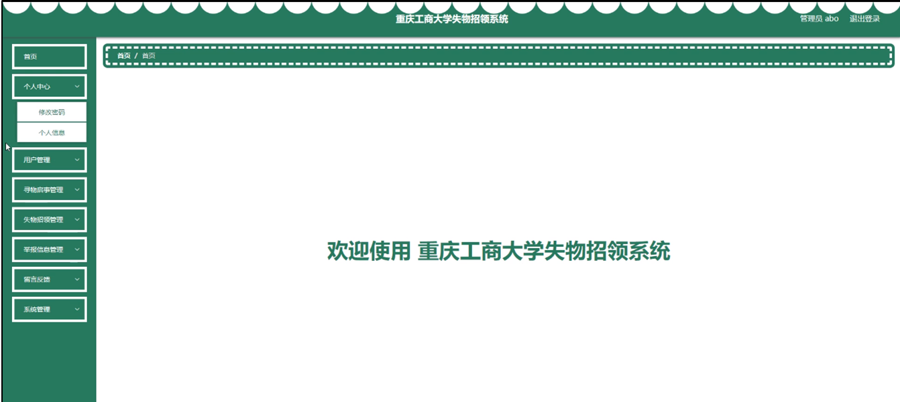

图5-7管理员功能界面图

用户管理，在用户管理页面可以对用户账号，用户姓名，性别，年龄，头像等内容进行查看，修改和删除等操作，如图5-8所示。

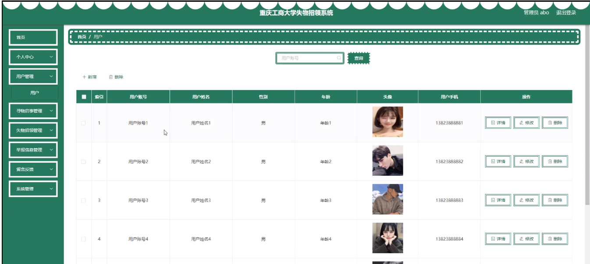

图5-8用户管理界面图

寻物启事管理，在寻物启事管理页面可以对物品名称，图片，丢失地点，丢失时间，用户账号，用户姓名，用户手机，找回状态等内容进行查看，修改，查看评论和删除等操作，如图5-9所示。

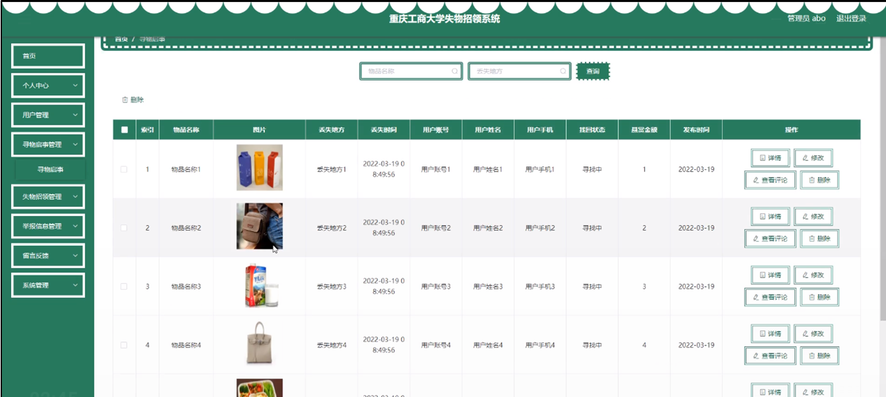

图5-9寻物启事管理界面图

举报信息管理，在举报信息管理页面可以对举报标题，用户编号，用户姓名，举报时间，审核回复，审核状态等内容进行详情，修改和删除等操作，如图5-10所示。

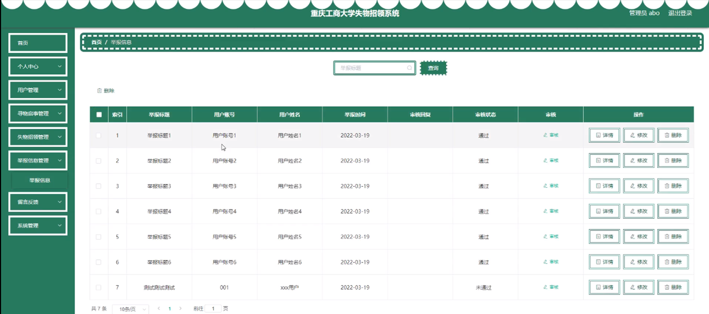

图5-10举报信息管理界面图

留言反馈，在留言反馈页面可以对用户名，留言内容，留言图片，回复内容，回复图片等内容进行详情，修改，回复和删除操作，如图5-11所示。

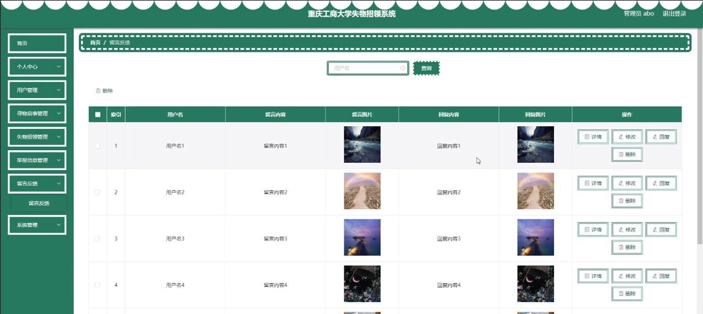

图5-11留言反馈界面图

系统管理，在系统公告页面可以对标题，图片等内容进行查看，修改和删除等操作，还可以对轮播图管理进行细的操作管理；如图5-12所示。

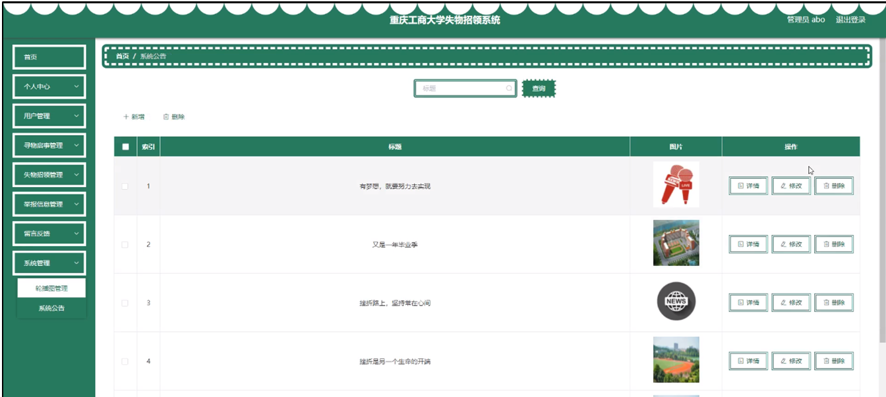

图5-12系统管理界面图

**JAVA** **毕设帮助，指导，源码获取，调试部署**

