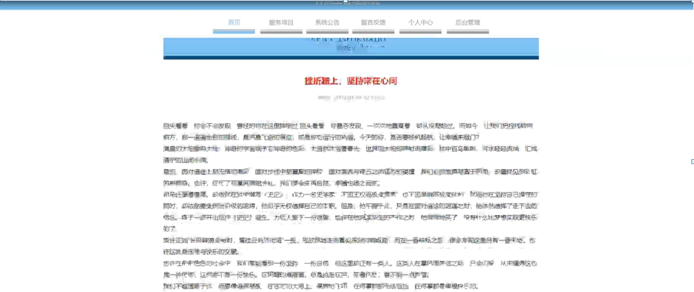

ssm+Vue计算机毕业设计钟点工管理系统（程序+LW文档）

**项目运行**

**环境配置：**

**Jdk1.8 + Tomcat7.0 + Mysql + HBuilderX** **（Webstorm也行）+ Eclispe（IntelliJ
IDEA,Eclispe,MyEclispe,Sts都支持）。**

**项目技术：**

**SSM + mybatis + Maven + Vue** **等等组成，B/S模式 + Maven管理等等。**

**环境需要**

**1.** **运行环境：最好是java jdk 1.8，我们在这个平台上运行的。其他版本理论上也可以。**

**2.IDE** **环境：IDEA，Eclipse,Myeclipse都可以。推荐IDEA;**

**3.tomcat** **环境：Tomcat 7.x,8.x,9.x版本均可**

**4.** **硬件环境：windows 7/8/10 1G内存以上；或者 Mac OS；**

**5.** **是否Maven项目: 否；查看源码目录中是否包含pom.xml；若包含，则为maven项目，否则为非maven项目**

**6.** **数据库：MySql 5.7/8.0等版本均可；**

**毕设帮助，指导，本源码分享，调试部署** **(** **见文末** **)**

### 总体设计

根据钟点工管理系统的功能需求，进行系统设计。

前台用户可以查看首页、服务项目、系统公告、留言反馈、个人中心、后台管理等功能。

后台主要是管理员，管理员功能包括首页、个人中心、用户管理、钟点工管理、项目分类管理、服务项目管理、服务订单管理、服务费用管理、服务评价管理、留言反馈、系统管理等；

系统对这些功能进行整合，产生的功能结构图如下图所示：

图3-1 系统总体设计图

### 3.4 数据库设计

在每一个系统中数据库有着非常重要的作用，数据库的设计得好将会增加系统的效率以及系统各逻辑功能的实现。所以数据库的设计我们要从系统的实际需要出发，才能使其更为完美的符合系统功能的实现。

#### 3.4.1 数据库E-R图

E-R图为实体-关系图，本系统的E-R图展现了各个实体之间的关系，在本数据库中，各个实体之间的关系均为多对多的关系；

用户注册实体属性图如图3-2所示。

图3-2注册实体属性图

服务项目实体属性图如图3-3所示。

图3-3服务项目实体属性图

服务费用实体属性图如图3-4所示。

图3-4服务费用实体属性图

### 系统功能模块

进入钟点工管理系统页面中可以查看首页、服务项目、系统公告、留言反馈、个人中心、后台管理等内容，进行详细等操作，如图4-1所示。

图4-1系统首页界面图

服务项目，在服务项目页面中可以查看项目名称、项目、分类、每时价、可约时间、服务地区、钟点工账号、钟点工姓名、钟点工手机、性别、年龄等内容进行收藏等操作，如图4-2所示。

图4-2服务项目界面图

个人中心，在个人中心页面中通过填写用户账号、密码、用户姓名、性别、性别、年龄、图片、用户手机等内容进行更新信息等操作，并可以根据我的收藏等操作如图4-3所示。

图4-3个人中心界面图

用户注册，通过填写用户账号、密码、确认密码、用户姓名、年龄、用户手机等内容进行注册等操作如图4-4所示。

图4-4用户注册界面图

### 4.2管理员功能模块

管理员进行登录，进入系统前在登录页面根据要求填写用户名和密码，选择角色等信息，点击登录进行登录操作，如图4-5所示。

图4-5管理员登录界面图

管理员登录系统后，可以对首页、个人中心、用户管理、钟点工管理、项目分类管理、服务项目管理、服务订单管理、服务费用管理、服务评价管理、留言反馈、系统管理等功能进行相应的操作管理，如图4-6所示。

图4-6管理员功能界面图

用户管理，在用户管理界面可以对索引、用户账号、用户姓名、性别、年龄、头像、用户手机等内容进行详情、修改或删除等操作，如图4-7所示。

图4-7用户管理界面图

钟点工管理，在钟点工管理界面可以对索引、钟点工账号、钟点工姓名、性别、年龄、头像、钟点工手机等内容进行详情、修改或删除等操作，如图4-8所示。

图4-8钟点工管理界面图

项目分类管理，在项目分类管理界面可以对索引、项目分类等内容进行修改或删除等操作，如图4-9所示。

图4-9项目分类管理界面图

服务项目管理，在服务项目管理页面可以对索引、项目名称、项目分类、每时价、可约时间、服务地区、钟点工账号、钟点工姓名、钟点工手机、性别、年龄、头像等内容进行详情、修改或删除等操作，如图4-10所示。

图4-10服务项目管理界面图

服务订单管理，在服务订单管理页面中可以对索引、项目名称、项目分类、每时价、钟点工账号、钟点工姓名、钟点工手机、性别、年龄、用户账号、用户姓名、用户手机、上门地址、预约时间、备注、审核回复、审核状态、审核等内容进行详情、修改或删除等操作，如图4-11所示。

图4-11服务订单管理界面图

服务费用管理，在服务费用管理页面可以对索引、预约编号、项目名称、项目分类、每时价、钟点工账号、钟点工姓名、钟点工手机、开始时间、结束时间、服务时长、服务价格、用户账号、用户姓名、用户手机、是否支付等内容进行详情或服务评价等操作，如图4-12所示。

图4-12服务费用管理界面图

#### **JAVA** **毕设帮助，指导，源码分享，调试部署**

