ssm+Vue计算机毕业设计银行客户关系管理系统（程序+LW文档）

**项目运行**

**环境配置：**

**Jdk1.8 + Tomcat7.0 + Mysql + HBuilderX** **（Webstorm也行）+ Eclispe（IntelliJ
IDEA,Eclispe,MyEclispe,Sts都支持）。**

**项目技术：**

**SSM + mybatis + Maven + Vue** **等等组成，B/S模式 + Maven管理等等。**

**环境需要**

**1.** **运行环境：最好是java jdk 1.8，我们在这个平台上运行的。其他版本理论上也可以。**

**2.IDE** **环境：IDEA，Eclipse,Myeclipse都可以。推荐IDEA;**

**3.tomcat** **环境：Tomcat 7.x,8.x,9.x版本均可**

**4.** **硬件环境：windows 7/8/10 1G内存以上；或者 Mac OS；**

**5.** **是否Maven项目: 否；查看源码目录中是否包含pom.xml；若包含，则为maven项目，否则为非maven项目**

**6.** **数据库：MySql 5.7/8.0等版本均可；**

**毕设帮助，指导，本源码分享，调试部署** **(** **见文末** **)**

### 系统结构图

整个系统的模块划分包含客户管理模块、vip管理模块和管理员管理模块, 又划分了若干了子模块,为了方便更直观的理解,下图以图形形式给出关于整个网站的结构图。

网站总体功能结构图3-1如图所示：

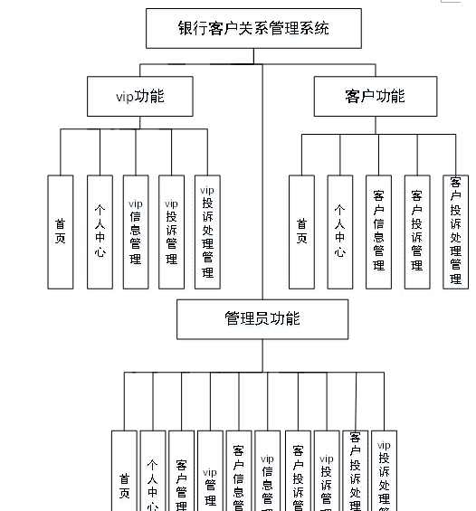

图3-2网站总体功能结构图

### 数据库概念设计

在对数据库设计之前首先要分析一下银行客户关系管理系统的功能，和各模块之间的关系，再对数据表进行设计。每一个模块的实体都会对应多个实体对象，下面是几个系统中的数据实体。

vip投诉信息实体E-R图如图4-1所示：

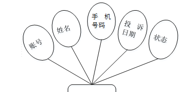

图4-1vip投诉信息E-R图

客户信息实体E-R图如图4-2所示：

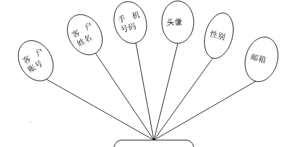

图4-2客户信息实体E-R图

vip信息实体E-R图如图4-3所示：

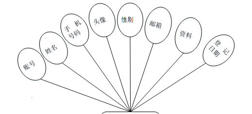

图4-3vip信息实体E-R图

客户信息实体E-R图如图4-4所示：

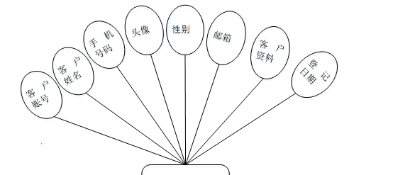

图4-4客户信息实体E-R图

### 管理员功能模块

管理员进行登录，进入系统前在登录页面根据要求填写用户名和密码，选择角色等信息，点击登录操作，如图5-1所示。

图5-1管理员登录界面图

管理员登录系统后，可以对首页、个人中心、客户管理、vip管理、客户信息管理、vip信息管理、客户投诉管理、vip投诉管理、客户投诉处理管理、vip投诉处理管理等进行相应的操作管理，如图5-2所示。

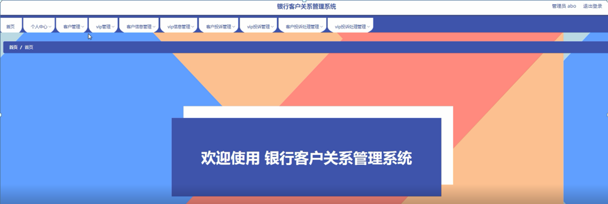

图5-2管理员功能界图面

客户投诉管理，在客户投诉管理页面可以对客户账号、客户姓名、手机号码、投诉日期、状态等内容进行详情、修改和删除等操作，如图5-3所示。

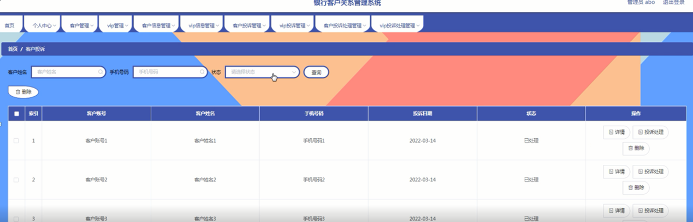

图5-3客户投诉管理界面图

客户管理，在客户管理页面可以对客户账号、客户姓名、手机号码、头像、性别、邮箱等内容进行详情、修改、删除等操作，如图5-4所示。

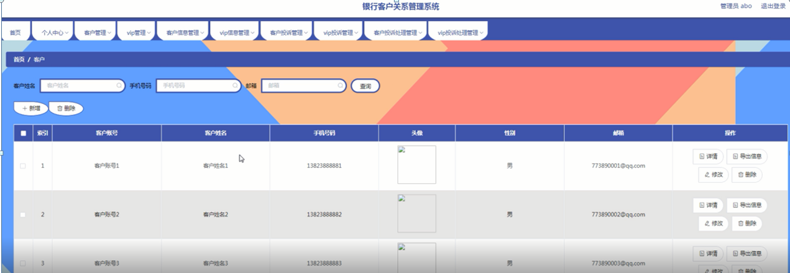

图5-4客户管理界面图

vip管理，在vip管理页面可以对账号、姓名、手机号码、头像、性别、邮箱等内容进行修改和删除等操作，如图5-5所示。

图5-5vip管理界面图

vip投诉管理，在vip投诉管理页面可以对账号、姓名、手机号码、投诉日期、状态等内容进行修改和删除等操作，如图5-6所示。

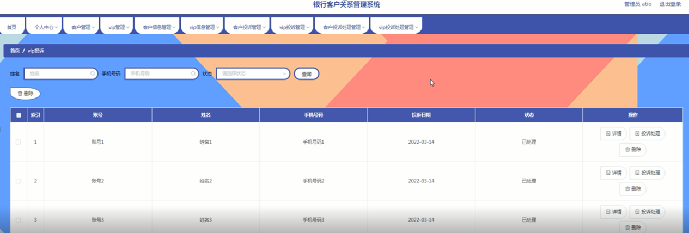

图5-6vip投诉管理界面图

### 5.2客户后台功能模块

客户注册，在客户注册页面可以对客户账号、客户姓名、密码、确认密码、手机号码、邮箱等内容进行注册操作，如图5-7所示。

图5-7客户注册界面图

客户登录，在客户登录页面可以填写用户名、密码、选择角色等内容进行登录操作，如图5-8所示。

图5-8客户登录界面图

客户登录进入网站后台可以对首页、个人中心、客户信息管理、客户投诉管理、客户投诉处理管理等进行相应操作，如图5-9所示。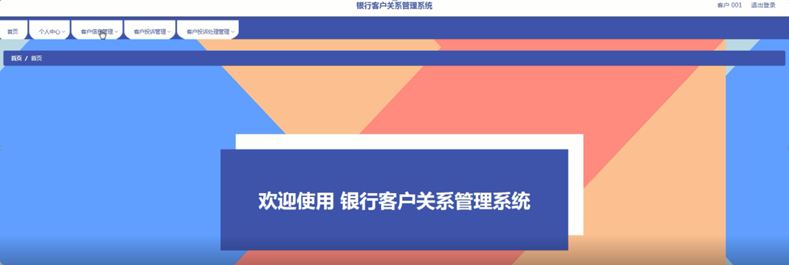

图5-9客户后台功能界面图

客户信息管理，在客户信息管理页面查看客户账号、客户姓名、手机号码、头像、性别、邮箱、客户资料、登记日期等内容，进行详情等操作，如图5-10所示。

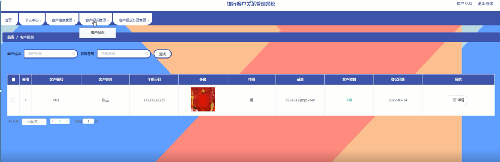

图5-10客户信息管理界面图

客户投诉管理，在客户投诉管理页面查看客户账号、客户姓名、手机号码、投诉日期、状态等内容，进行详情、修改、删除等操作，如图5-11所示。

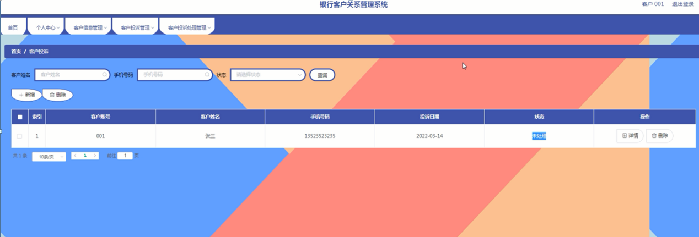

图5-11客户投诉管理界面图

客户投诉处理管理，在客户投诉处理管理页面查看客户账号、客户姓名、手机号码、投诉日期、处理方案、提交日期等内容，进行详情、修改、删除等操作，如图5-12所示。

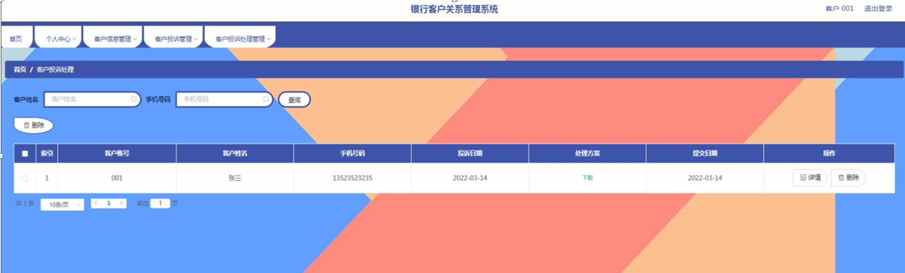

图5-12客户投诉处理管理界面图

**JAVA** **毕设帮助，指导，源码分享，调试部署**

