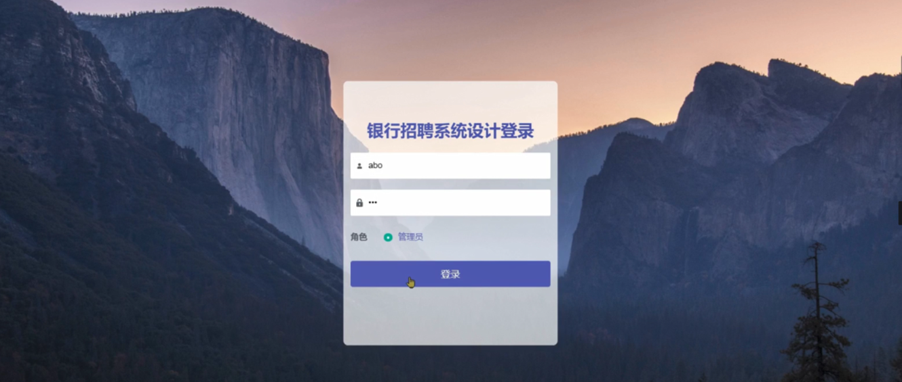

ssm+Vue计算机毕业设计银行招聘系统设计（程序+LW文档）

**项目运行**

**环境配置：**

**Jdk1.8 + Tomcat7.0 + Mysql + HBuilderX** **（Webstorm也行）+ Eclispe（IntelliJ
IDEA,Eclispe,MyEclispe,Sts都支持）。**

**项目技术：**

**SSM + mybatis + Maven + Vue** **等等组成，B/S模式 + Maven管理等等。**

**环境需要**

**1.** **运行环境：最好是java jdk 1.8，我们在这个平台上运行的。其他版本理论上也可以。**

**2.IDE** **环境：IDEA，Eclipse,Myeclipse都可以。推荐IDEA;**

**3.tomcat** **环境：Tomcat 7.x,8.x,9.x版本均可**

**4.** **硬件环境：windows 7/8/10 1G内存以上；或者 Mac OS；**

**5.** **是否Maven项目: 否；查看源码目录中是否包含pom.xml；若包含，则为maven项目，否则为非maven项目**

**6.** **数据库：MySql 5.7/8.0等版本均可；**

**毕设帮助，指导，本源码分享，调试部署** **(** **见文末** **)**

### 系统结构设计

系统架构图属于系统设计阶段，系统架构图只是这个阶段一个产物，系统的总体架构决定了整个系统的模式，是系统的基础。银行招聘系统设计的整体结构设计如图4-2所示。

图4-2 系统结构图

### 4.3 数据库设计

数据库是计算机信息系统的基础。目前，电脑系统的关键与核心部分就是数据库。数据库开发的优劣对整个系统的质量和速度有着直接影响。

#### 4.3.1 数据库设计原则

数据库的概念结构设计采用实体—联系（E-R）模型设计方法。E-R模型法的组成元素有：实体、属性、联系，E-R模型用E-
R图表示，是提示用户工作环境中所涉及的事物，属性则是对实体特性的描述。在系统设计当中数据库起着决定性的因素。下面设计出这几个关键实体的实体—关系图。

#### 4.3.2 数据库实体

数据模型中的实体（Entity），也称为实例，对应现实世界中可区别于其他对象的“事件”或“事物”。例如，公司中的每个员工，家里中的每个家具。

本系统的E-R图如下图所示：

1、用户管理实体图如图4-3所示：

图4-3用户管理实体图

2、招聘信息管理实体图如图4-4所示：

图4-4招聘信息管理实体图

### 系统功能模块

银行招聘系统设计，在系统的首页可以查看首页、个人简历、招聘信息、报名情况、准考证、成绩查询、招聘结果、个人中心、后台管理等信息进行详细操作，如图5-1所示。

图5-1系统首页界面图

个人简历，在个人简历页面中可以查看账号、姓名、性别、年龄、手机、照片、出生日期、求职岗位、期望薪资、获奖证书、毕业学校、最高学历、工作履历等详细信息，如图5-2所示。

图5-2个人简历界面图

招聘信息，在招聘信息页面中可以查看招聘编号、岗位名称、联系方式、联系邮箱、招聘人数、图片、职位要求、工资待遇、工作任务等详细信息进行报名，如图5-3所示。

图5-3招聘信息界面图

准考证，在准考证页面中可以查看考试编号、准考证号、考试名称、考试类型、考场号、考试地点、考试时间、账号、姓名、身份证、照片等详细信息；如图5-4所示。

图5-4准考证界面图

### 5.2 管理员功能模块

管理员登录，管理员通过输入用户名、密码、选择角色等信息，然后点击登录就能登录到系统进行系统的使用了，如图5-5所示。

图5-5管理员登录界面图

管理员登录进入系统之后，就可以对所有的信息进行查看，可以查看到首页、个人中心、用户管理、公告信息管理、个人简历管理、招聘信息管理、报名情况管理、准考证管理、成绩查询管理、招聘结果管理、系统管理等，并且还可以对其进行相应的操作管理，如图5-6所示。

图5-6管理员功能界面图

用户管理，在用户管理页面中可以对索引、账号、姓名、性别、年龄、手机、邮箱、身份证号、联系地址、照片等信息进行详情，修改或删除等操作，如图5-7所示。

图5-7用户管理界面图

公告信息管理，在公告信息管理页面中可以对索引、标题、附件、图片、发布人、发布时间等信息进行修改或删除等操作，如图5-8所示。

图5-8公告信息管理界面图

个人简历管理，在个人简历管理页面中可以对索引、账号、姓名、性别、年龄、手机、照片、出生日期、求职岗位、期望薪资、毕业学校、最高学历、工作履历等信息进行详情，修改或删除等操作，如图5-9所示。

图5-9个人简历管理界面图

招聘信息管理，在招聘信息管理页面中可以对索引、招聘编号、岗位名称、联系方式、联系邮箱、招聘人数、图片等信息进行详情、修改或删除等操作，如图5-10所示。

图5-10招聘信息管理界面图

报名情况管理，在报名情况管理页面中可以对索引、招聘编号、岗位名称、联系方式、联系邮箱、招聘人数、账号、姓名、身份证、照片、审核回复、审核状态、审核等信息进行详情、生成准考证、修改或删除等操作，如图5-11所示。

图5-11报名情况管理界面图

准考证管理，在准考证管理页面中可以对索引、考试编号、准考证号、考试名称、考试类型、考场号、考试地点、考试时间、账号、姓名、身份证、照片等信息进行修改或删除等操作，如图5-12所示。

图5-12准考证管理界面图

#### **JAVA** **毕设帮助，指导，源码分享，调试部署**

