ssm+Vue计算机毕业设计银行服务评价系统（程序+LW文档）

**项目运行**

**环境配置：**

**Jdk1.8 + Tomcat7.0 + Mysql + HBuilderX** **（Webstorm也行）+ Eclispe（IntelliJ
IDEA,Eclispe,MyEclispe,Sts都支持）。**

**项目技术：**

**SSM + mybatis + Maven + Vue** **等等组成，B/S模式 + Maven管理等等。**

**环境需要**

**1.** **运行环境：最好是java jdk 1.8，我们在这个平台上运行的。其他版本理论上也可以。**

**2.IDE** **环境：IDEA，Eclipse,Myeclipse都可以。推荐IDEA;**

**3.tomcat** **环境：Tomcat 7.x,8.x,9.x版本均可**

**4.** **硬件环境：windows 7/8/10 1G内存以上；或者 Mac OS；**

**5.** **是否Maven项目: 否；查看源码目录中是否包含pom.xml；若包含，则为maven项目，否则为非maven项目**

**6.** **数据库：MySql 5.7/8.0等版本均可；**

**毕设帮助，指导，本源码分享，调试部署** **(** **见文末** **)**

### 系统设计主要功能

通过市场调研及咨询研究，了解了银行服务评价系统及管理者的使用需求，于是制定了管理员、银行管理员和顾客等模块。功能结构图如下所示：

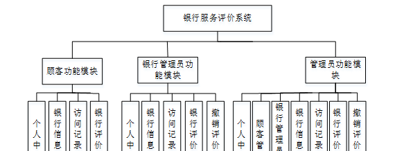

图4-1系统功能结构图

### 4.2 数据库设计

#### 4.2.1 数据库设计规范

数据可设计要遵循职责分离原则，即在设计时应该要考虑系统独立性，即每个系统之间互不干预不能混乱数据表和系统关系。

数据库命名也要遵循一定规范，否则容易混淆，数据库字段名要尽量做到与表名类似，多使用小写英文字母和下划线来命名并尽量使用简单单词。

**4.2.2** **E/R** **图**

顾客管理E/R图，如下所示：

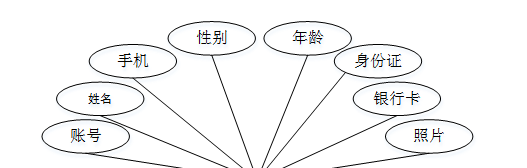

图4-2 顾客管理E/R图

银行信息管理E/R图，如下所示：

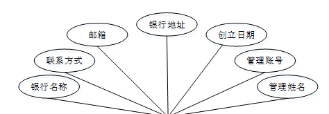

图4-3银行信息管理E/R图

访问记录管理E/R图，如下所示。

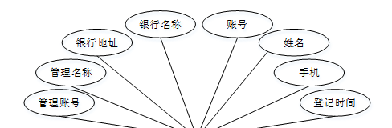

图4-4访问记录管理E/R图

### 顾客功能模块

顾客注册，顾客通过输入账号、密码、姓名、年龄、手机、身份证进行注册，如图5-1所示。

图5-1顾客注册界面图

顾客登录，顾客通过输入用户名、密码、角色进行登录，如图5-2所示。

图5-2顾客登录界面图

顾客通过登录进入系统可查看个人中心、银行信息管理、访问记录管理、银行评价管理等内容，如图5-3所示。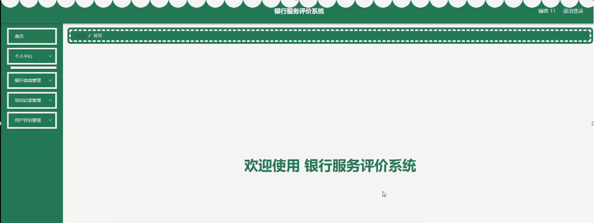
图5-3顾客功能界面图

银行信息管理，顾客可在银行信息管理页面查看银行名称、联系方式、邮箱、银行地址、创立日期、管理账号、管理姓名等内容，如图5-4所示。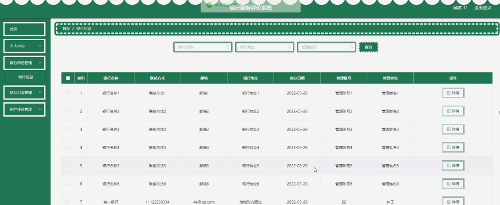
图5-4银行信息管理界面图

访问记录管理，顾客可在访问记录管理页面查看管理账号、管理名称、银行名称、银行地址、账号、姓名、手机、登记时间等内容，如图5-5所示。

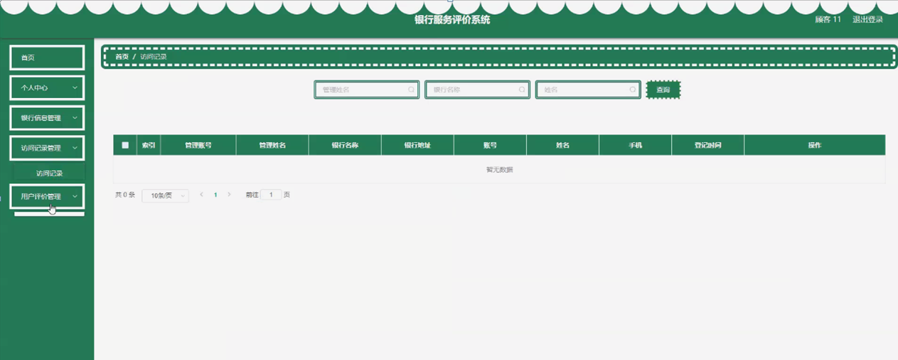

图5-5访问记录管理界面图

5.2银行管理员功能模块

银行管理员注册，银行管理员通过输入管理账号、密码、管理姓名、银行名称、银行地址、年龄、手机等内容进行注册，如图5-6所示。

图5-6银行管理员注册界面图

银行管理员通过登录进入系统可查看个人中心、银行信息管理、访问记录管理、银行评价管理、撤销评价管理等内容，如图5-7所示。

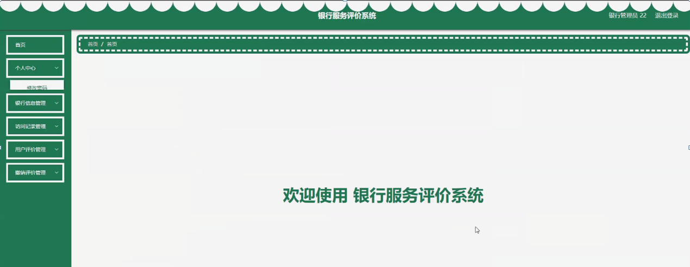 图5-7银行管理员功能界面图

银行信息管理，银行管理员可在银行信息管理页面查看银行名称、联系方式、邮箱、银行地址、创立日期、管理账号、管理姓名等内容，还可进行新增、修改或删除等操作，如图5-8所示。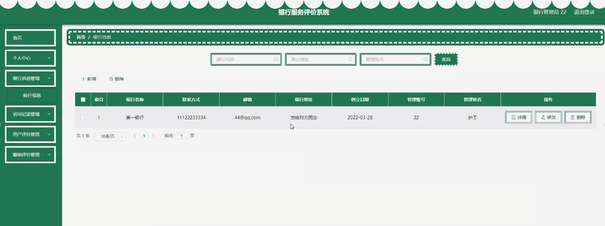
图5-8银行信息管理管理界图面

访问记录管理，银行管理员可在访问记录管理页面查看管理账号、管理名称、银行名称、银行地址、账号、姓名、手机、登记时间等内容，还可进行新增或删除等操作，如图5-9所示。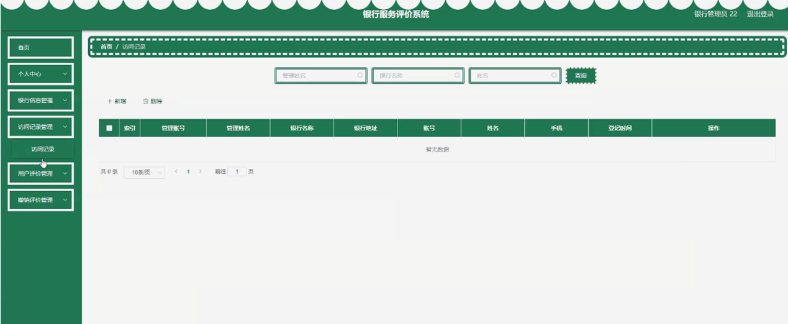

图5-9访问记录管理界图面

5.3管理员功能模块

管理员登录，管理员通过输入用户名、密码、角色进行登录，如图5-10所示。

图5-10管理员登录界面图

管理员通过登录进入系统可查看个人中心、顾客管理、银行管理员管理、银行信息管理、访问记录管理、用户评价管理、撤销评价管理等内容，如图5-11所示。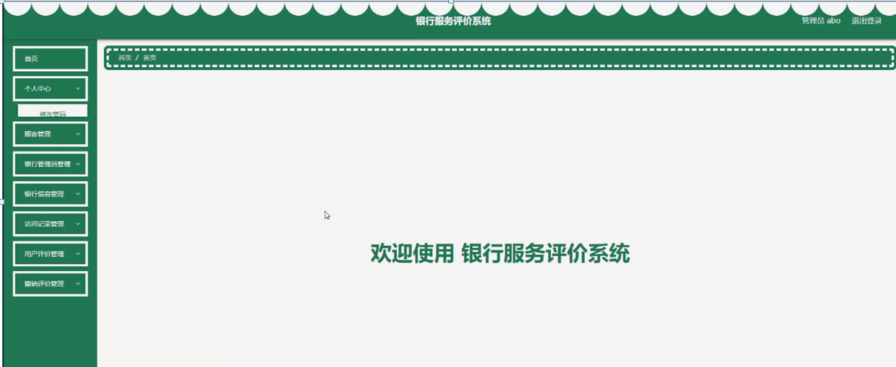

图5-11管理员功能界面图

顾客管理，管理员可在顾客管理页面查看账号、姓名、性别、年龄、手机、身份证、银行卡、照片等内容，还可进行新增、修改或删除等操作，如图5-12所示。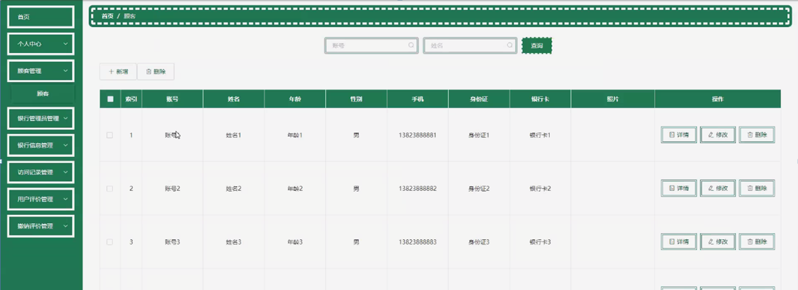

图5-12顾客管理界面图

**JAVA** **毕设帮助，指导，源码分享，调试部署**

