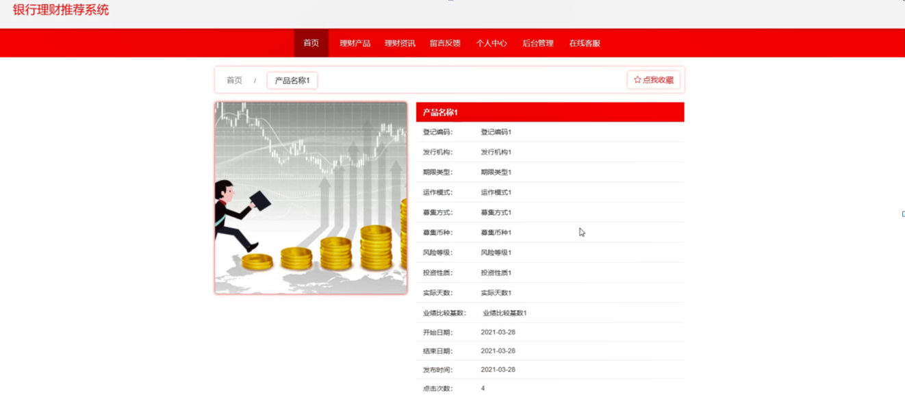

ssm+Vue计算机毕业设计银行理财推荐系统（程序+LW文档）

**项目运行**

**环境配置：**

**Jdk1.8 + Tomcat7.0 + Mysql + HBuilderX** **（Webstorm也行）+ Eclispe（IntelliJ
IDEA,Eclispe,MyEclispe,Sts都支持）。**

**项目技术：**

**SSM + mybatis + Maven + Vue** **等等组成，B/S模式 + Maven管理等等。**

**环境需要**

**1.** **运行环境：最好是java jdk 1.8，我们在这个平台上运行的。其他版本理论上也可以。**

**2.IDE** **环境：IDEA，Eclipse,Myeclipse都可以。推荐IDEA;**

**3.tomcat** **环境：Tomcat 7.x,8.x,9.x版本均可**

**4.** **硬件环境：windows 7/8/10 1G内存以上；或者 Mac OS；**

**5.** **是否Maven项目: 否；查看源码目录中是否包含pom.xml；若包含，则为maven项目，否则为非maven项目**

**6.** **数据库：MySql 5.7/8.0等版本均可；**

**毕设帮助，指导，本源码分享，调试部署** **(** **见文末** **)**

###  系统结构

系统架构图属于系统设计阶段，系统架构图只是这个阶段一个产物，系统的总体架构决定了整个系统的模式，是系统的基础。银行理财推荐系统的整体结构设计如图4-2所示。

图4-2 系统结构图

### 4.3. 数据库设计

4.3.1 数据库实体

用户信息管理结构图，如图4-3所示：

图4-3用户信息管理实体结构图

理财产品管理实体属性图，如图4-4所示：

图4-4理财产品管理实体属性图

### 系统功能模块

银行理财推荐系统，在系统首页可以查看首页、理财产品、理财资讯、留言反馈、个人中心、后台管理、在线客服等内容进行详细操作，如图5-1所示。

图5-1系统首页界面图

理财产品，在理财产品页面可以查看产品名称、登记编码、发行机构、期限类型、运作模式、募集方式、募集币种、风险等级、投资性质、实际天数、业绩比较基数、开始日期、结束日期、发布时间、封面图片等详细内容进行评论或收藏；如图5-2所示。

图5-2理财产品界面图

用户注册：在用户注册页面通过填写用户账号、密码、用户姓名、年龄、用户手机、身份证等详细内容进行用户注册；如图5-3所示。在个人中心页面中输入用户账号、密码、用户姓名、性别、年龄、图片、用户手机、身份证等详细内容进行更新信息；并可根据需要对我的收藏等进行操作；如图5-4所示。

图5-3用户注册界面图

图5-4个人中心界面图

### 5.2管理员功能模块

管理员登录，通过填写注册时输入的用户名、密码、选择角色进行登录，如图5-5所示。

图5-5管理员登录界面图

管理员登录进入银行理财推荐系统可以查看首页、个人中心、用户管理、理财产品管理、产品购买管理、产品合同管理、理财报告管理、留言板管理、系统管理等内容进行详细操作，如图5-6所示。

图5-6管理员功能界面图

用户管理，在用户管理页面可以查看索引、用户账号、用户姓名、性别、年龄、头像、用户手机、身份证等信息，并可根据需要进行详情，修改或删除等操作，如图5-7所示。

图5-7用户管理界面图

理财产品管理，在理财产品管理页面可以查看索引、产品名称、登记编码、发行机构、期限类型、运作模式、募集方式、募集币种、风险等级、投资性质、实际天数、业绩比较基数、开始日期、结束日期、发布时间、封面图片等内容，并可根据需要进行详情、修改、查看评论或删除等操作，如图5-8所示。

图5-8理财产品管理界面图

产品购买管理，在产品购买管理页面可以查看索引、订单号、产品名称、期限类型、登记编码、发行机构、买入金额、用户账号、用户姓名、用户手机、身份证、购买时间、是否支付、审核回复、审核状态、审核等信息，并可根据需要进行详情、签订合同、修改或删除等操作，如图5-9所示。

图5-9产品购买管理界面图

产品合同管理，在产品合同管理页面可以查看索引、订单号、产品名称、登记编码、发行机构、买入金额、用户账号、用户姓名、用户手机、身份证、合同文件、签订时间、备注等信息，并可根据需要进行详情、修改或删除等操作，如图5-10所示。

图5-10产品合同管理界面图

理财报告管理，在理财报告管理页面可以查看索引、报告编号、报告主题、报告时间、收益、亏损、盈利、备注等信息，并可根据需要进行详情、修改或删除操作，如图5-
11所示。

图5-11理财报告管理界面图

留言板管理，在留言板管理页面可以查看索引、用户名、留言内容、回复内容等信息，并可根据需要进行详情、修改、回复或删除等操作，如图5- 12所示。

图5-12留言板管理界面图

#### **JAVA** **毕设帮助，指导，源码分享，调试部署**

