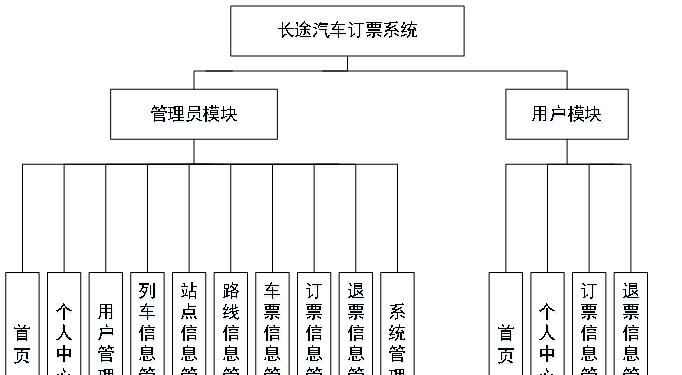

ssm+Vue计算机毕业设计长途汽车订票系统（程序+LW文档）

**项目运行**

**环境配置：**

**Jdk1.8 + Tomcat7.0 + Mysql + HBuilderX** **（Webstorm也行）+ Eclispe（IntelliJ
IDEA,Eclispe,MyEclispe,Sts都支持）。**

**项目技术：**

**SSM + mybatis + Maven + Vue** **等等组成，B/S模式 + Maven管理等等。**

**环境需要**

**1.** **运行环境：最好是java jdk 1.8，我们在这个平台上运行的。其他版本理论上也可以。**

**2.IDE** **环境：IDEA，Eclipse,Myeclipse都可以。推荐IDEA;**

**3.tomcat** **环境：Tomcat 7.x,8.x,9.x版本均可**

**4.** **硬件环境：windows 7/8/10 1G内存以上；或者 Mac OS；**

**5.** **是否Maven项目: 否；查看源码目录中是否包含pom.xml；若包含，则为maven项目，否则为非maven项目**

**6.** **数据库：MySql 5.7/8.0等版本均可；**

**毕设帮助，指导，本源码分享，调试部署** **(** **见文末** **)**

**总体设计**

总体设计图规定了系统的主要功能，如图3-3所示：

图3-3 总体设计图

**3.4** **数据库设计**

**3.4.1** **数据库E-R图**

E-R图为实体-关系图，本系统的E-R图展现了各个实体之间的关系，在本数据库中，各个实体之间的关系均为多对多的关系，

用户信息属性图如图3-4所示。

图3-4用户信息实体属性图

路线信息实体属性图如图3-5所示。

图3-5路线信息实体属性图

列车信息实体属性图如图3-6所示。

图3-6列车信息实体属性图

车票信息实体属性图如图3-7所示。

图3-7车票信息实体属性图

**用户功能模块**

用户登录长途汽车订票系统首页，用户可以对首页、个人中心、订票信息管理、退票信息管理等功能模块的查看与操作，如图4-1所示。

图4-1用户功能界面图

个人中心：在个人中心页面，可以对账号、姓名、性别、手机、身份证、头像等内容，进行修改，还能修改密码，如图4-2所示。

图4-2个人中心界面图

订票信息管理：点击订票信息管理，通过查看车票名称、车票价格、订票时间、订票说明、账号、姓名、是否支付、审核回复、审核状态等内容，进行相对应操作，如图4-3所示。

图4-3订票信息管理界面图

### 4.2前台首页功能模块

进入到长途汽车订票系统，在网站首页可以查看首页、列车信息、站点信息、路线信息、车票信息、订票资讯、个人中心、后台管理等内容进行操作，如图4-4所示。

图4-4前台首页界面图

点击注册，在用户注册页面通过填写账号、密码、确认密码、姓名、手机、身份证等信息完成用户注册操作；点击登录，通过输入账号、密码等登录到网站前台，进行相应操作，如图4-5所示。

图4-5用户注册、用户登录界面图

列车信息，在列车信息页面可以查看列车编号、列车名称、最早班次、最晚班次、发出间隔、座位数、列车图片等内容，并进行列车等操作；如图4-6所示。

图4-6列车信息界面图

站点信息，在站点信息页面可以查看站点编号、站点名称、站点地址、站点电话、站点图片等信息，进行站点介绍操作。如图4-7所示。

图4-7站点信息界面图

路线信息，在路线信息页面通过查看路线名称、起点地址、终点地址、路线距离、预计时间、路线图片等信息，进行行程轨迹操作，如图4-8所示。

图4-8路线信息界面图

车票信息，在车票信息页面通过查看车票名称、乘车班次、发车时间、到达时间、到达地点、车票价格、车票图片等信息，进行行订票、车票介绍操作，如图4-9所示。

图4-9车票信息界面

个人中心，在个人中心页面通过填写账号、密码、姓名、性别、手机、身份证、头像等信息，进行更新信息、退出登录操作，如图4-10所示。

图4-10个人中心界面图

**4.3** **管理员功能模块**

管理员通过登录页面输入用户名，密码选择角色等内容进行登录，登录到系统后台，进行相应的操作，如下图4-11所示。

图4-11管理员登录界图面

管理员登录到长途汽车订票系统的后台，管理员可以对首页、个人中心、用户管理、列车信息管理、站点信息管理、路线信息管理、车票信息管理、订票信息管理、退票信息管理、系统管理等进行相应操作，如下图4-12所示：

图4-12管理员功能界图面

#### **JAVA** **毕设帮助，指导，源码分享，调试部署**

