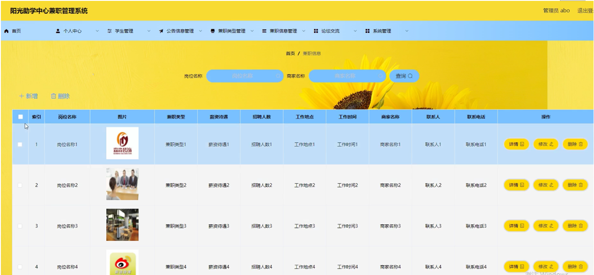

ssm+Vue计算机毕业设计阳光助学中心兼职管理系统（程序+LW文档）

**项目运行**

**环境配置：**

**Jdk1.8 + Tomcat7.0 + Mysql + HBuilderX** **（Webstorm也行）+ Eclispe（IntelliJ
IDEA,Eclispe,MyEclispe,Sts都支持）。**

**项目技术：**

**SSM + mybatis + Maven + Vue** **等等组成，B/S模式 + Maven管理等等。**

**环境需要**

**1.** **运行环境：最好是java jdk 1.8，我们在这个平台上运行的。其他版本理论上也可以。**

**2.IDE** **环境：IDEA，Eclipse,Myeclipse都可以。推荐IDEA;**

**3.tomcat** **环境：Tomcat 7.x,8.x,9.x版本均可**

**4.** **硬件环境：windows 7/8/10 1G内存以上；或者 Mac OS；**

**5.** **是否Maven项目: 否；查看源码目录中是否包含pom.xml；若包含，则为maven项目，否则为非maven项目**

**6.** **数据库：MySql 5.7/8.0等版本均可；**

**毕设帮助，指导，本源码分享，调试部署** **(** **见文末** **)**

### 系统结构设计

系统设计是把本系统的各项功能需求进行细化，而转换为软件系统表示的一个设计过程，在对目标系统的研究分析之后，做出整个系统平台的总体规划，进而对用例中各个对象进一步地合理精细设计。为降低整个系统的复杂度，而使其更加便于修改，提高代码的可读性，我们会将系统模块化，模块间保持相对独立，且每个模块只完成一个子功能，并且与其他模块通过简单的接口链接，即高内聚低耦合原则，而使整个系统能够拥有一个高性能的结构，这边是系统概要设计最重要的目的。在之前的需求分析的基础上，本阳光助学中心兼职管理系统结构，如下图4-1所示。

图4-1 系统结构功能图

### 4.2数据库设计

在查询时，应保证所有满足条件的记录都能查到。数据库记录通常在几百条以上，如有遗漏将会对学生的统计造成影响。一般操作的响应时间应该在1-2秒内。采用菜单界面，对学生比较友好。本文中将通过E-
R图来设计并展示数据的概念模型，

学生管理E-R图如图4-2所示。

图4-2学生管理E-R图

公告信息管理E-R图如图4-3所示。

图4-3公告信息管理E-R图

兼职信息管理E-R图如图4-4所示。

图4-4兼职信息管理E-R图

### 系统功能模块

阳光助学中心兼职管理系统，在系统首页可以查首页，公告信息，兼职信息，论坛交流，个人中心，在线聊天等内容，并进行详细操作；如图5-1所示。

图5-1系统首页界面图

兼职信息，在兼职信息页面可以岗位名称，兼职类型，薪资待遇，招聘人数，工作地点，工作时间，岗位要求，商家名称，联系人，联系电话，兼职详情等内容，并进行收藏等操作，如图5-2所示。

图5-2兼职信息界面图

个人中心，在个人中心页面通过填写学号，密码，学生姓名，头像，性别，手机号码，邮箱等内容进行更新信息，还可以对我的发布，我的收藏进行详细操作；如图5-3所示。

图5-3个人中心界面图

学生注册，在学生注册页面通过填写学号，密码，确认密码，学生姓名，手机号码，邮箱等内容进行注册操作，如图5-4所示。

图5-4学生注册界面图

### 5.2管理员功能模块

管理员登录系统后，可以对首页，个人中心，学生管理，公告信息管理，兼职类型管理，兼职信息管理，论坛交流，系统管理等功能进行相应的操作管理，如图5-5所示。

图5-5管理员功能界面图

学生管理，在学生管理页面可以对索引，学号，学生姓名，头像，性别，手机号码，邮箱等内容进行详情，修改和删除操作，如图5-6所示。

图5-6学生管理界面图

公告信息管理，在公告信息管理页面可以对索引，公告名称，图片，发布时间等信息进行详情，修改，查看评论和删除操作，如图5-7所示。

图5-公告信息管理界面图

兼职类型管理，在兼职类型管理页面可以对兼职类型等内容进行详情，修改，和删除操作，如图5-8所示。

图5-8兼职类型管理界面图

兼职信息管理，在兼职信息管理页面可以对索引，岗位名称，图片，兼职类型，薪资待遇，招聘人数，工作地点，工作时间，商家名称，联系人，联系电话等内容进行详情，修改，和删除操作，如图5-9所示。

图5-9兼职信息管理界面图

论坛交流，在论坛交流页面可以对索引，帖子标题，用户名，状态等内容进行详情，修改，查看评论和删除操作，如图5-10所示。

图5-10论坛交流界面图

系统管理，在轮播图管理页面可以对索引，名称，值等内容进行详情，修改，等操作；如图5-11所示。

图5-11系统管理界面图

**JAVA** **毕设帮助，指导，源码分享，调试部署**

