ssm+Vue计算机毕业设计音乐推荐系统（程序+LW文档）

**项目运行**

**环境配置：**

**Jdk1.8 + Tomcat7.0 + Mysql + HBuilderX（Webstorm也行）+ Eclispe（IntelliJ
IDEA,Eclispe,MyEclispe,Sts都支持）。**

**项目技术：**

**SSM + mybatis + Maven + Vue 等等组成，B/S模式 + Maven管理等等。**

**环境需要**

**1.运行环境：最好是java jdk 1.8，我们在这个平台上运行的。其他版本理论上也可以。**

**2.IDE环境：IDEA，Eclipse,Myeclipse都可以。推荐IDEA;**

**3.tomcat环境：Tomcat 7.x,8.x,9.x版本均可**

**4.硬件环境：windows 7/8/10 1G内存以上；或者 Mac OS；**

**5.是否Maven项目: 否；查看源码目录中是否包含pom.xml；若包含，则为maven项目，否则为非maven项目**

**6.数据库：MySql 5.7/8.0等版本均可；**

**毕设帮助，指导，本源码分享，调试部署(** **见文末)**

### 系统设计主要功能

通过市场调研及咨询研究，了解了用户及管理者的使用需求，于是制定了管理员，和用户等模块。功能结构图如下所示：

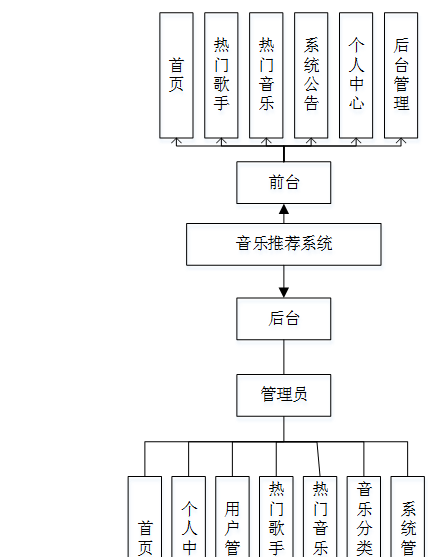

图4-1系统功能结构图

### 4.2数据库设计

#### 4.2.1数据库设计规范

数据可设计要遵循职责分离原则，即在设计时应该要考虑系统独立性，即每个系统之间互不干预不能混乱数据表和系统关系。

数据库命名也要遵循一定规范，否则容易混淆，数据库字段名要尽量做到与表名类似，多使用小写英文字母和下划线来命名并尽量使用简单单词。

#### 4.2.2 E/R图

用户注册E/R图，如下所示：

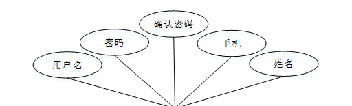

图4-2用户注册E/R图

热门音乐E/R图，如下所示：

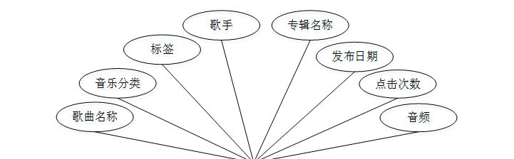

图4-3热门音乐E/R图

### 系统功能模块

音乐推荐系统，在系统首页可以查看首页，热门歌手，热门音乐，系统公告，个人中心，后台管理等内容，并进行详细操作；如图5-1所示。

图5-1系统首页界面图

用户注册，在用户注册页面通过填写用户账号，用户姓名，密码，确认密码，联系电话等信息进行注册操作，如图5-2所示。

图5-2用户注册界面图

热门歌手，在热门歌手页面可以查看歌手姓名，歌手性别，出生日期，流派，标签，代表作，点击次数等内容，并可以进行评论，点我收藏等操作，如图5-3所示。

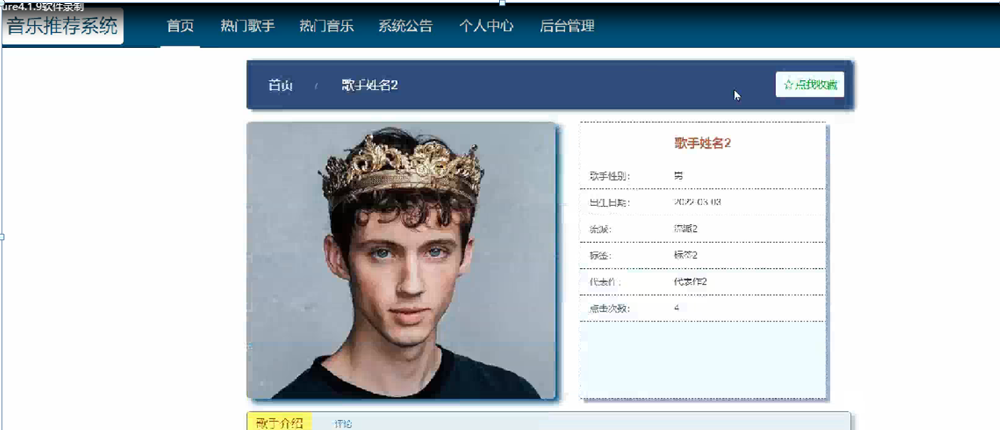

图5-3热门歌手界面图

热门音乐，在热门音乐页面可以歌曲名称，音乐分类，标签，歌手，专辑名称，发布日期，点击次数，音频等内容，并进行赞一下，踩一下，点我收藏等操作；如图5-4所示。

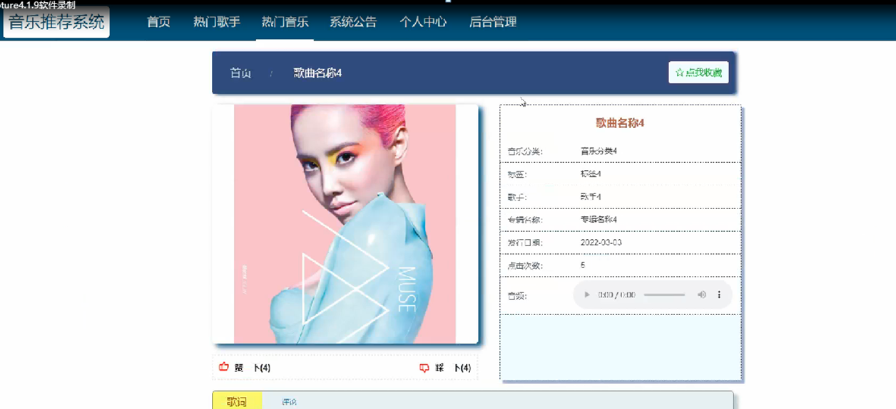

图5-4热门音乐界面图

个人中心，在个人中心页面通过填写用户账号，用户姓名，密码，性别，联系电话等内容进行更新信息，还可以根据需要对我的收藏进行相对应操作，如图5-5所示。

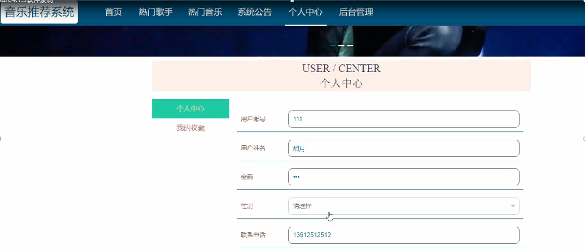

图5-5个人中心界面图

### 5.2管理员功能模块

管理员登录，通过填写注册时输入的用户名、密码、选择角色等信息进行登录操作，如图5-6所示。

图5-6管理员登录界面图

管理员登录进入系统可以查看首页，个人中心，用户管理，热门歌手管理，音乐分类管理，热门音乐管理，系统管理等功能，并进行详细操作，如图5-7所示。

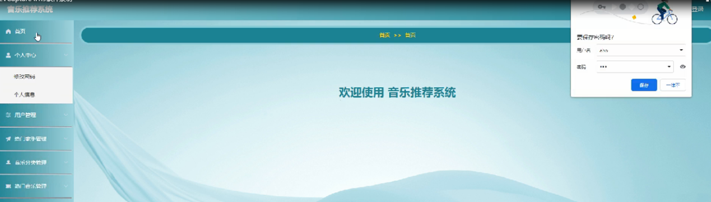

图5-7管理员功能界面图

用户管理；在用户管理页面中可以查看索引，用户账号，用户姓名，性别，联系电话等内容，并进行详情，修改和删除等操作；如图5-8所示。

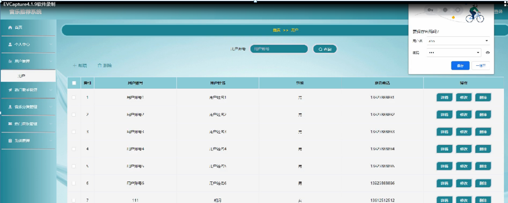

图5-8用户管理界面图

热门歌手管理；在热门歌手管理页面中可以查看索引，歌手姓名，歌手性别，出生日期，封面，流派，标签等内容，并进行详情，修改，查看评论和删除操作；如图5-9所示。

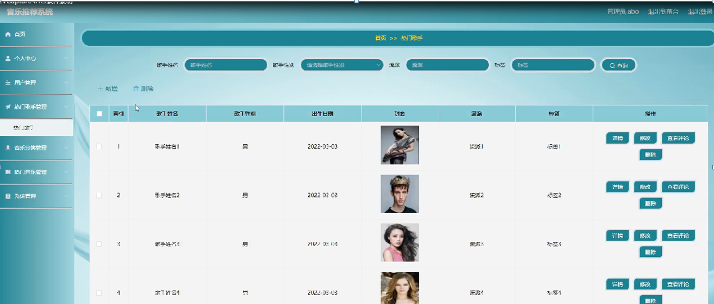

图5-9热门歌手管理界面图

音乐分类管理；在音乐分类管理页面中可以查看音乐分类信息，并进行详情操作；如图5-10所示。

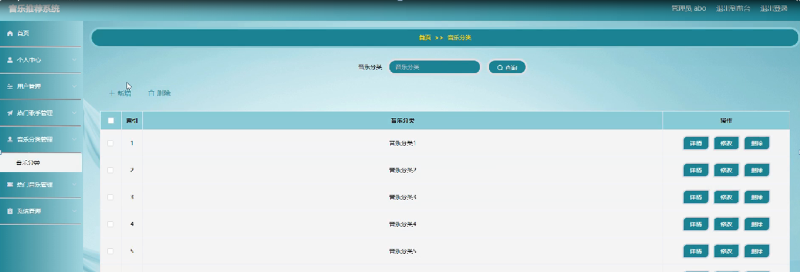

图5-10音乐分类管理界面图

热门音乐管理；在热门音乐管理页面中可以查看索引，歌曲名称，音乐分类，标签，封面，歌手，专辑名称，发布日期，音频等内容，并进行详情，修改，查看评论和删除操作；如图5-11所示。

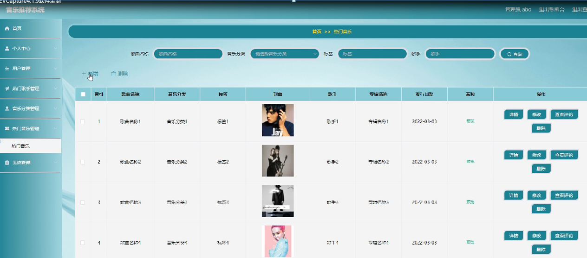

图5-11热门音乐管理界面图

#### **JAVA毕设帮助，指导，源码分享，调试部署**

