ssm+Vue计算机毕业设计音乐资源分享网站（程序+LW文档）

**项目运行**

**环境配置：**

**Jdk1.8 + Tomcat7.0 + Mysql + HBuilderX** **（Webstorm也行）+ Eclispe（IntelliJ
IDEA,Eclispe,MyEclispe,Sts都支持）。**

**项目技术：**

**SSM + mybatis + Maven + Vue** **等等组成，B/S模式 + Maven管理等等。**

**环境需要**

**1.** **运行环境：最好是java jdk 1.8，我们在这个平台上运行的。其他版本理论上也可以。**

**2.IDE** **环境：IDEA，Eclipse,Myeclipse都可以。推荐IDEA;**

**3.tomcat** **环境：Tomcat 7.x,8.x,9.x版本均可**

**4.** **硬件环境：windows 7/8/10 1G内存以上；或者 Mac OS；**

**5.** **是否Maven项目: 否；查看源码目录中是否包含pom.xml；若包含，则为maven项目，否则为非maven项目**

**6.** **数据库：MySql 5.7/8.0等版本均可；**

**毕设帮助，指导，本源码分享，调试部署** **(** **见文末** **)**

### 系统结构设计

整个系统是由多个功能模块组合而成的，要将所有的功能模块都一一列举出来，然后进行逐个的功能设计，使得每一个模块都有相对应的功能设计，然后进行系统整体的设计。

本音乐资源分享系统结构图如图3-2所示。

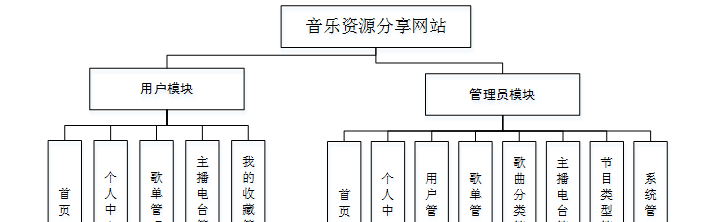

图3-2音乐资源分享系统结构图

### 3.3数据库设计

数据库可以说是所有软件的根本，如果数据库存在缺陷，那么会导致系统开发的不顺利、维护困难、用户使用不顺畅等一系列问题，严重时将会直接损害企业的利益，同时在开发完成后，数据库缺陷也更加难以解决。所以必须要对数据库设计重点把握，做到认真细致。因此，数据库设计是这个在线音乐资源分享系统的重点要素。

#### 3.3.1概念结构设计

(1) 用户管理实体属性图如下图3-3所示

图3-3用户管理实体属性图

(2) 歌单管理实体属性如下图3-4所示

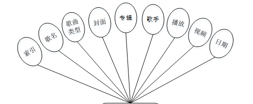

图3-4歌单管理实体属性图

(3) 主播电台管理实体属性如下图3-5所示

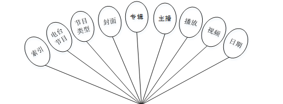

图3-5主播电台管理实体属性图

### 系统功能模块

音乐资源分享系统，在系统首页可以查看首页、歌单、主播电台、个人中心、后台管理等内容进行详细操作，如图4-1所示。

图4-1系统首页界面图

歌单：在歌单页面可以查看歌名、歌曲类型、封面、专辑、歌手、日期、播放等内容，并进行收藏或评论等操作，如图4-2所示。

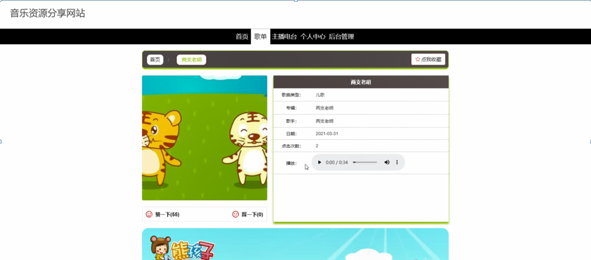

图4-2歌单界面图

主播电台：在主播电台页面可以查看电台节目、节目类型、封面、专辑、主播、日期、播放等内容，并进行收藏或评论等操作，如图4-3所示。

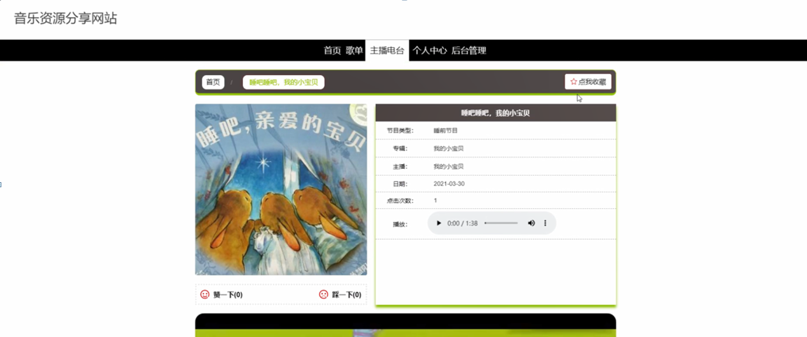

图4-3主播电台界面图

用户注册：在用户注册页面中输入账号、密码、姓名、手机、邮箱等内容进行用户注册；如图4-4所示。在个人中心页面中输入账号、密码、姓名、性别、手机、邮箱、图片等内容进行更新信息；并可以根据需要对我的收藏进行相应的操作；如图4-5所示。

图4-4用户注册界面图

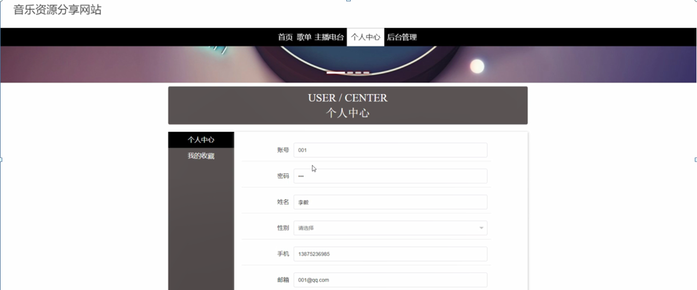

图4-5个人中心界面图

### 4.2管理员功能模块

管理员登录；在管理员登录页面中填写用户名、密码、选择角色进行登录，如图4-6所示。

图4-6管理员登录界面图

管理员登录进入音乐资源分享网站可以查看首页、个人中心、用户管理、歌单管理、歌曲分类管理、主播电台管理、节目类型管理、系统管理等信息进行详细操作，如图4-7所示。

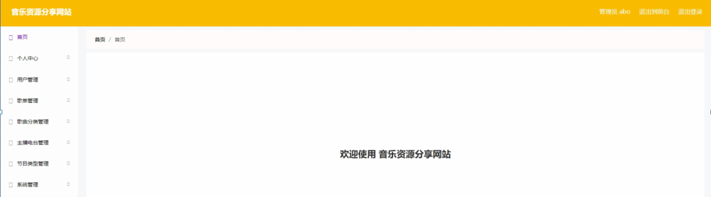

图4-7管理员功能界面图

用户管理；在用户管理页面可以对索引、账号、姓名、性别、手机、邮箱、照片等内容进行详情、修改或删除等操作，如图4-8所示。

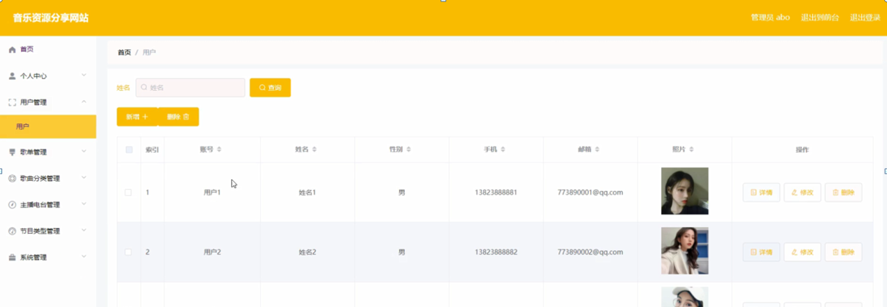

图4-8用户管理界面图

歌单管理；在歌单管理页面可以对索引、歌名、歌曲类型、封面、专辑、歌手、播放、视频、日期等内容进行详情、修改或删除等操作，如图4-9所示。

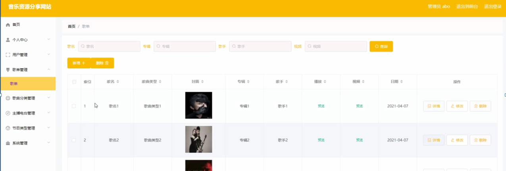

图4-9歌单管理界面图

歌曲分类管理；在歌曲分类管理页面可以对索引、歌曲类型等内容进行修改或删除等操作，如图4-10所示。

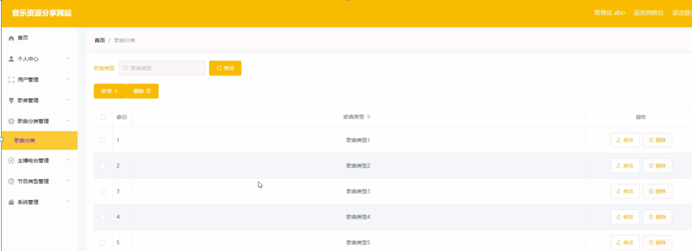

图4-10歌曲分类管理界面图

主播电台管理；在主播电台管理页面可以对索引、电台节目、节目类型、封面、专辑、主播、播放、视频、日期等内容进行详情、修改或删除等操作，如图4-11所示。

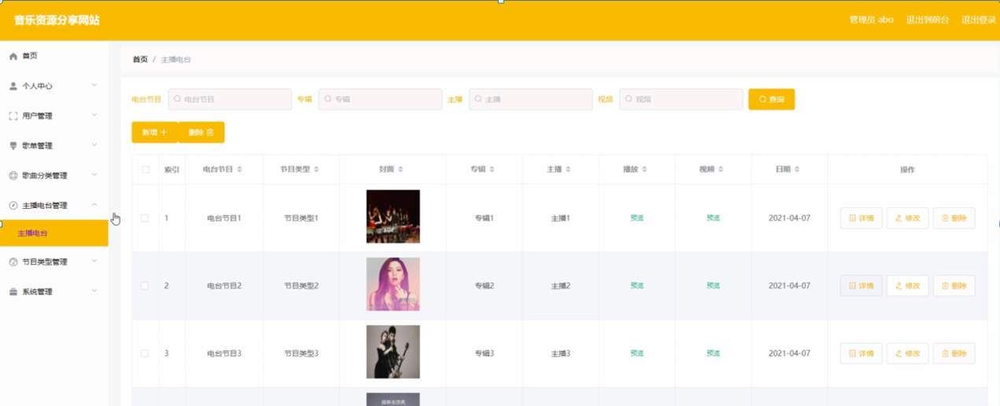

图4-11主播电台管理界面图

节目类型管理；在节目类型管理页面可以对索引、节目类型等内容进行修改或删除等操作，如图4-12所示。

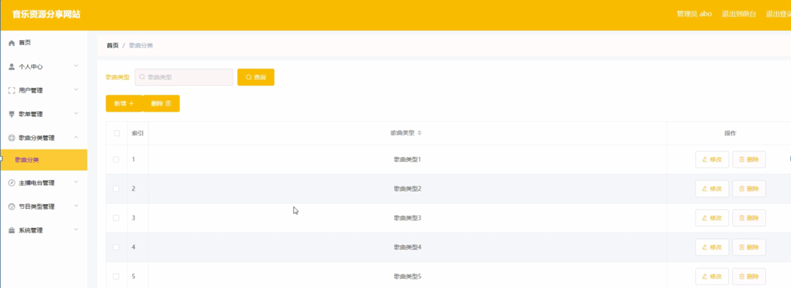

图4-12节目类型管理界面图

#### **JAVA** **毕设帮助，指导，源码分享，调试部署**

