ssm+Vue计算机毕业设计音乐鉴赏网站前端开发（程序+LW文档）

**项目运行**

**环境配置：**

**Jdk1.8 + Tomcat7.0 + Mysql + HBuilderX（Webstorm也行）+ Eclispe（IntelliJ
IDEA,Eclispe,MyEclispe,Sts都支持）。**

**项目技术：**

**SSM + mybatis + Maven + Vue 等等组成，B/S模式 + Maven管理等等。**

**环境需要**

**1.运行环境：最好是java jdk 1.8，我们在这个平台上运行的。其他版本理论上也可以。**

**2.IDE环境：IDEA，Eclipse,Myeclipse都可以。推荐IDEA;**

**3.tomcat环境：Tomcat 7.x,8.x,9.x版本均可**

**4.硬件环境：windows 7/8/10 1G内存以上；或者 Mac OS；**

**5.是否Maven项目: 否；查看源码目录中是否包含pom.xml；若包含，则为maven项目，否则为非maven项目**

**6.数据库：MySql 5.7/8.0等版本均可；**

**毕设帮助，指导，本源码分享，调试部署(** **见文末)**

### 系统体系结构

音乐鉴赏网站前端开发的结构图4-1所示：

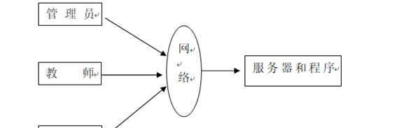

图4-1 系统结构

模块包括首页,个人中心,用户管理,教师管理,音乐分类管理,音乐信息管理,视频分类管理，音乐视频管理，音乐人管理，音乐论坛，系统管理等进行相应的操作。

登录系统结构图，如图4-2所示：

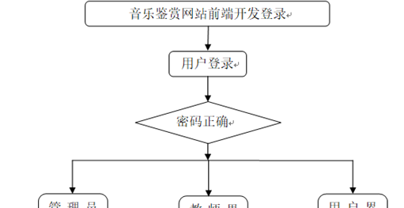

图4-2 登录结构图

这些功能可以充分满足音乐鉴赏网站前端开发的需求。此系统功能较为全面如下图系统功能结构如图4-3所示。

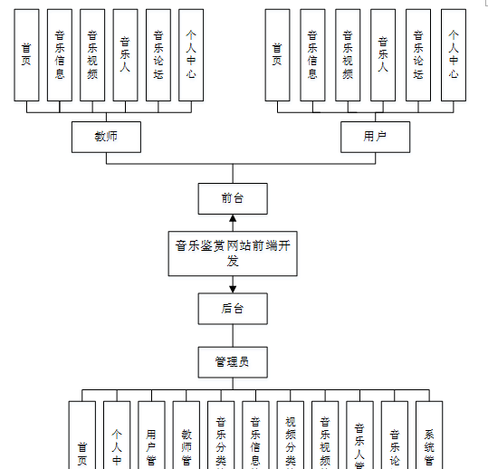

图4-3系统功能结构图

### 4.2 数据库设计

本系统使用MYSQL 作为系统的数据库，设计用户注册表、文件上传的表等等。

#### 4.2.1 数据库概念结构设计

概念结构设计是根据用户需求形成的。用最常的E-R方法描述数据模型进行数据库的概念设计，首先设计局部的E-
R模式，最后各局部ER模式综合成一个全局模式。然后再把概念模式转换成逻辑模式。将概念设计从设计过程中独立开来，设计复杂程度降低，不受特定DBMS的限制。

1.所有实体和属性的定义如下所示。

音乐分类管理属性图如图4-4所示。

图4-4音乐分类管理实体属性图

音乐信息管理实体属性图如图4-5所示。

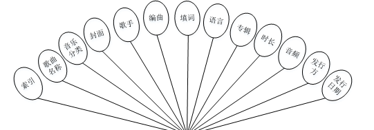

图4-5音乐信息管理实体属性图

### 系统功能模块

音乐鉴赏网站，在网站首页可以查看首页,音乐信息,音乐视频，音乐人，音乐论坛，个人中心等内容进行详细操作，如图5-1所示。

图5-1网站首页界面图

教师注册，在教师注册页面填写教师账号，密码，再次输入密码，教师姓名，年龄，联系电话等内容，并进行注册操作；如图5-2所示。

图5-2教师注册界面图

用户注册，在用户注册页面填写账号，密码，再次输入密码，姓名，年龄，手机等内容，并进行注册操作；如图5-3所示。

图5-3用户注册界面图

音乐信息，在音乐信息页面可以查看音乐分类，歌手，编曲，填词，语言，专辑，时长，发行方，发行日期，点击次数等内容，如图5-4所示。

图5-4音乐信息界面图

音乐视频，在音乐视频页面可以查看视频分类，发布日期，点击次数等详细信息，如图5-5所示。

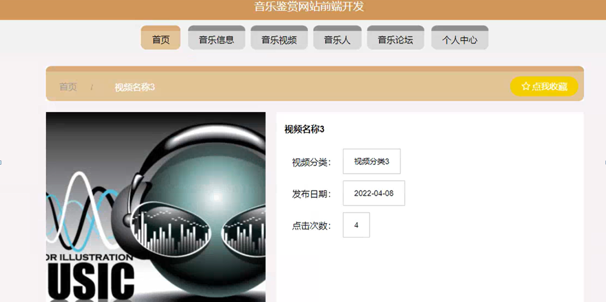

图5-5音乐视频界面图

个人中心，在个人中心页面通过填写账号,密码,姓名,年龄,性别,手机,上传图片等内容进行信息更新操作，还可以根据需要对我的发布，我的收藏进行详细操作；如图5-6所示。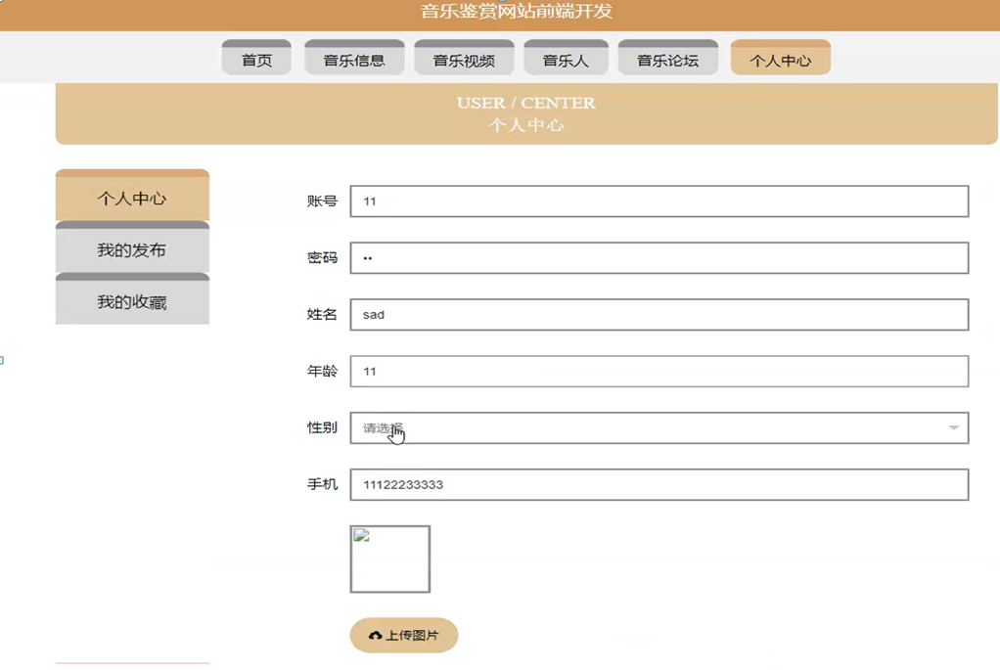

图5-6个人中心界面图

### 5.2管理员功能模块

管理员登录，管理员通过输入用户名，密码，等信息进行系统登录，如图5-7所示。

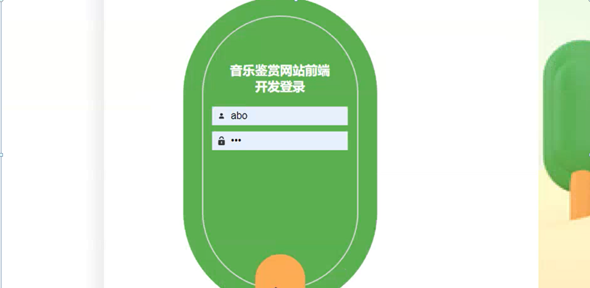

图5-7管理员登录界面图

管理员登录进入音乐鉴赏网站前端开发可以查看首页,个人中心,用户管理,教师管理,音乐分类管理,音乐信息管理,视频分类管理，音乐视频管理，音乐人管理，音乐论坛，系统管理等内容进行详细操作，如图5-8所示。

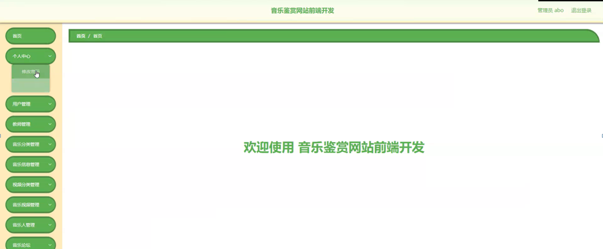

图5-8管理员功能界面图

用户管理，在用户管理页面可以对索引,账号,姓名，年龄，性别，手机，照片等内容进行详情，修改和删除等操作，如图5-9所示。

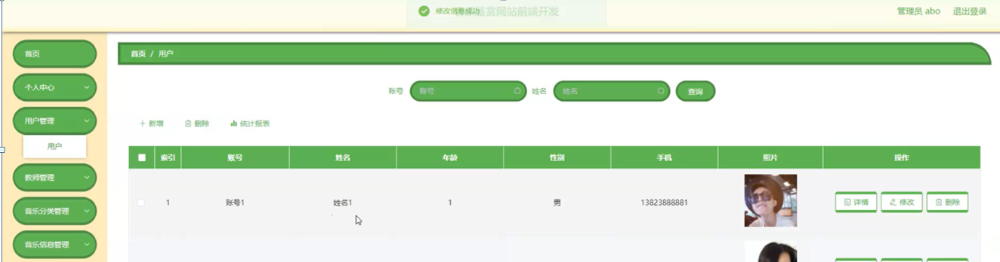

图5-9用户管理界面图

教师管理，在教师信息管理页面可以对索引,教师账号，教师姓名，年龄，性别，联系电话，图片等内容进行详情，修改或删除等操作，如图5-10所示。

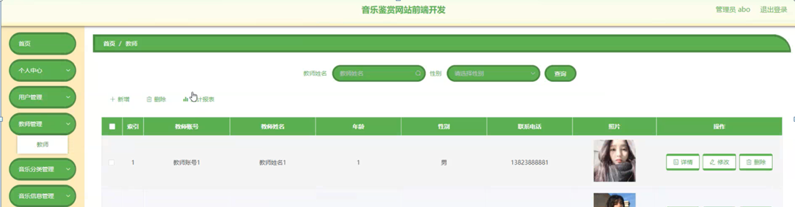

图5-10教师管理界面图

音乐分类管理，在音乐分类管理页面可以对索引,音乐分类等内容进行详情、修改或删除等操作，如图5-11所示。

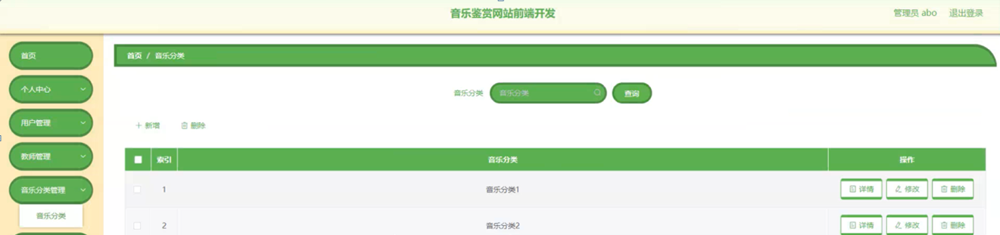

图5-11音乐分类管理界面图

音乐信息管理，在音乐信息管理页面可以对索引,歌曲名称,音乐分类,封面，歌手，编曲，填词，语言，专辑，时长，音频，发行方，发行日期等内容进行详情、修改、查看评论或删除等操作，如图5-12所示。

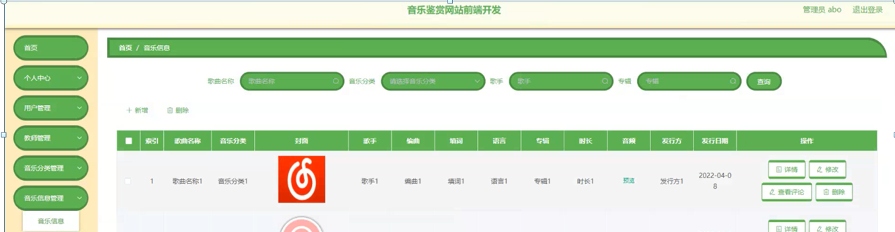

图5-12音乐信息管理界面图

**JAVA** **毕设帮助，指导，源码分享，调试部署**

