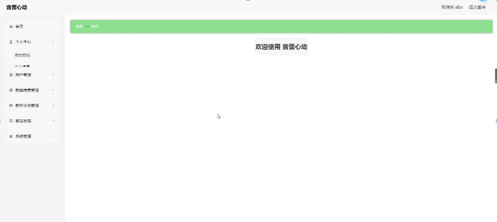

ssm+Vue计算机毕业设计音蕾心动（程序+LW文档）

**项目运行**

**环境配置：**

**Jdk1.8 + Tomcat7.0 + Mysql + HBuilderX** **（Webstorm也行）+ Eclispe（IntelliJ
IDEA,Eclispe,MyEclispe,Sts都支持）。**

**项目技术：**

**SSM + mybatis + Maven + Vue** **等等组成，B/S模式 + Maven管理等等。**

**环境需要**

**1.** **运行环境：最好是java jdk 1.8，我们在这个平台上运行的。其他版本理论上也可以。**

**2.IDE** **环境：IDEA，Eclipse,Myeclipse都可以。推荐IDEA;**

**3.tomcat** **环境：Tomcat 7.x,8.x,9.x版本均可**

**4.** **硬件环境：windows 7/8/10 1G内存以上；或者 Mac OS；**

**5.** **是否Maven项目: 否；查看源码目录中是否包含pom.xml；若包含，则为maven项目，否则为非maven项目**

**6.** **数据库：MySql 5.7/8.0等版本均可；**

**毕设帮助，指导，本源码分享，调试部署** **(** **见文末** **)**

### 系统功能结构

一、用户管理功能

该部分内容提供首页，歌曲信息，音乐资讯，留言反馈，个人中心等等功能。

二、管理员管理功能

该部分内容包含了首页，个人中心，用户管理，歌曲信息管理，歌手分类管理，留言反馈，系统管理等功能。管理员可对所有的信息进行增、删、改、查，能对用户信息进行管理,更新最近的音蕾心动信息。

为了方便更直观的理解,下图以图形形式给出关于整个网站的结构图。网站总体功能结构图3-1如图所示：

图3-1系统总体功能结构图

### 数据库概念设计

在对数据库设计之前首先要分析一下音蕾心动系统的功能，和各模块之间的关系，再对数据表进行设计。每一个模块的实体都会对应多个实体对象，下面是几个系统中的数据实体如下所示。

用户注册实体E-R图如图4-1所示：

图4-1用户注册E-R图

歌曲信息管理实体E-R图如图4-2所示：

图4-2歌曲信息管理实体E-R图

留言反馈实体E-R图如图4-3所示：

图4-3留言反馈实体E-R图

### 系统首页的设计

该界面是音蕾心动系统的首页，界面设置要求界面简洁明了、操作简单、兼容性好。在考虑设计界面时，首先要考虑界面标准化设计，其次是完善界面设计，但不要因对界面的美化使界面的操作变得复杂，用户可在此页面进行登录等操作，页面顶部导航条是各模块的入口。

系统首页页面主要包括首页，歌曲信息，音乐资讯，留言反馈，个人中心等内容，并根据需要进行详细操作；如图5-1所示：

图5-1系统首页界面图

用户注册，在用户注册页面通过填写账号，密码，确认密码，姓名，年龄，手机等信息完成用户注册操作，如图5-2所示。

图5-2用户注册界面图

歌曲信息，在歌曲信息页面可以查看歌曲名称，歌曲类型，歌手，专辑，点击次数，音频文件，下载文件等详细内容，还可以进行收藏，评论操作；如图5-3所示。

图5-3歌曲信息界面图

留言反馈，在留言反馈页面可以对留言，图片进行立即提交和重置操作；如图5-4所示。

图5-4留言反馈界面图

个人中心，在个人中心页面通过填写账号，密码，姓名，性别，年龄，手机等信息进行更新信息，还可以根据需要对我的收藏进行详细操作，如图5-5所示。

图5-5个人中心界面图

### 5.2管理员功能模块

管理员登录，进入系统前在登录页面根据要求填写用户名和密码等信息，点击登录进行登录操作，如图5-6所示。

图5-6管理员登录界面图

管理员登录系统后，可以对首页，个人中心，用户管理，歌曲信息管理，歌手分类管理，留言反馈，系统管理等功能进行相应的操作管理，如图5-7所示。

图5-7管理员功能界面图

用户管理，在用户管理页面可以对账号，姓名，性别，年龄，手机，头像等内容进行详情，修改和删除等操作，如图5-8所示。

图5-8用户管理界面图

歌曲信息管理，在歌曲信息管理页面可以对索引，歌曲名称，歌曲类型，歌手，专辑，音频文件，下载文件，歌曲图片等内容进行详情，查看评论，修改和删除等操作，如图5-9所示。

图5-9歌曲信息管理界面图

歌手分类管理，在歌手分类管理页面可以对索引，类型等内容进行修改和删除等操作，如图5-10所示。

图5-10歌手分类管理界面图

系统管理，在音乐资讯管理页面可以对索引，标题，图片等内容进行详情，修改，删除等操作，如图5-11所示。

图5-11系统管理界面图

留言反馈，在留言反馈页面可以对索引，用户名，留言内容，留言图片，回复内容，回复图片等内容进行详情，回复，修改和删除等操作，如图5-12所示。

图5-12留言反馈界面图

**JAVA** **毕设帮助，指导，源码分享，调试部署**

