ssm+Vue计算机毕业设计饮品外卖系统（程序+LW文档）

**项目运行**

**环境配置：**

**Jdk1.8 + Tomcat7.0 + Mysql + HBuilderX** **（Webstorm也行）+ Eclispe（IntelliJ
IDEA,Eclispe,MyEclispe,Sts都支持）。**

**项目技术：**

**SSM + mybatis + Maven + Vue** **等等组成，B/S模式 + Maven管理等等。**

**环境需要**

**1.** **运行环境：最好是java jdk 1.8，我们在这个平台上运行的。其他版本理论上也可以。**

**2.IDE** **环境：IDEA，Eclipse,Myeclipse都可以。推荐IDEA;**

**3.tomcat** **环境：Tomcat 7.x,8.x,9.x版本均可**

**4.** **硬件环境：windows 7/8/10 1G内存以上；或者 Mac OS；**

**5.** **是否Maven项目: 否；查看源码目录中是否包含pom.xml；若包含，则为maven项目，否则为非maven项目**

**6.** **数据库：MySql 5.7/8.0等版本均可；**

**毕设帮助，指导，本源码分享，调试部署** **(** **见文末** **)**

### 系统结构

系统架构图属于系统设计阶段，系统架构图只是这个阶段一个产物，系统的总体架构决定了整个系统的模式，是系统的基础。饮品外卖系统的整体结构设计如图4-2所示。

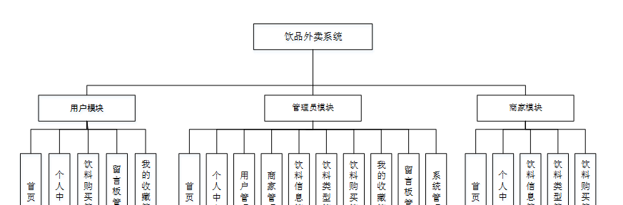

图4-2 系统结构图

### 4.3. 数据库设计

4.3.1 数据库实体

管理员信息结构图，如图4-3所示：

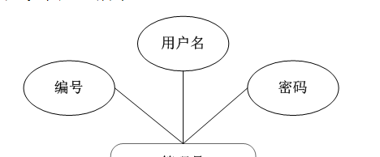

图4-3 管理员信息实体结构图

饮料信息管理实体属性图，如图4-4所示：

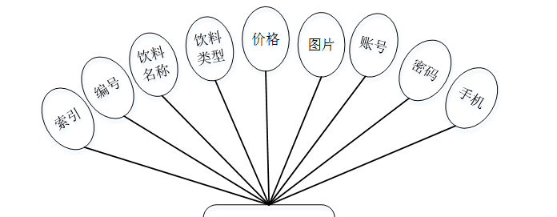

图4-4饮料信息管理实体属性图

饮料购买管理实体属性图，如图4-5所示：

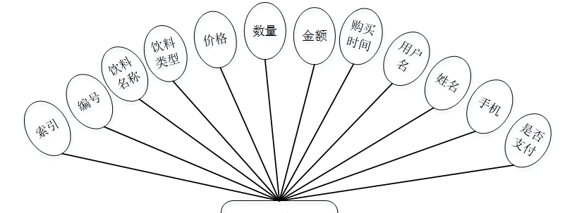

图4-5饮料购买管理实体属性图

### 系统功能模块

饮品外卖系统设计，在饮品外卖系统首页可以查看首页、饮料信息、饮品资讯、留言反馈、个人中心、后台管理等内容进行详细操作，如图5-1所示。

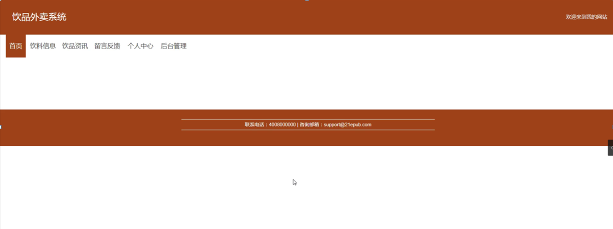

图5-1网站首页界面图

饮料信息，在饮料信息页面可以查看编号、饮料名称、饮料类型、价格、图片、账号、手机、详情等详细内容，根据需要进行购买、评论或收藏，如图5-2所示。

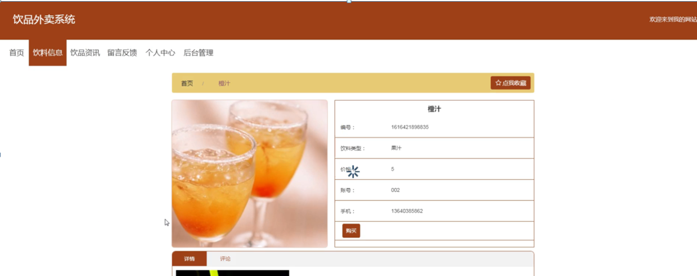

图5-2饮料信息界面图

用户注册，在用户注册页面通过填写用户名、密码、姓名、身份证、手机、邮箱等信息进行注册操作，如图5-3所示。在个人中心页面通过填写用户名、密码、姓名、性别、图片、身份证、手机、邮箱等信息，根据需要对个人信息进行更新操作，如图5-4所示。

图5-3用户注册界面图

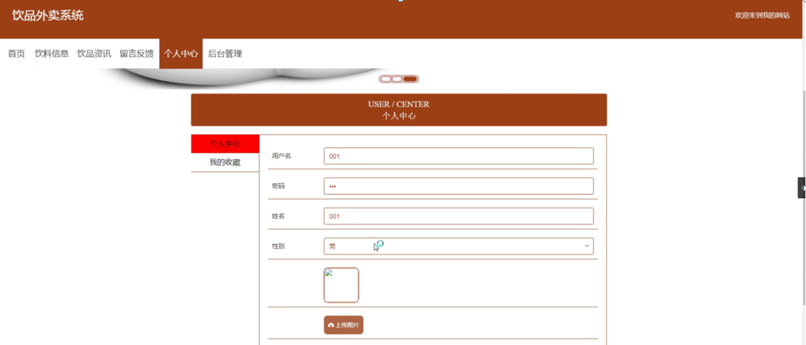

图5-4个人中心界面图

### 5.2管理员功能模块

管理员登录，管理员通过输入账号，密码，选择角色等信息即可进行系统登录，如图5-5所示。

图5-5管理员登录界面图

管理员登录进入饮品外卖系统可以查看首页、个人中心、用户管理、商家管理、饮料信息管理、饮料类型管理、饮料购买管理、我的收藏管理、留言板管理、系统管理等内容进行详细操作，如图5-6所示。

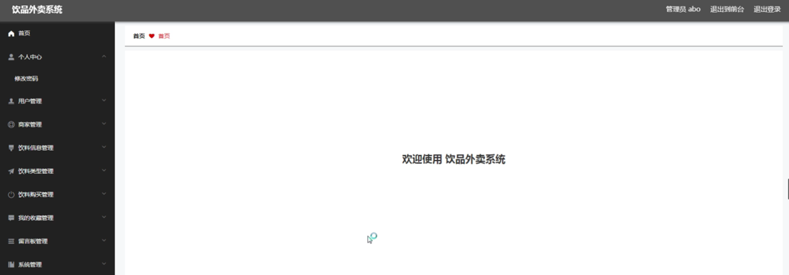

图5-6管理员功能界面图

饮料信息管理，在饮料信息管理页面可以对索引、编号、饮料名称、饮料类型、价格、图片、账号、密码、手机等信息进行详情、修改、查看评论或删除等操作，如图5-7所示。

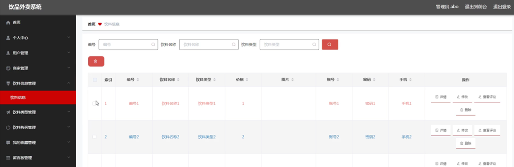

图5-7饮料信息管理界面图

饮料购买管理，在饮料购买管理页面可以对索引、编号、饮料名称、饮料类型、价格、数量、金额、购买时间、用户名、姓名、手机、是否支付等信息进行详情、修改或删除等操作，如图5-8所示。

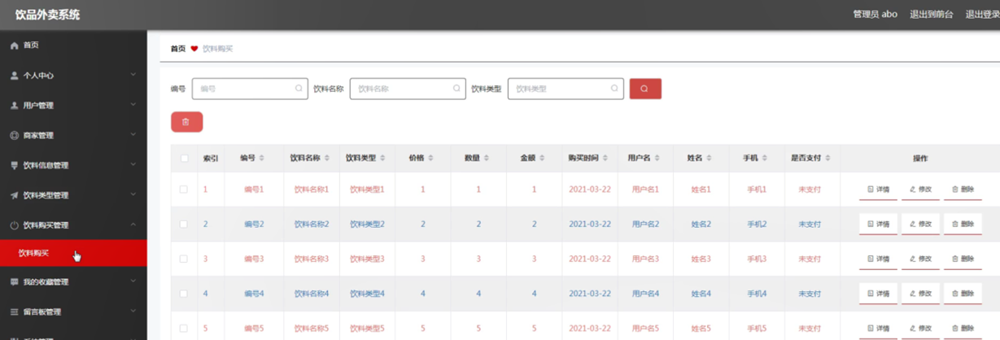

图5-8饮料购买管理界面图

留言板管理，在留言板管理页面可以对索引、用户名、留言内容、回复内容等信息进行详情、修改、回复或删除等操作，如图5-9所示。

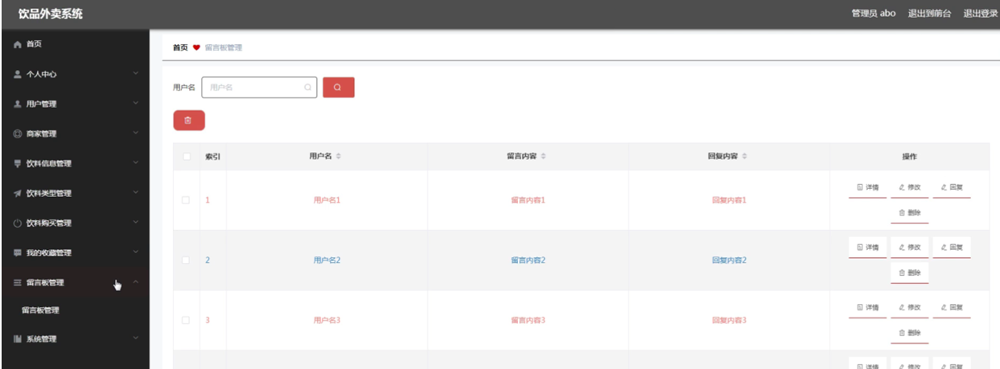

图5-9留言板管理界面图

### 5.3用户功能模块

用户登录进入饮品外卖系统可以查看首页、个人中心、饮料购买管理、留言板管理、我的收藏管理等内容进行详细操作，如图5-10所示。

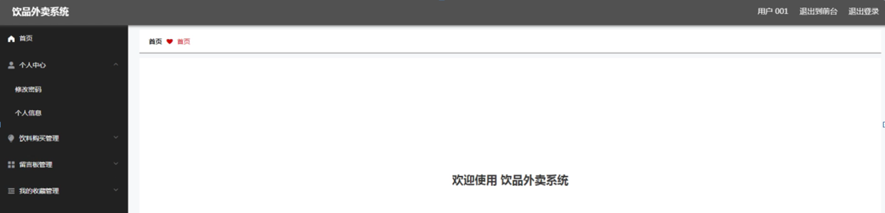

图5-10用户功能界面图

### 5.4商家功能模块

商家登录进入饮品外卖系统可以查看首页、个人中心、饮料信息管理、饮料类型管理、饮料购买管理等内容进行详细操作，如图5-11所示。

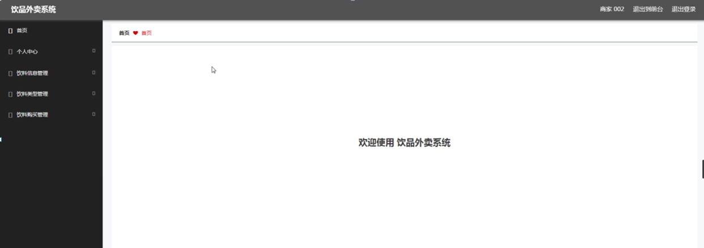

图5-11商家功能界面图

个人中心，在个人中心页面通过填写账号、姓名、头像、性别、身份证、手机、邮箱等内容，并可根据需要对个人信息进行修改，如图5-12所示。

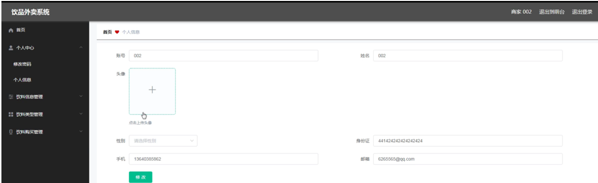

图5-12个人中心界面图

#### **JAVA** **毕设帮助，指导，源码分享，调试部署**

