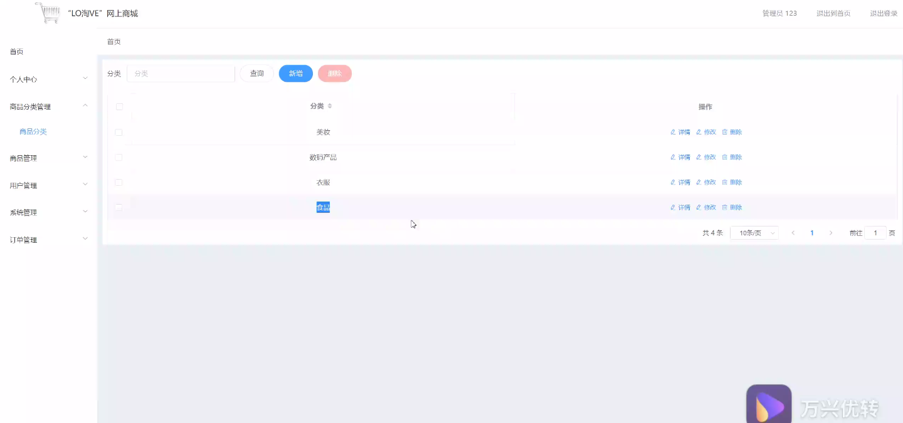
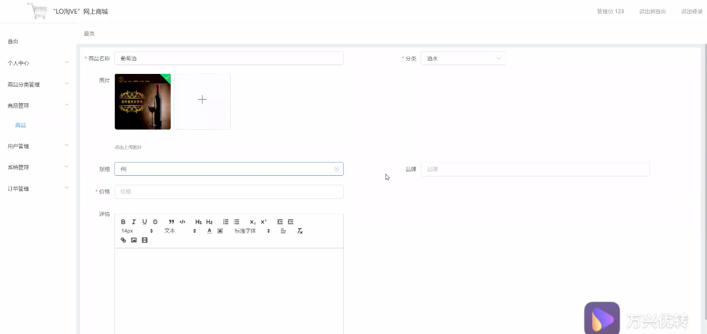
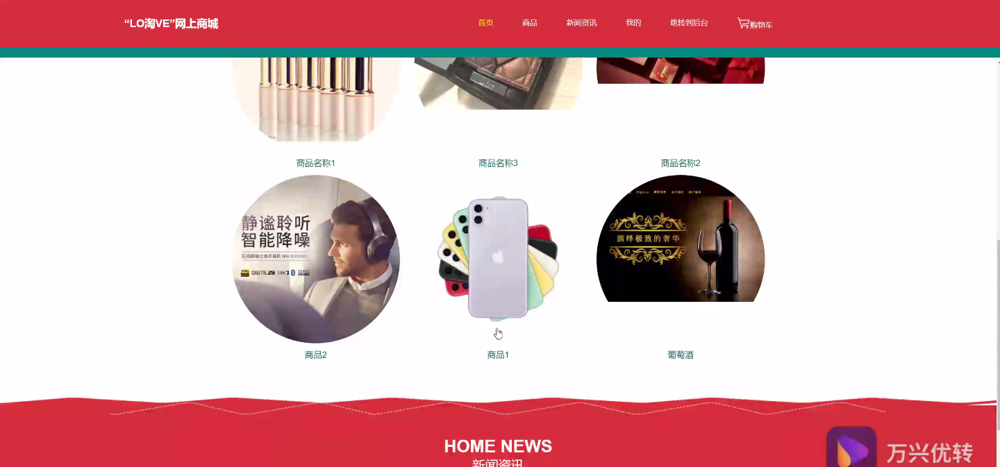
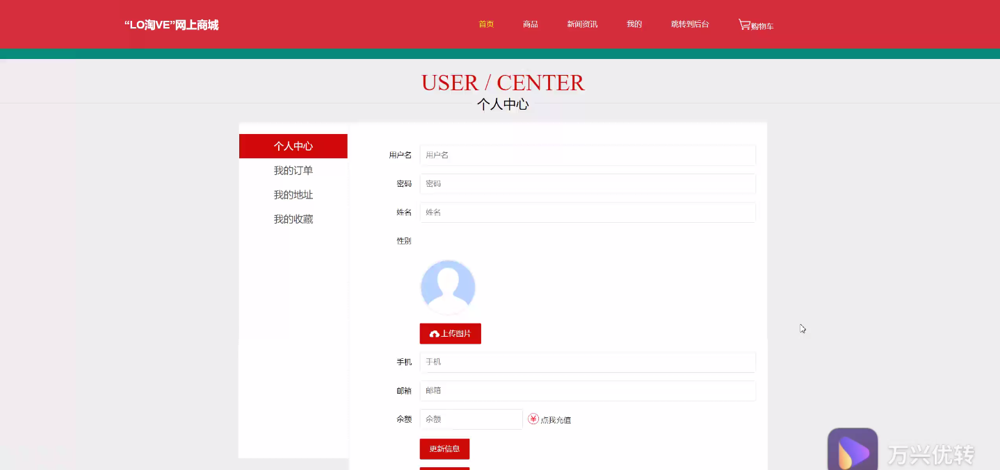
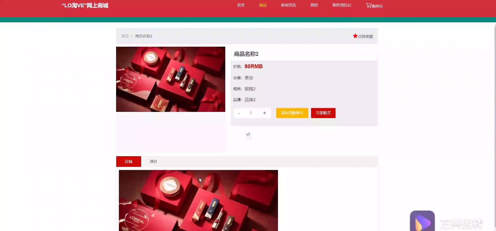
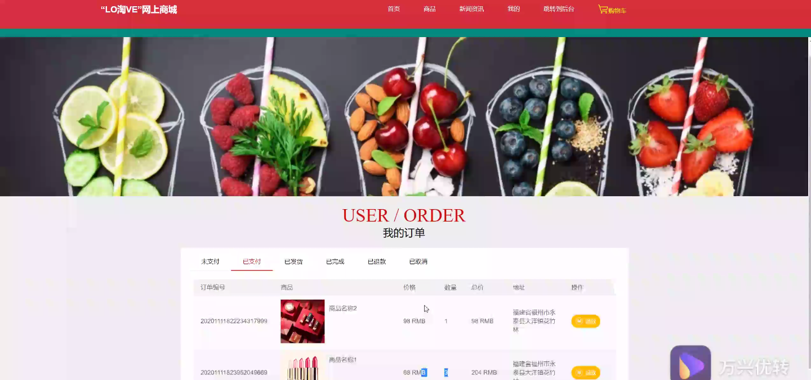

****本项目包含程序+源码+数据库+LW+调试部署环境，文末可获取一份本项目的java源码和数据库参考。****

## ******开题报告******

研究背景：
随着互联网的快速发展和普及，电子商务已经成为了人们购物的主要方式之一。而“LO淘VE”作为一家网上商城，致力于为用户提供方便、快捷、安全的在线购物体验。然而，在当前市场竞争激烈的情况下，如何提升“LO淘VE”网上商城的竞争力，吸引更多的用户，成为了一个迫切需要解决的问题。

研究意义：
通过对“LO淘VE”网上商城进行深入研究，可以帮助我们更好地理解电子商务行业的发展趋势和用户需求，为企业提供科学的决策依据。同时，通过改进和优化“LO淘VE”网上商城的系统功能，可以提高用户的购物体验，增加用户的黏性和忠诚度，从而提升企业的市场竞争力和盈利能力。

研究目的： 本研究旨在通过对“LO淘VE”网上商城的研究，探索如何优化其系统功能，提升用户购物体验，从而实现以下目标：

  1. 提高“LO淘VE”网上商城的用户满意度和忠诚度；
  2. 增加“LO淘VE”网上商城的用户数量和交易量；
  3. 提升“LO淘VE”网上商城在电子商务市场中的竞争力。

研究内容： 本研究将重点关注“LO淘VE”网上商城的系统功能，包括商品分类、商品和用户等方面。具体研究内容如下：

  1. 商品分类：通过对“LO淘VE”网上商城的商品分类进行优化，提供更加精准和个性化的商品推荐，帮助用户快速找到所需商品，并提高购买意愿。

  2. 商品：研究商品信息的展示方式和描述内容，设计更吸引用户的商品页面布局，提供清晰、详细的商品信息，增加用户的购买信心。

  3. 用户：通过研究用户行为数据和偏好，建立用户画像，为用户提供个性化的推荐服务，增强用户粘性和忠诚度。

拟解决的主要问题： 在研究过程中，我们将重点解决以下问题：

  1. 如何优化商品分类系统，提高商品搜索的准确性和效率？
  2. 如何设计商品页面，使其更具吸引力和信息量？
  3. 如何通过用户行为数据分析，实现个性化推荐服务？

研究方案： 为了达到上述目标，我们将采取以下研究方案：

  1. 调研分析：对电子商务行业的发展趋势和用户需求进行调研分析，为“LO淘VE”网上商城的优化提供参考依据。
  2. 数据收集：收集“LO淘VE”网上商城的用户数据、商品数据等相关数据，用于后续的数据分析和模型建立。
  3. 系统优化：根据研究内容，对“LO淘VE”网上商城的系统功能进行优化和改进，提升用户购物体验。
  4. 实验评估：通过实验和用户反馈评估优化效果，并进行必要的调整和改进。

预期成果： 通过本研究，我们期望能够实现以下预期成果：

  1. 提高“LO淘VE”网上商城的用户满意度和忠诚度，增加用户的购买频次和金额。
  2. 增加“LO淘VE”网上商城的用户数量和交易量，扩大市场份额。
  3. 提升“LO淘VE”网上商城在电子商务市场中的竞争力，成为用户首选的在线购物平台。

进度安排：

2022年9月至10月：开题报告编写和提交，完成开题报告的撰写并提交给指导教师进行审核。

2022年11月至2023年1月：系统设计和开发，根据开题报告的要求，进行系统设计和编码工作。

2023年2月至3月：论文撰写和初稿完成，开始撰写论文，并在这个阶段完成论文的初稿。

2023年4月至5月：论文修改和最终定稿，根据指导教师的意见对论文进行修改，并完成最终的定稿。

2023年5月：论文答辩和提交，参加论文答辩并根据答辩结果进行修改，最后将论文提交给学院或学校。

参考文献：

[1]喻佳,吴丹新.基于SpringBoot的Web快速开发框架[J].电脑编程技巧与维护,2021,(09):31-33.

[2]李鹏.基于SpringBoot快速开发平台的实现[J].电子技术与软件工程,2021,(12):36-37.

[3]叶开平,蔡维晟,陈家敏,邓斯妮.基于SpringBoot的综测可视化管理系统的研究与设计[J].电脑知识与技术,2021,(12):100-104.

[4]江健锋,徐振平.Springboot最小系统的设计与实现[J].电脑知识与技术,2021,(04):62-63.

[5]赵炯,司圣杰,周奇才,熊肖磊.通用信息获取系统设计与实现[J].起重运输机械,2020,(16):89-97.

[6]吴英宾.一种内外网数据交互系统的设计与实现[J].软件工程,2020,(08):25-27.

****以上是本项目程序开发之前开题报告内容，最终成品以下面界面为准，大家可以酌情参考使用。要源码参考请在文末进行获取！！****

## ******本项目的界面展示******

