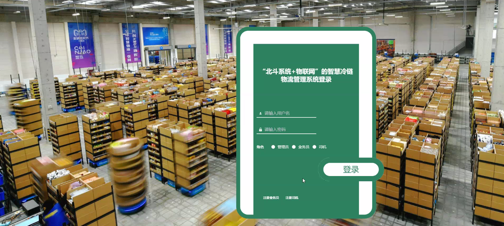
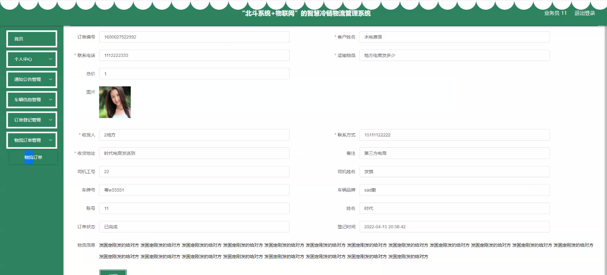

****本项目包含程序+源码+数据库+LW+调试部署环境，文末可获取一份本项目的java源码和数据库参考。****

## ******开题报告******

研究背景：
随着物联网技术的不断发展和应用，智慧冷链物流管理系统在现代物流行业中起到了至关重要的作用。冷链物流是指在运输、储存和配送过程中需要控制温度和湿度等环境参数的物流活动。而智慧冷链物流管理系统则是基于物联网技术，结合北斗系统的定位功能，对冷链物流进行全程监控和管理。该系统可以实时获取物流信息、监测环境参数，并提供数据分析和预警功能，为冷链物流企业提供高效、安全、可靠的服务。

研究意义：
智慧冷链物流管理系统的研究具有重要的现实意义和经济价值。首先，冷链物流是保证食品、药品等易腐品质量和安全的关键环节，其管理水平直接影响着国家经济发展和人民生活质量。其次，智慧冷链物流管理系统的建设与应用，可以提高物流效率，降低物流成本，减少资源浪费，推动物流行业的转型升级。此外，该系统还可以为政府监管部门提供数据支持，加强对冷链物流的监管和管理，保障公众利益。

研究目的：
本研究旨在探索并构建一种基于北斗系统和物联网技术的智慧冷链物流管理系统，以提高冷链物流的运营效率和服务质量。具体目标包括：实现物流信息的实时监测和追踪、环境参数的实时监测和控制、异常情况的预警和处理等功能，为冷链物流企业提供全方位、精细化的管理支持。

研究内容： 本研究将围绕智慧冷链物流管理系统的功能展开研究，主要包括以下内容：

  1. 业务员管理：设计并实现业务员信息的录入、查询、统计等功能，以便于对业务员进行有效管理和绩效评估。

  2. 车辆信息管理：建立车辆档案，包括车辆基本信息、行驶记录、维护保养等，实现车辆调度和运输过程的实时监控。

  3. 订单登记管理：设计订单登记系统，实现订单信息的录入、修改、查询等功能，确保订单信息的准确性和及时性。

  4. 司机管理：建立司机档案，包括司机基本信息、从业资格证明、驾驶记录等，实现对司机的管理和安全监控。

  5. 物流订单管理：构建物流订单管理系统，包括订单接收、处理、分配、跟踪等环节，提高物流运作的效率和可追溯性。

  6. 通知公告管理：设计通知公告发布系统，实现对内部人员和外部合作伙伴的信息传递和沟通，提高工作效率和信息共享。

拟解决的主要问题： 在智慧冷链物流管理系统的研究过程中，我们将重点解决以下问题：

  1. 如何实现物流信息的实时监测和追踪，确保物流过程的可视化和可控制性？

  2. 如何实现环境参数的实时监测和控制，保障冷链物流过程中的温度、湿度等环境条件符合要求？

  3. 如何建立高效的异常情况预警和处理机制，及时发现和解决物流过程中的问题？

  4. 如何设计用户友好的界面和操作流程，提高系统的易用性和用户满意度？

  5. 如何保障系统的安全性和稳定性，防止数据泄露和系统故障的风险？

研究方案和预期成果：
本研究将采用综合研究方法，包括文献调研、需求分析、系统设计与开发等环节。预期成果包括构建一套完整的智慧冷链物流管理系统原型，并在实际应用中进行验证和优化。通过该系统的应用，预期可以提高冷链物流的运营效率和服务质量，降低物流成本，促进物流行业的可持续发展。

进度安排：

2022年9月至10月：需求分析和规划，进行用户需求调研和分析，确定系统功能和目标。

2022年11月至2023年1月：系统设计和开发，完成系统架构设计和技术选型，并开始编写代码。

2023年2月至3月：测试和优化，进行单元测试和集成测试，修复问题并优化系统性能。

2023年4月至5月：文档编写和培训，编写用户手册和系统文档，并进行相关人员的培训。

2023年5月：上线部署和维护，将系统部署到生产环境中，并定期进行维护和升级。

参考文献：

[1]王振华.SpringBoot在教学效果评估系统中的应用[J].电子技术,2023,(05):67-69.

[2]王明泉.基于SpringBoot远程热部署的探索和应用[J].信息与电脑(理论版),2023,(07):1-4.

[3]王亚东,李晓霞,陈强强,剡美娜.基于SpringBoot的需求发布平台设计[J].信息与电脑(理论版),2023,(01):105-107.

[4]陈新府豪.基于SpringBoot和Vue框架的创新方法推理系统的设计与实现[D].导师：黄静.浙江理工大学,2022.

[5]霍福华,韩慧.基于SpringBoot微服务架构下前后端分离的MVVM模型[J].电子技术与软件工程,2022,(01):73-76.

[6]韩策,张娜,王松亭,张凯,何方,袁峰.SpringBoot OPC客户端设计与研究[J].电子世界,2021,(19):25-26.

****以上是本项目程序开发之前开题报告内容，最终成品以下面界面为准，大家可以酌情参考使用。要源码参考请在文末进行获取！！****

## ******本项目的界面展示******

