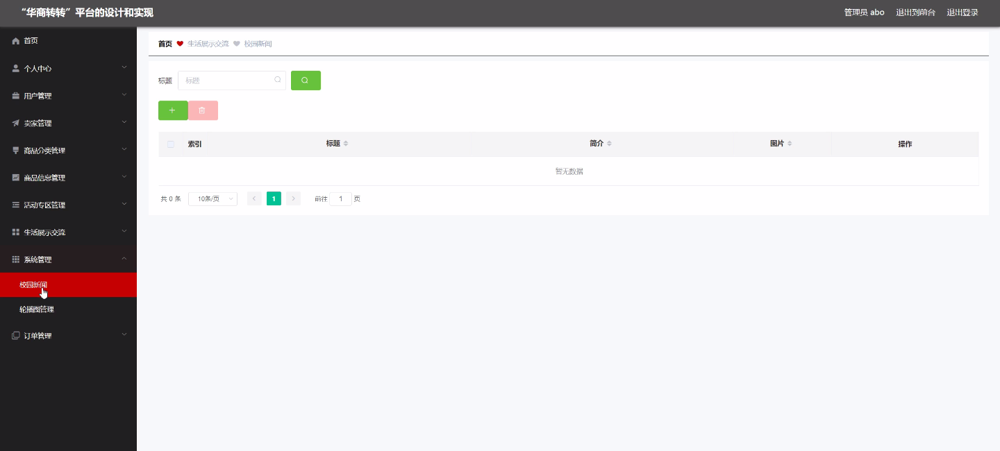
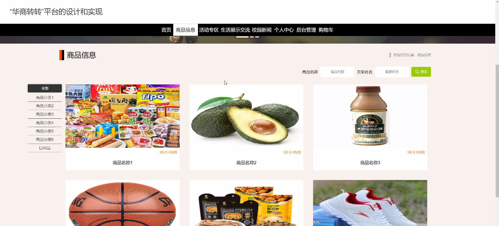
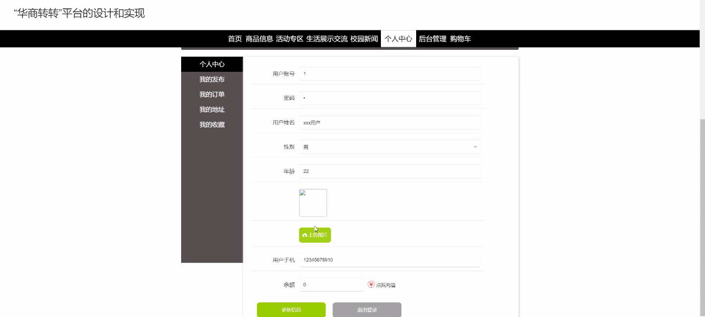
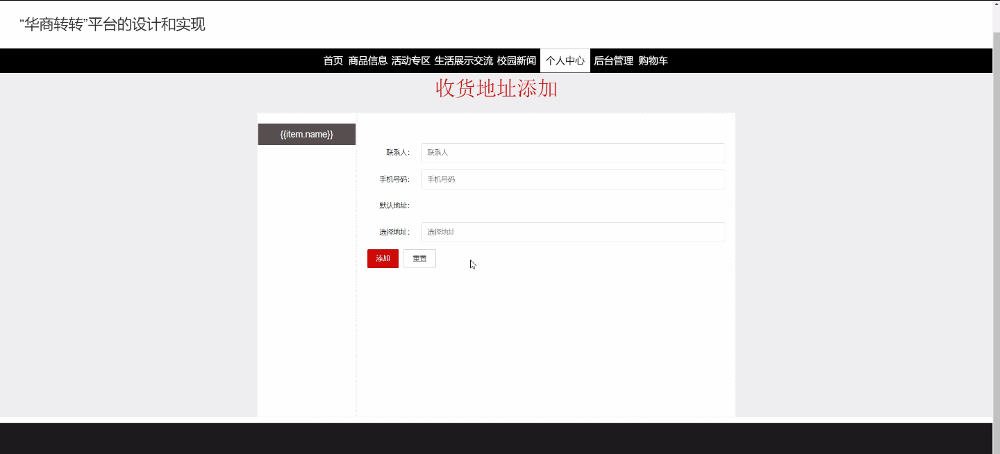
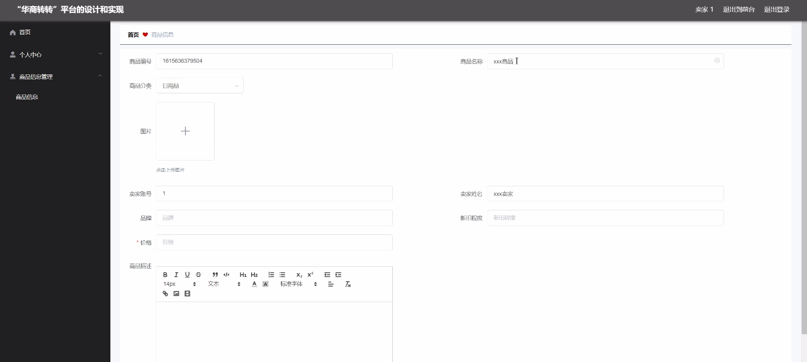

****本项目包含程序+源码+数据库+LW+调试部署环境，文末可获取一份本项目的java源码和数据库参考。****

## ******开题报告******

研究背景：
随着互联网的快速发展和电子商务的兴起，线上交易平台成为了人们购买和销售商品的主要渠道之一。然而，当前市场上存在着许多问题，例如信息不对称、信任缺失、交易风险等，这些问题制约了用户在线交易的体验和信心。因此，设计和实现一个高效、安全、可信赖的线上交易平台具有重要意义。

研究意义：
“华商转转”平台的设计和实现旨在解决当前线上交易平台存在的问题，提升用户的交易体验和信任感。通过构建一个功能完善、操作简便的平台，可以促进用户与卖家之间的信息对称，增强用户对商品质量和交易安全性的信心，从而推动线上交易的发展。

研究目的：
本研究的目的是通过对“华商转转”平台的设计和实现，提供一个安全、便捷、高效的线上交易环境，满足用户的购买需求，同时为卖家提供一个良好的销售平台。通过优化系统功能和提升用户体验，旨在打造一个可信赖的线上交易平台，推动电子商务的发展。

研究内容： 本研究将主要围绕以下系统功能展开设计和实现：

  1. 用户：设计用户注册、登录、个人信息管理等功能，提供个性化的用户体验，确保用户信息的安全性和隐私保护。

  2. 卖家：为卖家提供商家入驻、店铺管理、商品发布等功能，帮助卖家提升销售效率和品牌形象。

  3. 商品分类：设计合理的商品分类体系，方便用户快速定位所需商品，提高浏览和购买效率。

  4. 商品信息：提供详尽的商品信息展示，包括商品描述、图片、价格、库存等，帮助用户准确了解商品特性，做出明智的购买决策。

  5. 活动专区：设置促销活动、限时折扣等营销手段，吸引用户参与购买，增加交易量和用户粘性。

拟解决的主要问题： 在设计和实现“华商转转”平台过程中，主要解决以下问题：

  1. 信息不对称：通过完善的商品信息展示和用户评价系统，减少买家和卖家之间的信息不对称，提高交易的透明度和可信度。

  2. 信任缺失：建立可靠的用户认证和身份验证机制，增加用户对平台和卖家的信任感，降低交易风险。

  3. 交易安全：采用安全的支付系统和物流配送服务，确保交易过程中的资金安全和商品的及时送达。

研究方案和预期成果： 本研究将采用软件工程的方法，结合用户需求调研和技术实现，设计和开发“华商转转”平台。预期的成果包括：

  1. 完善的系统功能和用户界面设计，提供良好的用户体验。

  2. 可靠的用户认证和身份验证机制，保障用户信息的安全性和隐私保护。

  3. 安全、高效的支付系统和物流配送服务，确保交易的顺利进行。

  4. 提供详尽的商品信息展示和用户评价系统，减少信息不对称，增强用户对商品质量的信心。

  5. 活动专区的设置和营销手段的运用，吸引用户参与购买，促进交易量的增长。

进度安排：

2022年9月至10月：需求分析和规划，明确系统功能和目标，制定项目计划。

2022年11月至2023年1月：系统设计和编码，完成详细的系统设计并开始编写代码。

2023年2月至3月：用户界面开发和数据库开发，开发用户友好的界面和设计数据库结构。

2023年4月至5月：功能测试、文档编写和上线部署，对系统进行全面的功能测试并编写用户手册。

2023年5月：维护和升级，定期对系统进行维护和升级，修复bug和添加新功能。

参考文献：

[1]邱小群,邓丽艳,陈海潮.基于B/S的信息管理系统设计和实现[J].信息与电脑(理论版),2022,(20):146-148.

[2]谢霜.基于Java技术的网络管理体系结构的应用[J].网络安全技术与应用,2022,(10):14-15.

[3]宋锦华.高职院校Java程序设计课程改革研究[J].科技视界,2022,(20):133-135.

[4]曹嵩彭,王鹏宇.浅析Java语言在软件开发中的应用[J].信息记录材料,2022,(03):114-116.

[5]朱澈,余俊达.武汉东湖学院.基于Java的软硬件信息管理系统V1.0[Z].项目立项编号.鉴定单位.鉴定日期:

****以上是本项目程序开发之前开题报告内容，最终成品以下面界面为准，大家可以酌情参考使用。要源码参考请在文末进行获取！！****

## ******本项目的界面展示******

