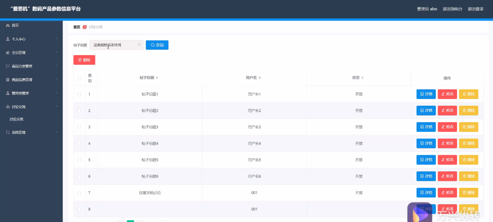

****本项目包含程序+源码+数据库+LW+调试部署环境，文末可获取一份本项目的java源码和数据库参考。****

## ******开题报告******

研究背景：
随着科技的不断发展和智能化时代的到来，数码产品在我们日常生活中扮演着越来越重要的角色。人们对于数码产品的需求也日益增长，从手机、电脑到智能家居设备，各类数码产品已经成为了人们生活中必不可少的一部分。然而，由于市场上数码产品众多，品牌繁杂，消费者在选择和购买数码产品时往往面临信息不对称、信息不全面等问题。因此，建立一个全面、准确、可靠的数码产品参数信息平台势在必行。

研究意义：
“爱思机”数码产品参数信息平台的建立将为消费者提供一个集合了各类数码产品参数信息的综合性平台，帮助消费者更加便捷地获取所需信息，提高消费者对数码产品的选择和购买的满意度。同时，该平台还将促进数码产品市场的健康发展，推动品牌竞争力的提升，促进行业的良性竞争。

研究目的：
本研究旨在构建一个全面、准确、可靠的数码产品参数信息平台，为消费者提供一个便捷的购物指南，帮助消费者更好地了解数码产品的性能、特点和优势，从而做出明智的购买决策。通过建立该平台，我们希望解决消费者在购买数码产品时面临的信息不对称、信息不全面等问题，提高消费者的购物体验。

研究内容： 本研究将主要围绕以下系统功能展开：

  1. 会员系统：建立一个完善的会员系统，让用户可以注册成为会员并享受个性化的服务，如浏览历史记录、收藏商品、参与评价等。

  2. 商品分类系统：构建一个科学合理的商品分类体系，将各类数码产品按照品牌、型号、功能等进行分类，方便用户快速定位所需产品。

  3. 商品信息系统：收集、整理和更新各类数码产品的参数信息，包括但不限于价格、尺寸、颜色、配置等，确保信息的准确性和实时性。

  4. 用户评价系统：为用户提供撰写和查看其他用户评价的功能，帮助用户更好地了解产品的真实使用感受和性能表现。

拟解决的主要问题： 通过建立“爱思机”数码产品参数信息平台，我们将解决消费者在购买数码产品时面临的以下主要问题：

  1. 信息不对称：消费者往往难以获取到准确、全面的数码产品参数信息，导致选择困难。

  2. 信息不全面：市场上的数码产品众多，消费者难以掌握所有产品的参数信息，无法做出理性的购买决策。

  3. 信息可靠性：部分商家在宣传和销售过程中可能夸大产品的性能和优势，消费者需要一个可信赖的信息来源。

研究方案和预期成果：
我们将通过收集、整理和更新各类数码产品的参数信息，建立一个全面、准确、可靠的数码产品参数信息平台。该平台将提供会员系统、商品分类系统、商品信息系统和用户评价系统等功能，帮助消费者更好地了解数码产品，从而做出明智的购买决策。预期成果包括但不限于：

  1. 提供准确、全面的数码产品参数信息，满足消费者对信息的需求。

  2. 建立一个便捷的购物指南，帮助消费者快速定位所需产品。

  3. 提高消费者对数码产品的选择和购买的满意度，促进市场的健康发展。

  4. 推动品牌竞争力的提升，促进行业的良性竞争。

  5. 提供一个可信赖的信息来源，帮助消费者避免被虚假宣传所误导。

进度安排：

2022年9月至10月：需求分析和规划，明确系统功能和目标，制定项目计划。

2022年11月至2023年1月：系统设计和编码，完成详细的系统设计并开始编写代码。

2023年2月至3月：用户界面开发和数据库开发，开发用户友好的界面和设计数据库结构。

2023年4月至5月：功能测试、文档编写和上线部署，对系统进行全面的功能测试并编写用户手册。

2023年5月：维护和升级，定期对系统进行维护和升级，修复bug和添加新功能。

参考文献：

[1]邱小群,邓丽艳,陈海潮.基于B/S的信息管理系统设计和实现[J].信息与电脑(理论版),2022,(20):146-148.

[2]谢霜.基于Java技术的网络管理体系结构的应用[J].网络安全技术与应用,2022,(10):14-15.

[3]宋锦华.高职院校Java程序设计课程改革研究[J].科技视界,2022,(20):133-135.

[4]曹嵩彭,王鹏宇.浅析Java语言在软件开发中的应用[J].信息记录材料,2022,(03):114-116.

[5]朱澈,余俊达.武汉东湖学院.基于Java的软硬件信息管理系统V1.0[Z].项目立项编号.鉴定单位.鉴定日期:

****以上是本项目程序开发之前开题报告内容，最终成品以下面界面为准，大家可以酌情参考使用。要源码参考请在文末进行获取！！****

## ******本项目的界面展示******

