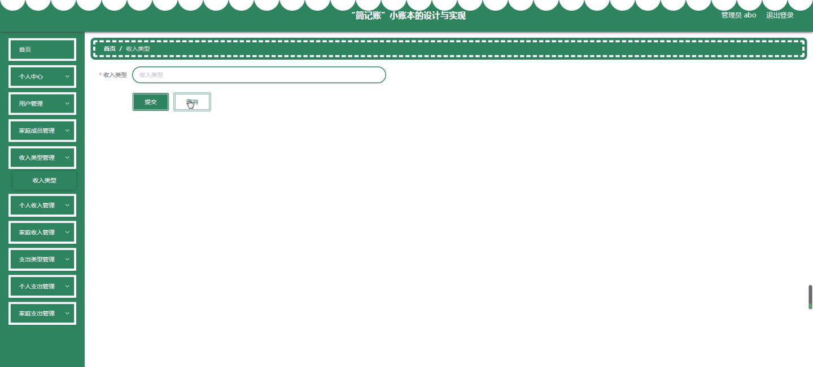
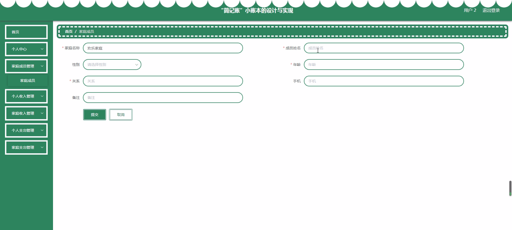
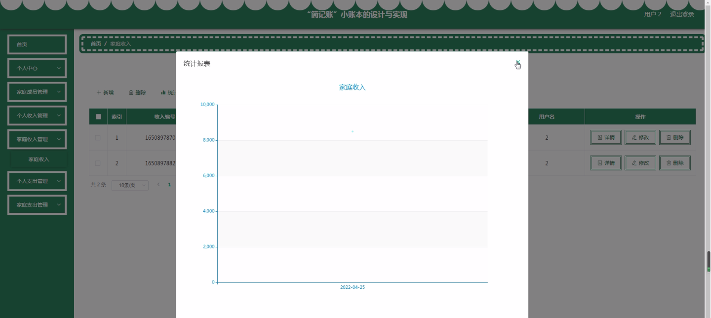
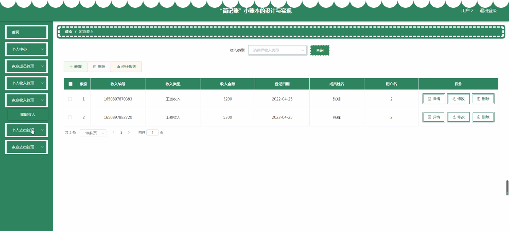
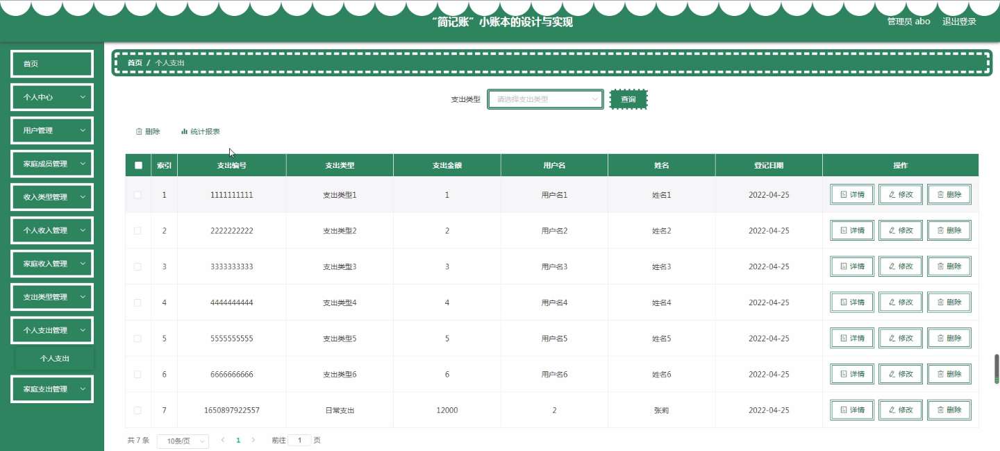

****本项目包含程序+源码+数据库+LW+调试部署环境，文末可获取一份本项目的java源码和数据库参考。****

## ******开题报告******

研究背景：
在现代社会中，人们的生活节奏日益加快，经济压力也越来越大。因此，合理管理个人和家庭的财务变得尤为重要。然而，许多人在面对繁杂的收入和支出记录时感到困惑，往往难以做到全面、准确地掌握自己的财务状况。这就需要一个简单易用、功能完善的小账本工具来帮助人们进行财务管理。

研究意义：
“简记账”小账本的设计与实现旨在解决人们在财务管理方面遇到的问题。通过提供一个便捷、高效的平台，用户可以轻松记录和分析个人和家庭的收入和支出情况，从而更好地控制自己的财务状况。这不仅有助于提高个人的理财能力，还可以帮助家庭更好地规划和管理家庭预算，实现财务目标。

研究目的：
本研究的目的是设计和实现一款功能全面、操作简单的“简记账”小账本应用程序，以满足用户对财务管理的需求。通过该应用程序，用户可以方便地记录和分类个人和家庭的收入和支出，并提供统计分析功能，帮助用户更好地了解自己的财务状况，合理规划和管理财务。

研究内容：
本研究的主要内容包括以下系统功能：用户管理、家庭收入管理、家庭支出管理、家庭成员管理、收入类型管理、个人收入管理、支出类型管理、个人支出管理等。通过这些功能，用户可以创建个人账户并添加家庭成员，记录和分类各种收入和支出，同时进行数据统计和分析，以便更好地了解财务状况。

拟解决的主要问题：

  1. 用户如何快速准确地记录和分类个人和家庭的收入和支出？
  2. 如何提供简单直观的界面，使用户能够轻松操作账本应用程序？
  3. 如何进行数据统计和分析，帮助用户更好地了解自己的财务状况？
  4. 如何实现多用户共享账本的功能，方便家庭成员之间的协作和信息共享？

研究方案：

  1. 进行市场调研，了解用户对于财务管理的需求和期望。
  2. 设计用户友好的界面，简化操作流程，提高用户体验。
  3. 开发相应的功能模块，包括账户管理、收入支出记录、数据统计分析等。
  4. 进行系统测试和优化，确保应用程序的稳定性和可靠性。
  5. 上线发布并进行用户反馈收集，不断改进和完善产品。

预期成果：
通过本研究，预期能够设计和实现一款功能全面、操作简单的“简记账”小账本应用程序，帮助用户更好地管理个人和家庭的财务。用户可以方便地记录和分类收入和支出，进行数据统计和分析，从而更好地了解自己的财务状况，合理规划和管理财务。同时，该应用程序还将提供多用户共享账本的功能，方便家庭成员之间的协作和信息共享。这将为用户提供一个便捷、高效的财务管理工具，提升他们的理财能力，实现财务目标。

进度安排：

2022年9月至10月：需求分析和规划，进行用户需求调研和分析，确定系统功能和目标。

2022年11月至2023年1月：系统设计和开发，完成系统架构设计和技术选型，并开始编写代码。

2023年2月至3月：测试和优化，进行单元测试和集成测试，修复问题并优化系统性能。

2023年4月至5月：文档编写和培训，编写用户手册和系统文档，并进行相关人员的培训。

2023年5月：上线部署和维护，将系统部署到生产环境中，并定期进行维护和升级。

参考文献：

[1]王振华.SpringBoot在教学效果评估系统中的应用[J].电子技术,2023,(05):67-69.

[2]王明泉.基于SpringBoot远程热部署的探索和应用[J].信息与电脑(理论版),2023,(07):1-4.

[3]王亚东,李晓霞,陈强强,剡美娜.基于SpringBoot的需求发布平台设计[J].信息与电脑(理论版),2023,(01):105-107.

[4]陈新府豪.基于SpringBoot和Vue框架的创新方法推理系统的设计与实现[D].导师：黄静.浙江理工大学,2022.

[5]霍福华,韩慧.基于SpringBoot微服务架构下前后端分离的MVVM模型[J].电子技术与软件工程,2022,(01):73-76.

[6]韩策,张娜,王松亭,张凯,何方,袁峰.SpringBoot OPC客户端设计与研究[J].电子世界,2021,(19):25-26.

****以上是本项目程序开发之前开题报告内容，最终成品以下面界面为准，大家可以酌情参考使用。要源码参考请在文末进行获取！！****

## ******本项目的界面展示******

