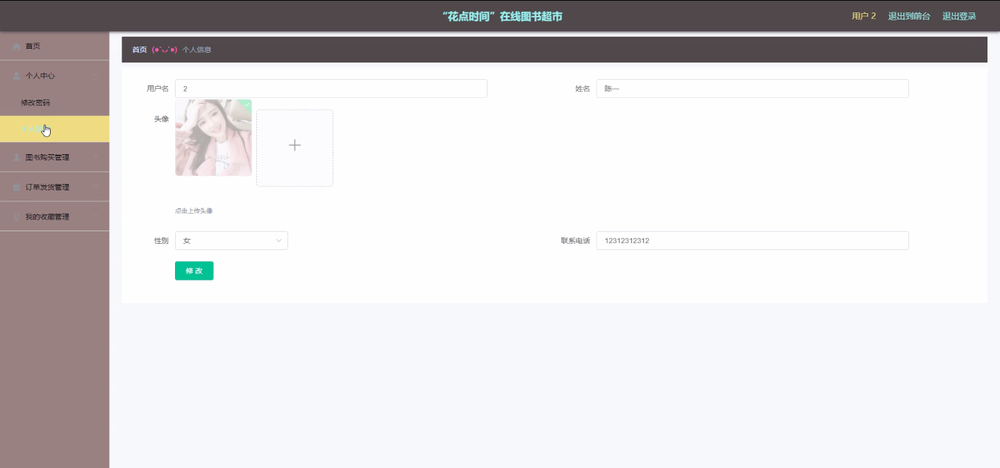

****本项目包含程序+源码+数据库+LW+调试部署环境，文末可获取一份本项目的java源码和数据库参考。****

## ******开题报告******

研究背景：
随着互联网的迅速发展，电子商务行业蓬勃发展，线上购物已经成为人们生活中不可或缺的一部分。在线图书超市作为电子商务的重要组成部分之一，为用户提供了便捷的图书购买渠道。然而，在线图书超市面临着众多挑战和问题，如用户体验不佳、图书分类不明确、图书信息不全等，这些问题制约了在线图书超市的发展和用户满意度。

研究意义：
针对在线图书超市存在的问题，进行深入研究具有重要的现实意义。通过改进和优化系统功能，提升用户体验，完善图书分类和信息，可以增加用户对在线图书超市的信任度和忠诚度，促进其持续发展。同时，研究还可以为其他电子商务平台提供借鉴和参考，推动整个行业的发展。

研究目的：
本研究旨在通过对在线图书超市的系统功能进行分析和优化，解决当前存在的问题，提升用户体验和满意度。具体目标包括改进用户界面设计，优化图书分类和信息展示，提高图书购买和订单发货的效率，以及优化图书入库管理等方面。

研究内容： 本研究将主要围绕在线图书超市的系统功能展开，包括用户、图书分类、图书信息、图书购买、订单发货、图书入库等方面。具体内容包括但不限于以下几个方面：

  1. 用户：分析用户需求和行为特征，改进用户界面设计，提升用户体验。
  2. 图书分类：优化图书分类体系，使用户能够更快速、准确地找到所需图书。
  3. 图书信息：完善图书信息展示，包括图书封面、作者简介、读者评价等，提供全面、详细的图书信息。
  4. 图书购买：简化购买流程，提高购买效率，增加支付方式的选择，保障交易安全。
  5. 订单发货：优化订单处理流程，提高发货速度和准确性，增强物流追踪功能。
  6. 图书入库：改进图书入库管理系统，提高图书入库效率和准确性。

拟解决的主要问题：
通过对上述系统功能的优化，本研究旨在解决在线图书超市存在的一系列问题，包括用户体验不佳、图书分类不明确、图书信息不全、购买流程繁琐、发货速度慢、图书入库效率低等问题。

研究方案：
本研究将采用综合研究方法，包括文献调研、用户调研、系统分析等。通过对现有在线图书超市的数据和用户反馈进行收集和分析，结合相关理论和经验，提出相应的优化方案。在方案实施过程中，将进行系统功能改进和界面设计优化，并进行系统测试和用户体验评估。

预期成果：
通过本研究的努力，预期可以改善在线图书超市的用户体验和满意度，提升系统功能的效率和准确性。具体成果包括但不限于：优化的用户界面设计、完善的图书分类和信息展示、简化的购买流程、高效的订单发货系统、提高的图书入库管理效率等。这些成果将为在线图书超市的发展提供有力支持，并为电子商务行业的发展贡献经验和借鉴。

进度安排：

2022年9月至10月：需求分析和规划，进行用户需求调研和分析，确定系统功能和目标。

2022年11月至2023年1月：系统设计和开发，完成系统架构设计和技术选型，并开始编写代码。

2023年2月至3月：测试和优化，进行单元测试和集成测试，修复问题并优化系统性能。

2023年4月至5月：文档编写和培训，编写用户手册和系统文档，并进行相关人员的培训。

2023年5月：上线部署和维护，将系统部署到生产环境中，并定期进行维护和升级。

参考文献：

[1]王振华.SpringBoot在教学效果评估系统中的应用[J].电子技术,2023,(05):67-69.

[2]王明泉.基于SpringBoot远程热部署的探索和应用[J].信息与电脑(理论版),2023,(07):1-4.

[3]王亚东,李晓霞,陈强强,剡美娜.基于SpringBoot的需求发布平台设计[J].信息与电脑(理论版),2023,(01):105-107.

[4]陈新府豪.基于SpringBoot和Vue框架的创新方法推理系统的设计与实现[D].导师：黄静.浙江理工大学,2022.

[5]霍福华,韩慧.基于SpringBoot微服务架构下前后端分离的MVVM模型[J].电子技术与软件工程,2022,(01):73-76.

[6]韩策,张娜,王松亭,张凯,何方,袁峰.SpringBoot OPC客户端设计与研究[J].电子世界,2021,(19):25-26.

****以上是本项目程序开发之前开题报告内容，最终成品以下面界面为准，大家可以酌情参考使用。要源码参考请在文末进行获取！！****

## ******本项目的界面展示******

