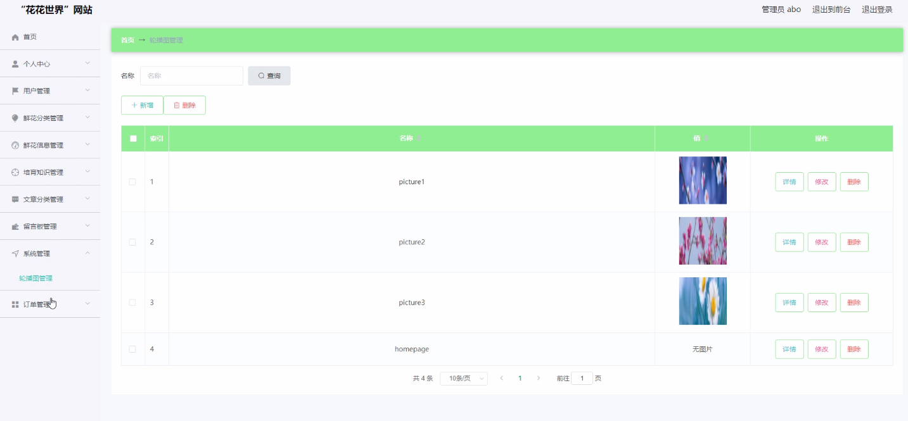

****本项目包含程序+源码+数据库+LW+调试部署环境，文末可获取一份本项目的java源码和数据库参考。****

## ******开题报告******

研究背景、意义和目的：

在当今社会，随着互联网的迅速发展，电子商务已经成为了人们购物的主要方式之一。而作为电子商务的一个重要领域，鲜花销售也逐渐受到了广大消费者的关注。然而，在传统的线下鲜花市场中，消费者往往面临着鲜花种类有限、价格不透明、购买流程繁琐等问题。因此，开发一个方便快捷、丰富多样的在线鲜花销售平台具有重要的现实意义。

本次研究旨在设计和开发一个名为“花花世界”的网站，以满足用户对鲜花购买的需求，并提供相关的鲜花分类、鲜花信息、培育知识、文章分类等系统功能。通过该网站，用户可以方便地浏览和购买各类鲜花，并获取到与鲜花相关的详细信息和专业的培育知识。同时，该网站还将提供丰富的文章分类，帮助用户更好地了解和欣赏鲜花文化。

研究内容：

  1. 用户系统功能：设计和开发用户注册、登录、个人信息管理等功能，使用户能够方便地进行购物和交流。

  2. 鲜花分类系统功能：根据鲜花的特征和用途，对鲜花进行分类，并提供相应的筛选和搜索功能，以满足用户的不同需求。

  3. 鲜花信息系统功能：收集和整理各类鲜花的详细信息，包括名称、产地、花语、价格等，为用户提供全面准确的鲜花信息。

  4. 培育知识系统功能：提供鲜花的培育方法、养护技巧等相关知识，帮助用户更好地照顾自己所购买的鲜花。

  5. 文章分类系统功能：整理和发布与鲜花相关的文章，包括花艺、花卉文化、鲜花市场动态等内容，丰富用户的阅读体验。

拟解决的主要问题：

  1. 传统线下鲜花市场购买流程繁琐的问题：通过在线平台提供方便快捷的购物流程，简化用户购买鲜花的步骤。

  2. 鲜花种类有限的问题：通过鲜花分类系统功能，提供多样化的鲜花选择，满足用户不同的需求。

  3. 鲜花价格不透明的问题：通过鲜花信息系统功能，提供详细的鲜花信息和价格，使用户能够做出明智的购买决策。

  4. 用户对鲜花养护知识的需求：通过培育知识系统功能，向用户提供专业的鲜花养护知识，帮助他们更好地照顾所购买的鲜花。

  5. 缺乏与鲜花相关的文化和知识的获取渠道：通过文章分类系统功能，为用户提供丰富的鲜花文化和知识，增加用户的阅读体验和知识储备。

研究方案和预期成果：

本研究将采用网站开发技术，结合用户需求和市场情况，设计和开发一个名为“花花世界”的在线鲜花销售平台。预期成果包括完善的用户系统功能、鲜花分类系统功能、鲜花信息系统功能、培育知识系统功能和文章分类系统功能。通过该平台，用户可以方便地浏览和购买各类鲜花，并获取到与鲜花相关的详细信息和专业的培育知识，同时还能够阅读丰富的鲜花文化和知识文章。通过提供便捷、丰富多样的在线购物和知识获取渠道，预期能够满足用户对鲜花的需求，促进鲜花市场的发展和消费者的满意度提升。

进度安排：

2022年9月至10月：开题报告编写和提交，完成开题报告的撰写并提交给指导教师进行审核。

2022年11月至2023年1月：系统设计和开发，根据开题报告的要求，进行系统设计和编码工作。

2023年2月至3月：论文撰写和初稿完成，开始撰写论文，并在这个阶段完成论文的初稿。

2023年4月至5月：论文修改和最终定稿，根据指导教师的意见对论文进行修改，并完成最终的定稿。

2023年5月：论文答辩和提交，参加论文答辩并根据答辩结果进行修改，最后将论文提交给学院或学校。

参考文献：

[1]喻佳,吴丹新.基于SpringBoot的Web快速开发框架[J].电脑编程技巧与维护,2021,(09):31-33.

[2]李鹏.基于SpringBoot快速开发平台的实现[J].电子技术与软件工程,2021,(12):36-37.

[3]叶开平,蔡维晟,陈家敏,邓斯妮.基于SpringBoot的综测可视化管理系统的研究与设计[J].电脑知识与技术,2021,(12):100-104.

[4]江健锋,徐振平.Springboot最小系统的设计与实现[J].电脑知识与技术,2021,(04):62-63.

[5]赵炯,司圣杰,周奇才,熊肖磊.通用信息获取系统设计与实现[J].起重运输机械,2020,(16):89-97.

[6]吴英宾.一种内外网数据交互系统的设计与实现[J].软件工程,2020,(08):25-27.

****以上是本项目程序开发之前开题报告内容，最终成品以下面界面为准，大家可以酌情参考使用。要源码参考请在文末进行获取！！****

## ******本项目的界面展示******

