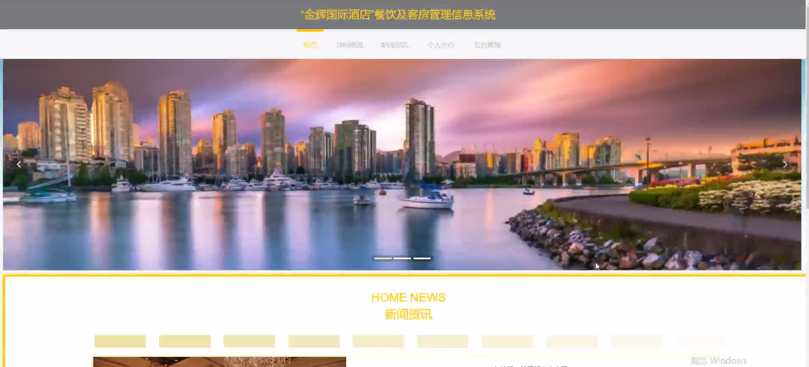

****本项目包含程序+源码+数据库+LW+调试部署环境，文末可获取一份本项目的java源码和数据库参考。****

## ******开题报告******

研究背景：
随着旅游业的快速发展和人们对舒适度要求的提高，酒店行业正迎来蓬勃发展的机遇。然而，传统的酒店管理方式已经无法满足日益增长的客户需求和竞争压力。因此，建立一个高效、智能化的餐饮及客房管理信息系统变得尤为重要。

研究意义：
“金辉国际酒店”餐饮及客房管理信息系统的建立将带来诸多好处。首先，该系统可以提高酒店运营效率，减少人工操作的错误和时间成本。其次，通过数据的集中管理和分析，酒店管理层可以更好地了解客户需求，优化服务质量，并制定更科学的经营策略。最后，该系统还可以提升客户体验，实现个性化服务，从而增强客户忠诚度。

研究目的：
本研究的目的是设计和开发一个功能完善、易于使用的“金辉国际酒店”餐饮及客房管理信息系统，以满足酒店运营的需求。通过该系统，酒店可以实现餐饮和客房管理的自动化、智能化，提高工作效率和服务质量。

研究内容： 本研究将围绕以下系统功能展开研究：

  1. 用户管理：包括用户注册、登录、权限管理等功能，确保系统安全可靠。

  2. 房间类型管理：对不同类型的客房进行分类管理，方便客户选择和预订。

  3. 房间信息管理：记录客房的基本信息，如房间号、楼层、价格等，并实时更新房态信息。

  4. 前台接待管理：包括客户入住登记、办理退房手续、处理客户投诉等工作。

  5. 房间预约管理：提供在线预订功能，方便客户随时预定房间。

  6. 房间入住管理：记录客户入住时间、离店时间等信息，并生成相应账单。

  7. 房间退房管理：处理客户退房手续，结算费用并更新房态信息。

  8. 请假信息管理：员工请假申请、审批和记录管理，确保人力资源的合理调配。

  9. 员工工资管理：记录员工工资信息，自动生成工资报表，提高薪资管理效率。

  10. 菜品信息管理：包括菜品种类、价格、库存等信息的管理，方便餐厅运营。

  11. VIP管理：对VIP客户进行特殊待遇和管理，提升客户满意度。

拟解决的主要问题：
本研究旨在解决传统酒店管理方式存在的效率低下、服务质量不稳定、数据分散等问题。通过建立餐饮及客房管理信息系统，可以实现酒店管理的自动化、智能化，提高工作效率、服务质量和客户满意度。

研究方案和预期成果：
本研究将采用软件开发的方法，结合数据库技术和人机交互设计原则，设计和开发一个功能完善、易于使用的“金辉国际酒店”餐饮及客房管理信息系统。预期成果包括一个稳定可靠的系统，能够实现酒店管理的自动化、智能化，并提供良好的用户体验。该系统将为酒店提供全面的管理支持，提高运营效率和服务质量，进而增强竞争力和盈利能力。

进度安排：

2022年9月至10月：开题报告编写和提交，完成开题报告的撰写并提交给指导教师进行审核。

2022年11月至2023年1月：系统设计和开发，根据开题报告的要求，进行系统设计和编码工作。

2023年2月至3月：论文撰写和初稿完成，开始撰写论文，并在这个阶段完成论文的初稿。

2023年4月至5月：论文修改和最终定稿，根据指导教师的意见对论文进行修改，并完成最终的定稿。

2023年5月：论文答辩和提交，参加论文答辩并根据答辩结果进行修改，最后将论文提交给学院或学校。

参考文献：

[1]喻佳,吴丹新.基于SpringBoot的Web快速开发框架[J].电脑编程技巧与维护,2021,(09):31-33.

[2]李鹏.基于SpringBoot快速开发平台的实现[J].电子技术与软件工程,2021,(12):36-37.

[3]叶开平,蔡维晟,陈家敏,邓斯妮.基于SpringBoot的综测可视化管理系统的研究与设计[J].电脑知识与技术,2021,(12):100-104.

[4]江健锋,徐振平.Springboot最小系统的设计与实现[J].电脑知识与技术,2021,(04):62-63.

[5]赵炯,司圣杰,周奇才,熊肖磊.通用信息获取系统设计与实现[J].起重运输机械,2020,(16):89-97.

[6]吴英宾.一种内外网数据交互系统的设计与实现[J].软件工程,2020,(08):25-27.

****以上是本项目程序开发之前开题报告内容，最终成品以下面界面为准，大家可以酌情参考使用。要源码参考请在文末进行获取！！****

## ******本项目的界面展示******

