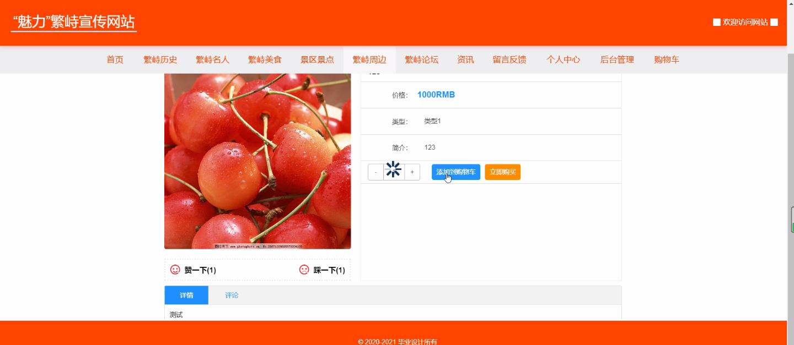

****本项目包含程序+源码+数据库+LW+调试部署环境，文末可获取一份本项目的java源码和数据库参考。****

## ******开题报告******

研究背景：
随着互联网的快速发展，网络已经成为人们获取信息、交流和娱乐的重要渠道。各个地方也纷纷建立宣传网站，以展示本地的特色和魅力，吸引更多的游客和投资者。而对于繁峙这样一个具有丰富历史文化和自然资源的地方来说，建立一套完善的宣传网站，将是提升地方知名度和吸引力的重要手段。

研究意义：
通过建立“魅力”繁峙宣传网站，可以有效地推广繁峙的历史文化、名人故事、美食特色以及周边景点等，向更多的人群传递繁峙的魅力。这不仅可以吸引更多的游客前来参观旅游，还能够促进当地经济的发展，增加就业机会，提高居民的生活质量。

研究目的：
本研究的目的是基于“魅力”繁峙宣传网站的功能需求，设计并开发一套系统，以满足用户对繁峙相关信息的查询和了解需求。通过该系统，用户可以方便地获取繁峙的历史文化、名人故事、美食特色、景区景点以及周边信息等，从而提高用户对繁峙的认知和兴趣。

研究内容： 本研究将围绕“魅力”繁峙宣传网站的功能需求展开，主要包括以下几个方面的内容：

  1. 用户系统：设计并实现用户注册、登录、个人信息管理等功能，为用户提供个性化的服务和推荐。

  2. 繁峙历史系统：收集整理繁峙的历史资料，包括建筑、文物、传统习俗等，并将其呈现在宣传网站上，让用户了解繁峙的历史渊源。

  3. 繁峙名人系统：介绍繁峙的名人故事和成就，包括历史人物、文化名人、科技创新者等，以展示繁峙的人文底蕴。

  4. 繁峙美食系统：收集整理繁峙的特色美食，包括传统菜肴、地方小吃等，为用户提供美食推荐和点评。

  5. 景区景点系统：介绍繁峙的自然风光和人文景观，包括山水名胜、古迹遗址等，为用户提供旅游攻略和景点推荐。

  6. 繁峙周边系统：介绍繁峙周边的其他地方特色和旅游资源，包括邻近城市、自然保护区等，为用户提供更全面的旅游信息。

拟解决的主要问题： 本研究将重点解决以下几个问题：

  1. 如何设计一个用户友好的界面，使用户能够方便快捷地获取所需信息？

  2. 如何收集整理繁峙的历史文化、名人故事、美食特色等内容，并进行有效展示？

  3. 如何提供个性化的服务和推荐，满足不同用户的需求和兴趣？

  4. 如何确保宣传网站的信息准确性和权威性，提高用户对网站的信任度？

  5. 如何与相关部门和机构合作，共同推进“魅力”繁峙宣传网站的建设和运营？

研究方案和预期成果：
本研究将采用文献调研、实地考察、数据分析等方法，结合前期调研和需求分析的结果，设计并开发“魅力”繁峙宣传网站。预期成果包括一个功能完善、界面友好的宣传网站，能够满足用户对繁峙相关信息的查询和了解需求，并能够有效推广繁峙的历史文化、名人故事、美食特色等，提升繁峙的知名度和吸引力。

进度安排：

2022年9月至10月：开题报告编写和提交，完成开题报告的撰写并提交给指导教师进行审核。

2022年11月至2023年1月：系统设计和开发，根据开题报告的要求，进行系统设计和编码工作。

2023年2月至3月：论文撰写和初稿完成，开始撰写论文，并在这个阶段完成论文的初稿。

2023年4月至5月：论文修改和最终定稿，根据指导教师的意见对论文进行修改，并完成最终的定稿。

2023年5月：论文答辩和提交，参加论文答辩并根据答辩结果进行修改，最后将论文提交给学院或学校。

参考文献：

[1]喻佳,吴丹新.基于SpringBoot的Web快速开发框架[J].电脑编程技巧与维护,2021,(09):31-33.

[2]李鹏.基于SpringBoot快速开发平台的实现[J].电子技术与软件工程,2021,(12):36-37.

[3]叶开平,蔡维晟,陈家敏,邓斯妮.基于SpringBoot的综测可视化管理系统的研究与设计[J].电脑知识与技术,2021,(12):100-104.

[4]江健锋,徐振平.Springboot最小系统的设计与实现[J].电脑知识与技术,2021,(04):62-63.

[5]赵炯,司圣杰,周奇才,熊肖磊.通用信息获取系统设计与实现[J].起重运输机械,2020,(16):89-97.

[6]吴英宾.一种内外网数据交互系统的设计与实现[J].软件工程,2020,(08):25-27.

****以上是本项目程序开发之前开题报告内容，最终成品以下面界面为准，大家可以酌情参考使用。要源码参考请在文末进行获取！！****

## ******本项目的界面展示******

