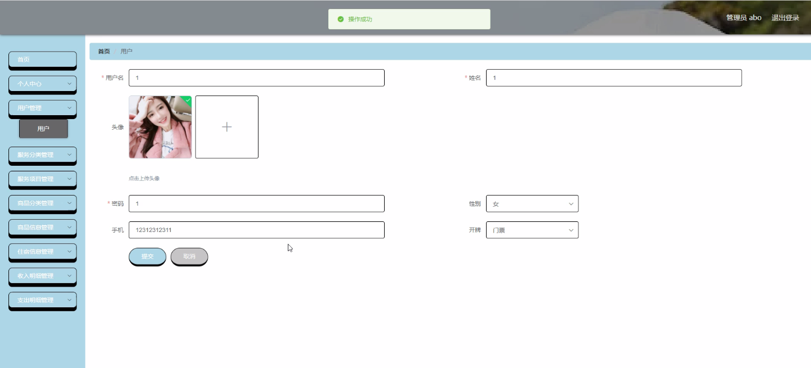
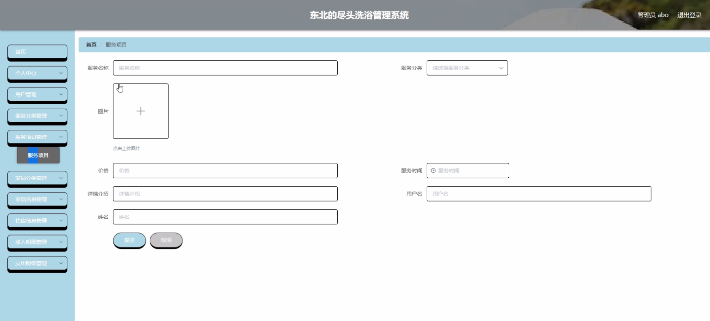
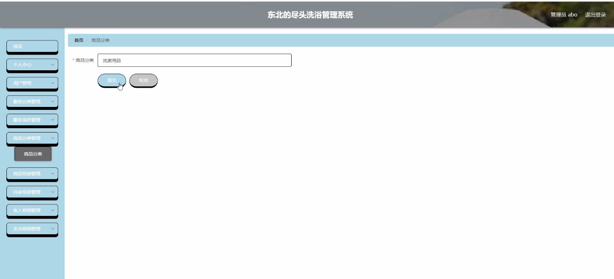
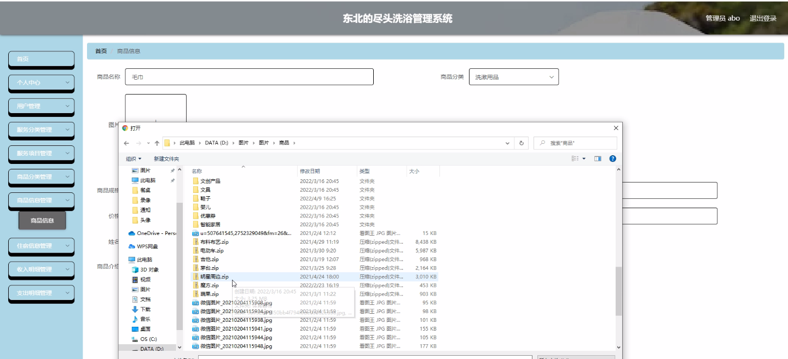
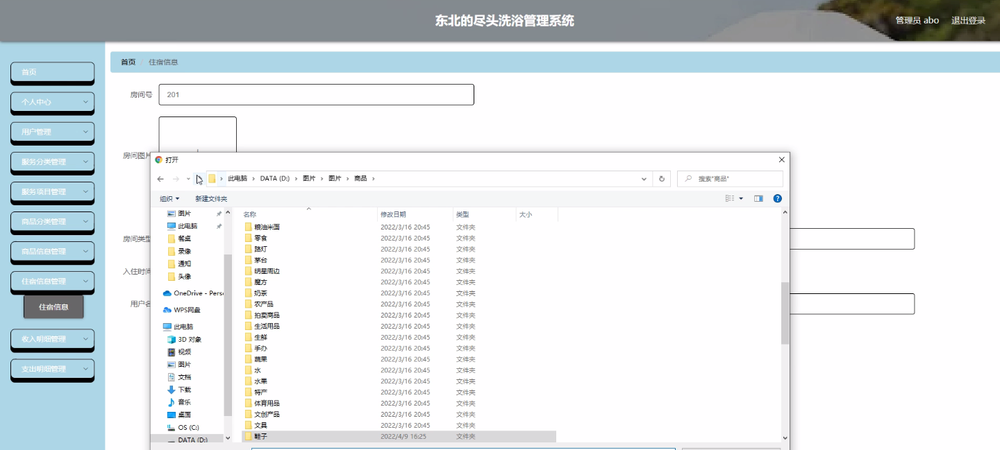
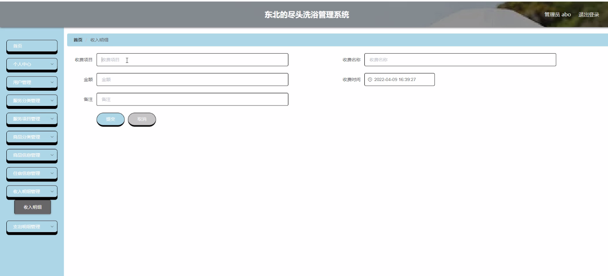
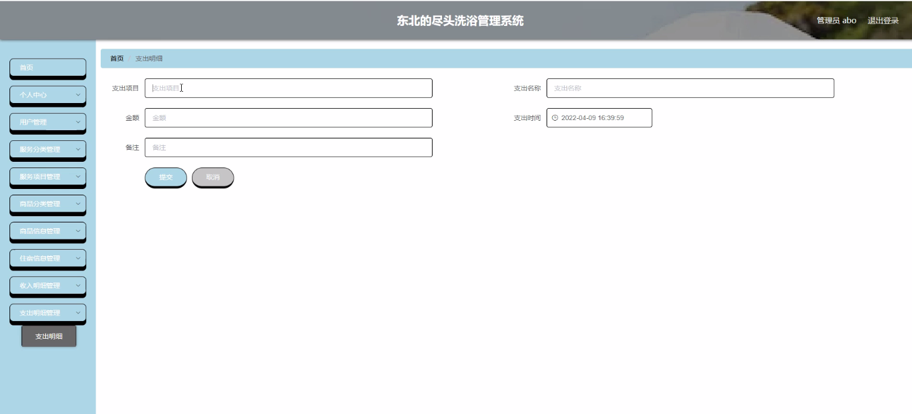

****本项目包含程序+源码+数据库+LW+调试部署环境，文末可获取一份本项目的java源码和数据库参考。****

## ******开题报告******

研究背景：
随着社会经济的发展和人们生活水平的提高，洗浴行业逐渐成为人们日常生活中不可或缺的一部分。然而，在传统的洗浴管理模式下，存在着许多问题，如信息不透明、服务质量难以保证、管理效率低下等。因此，建立一个完善的洗浴管理系统具有重要的现实意义。

研究意义：
通过构建东北地区尽头洗浴管理系统，可以实现对洗浴行业的规范化管理，提升服务质量，满足消费者的需求，促进行业的健康发展。同时，该系统还能够提供全面的数据分析和决策支持，帮助企业进行精细化运营管理，提高经济效益。

研究目的：
本研究旨在设计和开发一个功能完备、操作简便的洗浴管理系统，以解决传统洗浴行业中存在的问题，并提升行业整体管理水平。通过引入先进的信息技术手段，提高服务质量和管理效率，实现洗浴行业的可持续发展。

研究内容： 根据系统功能，本研究将包括以下内容：

  1. 用户管理：设计用户注册、登录、信息修改等功能，实现用户身份识别和个人信息管理。

  2. 服务分类：建立洗浴服务的分类体系，包括按照不同性别、年龄、需求等进行分类，方便用户选择适合自己的服务项目。

  3. 服务项目：详细描述各类洗浴服务的具体内容和特点，提供清晰的服务介绍，帮助用户了解和选择。

  4. 商品分类：构建商品分类体系，包括洗浴用品、保健品等，方便用户浏览和购买。

  5. 商品信息：提供商品的详细信息，包括价格、规格、使用方法等，方便用户了解和购买。

  6. 住宿信息：记录和管理洗浴场所的住宿信息，包括房间类型、价格、预订情况等。

  7. 收入明细：统计和分析洗浴场所的收入情况，包括服务项目、商品销售等。

  8. 支出明细：记录和管理洗浴场所的支出情况，包括人员工资、设备维护等。

拟解决的主要问题：
本研究旨在解决传统洗浴行业中存在的信息不透明、服务质量难以保证、管理效率低下等问题。通过建立洗浴管理系统，提供全面的信息展示和管理功能，实现服务的标准化和规范化，提升用户体验和满意度。

研究方案和预期成果：
本研究将采用软件开发的方法，结合需求分析和系统设计，构建一个完善的洗浴管理系统。预期成果包括：用户管理模块、服务分类模块、服务项目模块、商品分类模块、商品信息模块、住宿信息模块、收入明细模块、支出明细模块等功能模块的设计和实现。通过该系统的应用，预期能够提高洗浴行业的管理水平，提升服务质量，促进行业的可持续发展。

进度安排：

2022年9月至10月：需求分析和规划，进行用户需求调研和分析，确定系统功能和目标。

2022年11月至2023年1月：系统设计和开发，完成系统架构设计和技术选型，并开始编写代码。

2023年2月至3月：测试和优化，进行单元测试和集成测试，修复问题并优化系统性能。

2023年4月至5月：文档编写和培训，编写用户手册和系统文档，并进行相关人员的培训。

2023年5月：上线部署和维护，将系统部署到生产环境中，并定期进行维护和升级。

参考文献：

[1]王振华.SpringBoot在教学效果评估系统中的应用[J].电子技术,2023,(05):67-69.

[2]王明泉.基于SpringBoot远程热部署的探索和应用[J].信息与电脑(理论版),2023,(07):1-4.

[3]王亚东,李晓霞,陈强强,剡美娜.基于SpringBoot的需求发布平台设计[J].信息与电脑(理论版),2023,(01):105-107.

[4]陈新府豪.基于SpringBoot和Vue框架的创新方法推理系统的设计与实现[D].导师：黄静.浙江理工大学,2022.

[5]霍福华,韩慧.基于SpringBoot微服务架构下前后端分离的MVVM模型[J].电子技术与软件工程,2022,(01):73-76.

[6]韩策,张娜,王松亭,张凯,何方,袁峰.SpringBoot OPC客户端设计与研究[J].电子世界,2021,(19):25-26.

****以上是本项目程序开发之前开题报告内容，最终成品以下面界面为准，大家可以酌情参考使用。要源码参考请在文末进行获取！！****

## ******本项目的界面展示******

