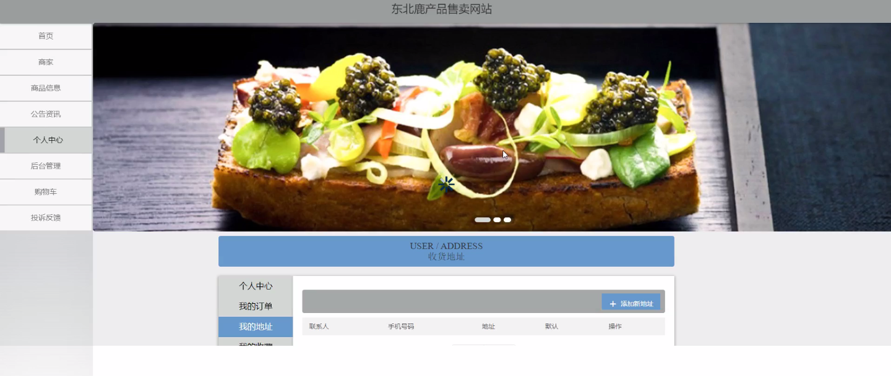
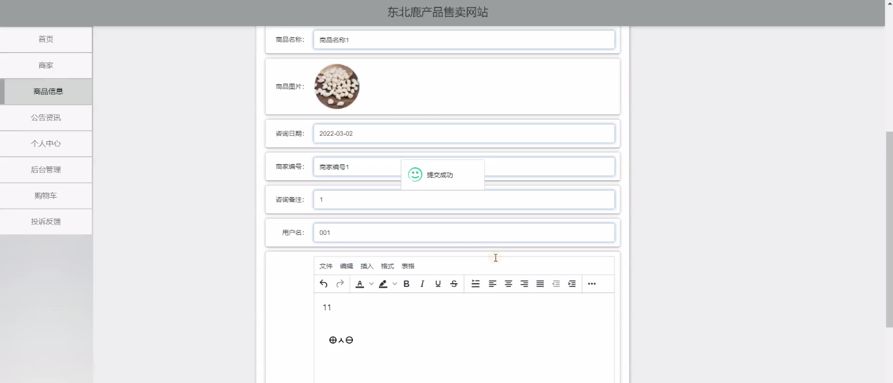
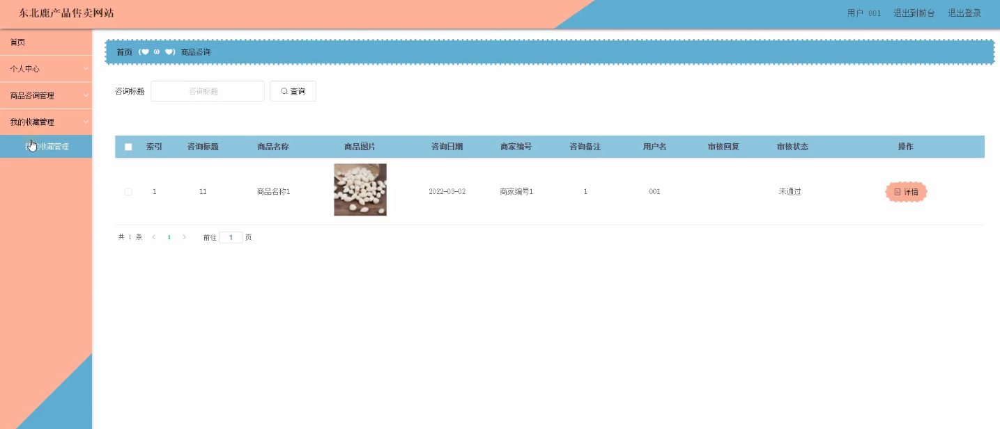
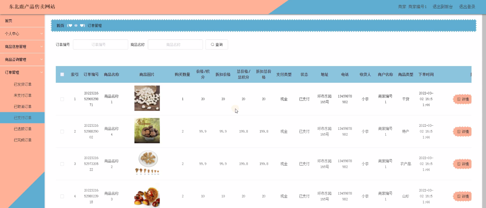
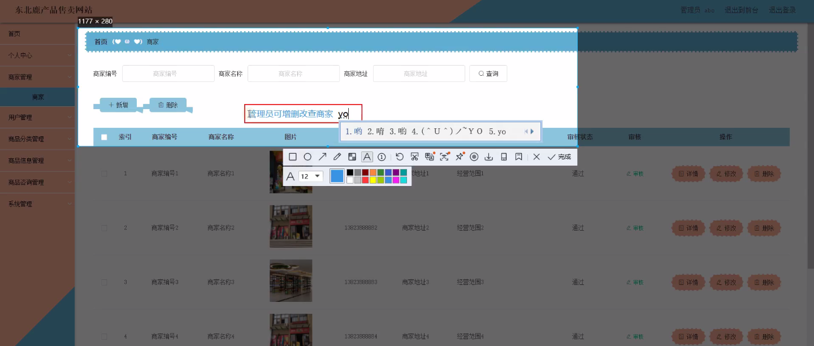
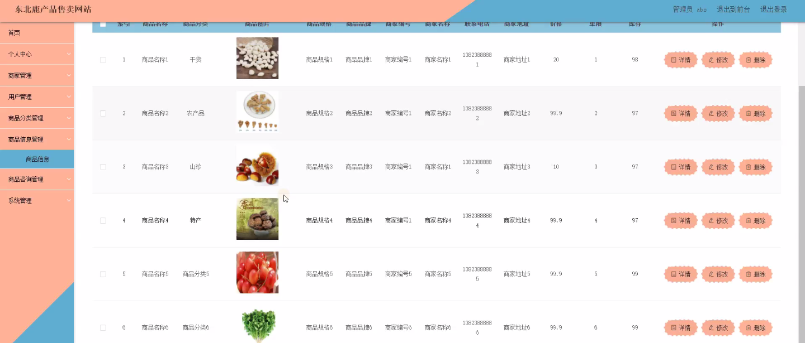
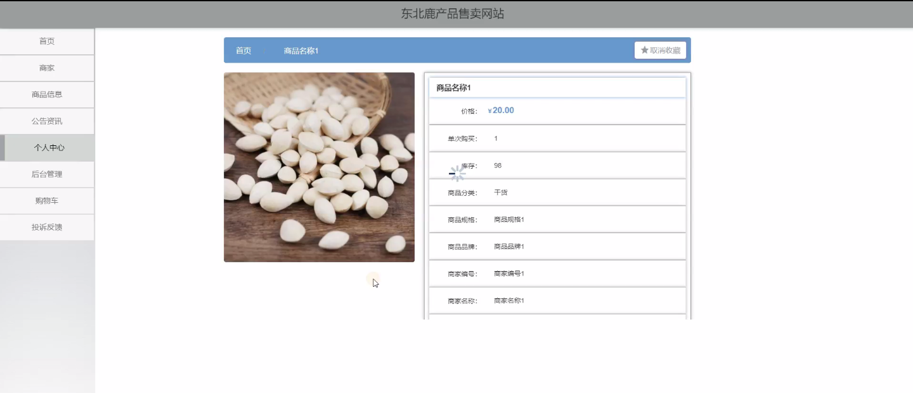

****本项目包含程序+源码+数据库+LW+调试部署环境，文末可获取一份本项目的java源码和数据库参考。****

## ******开题报告******

研究背景：
随着互联网的快速发展，电子商务已经成为了人们购物的主要方式之一。而在电子商务领域中，商品售卖网站起到了至关重要的作用。然而，在当前市场上，针对特定地区的产品进行售卖的网站相对较少。尤其是东北鹿产品，由于其独特的品质和口碑，具有很大的市场潜力。因此，建立一个专门销售东北鹿产品的网站具有重要的研究意义和实际价值。

研究意义：
通过建立一个专门销售东北鹿产品的网站，可以为消费者提供方便快捷的购物体验，同时也能够促进东北鹿产品的推广和销售。这不仅有助于满足消费者对高品质产品的需求，还能够推动当地农业产业的发展，增加农民的收入。此外，通过建立一个集商家、用户、商品分类、商品信息、商品咨询等系统功能于一体的网站，还能够促进商家与用户之间的交流和合作，提升整个产业链的效益。

研究目的：
本研究旨在建立一个专门销售东北鹿产品的网站，通过对商家、用户、商品分类、商品信息、商品咨询等系统功能的研究和设计，实现商品的在线展示、交易和服务。通过该网站的建立和运营，旨在提升消费者购物体验，促进东北鹿产品的推广和销售，推动当地农业产业的发展，为商家和用户之间搭建一个良好的交流平台。

研究内容： 本研究的主要内容包括商家、用户、商品分类、商品信息、商品咨询等系统功能的研究和设计。具体来说，研究内容涉及以下几个方面：

  1. 商家功能：研究商家入驻流程、商家管理系统、商家店铺页面设计等，以便商家能够方便快捷地管理自己的店铺和商品。

  2. 用户功能：研究用户注册、登录、浏览商品、下单支付等功能，以提供用户友好的购物体验。

  3. 商品分类功能：研究商品分类标准、分类页面设计等，以便用户能够方便地找到所需商品。

  4. 商品信息功能：研究商品信息的展示方式、详细描述、图片展示等，以提供准确全面的商品信息。

  5. 商品咨询功能：研究用户对商品的咨询方式、商家的回复方式等，以促进用户与商家之间的交流和沟通。

拟解决的主要问题： 本研究旨在解决以下主要问题：

  1. 如何设计一个便捷易用的商家管理系统，方便商家管理店铺和商品？

  2. 如何提供一个用户友好的购物体验，使用户能够方便快捷地浏览商品并完成下单支付？

  3. 如何设计一个合理的商品分类系统，使用户能够方便地找到所需商品？

  4. 如何展示准确全面的商品信息，以提供给用户参考和选择？

  5. 如何搭建一个良好的商品咨询平台，促进用户与商家之间的交流和沟通？

研究方案和预期成果：
本研究将采用文献研究、案例分析和系统设计等方法，通过调研和分析已有的电子商务网站，结合东北鹿产品的特点和市场需求，设计并开发一个专门销售东北鹿产品的网站。预期成果包括一个完善的商家、用户、商品分类、商品信息、商品咨询等系统功能，以及一个稳定可靠的网站平台。通过该网站的建立和运营，预期能够提升消费者购物体验，促进东北鹿产品的推广和销售，推动当地农业产业的发展。

进度安排：

2022年9月至10月：需求分析和规划，进行用户需求调研和分析，确定系统功能和目标。

2022年11月至2023年1月：系统设计和开发，完成系统架构设计和技术选型，并开始编写代码。

2023年2月至3月：测试和优化，进行单元测试和集成测试，修复问题并优化系统性能。

2023年4月至5月：文档编写和培训，编写用户手册和系统文档，并进行相关人员的培训。

2023年5月：上线部署和维护，将系统部署到生产环境中，并定期进行维护和升级。

参考文献：

[1]王振华.SpringBoot在教学效果评估系统中的应用[J].电子技术,2023,(05):67-69.

[2]王明泉.基于SpringBoot远程热部署的探索和应用[J].信息与电脑(理论版),2023,(07):1-4.

[3]王亚东,李晓霞,陈强强,剡美娜.基于SpringBoot的需求发布平台设计[J].信息与电脑(理论版),2023,(01):105-107.

[4]陈新府豪.基于SpringBoot和Vue框架的创新方法推理系统的设计与实现[D].导师：黄静.浙江理工大学,2022.

[5]霍福华,韩慧.基于SpringBoot微服务架构下前后端分离的MVVM模型[J].电子技术与软件工程,2022,(01):73-76.

[6]韩策,张娜,王松亭,张凯,何方,袁峰.SpringBoot OPC客户端设计与研究[J].电子世界,2021,(19):25-26.

****以上是本项目程序开发之前开题报告内容，最终成品以下面界面为准，大家可以酌情参考使用。要源码参考请在文末进行获取！！****

## ******本项目的界面展示******

