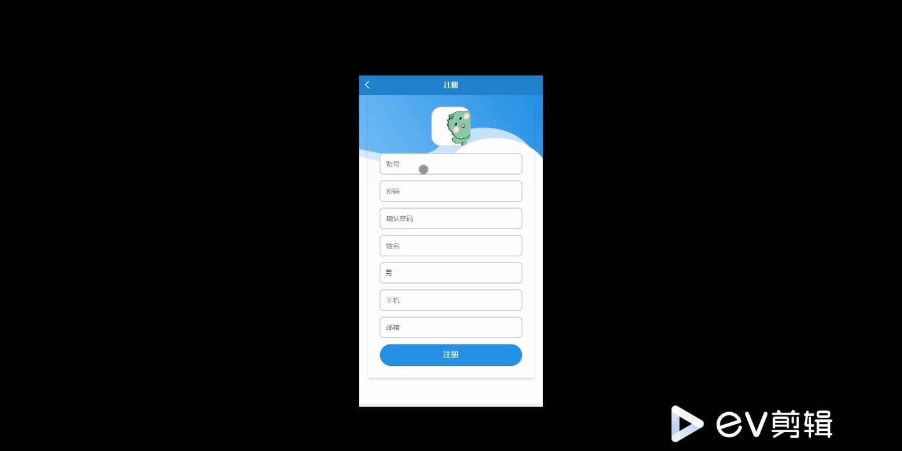
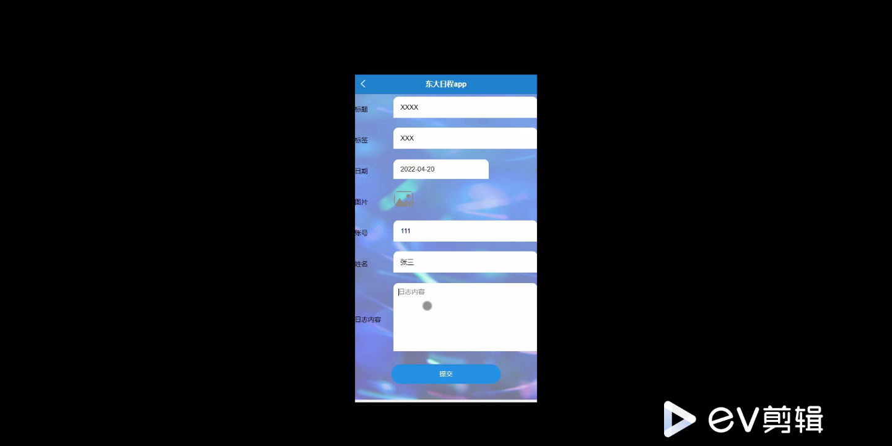
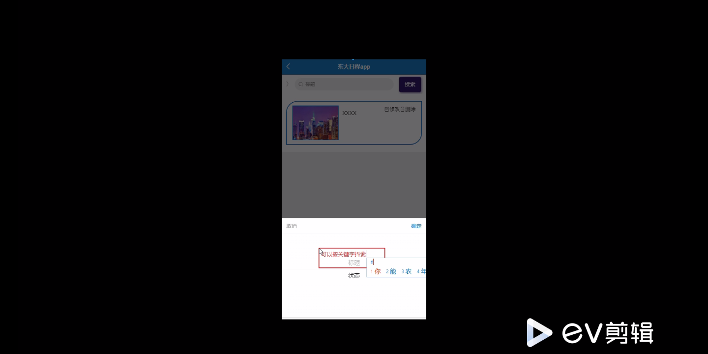
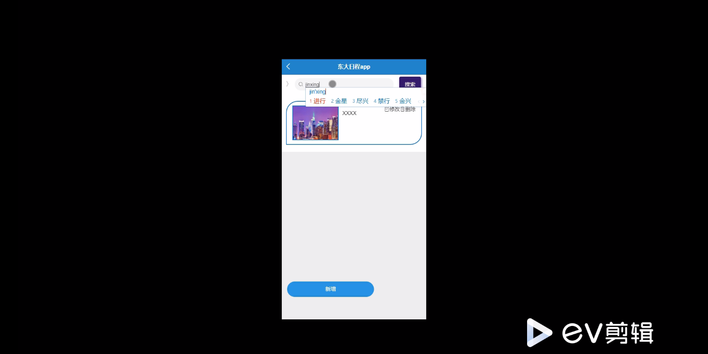
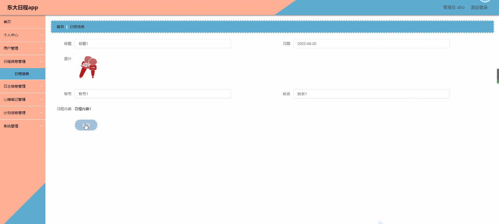
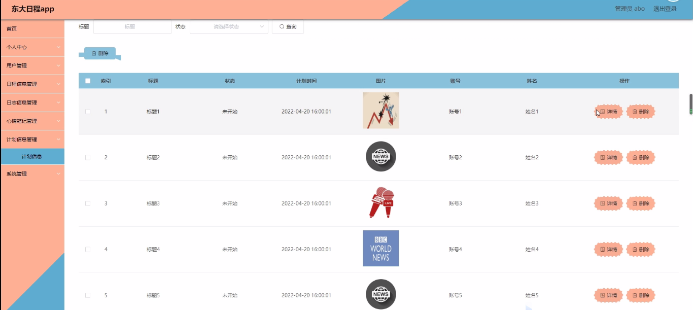

****本项目包含程序+源码+数据库+LW+调试部署环境，文末可获取一份本项目的java源码和数据库参考。****

## ******开题报告******

研究背景：
随着社会的快速发展和信息技术的日益普及，人们的生活变得越来越忙碌。在这样一个快节奏的生活环境中，合理安排时间成为了一项重要的任务。特别是对于大学生而言，他们面临着课程安排、社团活动、考试复习等多个方面的时间管理需求。然而，传统的纸质日程表已经无法满足他们的需求，因此需要一种更加高效、便捷的日程管理系统。

研究意义：
开发一款功能完善、易于使用的东大日程管理系统，对于提高大学生的时间管理能力、减轻压力、提高效率具有重要意义。通过该系统，大学生可以更好地规划自己的时间，合理安排各项任务，避免错过重要的事务。同时，该系统还可以帮助大学生记录和分析自己的学习和生活情况，从而更好地调整自己的状态和行动。

研究目的：
本研究旨在设计和开发一款适用于东大学生的日程管理系统，以满足他们的时间管理需求。通过该系统，用户可以方便地查看和编辑自己的日程安排、课程表、计划信息等，并能够记录和分析自己的心情笔记和日志信息。同时，系统还将提供校园资讯功能，为用户提供最新的校园动态和活动信息。

研究内容： 本研究的主要内容包括以下几个方面：

  1. 用户管理：设计并实现用户注册、登录、个人信息管理等功能，确保用户可以正常使用系统，并且个人信息得到保护。

  2. 日程信息管理：开发日程添加、编辑、删除等功能，使用户能够方便地管理自己的日程安排，并能够设置提醒功能以及与其他用户共享日程。

  3. 日志信息管理：设计并实现日志的添加、查看、编辑等功能，用户可以记录自己的学习和生活情况，并进行分类和标签管理。

  4. 心情笔记管理：开发心情笔记的添加、查看、编辑等功能，用户可以记录自己的心情变化，并进行情绪分析和统计。

  5. 计划信息管理：设计并实现计划的添加、查看、编辑等功能，用户可以制定自己的学习和生活计划，并进行进度跟踪和提醒。

  6. 课程表管理：开发课程表的添加、查看、编辑等功能，用户可以方便地管理自己的课程安排，并能够设置提醒功能和与其他用户共享课程表。

  7. 校园资讯功能：设计并实现校园资讯的浏览、搜索等功能，为用户提供最新的校园动态和活动信息。

拟解决的主要问题：

  1. 如何设计一个用户友好、功能完善的东大日程管理系统？
  2. 如何确保用户的个人信息得到保护和隐私不被泄露？
  3. 如何实现日程、日志、心情笔记等信息的分类和标签管理？
  4. 如何进行心情分析和统计，帮助用户更好地了解自己的情绪变化？
  5. 如何实现与其他用户的日程和课程表共享功能？

研究方案和预期成果：
本研究将采用敏捷开发方法，结合用户需求调研和原型设计，逐步迭代开发出一款功能完善、易于使用的东大日程管理系统。预期成果包括系统的设计和开发文档、用户手册以及最终的可用系统。通过该系统的应用，预期能够提高大学生的时间管理能力、减轻压力、提高效率，从而对他们的学习和生活产生积极的影响。

进度安排：

2022年9月至10月：开题报告编写和提交，完成开题报告的撰写并提交给指导教师进行审核。

2022年11月至2023年1月：系统设计和开发，根据开题报告的要求，进行系统设计和编码工作。

2023年2月至3月：论文撰写和初稿完成，开始撰写论文，并在这个阶段完成论文的初稿。

2023年4月至5月：论文修改和最终定稿，根据指导教师的意见对论文进行修改，并完成最终的定稿。

2023年5月：论文答辩和提交，参加论文答辩并根据答辩结果进行修改，最后将论文提交给学院或学校。

参考文献：

[1]喻佳,吴丹新.基于SpringBoot的Web快速开发框架[J].电脑编程技巧与维护,2021,(09):31-33.

[2]李鹏.基于SpringBoot快速开发平台的实现[J].电子技术与软件工程,2021,(12):36-37.

[3]叶开平,蔡维晟,陈家敏,邓斯妮.基于SpringBoot的综测可视化管理系统的研究与设计[J].电脑知识与技术,2021,(12):100-104.

[4]江健锋,徐振平.Springboot最小系统的设计与实现[J].电脑知识与技术,2021,(04):62-63.

[5]赵炯,司圣杰,周奇才,熊肖磊.通用信息获取系统设计与实现[J].起重运输机械,2020,(16):89-97.

[6]吴英宾.一种内外网数据交互系统的设计与实现[J].软件工程,2020,(08):25-27.

****以上是本项目程序开发之前开题报告内容，最终成品以下面界面为准，大家可以酌情参考使用。要源码参考请在文末进行获取！！****

## ******本项目的界面展示******

