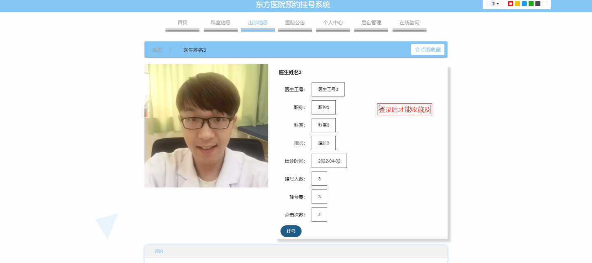
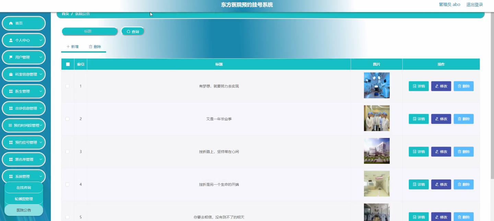
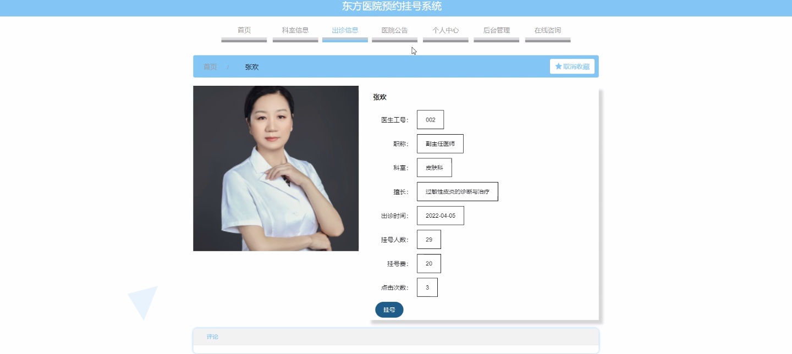
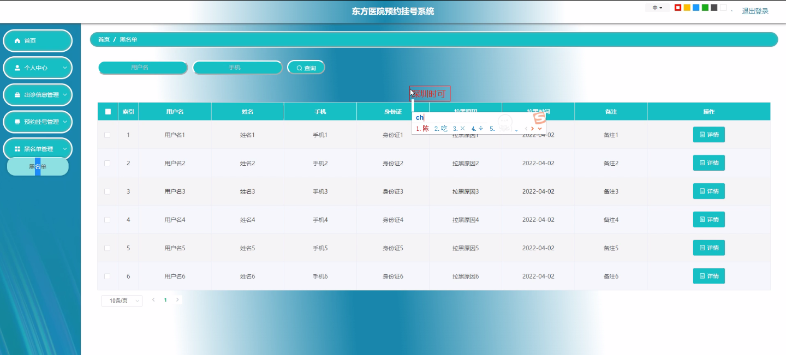

****本项目包含程序+源码+数据库+LW+调试部署环境，文末可获取一份本项目的java源码和数据库参考。****

## ******开题报告******

研究背景：
随着社会的发展和人口的增加，医疗资源的供需矛盾日益突出。传统的医院挂号方式存在诸多问题，如排队时间长、信息不透明等，给患者就医带来了很大的不便。为了解决这些问题，越来越多的医院开始引入预约挂号系统，以提高就医效率和服务质量。

研究意义：
预约挂号系统的引入可以有效地优化医疗资源的分配和利用，提高患者就医的便捷性和满意度。通过该系统，患者可以提前选择合适的科室和医生，并预约就诊时间，避免了排队等待的时间浪费。同时，医院也能够更好地安排医生的出诊时间，提高医疗服务的效率和质量。

研究目的：
本研究旨在设计和开发一套完善的东方医院预约挂号系统，以满足患者和医院的需求。通过该系统，患者可以方便地进行预约挂号，医院可以更好地管理和调度医疗资源，提高医疗服务的效率和质量。同时，通过研究系统的功能和特点，可以为其他医院引入预约挂号系统提供参考和借鉴。

研究内容： 本研究将主要围绕以下系统功能展开研究：

  1. 用户管理：设计用户注册、登录、个人信息管理等功能，保证用户信息的安全和准确性。

  2. 科室信息管理：建立科室信息数据库，包括科室名称、科室简介、科室位置等，方便患者选择合适的科室。

  3. 医生管理：建立医生信息数据库，包括医生姓名、职称、专业领域等，方便患者选择合适的医生。

  4. 出诊信息管理：记录医生的出诊时间和地点，确保患者能够选择到医生的合适时间就诊。

  5. 预约时间段管理：设置预约时间段，限制每个时间段的预约数量，避免资源浪费和过度预约。

  6. 预约挂号功能：设计预约挂号流程，包括选择科室、选择医生、选择就诊时间等，确保患者能够顺利完成预约挂号。

  7. 黑名单管理：建立黑名单机制，对违规操作的用户进行限制和处罚，维护系统的正常运行和公平性。

拟解决的主要问题：
通过研究和开发东方医院预约挂号系统，我们将解决传统挂号方式存在的排队时间长、信息不透明等问题。患者可以通过系统方便地选择科室和医生，并预约合适的就诊时间，提高就医效率和满意度。同时，医院也能够更好地管理和调度医疗资源，提高医疗服务的质量和效率。

研究方案和预期成果：
本研究将采用软件工程的方法，包括需求分析、系统设计、编码实现、测试验证等环节，开发出一套完善的东方医院预约挂号系统。预期成果包括一个稳定可靠、功能完善的系统，能够满足患者和医院的需求，提高医疗服务的效率和质量。同时，通过研究系统的功能和特点，可以为其他医院引入预约挂号系统提供参考和借鉴。

进度安排：

2022年9月至10月：需求分析和规划，明确系统功能和目标，制定项目计划。

2022年11月至2023年1月：系统设计和编码，完成详细的系统设计并开始编写代码。

2023年2月至3月：用户界面开发和数据库开发，开发用户友好的界面和设计数据库结构。

2023年4月至5月：功能测试、文档编写和上线部署，对系统进行全面的功能测试并编写用户手册。

2023年5月：维护和升级，定期对系统进行维护和升级，修复bug和添加新功能。

参考文献：

[1]邱小群,邓丽艳,陈海潮.基于B/S的信息管理系统设计和实现[J].信息与电脑(理论版),2022,(20):146-148.

[2]谢霜.基于Java技术的网络管理体系结构的应用[J].网络安全技术与应用,2022,(10):14-15.

[3]宋锦华.高职院校Java程序设计课程改革研究[J].科技视界,2022,(20):133-135.

[4]曹嵩彭,王鹏宇.浅析Java语言在软件开发中的应用[J].信息记录材料,2022,(03):114-116.

[5]朱澈,余俊达.武汉东湖学院.基于Java的软硬件信息管理系统V1.0[Z].项目立项编号.鉴定单位.鉴定日期:

****以上是本项目程序开发之前开题报告内容，最终成品以下面界面为准，大家可以酌情参考使用。要源码参考请在文末进行获取！！****

## ******本项目的界面展示******

