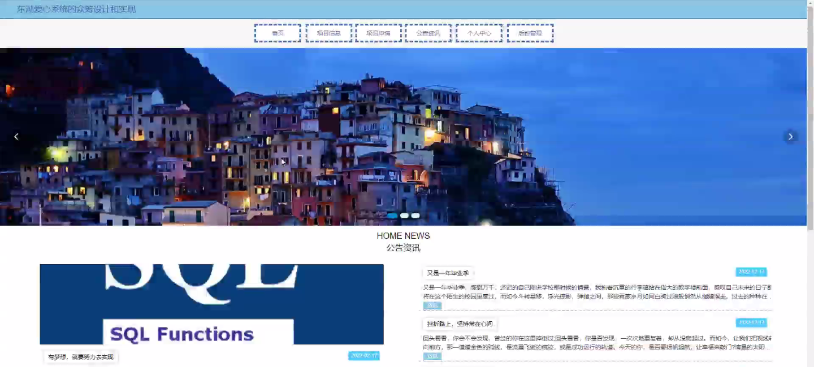
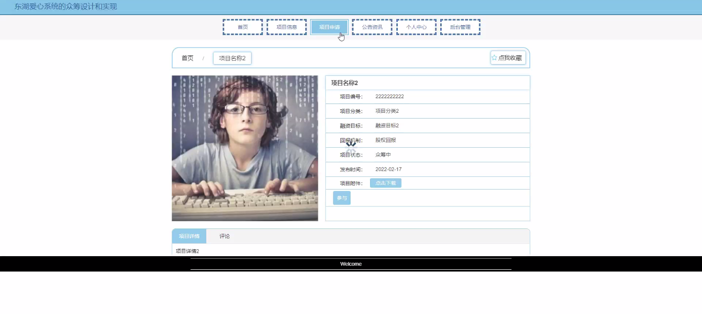
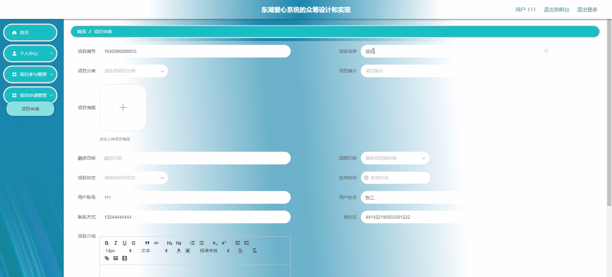
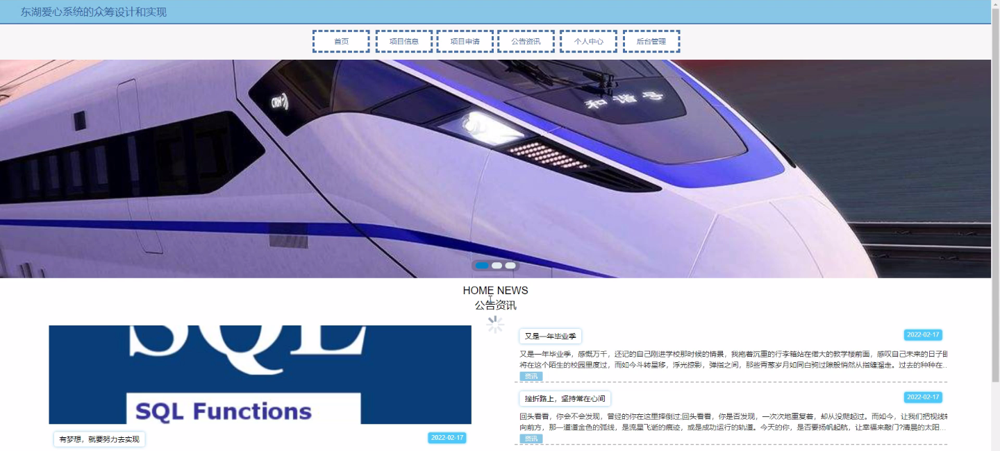

****本项目包含程序+源码+数据库+LW+调试部署环境，文末可获取一份本项目的java源码和数据库参考。****

## ******开题报告******

研究背景：
随着社会的发展和进步，人们对于公益事业的关注度不断提高。越来越多的人愿意积极参与到各种公益项目中，希望能够为社会做出一份贡献。然而，在众多公益项目中，有些项目因为资金不足或者宣传不到位，无法得到足够的支持和关注。因此，设计和实现一个有效的众筹系统，能够帮助这些公益项目筹集到更多的资金和资源，具有重要的意义和价值。

研究意义：
东湖爱心系统的众筹设计和实现旨在通过互联网技术和众筹模式，搭建一个公益项目的筹款平台，为那些需要帮助的项目提供更多的机会和资源。这不仅可以解决公益项目资金不足的问题，还可以提高公众对于公益事业的参与度和关注度，推动社会公益事业的发展。同时，通过众筹系统的设计和实现，可以提高公益项目的透明度和可信度，增加捐款者的信任感，促进公益事业的良性循环。

研究目的： 本研究旨在设计和实现一个功能完善、易于使用的众筹系统，为公益项目提供一个高效、便捷的筹款平台。具体目标包括：1.
提供用户注册和登录功能，方便用户参与众筹活动；2. 设计合理的项目分类和信息展示方式，使用户能够快速找到感兴趣的项目；3.
实现项目参与和捐款功能，方便用户支持自己关注的公益项目；4. 提供项目申请功能，方便公益组织或个人发布自己的项目并筹集资金。

研究内容： 根据系统功能的要求，本研究将重点围绕以下内容展开：

  1. 用户管理：设计用户注册、登录、个人信息管理等功能，确保用户能够方便地参与众筹活动。
  2. 项目分类：设计合理的分类标准和分类方式，使用户能够快速找到自己感兴趣的公益项目。
  3. 项目信息展示：设计项目详情页面，展示项目的基本信息、筹款进度、捐款方式等，提高项目的可信度和透明度。
  4. 项目参与：实现用户对项目的捐款和支持功能，包括在线支付、线下捐款等多种方式，方便用户参与公益事业。
  5. 项目申请：提供项目发布和申请功能，方便公益组织或个人发布自己的项目并筹集资金。

拟解决的主要问题： 本研究旨在解决以下问题：

  1. 如何设计一个用户友好、功能完善的众筹系统，提高用户的使用体验和参与度？
  2. 如何设计合理的项目分类和信息展示方式，使用户能够快速找到感兴趣的项目？
  3. 如何实现项目参与和捐款功能，方便用户支持自己关注的公益项目？
  4. 如何提供项目申请功能，方便公益组织或个人发布自己的项目并筹集资金？
  5. 如何确保众筹系统的安全性和可信度，增加用户的信任感？

研究方案和预期成果：
本研究将采用软件工程的方法，通过需求分析、系统设计、编码实现和测试验证等步骤，逐步完成众筹系统的设计和实现。预期成果包括一个功能完善、易于使用的众筹系统原型，并对系统进行测试和评估，以验证系统的可行性和有效性。同时，本研究还将撰写相关论文，总结研究过程和结果，为后续研究和实践提供参考。

* * *

##### 你可能想继续问：

进度安排：

2022年9月至10月：需求分析和规划，明确系统功能和目标，制定项目计划。

2022年11月至2023年1月：系统设计和编码，完成详细的系统设计并开始编写代码。

2023年2月至3月：用户界面开发和数据库开发，开发用户友好的界面和设计数据库结构。

2023年4月至5月：功能测试、文档编写和上线部署，对系统进行全面的功能测试并编写用户手册。

2023年5月：维护和升级，定期对系统进行维护和升级，修复bug和添加新功能。

参考文献：

[1]邱小群,邓丽艳,陈海潮.基于B/S的信息管理系统设计和实现[J].信息与电脑(理论版),2022,(20):146-148.

[2]谢霜.基于Java技术的网络管理体系结构的应用[J].网络安全技术与应用,2022,(10):14-15.

[3]宋锦华.高职院校Java程序设计课程改革研究[J].科技视界,2022,(20):133-135.

[4]曹嵩彭,王鹏宇.浅析Java语言在软件开发中的应用[J].信息记录材料,2022,(03):114-116.

[5]朱澈,余俊达.武汉东湖学院.基于Java的软硬件信息管理系统V1.0[Z].项目立项编号.鉴定单位.鉴定日期:

****以上是本项目程序开发之前开题报告内容，最终成品以下面界面为准，大家可以酌情参考使用。要源码参考请在文末进行获取！！****

## ******本项目的界面展示******

