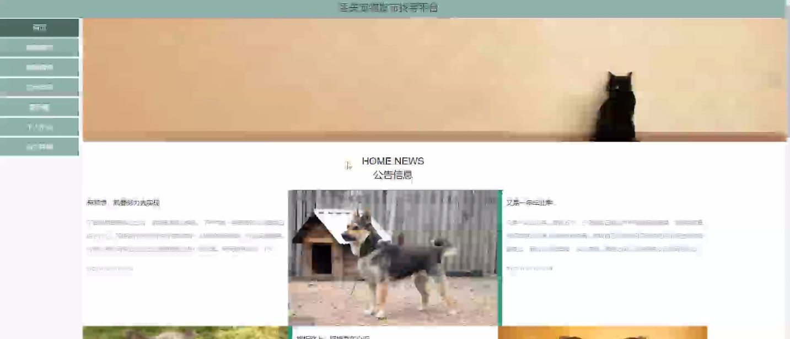

****本项目包含程序+源码+数据库+LW+调试部署环境，文末可获取一份本项目的java源码和数据库参考。****

## ******开题报告******

研究背景：
在现代社会，宠物已经成为很多人生活中不可或缺的一部分。然而，宠物丢失是一个常见的问题，给宠物主人带来了巨大的痛苦和焦虑。目前，虽然有一些宠物找寻平台存在，但仍然存在一些问题，如信息不及时、不准确等。因此，建立一个高效、准确的宠物找寻平台对于解决这个问题具有重要意义。

研究意义：
宠物找寻平台的建立可以帮助宠物主人更快速地找回丢失的宠物，减少他们的痛苦和损失。同时，宠物找寻平台也可以促进社会的互助和共享精神，让更多的人参与到宠物寻找的过程中，提高整个社区的凝聚力和关爱意识。

研究目的：
本研究旨在设计和开发一种高效、准确的宠物找寻平台，以满足宠物主人对于丢失宠物寻找的需求。通过提供用户友好的界面和强大的功能，帮助宠物主人快速发布丢失宠物的信息，并与其他用户进行互动和协作，提高宠物找回的成功率。

研究内容：
本研究将包括以下系统功能：用户管理、宠物分类、宠物报失、宠物招领、宠物认领等。具体而言，用户管理模块将负责用户注册、登录和个人信息管理；宠物分类模块将对不同种类的宠物进行分类和展示；宠物报失模块将提供宠物主人发布丢失宠物信息的功能；宠物招领模块将展示被捡到的宠物信息；宠物认领模块将帮助寻找到的宠物与原主人进行匹配和认领。

拟解决的主要问题： 通过建立一个完善的宠物找寻平台，我们将解决以下主要问题：

  1. 信息不及时和不准确：通过实时更新和验证机制，确保发布的宠物信息准确可靠。
  2. 缺乏有效的协作和互动机制：通过用户之间的互动和协作，提高宠物找回的成功率。
  3. 用户体验不友好：通过设计简洁、直观的界面，提供良好的用户体验，方便用户使用和操作。

研究方案和预期成果：
在研究方案上，我们将采用用户需求调研、系统设计和开发、功能测试等方法，逐步完善宠物找寻平台的各个模块。预期成果包括一个高效、准确的宠物找寻平台，能够帮助宠物主人快速找回丢失的宠物，并促进社区的互助和共享精神。

进度安排：

2022年9月至10月：需求分析和规划，明确系统功能和目标，制定项目计划。

2022年11月至2023年1月：系统设计和编码，完成详细的系统设计并开始编写代码。

2023年2月至3月：用户界面开发和数据库开发，开发用户友好的界面和设计数据库结构。

2023年4月至5月：功能测试、文档编写和上线部署，对系统进行全面的功能测试并编写用户手册。

2023年5月：维护和升级，定期对系统进行维护和升级，修复bug和添加新功能。

参考文献：

[1]邱小群,邓丽艳,陈海潮.基于B/S的信息管理系统设计和实现[J].信息与电脑(理论版),2022,(20):146-148.

[2]谢霜.基于Java技术的网络管理体系结构的应用[J].网络安全技术与应用,2022,(10):14-15.

[3]宋锦华.高职院校Java程序设计课程改革研究[J].科技视界,2022,(20):133-135.

[4]曹嵩彭,王鹏宇.浅析Java语言在软件开发中的应用[J].信息记录材料,2022,(03):114-116.

[5]朱澈,余俊达.武汉东湖学院.基于Java的软硬件信息管理系统V1.0[Z].项目立项编号.鉴定单位.鉴定日期:

****以上是本项目程序开发之前开题报告内容，最终成品以下面界面为准，大家可以酌情参考使用。要源码参考请在文末进行获取！！****

## ******本项目的界面展示******

