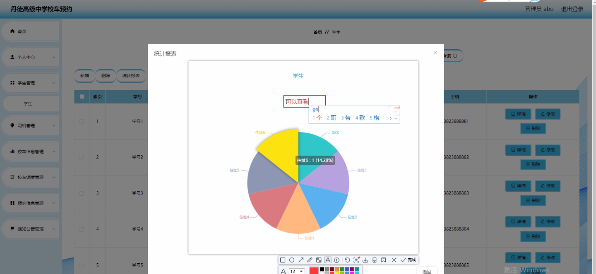
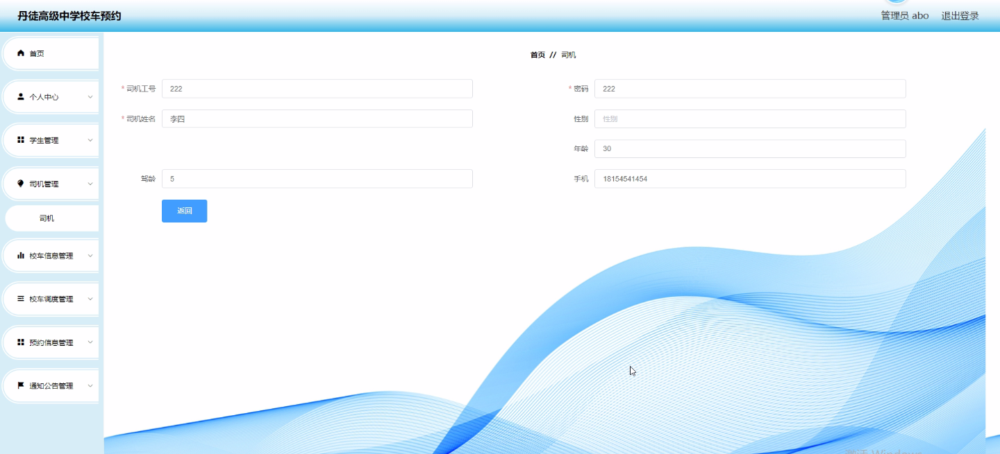
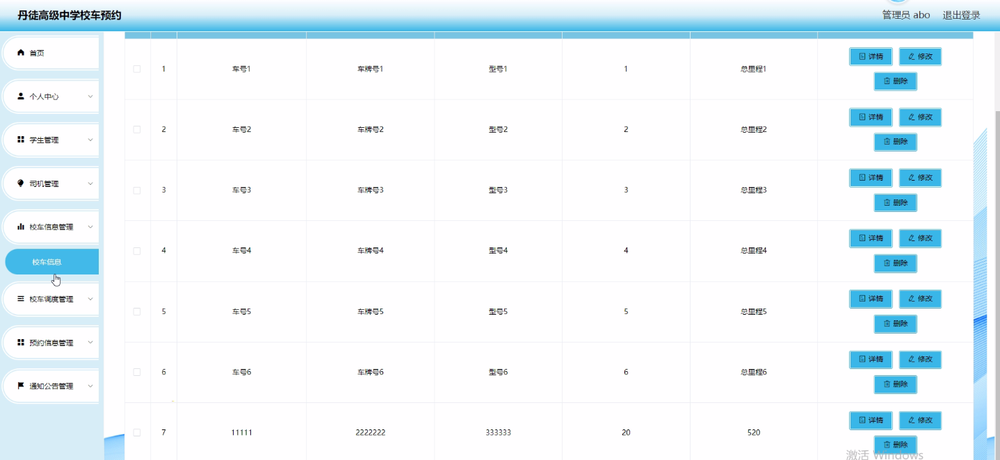
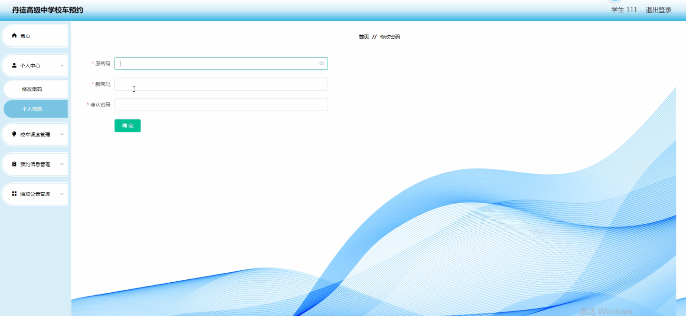
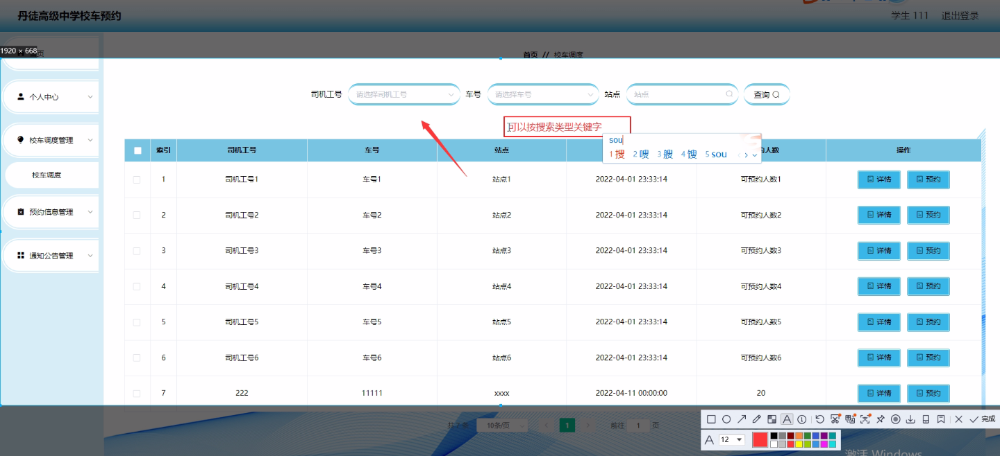
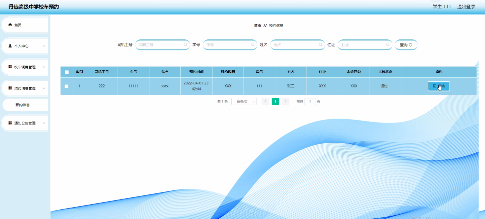

****本项目包含程序+源码+数据库+LW+调试部署环境，文末可获取一份本项目的java源码和数据库参考。****

## ******开题报告******

研究背景：
随着城市化进程的加快和人口流动的增加，校车作为学生通勤的重要方式，在现代教育中扮演着至关重要的角色。然而，目前存在着一些问题，如校车调度不合理、预约信息不便捷等，这些问题严重影响了学生的出行安全和校车资源的有效利用。因此，针对丹徒高级中学的校车预约系统进行研究和改进具有重要意义。

研究意义：
通过对丹徒高级中学校车预约系统的研究，可以提高校车调度的效率，减少学生等待时间，提升校车服务质量，保障学生的安全出行。同时，该研究还能够为其他学校或机构的校车管理提供借鉴和参考，推动校车预约系统的优化与发展。

研究目的：
本研究旨在分析丹徒高级中学校车预约系统的现状和问题，并设计一个更加科学、高效的校车预约系统，以提升校车服务的质量和效率。通过优化校车调度、完善预约信息管理等措施，实现学生、司机和校车信息的有效协调与管理，为学生提供更加便捷、安全的校车出行服务。

研究内容： 本研究将围绕学生、司机、校车信息、校车调度、预约信息和通知公告等系统功能展开研究。具体包括以下几个方面：

  1. 学生信息管理：建立学生信息数据库，包括学生基本信息、上下车地点等，实现学生信息的快速查询和更新。
  2. 司机信息管理：建立司机信息数据库，包括司机基本信息、驾驶证信息等，确保司机资质合法、可靠。
  3. 校车信息管理：建立校车信息数据库，包括校车基本信息、座位数、车辆状态等，实现对校车资源的有效管理和调度。
  4. 校车调度算法优化：通过分析学生上下车需求和校车资源分配情况，设计合理的校车调度算法，提高校车调度的效率和灵活性。
  5. 预约信息管理：建立预约信息数据库，包括学生预约信息、预约时间等，实现学生校车预约的便捷管理。
  6. 通知公告功能优化：完善通知公告功能，及时向学生和司机发布校车相关信息，提高信息传递的效率和准确性。

拟解决的主要问题：

  1. 校车调度不合理导致学生等待时间长的问题；
  2. 预约信息管理不便捷导致学生预约困难的问题；
  3. 学生、司机和校车信息协调不畅导致校车资源利用不充分的问题；
  4. 通知公告功能不完善导致信息传递不及时的问题。

研究方案：

  1. 调研：对丹徒高级中学现有校车预约系统进行调研，了解其功能、特点和存在的问题。
  2. 分析：针对调研结果，分析校车预约系统存在的问题，并确定改进的方向和目标。
  3. 设计：基于学生、司机、校车信息、校车调度、预约信息和通知公告等系统功能，设计一个更加科学、高效的校车预约系统。
  4. 实施：根据设计方案，进行系统开发和实施，包括数据库建设、算法优化、界面设计等。
  5. 测试：对新系统进行测试，验证其功能和性能是否满足需求。
  6. 评估：通过实际应用和用户反馈，评估新系统的效果和可行性。
  7. 改进：根据评估结果，对系统进行改进和优化，提高其稳定性和用户体验。

预期成果： 通过本研究，预期可以实现以下成果：

  1. 提高校车调度的效率，减少学生等待时间。
  2. 管理学生、司机和校车信息的协调与管理更加便捷。
  3. 学生校车预约更加方便快捷，提高预约成功率。
  4. 通知公告功能完善，及时向学生和司机发布校车相关信息。

进度安排：

2022年9月至10月：需求分析和规划，进行用户需求调研和分析，确定系统功能和目标。

2022年11月至2023年1月：系统设计和开发，完成系统架构设计和技术选型，并开始编写代码。

2023年2月至3月：测试和优化，进行单元测试和集成测试，修复问题并优化系统性能。

2023年4月至5月：文档编写和培训，编写用户手册和系统文档，并进行相关人员的培训。

2023年5月：上线部署和维护，将系统部署到生产环境中，并定期进行维护和升级。

参考文献：

[1]王振华.SpringBoot在教学效果评估系统中的应用[J].电子技术,2023,(05):67-69.

[2]王明泉.基于SpringBoot远程热部署的探索和应用[J].信息与电脑(理论版),2023,(07):1-4.

[3]王亚东,李晓霞,陈强强,剡美娜.基于SpringBoot的需求发布平台设计[J].信息与电脑(理论版),2023,(01):105-107.

[4]陈新府豪.基于SpringBoot和Vue框架的创新方法推理系统的设计与实现[D].导师：黄静.浙江理工大学,2022.

[5]霍福华,韩慧.基于SpringBoot微服务架构下前后端分离的MVVM模型[J].电子技术与软件工程,2022,(01):73-76.

[6]韩策,张娜,王松亭,张凯,何方,袁峰.SpringBoot OPC客户端设计与研究[J].电子世界,2021,(19):25-26.

****以上是本项目程序开发之前开题报告内容，最终成品以下面界面为准，大家可以酌情参考使用。要源码参考请在文末进行获取！！****

## ******本项目的界面展示******

