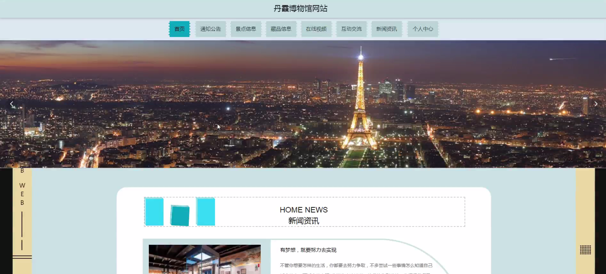

****本项目包含程序+源码+数据库+LW+调试部署环境，文末可获取一份本项目的java源码和数据库参考。****

## ******开题报告******

研究背景、意义和目的：

丹霞博物馆作为一个重要的文化遗产保护单位，承载着丰富的自然与人文资源。随着社会的发展和科技的进步，数字化技术在文化遗产领域的应用日益广泛。因此，建立一个完善的丹霞博物馆网站具有重要的研究背景、意义和目的。

首先，通过建立丹霞博物馆网站，可以实现对丹霞地貌的数字化展示和传播，将丹霞地貌的独特之美呈现给更多的人群。这对于提高公众对丹霞地貌的认知度和保护意识具有积极的推动作用。

其次，丹霞博物馆网站可以为游客提供便捷的服务和信息。通过用户功能，游客可以在线预约参观、购买门票等，提高游客的参观体验。同时，通知公告功能可以及时发布丹霞博物馆的最新消息和活动信息，吸引更多的游客前来参观。

最后，丹霞博物馆网站还可以提供丰富的藏品信息和在线视频功能，使游客能够深入了解丹霞地貌的历史、文化和科学价值。这对于促进文化交流、推动学术研究具有重要意义。

综上所述，建立一个功能完善的丹霞博物馆网站具有重要的研究背景、意义和目的，既可以提高公众对丹霞地貌的认知度和保护意识，又可以为游客提供便捷的服务和信息，同时还能促进文化交流和学术研究的发展。

* * *

研究内容：

根据系统功能的划分，丹霞博物馆网站的研究内容包括以下几个方面：

  1. 用户功能：设计并实现用户注册、登录、个人信息管理等功能，使用户能够方便地使用丹霞博物馆网站的各项服务。

  2. 通知公告功能：开发通知公告发布系统，实现管理员对丹霞博物馆最新消息、活动信息等的发布和管理，确保及时有效地向用户传达相关信息。

  3. 景点信息功能：收集整理丹霞地貌的相关资料和图片，设计并实现丹霞景点的介绍、导览等功能，为游客提供详尽的丹霞地貌参观指南。

  4. 藏品分类功能：对丹霞博物馆的藏品进行分类整理，设计并实现藏品分类浏览功能，使用户能够按照不同的主题或类别查看相关藏品信息。

  5. 藏品信息功能：详细记录丹霞博物馆的各项藏品信息，包括名称、年代、来源、文化背景等，为用户提供全面的藏品介绍和了解。

  6. 在线视频功能：收集丹霞地貌的相关视频资料，设计并实现在线视频播放功能，使用户能够通过网站观看与丹霞地貌相关的精彩视频。

通过以上系统功能的设计和实现，丹霞博物馆网站将成为一个集展示、交流、学习于一体的平台，为公众提供便捷的服务和丰富的文化体验。预计该研究将在数字化文化遗产领域取得重要的成果，促进丹霞地貌的保护和传承工作。

进度安排：

2022年9月至10月：开题报告编写和提交，完成开题报告的撰写并提交给指导教师进行审核。

2022年11月至2023年1月：系统设计和开发，根据开题报告的要求，进行系统设计和编码工作。

2023年2月至3月：论文撰写和初稿完成，开始撰写论文，并在这个阶段完成论文的初稿。

2023年4月至5月：论文修改和最终定稿，根据指导教师的意见对论文进行修改，并完成最终的定稿。

2023年5月：论文答辩和提交，参加论文答辩并根据答辩结果进行修改，最后将论文提交给学院或学校。

参考文献：

[1]喻佳,吴丹新.基于SpringBoot的Web快速开发框架[J].电脑编程技巧与维护,2021,(09):31-33.

[2]李鹏.基于SpringBoot快速开发平台的实现[J].电子技术与软件工程,2021,(12):36-37.

[3]叶开平,蔡维晟,陈家敏,邓斯妮.基于SpringBoot的综测可视化管理系统的研究与设计[J].电脑知识与技术,2021,(12):100-104.

[4]江健锋,徐振平.Springboot最小系统的设计与实现[J].电脑知识与技术,2021,(04):62-63.

[5]赵炯,司圣杰,周奇才,熊肖磊.通用信息获取系统设计与实现[J].起重运输机械,2020,(16):89-97.

[6]吴英宾.一种内外网数据交互系统的设计与实现[J].软件工程,2020,(08):25-27.

****以上是本项目程序开发之前开题报告内容，最终成品以下面界面为准，大家可以酌情参考使用。要源码参考请在文末进行获取！！****

## ******本项目的界面展示******

