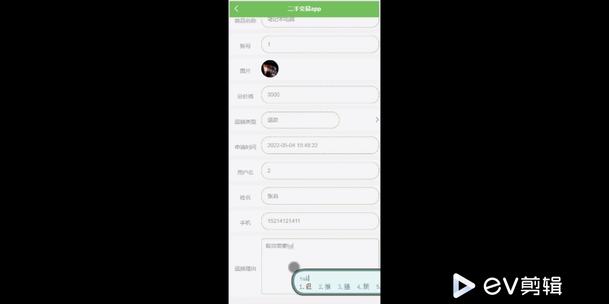

****本项目包含程序+源码+数据库+LW+调试部署环境，文末可获取一份本项目的java源码和数据库参考。****

## ******开题报告******

研究背景：
随着互联网的快速发展和智能手机的普及，二手交易平台成为了人们进行商品买卖的重要渠道之一。在二手交易平台上，用户可以通过发布自己的闲置物品来获得一定的经济收益，同时也可以购买到自己需要的二手商品。然而，当前的二手交易平台存在着一些问题，比如信息不对称、信任缺失、交易纠纷等，这些问题严重影响了用户的交易体验和平台的可持续发展。

研究意义：
针对当前二手交易平台存在的问题，进行深入的研究和探索具有重要的现实意义。首先，优化二手交易平台的功能和服务，可以提高用户的满意度和信任度，促进平台的长期发展。其次，通过解决二手交易中的核心问题，可以有效减少交易纠纷，提升交易的安全性和稳定性。最后，研究二手交易平台还可以为相关政府部门提供参考和借鉴，制定更加合理的监管政策，保护消费者的权益。

研究目的：
本研究旨在分析和解决当前二手交易平台存在的问题，提出一套完善的系统功能和服务模式，以改善用户的交易体验和促进平台的可持续发展。具体目标包括：优化用户、卖家、商品类型、二手商品、订单信息、确认收货、退换申请、在线交流、交流回复等系统功能，提高平台的安全性、便利性和效率性，减少交易纠纷，增加用户信任度，实现良性循环的二手交易生态。

研究内容： 本研究将围绕二手交易平台的系统功能展开研究，主要包括以下方面：

  1. 用户管理：设计合理的用户注册、登录、个人信息管理等功能，确保用户身份真实可靠，提供个性化的推荐服务。

  2. 卖家管理：建立卖家认证机制，对卖家进行资质审核和信用评估，提供可靠的卖家信息和商品质量保证。

  3. 商品分类与搜索：设计科学合理的商品分类体系，提供快速准确的商品搜索功能，方便用户找到所需商品。

  4. 交易流程管理：优化订单信息管理、确认收货和退换申请等流程，确保交易过程的顺利进行，减少交易纠纷的发生。

  5. 在线交流与反馈：建立用户之间的在线交流平台，提供交流回复功能，方便买家和卖家进行沟通和解决问题。

拟解决的主要问题：
本研究旨在解决当前二手交易平台存在的信息不对称、信任缺失、交易纠纷等核心问题。通过优化系统功能和服务模式，提高用户满意度和信任度，减少交易纠纷的发生，实现二手交易平台的良性循环。

研究方案和预期成果：
本研究将采用综合分析和实证研究的方法，结合大数据和人工智能技术，对二手交易平台的系统功能和服务进行优化和改进。预期成果包括：设计出一套完善的系统功能和服务模式，提高平台的安全性、便利性和效率性；减少交易纠纷，增加用户信任度；促进平台的可持续发展，实现良性循环的二手交易生态。

进度安排：

2022年9月至10月：开题报告编写和提交，完成开题报告的撰写并提交给指导教师进行审核。

2022年11月至2023年1月：系统设计和开发，根据开题报告的要求，进行系统设计和编码工作。

2023年2月至3月：论文撰写和初稿完成，开始撰写论文，并在这个阶段完成论文的初稿。

2023年4月至5月：论文修改和最终定稿，根据指导教师的意见对论文进行修改，并完成最终的定稿。

2023年5月：论文答辩和提交，参加论文答辩并根据答辩结果进行修改，最后将论文提交给学院或学校。

参考文献：

[1]喻佳,吴丹新.基于SpringBoot的Web快速开发框架[J].电脑编程技巧与维护,2021,(09):31-33.

[2]李鹏.基于SpringBoot快速开发平台的实现[J].电子技术与软件工程,2021,(12):36-37.

[3]叶开平,蔡维晟,陈家敏,邓斯妮.基于SpringBoot的综测可视化管理系统的研究与设计[J].电脑知识与技术,2021,(12):100-104.

[4]江健锋,徐振平.Springboot最小系统的设计与实现[J].电脑知识与技术,2021,(04):62-63.

[5]赵炯,司圣杰,周奇才,熊肖磊.通用信息获取系统设计与实现[J].起重运输机械,2020,(16):89-97.

[6]吴英宾.一种内外网数据交互系统的设计与实现[J].软件工程,2020,(08):25-27.

****以上是本项目程序开发之前开题报告内容，最终成品以下面界面为准，大家可以酌情参考使用。要源码参考请在文末进行获取！！****

## ******本项目的界面展示******

