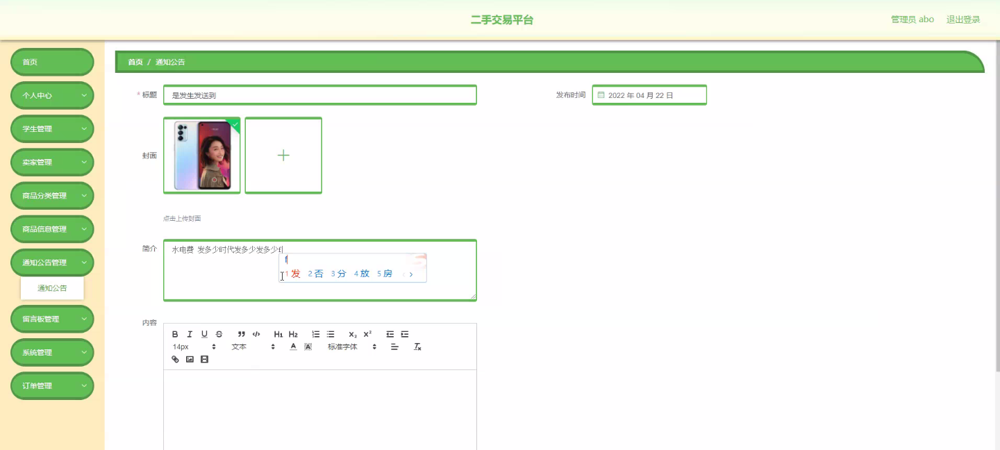

****本项目包含程序+源码+数据库+LW+调试部署环境，文末可获取一份本项目的java源码和数据库参考。****

## ******开题报告******

研究背景：
随着互联网的快速发展和普及，二手交易平台作为一种新型的电子商务模式，逐渐成为人们购买和出售二手商品的重要渠道。传统的线下二手交易存在信息不对称、交易风险高等问题，而二手交易平台通过提供便捷的交易环境和保护消费者权益的机制，能够有效解决这些问题。因此，对于二手交易平台的研究具有重要的现实意义。

研究意义：
二手交易平台的兴起和发展，为人们提供了一个更加方便、快捷、安全的二手交易方式。通过研究二手交易平台，可以深入了解其运行机制、市场规律以及用户行为特点，进而优化平台设计，提升用户体验，促进二手交易市场的健康发展。此外，研究二手交易平台还可以为相关政策的制定和监管提供参考依据，推动电子商务领域的发展。

研究目的：
本研究旨在深入探讨二手交易平台的运行机制和用户行为特点，分析平台在信息发布、交易安全、用户评价等方面存在的问题，并提出相应的解决方案，以期为二手交易平台的发展和管理提供科学依据。

研究内容： 本研究将围绕二手交易平台的学生、卖家、商品分类、商品信息、通知公告等系统功能展开研究。具体内容包括但不限于以下几个方面：

  1. 学生：研究学生在二手交易平台中的角色定位、需求特点以及参与行为，分析学生对于平台功能和服务的满意度和使用体验，探讨如何提高学生参与二手交易的积极性和交易效率。

  2. 卖家：研究卖家在二手交易平台中的行为模式和策略，分析卖家对于商品定价、描述和交易方式的选择，探讨如何提高卖家的信誉度和交易成功率，促进平台上的交易活动。

  3. 商品分类：研究二手交易平台的商品分类机制，分析当前分类方式的优缺点，探讨如何设计更加合理、有效的商品分类体系，提高用户搜索和浏览商品的效率和准确性。

  4. 商品信息：研究二手交易平台的商品信息发布机制，分析信息真实性、完整性和准确性的问题，探讨如何建立有效的信息审核和监管机制，保障用户的权益和交易安全。

  5. 通知公告：研究二手交易平台的通知公告功能，分析其在信息传递、用户互动等方面的作用，探讨如何优化通知公告的内容和形式，提高用户对于平台政策和活动的关注度和参与度。

拟解决的主要问题：
本研究将重点解决二手交易平台中存在的信息不对称、交易风险高、用户体验差等问题。通过深入分析平台运行机制和用户行为特点，提出相应的改进和优化方案，以期提升平台的信誉度、用户满意度和交易效率，促进二手交易市场的健康发展。

研究方案和预期成果：
本研究将采用综合性的研究方法，包括文献调研、实地观察、问卷调查、数据分析等，以获取全面、准确的研究结果。预期成果包括对于二手交易平台运行机制和用户行为特点的深入认识，针对性的改进和优化方案，以及相关政策和管理建议。通过本研究的成果，可以为二手交易平台的发展和管理提供科学依据，促进电子商务领域的健康发展。

进度安排：

2022年9月至10月：需求分析和规划，明确系统功能和目标，制定项目计划。

2022年11月至2023年1月：系统设计和编码，完成详细的系统设计并开始编写代码。

2023年2月至3月：用户界面开发和数据库开发，开发用户友好的界面和设计数据库结构。

2023年4月至5月：功能测试、文档编写和上线部署，对系统进行全面的功能测试并编写用户手册。

2023年5月：维护和升级，定期对系统进行维护和升级，修复bug和添加新功能。

参考文献：

[1]邱小群,邓丽艳,陈海潮.基于B/S的信息管理系统设计和实现[J].信息与电脑(理论版),2022,(20):146-148.

[2]谢霜.基于Java技术的网络管理体系结构的应用[J].网络安全技术与应用,2022,(10):14-15.

[3]宋锦华.高职院校Java程序设计课程改革研究[J].科技视界,2022,(20):133-135.

[4]曹嵩彭,王鹏宇.浅析Java语言在软件开发中的应用[J].信息记录材料,2022,(03):114-116.

[5]朱澈,余俊达.武汉东湖学院.基于Java的软硬件信息管理系统V1.0[Z].项目立项编号.鉴定单位.鉴定日期:

****以上是本项目程序开发之前开题报告内容，最终成品以下面界面为准，大家可以酌情参考使用。要源码参考请在文末进行获取！！****

## ******本项目的界面展示******

