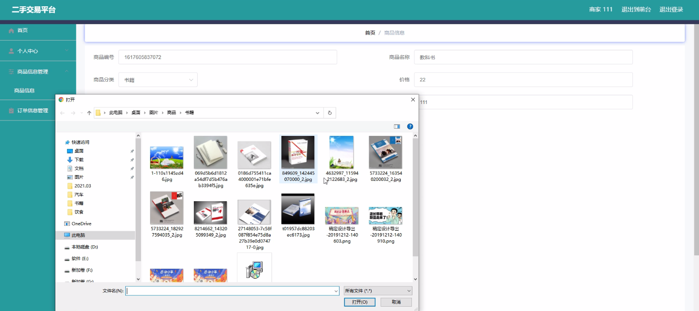

****本项目包含程序+源码+数据库+LW+调试部署环境，文末可获取一份本项目的java源码和数据库参考。****

## ******开题报告******

研究背景：
随着互联网的快速发展和普及，二手交易平台作为一种新型的电子商务模式，逐渐成为人们进行个人物品买卖的主要方式之一。在传统的线下交易中，买卖双方需要面对诸多不便和风险，如信息不对称、信任问题、时间成本等。而二手交易平台的出现，为买卖双方提供了一个便捷、高效、安全的交易环境，极大地促进了二手商品的流通和再利用。

研究意义：
二手交易平台的发展对于个人和社会都具有重要意义。首先，对于个人来说，二手交易平台提供了一个更广阔的市场，可以将闲置物品变现，获取经济收益。同时，通过购买二手商品，个人也能以较低的价格获得所需物品，提高消费效益。其次，对于社会来说，二手交易平台有助于减少资源浪费，促进可持续发展。通过二手交易，许多原本可能被丢弃的物品得到了再利用，减少了对自然资源的消耗，降低了环境污染。

研究目的：
本研究旨在探索二手交易平台的运行机制和用户行为，分析其对个人和社会的影响，并提出相应的改进策略。通过深入研究二手交易平台的各项功能和特点，我们希望能够揭示其中存在的问题和挑战，为二手交易平台的进一步发展提供参考和指导。

研究内容：
本研究将重点关注二手交易平台的以下系统功能：用户管理、商家管理、商品分类、商品信息和订单信息。具体而言，我们将分析用户在平台上的行为习惯和偏好，商家的经营策略和销售模式，商品分类的合理性和完善程度，以及订单信息的处理流程和安全性等方面的问题。通过对这些系统功能的研究，我们将全面了解二手交易平台的运作机制，找出其中存在的主要问题，并提出相应的解决方案。

拟解决的主要问题：
在研究过程中，我们将重点解决以下几个问题：一是信息不对称问题，即买卖双方在交易过程中由于信息不完全或不准确而产生的风险；二是信任问题，即买卖双方在交易过程中缺乏对对方的信任，导致交易无法顺利进行；三是平台安全问题，即用户个人信息和交易数据的安全性保障；四是交易纠纷处理问题，即当交易出现问题时，如何及时有效地解决纠纷，保护买卖双方的权益。

研究方案和预期成果：
为了解决上述问题，我们将采用多种研究方法，包括实地调研、问卷调查、数据分析等。通过对二手交易平台的用户和商家进行深入访谈和观察，我们将获取大量的实证数据，并结合相关理论进行分析和总结。最终，我们希望能够提出一套完善的二手交易平台运营策略和管理机制，以提高用户体验和交易效率，促进二手商品市场的健康发展。

进度安排：

2022年9月至10月：需求分析和规划，进行用户需求调研和分析，确定系统功能和目标。

2022年11月至2023年1月：系统设计和开发，完成系统架构设计和技术选型，并开始编写代码。

2023年2月至3月：测试和优化，进行单元测试和集成测试，修复问题并优化系统性能。

2023年4月至5月：文档编写和培训，编写用户手册和系统文档，并进行相关人员的培训。

2023年5月：上线部署和维护，将系统部署到生产环境中，并定期进行维护和升级。

参考文献：

[1]王振华.SpringBoot在教学效果评估系统中的应用[J].电子技术,2023,(05):67-69.

[2]王明泉.基于SpringBoot远程热部署的探索和应用[J].信息与电脑(理论版),2023,(07):1-4.

[3]王亚东,李晓霞,陈强强,剡美娜.基于SpringBoot的需求发布平台设计[J].信息与电脑(理论版),2023,(01):105-107.

[4]陈新府豪.基于SpringBoot和Vue框架的创新方法推理系统的设计与实现[D].导师：黄静.浙江理工大学,2022.

[5]霍福华,韩慧.基于SpringBoot微服务架构下前后端分离的MVVM模型[J].电子技术与软件工程,2022,(01):73-76.

[6]韩策,张娜,王松亭,张凯,何方,袁峰.SpringBoot OPC客户端设计与研究[J].电子世界,2021,(19):25-26.

****以上是本项目程序开发之前开题报告内容，最终成品以下面界面为准，大家可以酌情参考使用。要源码参考请在文末进行获取！！****

## ******本项目的界面展示******

