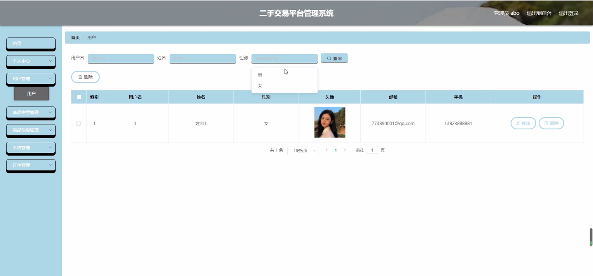
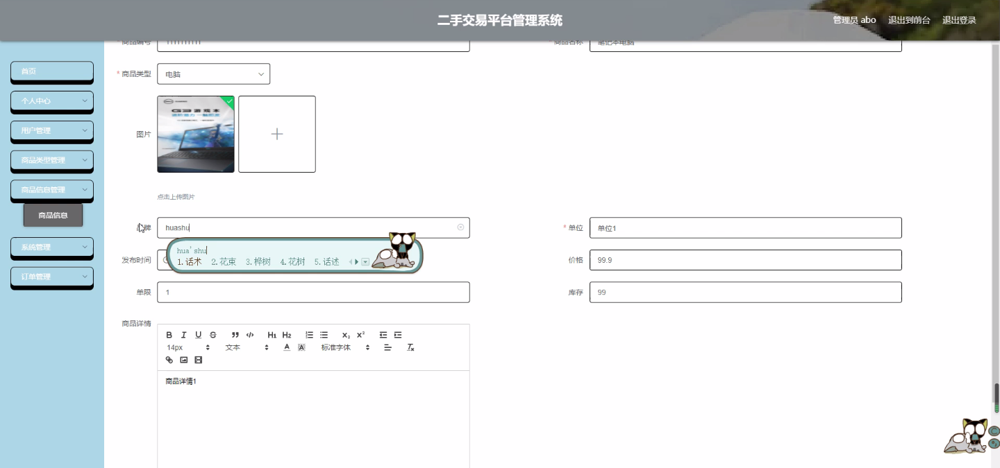
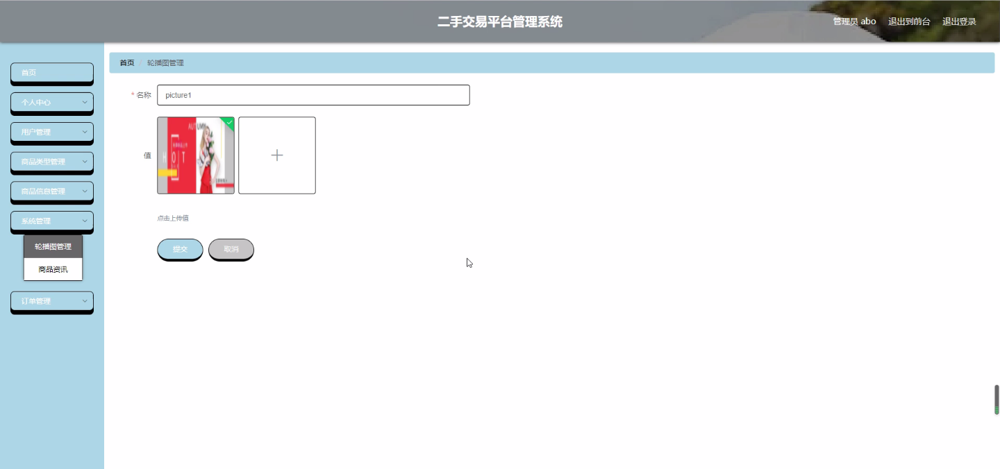
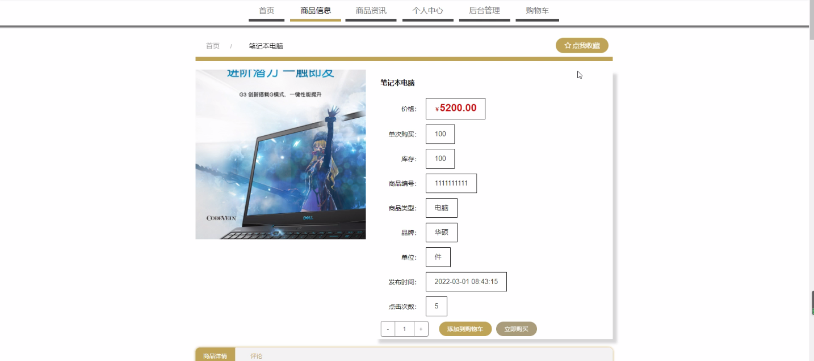
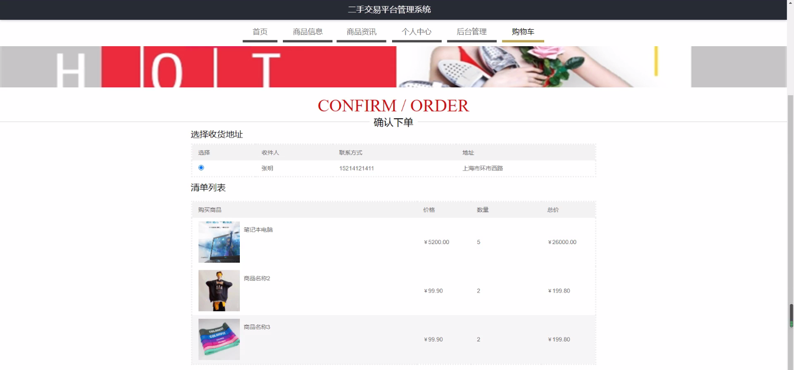
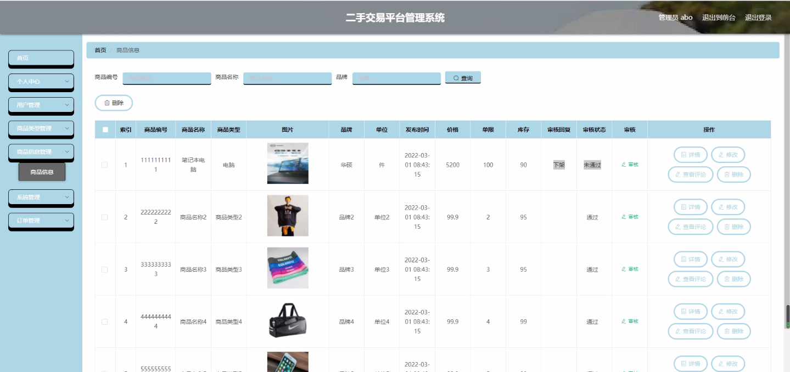

****本项目包含程序+源码+数据库+LW+调试部署环境，文末可获取一份本项目的java源码和数据库参考。****

## ******开题报告******

研究背景：
随着互联网的快速发展和智能手机的普及，二手交易市场逐渐兴起并迅速扩大。人们越来越倾向于在二手交易平台上购买和出售物品，这种模式不仅节约了资源，还提供了更多选择和便利。然而，由于二手交易平台的规模庞大和用户众多，管理和维护成为一个重要的问题。因此，开发一种高效的二手交易平台管理系统具有重要意义。

研究意义：
二手交易平台管理系统的开发可以提高平台的运营效率，增强用户体验，保证交易的安全性和可靠性。通过合理的管理和监控，可以减少虚假信息、欺诈行为和交易纠纷的发生，提升用户对平台的信任度，促进二手交易市场的健康发展。此外，该系统还可以为平台提供数据分析和决策支持，帮助平台制定更科学的运营策略，提高盈利能力。

研究目的：
本研究旨在设计和开发一种功能完善、操作简便的二手交易平台管理系统，以解决目前二手交易平台管理面临的诸多问题。通过引入先进的技术和方法，提高平台的管理效率和用户满意度，促进二手交易市场的良性发展。

研究内容： 本研究的主要内容包括以下几个方面：

  1. 用户管理：设计并实现用户注册、登录、信息修改等功能，确保用户身份的真实性和安全性。同时，为用户提供个人中心、消息通知等功能，提升用户体验。

  2. 商品类型管理：建立商品分类体系，使用户能够快速准确地找到自己需要的商品。同时，对商品类型进行管理和维护，保证分类的合理性和完整性。

  3. 商品信息管理：设计并实现商品发布、编辑、删除等功能，确保商品信息的真实性和有效性。同时，为用户提供商品搜索、筛选等功能，提高交易效率。

  4. 交易管理：建立交易流程，包括订单生成、支付、物流跟踪等环节的管理。同时，加强对交易过程的监控和评估，及时发现和解决潜在的问题。

  5. 安全管理：加强对用户信息和交易数据的保护，防止数据泄露和黑客攻击。同时，建立投诉处理机制，及时处理用户反馈和投诉，维护平台的声誉和形象。

拟解决的主要问题： 本研究旨在解决二手交易平台管理中存在的以下主要问题：

  1. 用户身份真实性难以验证：开发一种有效的用户认证机制，确保用户信息的真实性和安全性。

  2. 虚假信息和欺诈行为频发：建立严格的信息审核机制，减少虚假信息的发布，并采取措施打击欺诈行为。

  3. 交易纠纷处理困难：设计合理的投诉处理机制，快速、公正地解决交易纠纷，保护用户权益。

  4. 数据安全和隐私保护：加强对用户数据的保护，防止数据泄露和滥用，提高用户对平台的信任度。

  5. 平台运营效率低下：引入先进的技术和方法，提高平台的管理效率和用户体验，促进平台的良性发展。

研究方案和预期成果：
本研究将采用系统开发的方法，结合用户需求和市场情况，设计并开发一种功能完善、操作简便的二手交易平台管理系统。通过实际测试和优化，预期达到以下成果：

  1. 实现用户身份认证和信息审核的自动化，提高用户注册和信息发布的效率。

  2. 建立完善的交易管理流程，减少交易纠纷的发生，提升交易安全性和可靠性。

  3. 引入数据分析和决策支持功能，帮助平台制定更科学的运营策略，提高盈利能力。

  4. 提供良好的用户体验，包括个人中心、消息通知、商品搜索等功能，增强用户对平台的满意度。

  5. 加强数据安全和隐私保护措施，确保用户数据的安全性和机密性。

进度安排：

2022年9月至10月：开题报告编写和提交，完成开题报告的撰写并提交给指导教师进行审核。

2022年11月至2023年1月：系统设计和开发，根据开题报告的要求，进行系统设计和编码工作。

2023年2月至3月：论文撰写和初稿完成，开始撰写论文，并在这个阶段完成论文的初稿。

2023年4月至5月：论文修改和最终定稿，根据指导教师的意见对论文进行修改，并完成最终的定稿。

2023年5月：论文答辩和提交，参加论文答辩并根据答辩结果进行修改，最后将论文提交给学院或学校。

参考文献：

[1]喻佳,吴丹新.基于SpringBoot的Web快速开发框架[J].电脑编程技巧与维护,2021,(09):31-33.

[2]李鹏.基于SpringBoot快速开发平台的实现[J].电子技术与软件工程,2021,(12):36-37.

[3]叶开平,蔡维晟,陈家敏,邓斯妮.基于SpringBoot的综测可视化管理系统的研究与设计[J].电脑知识与技术,2021,(12):100-104.

[4]江健锋,徐振平.Springboot最小系统的设计与实现[J].电脑知识与技术,2021,(04):62-63.

[5]赵炯,司圣杰,周奇才,熊肖磊.通用信息获取系统设计与实现[J].起重运输机械,2020,(16):89-97.

[6]吴英宾.一种内外网数据交互系统的设计与实现[J].软件工程,2020,(08):25-27.

****以上是本项目程序开发之前开题报告内容，最终成品以下面界面为准，大家可以酌情参考使用。要源码参考请在文末进行获取！！****

## ******本项目的界面展示******

