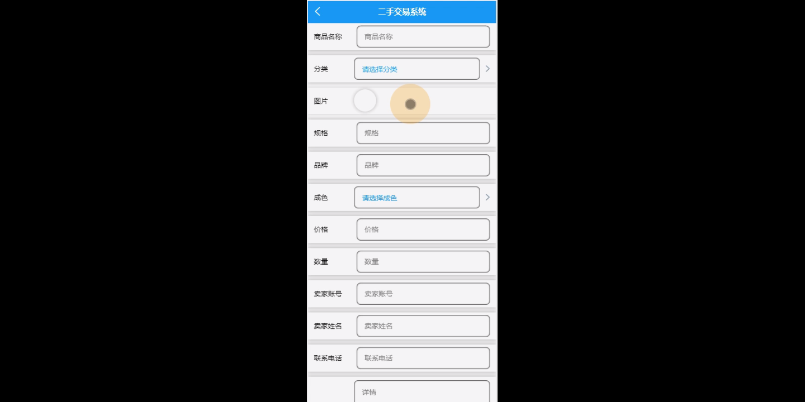
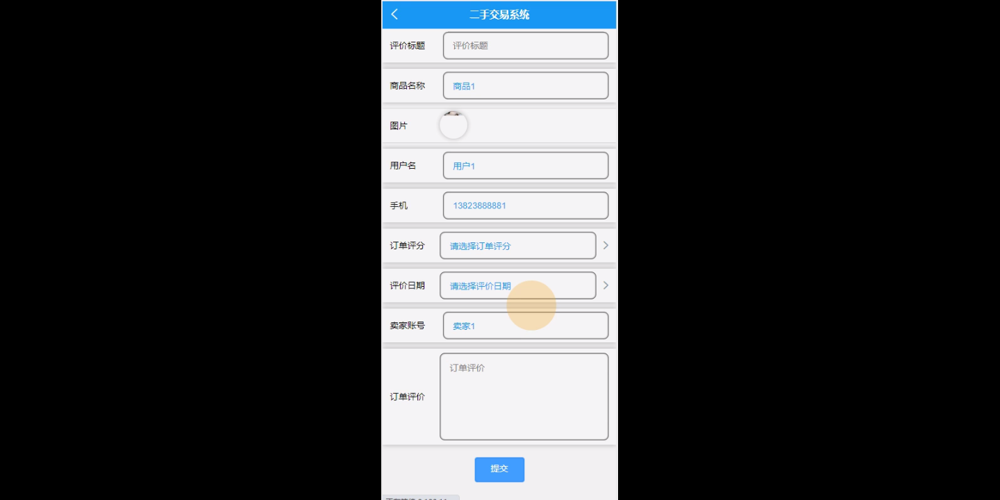
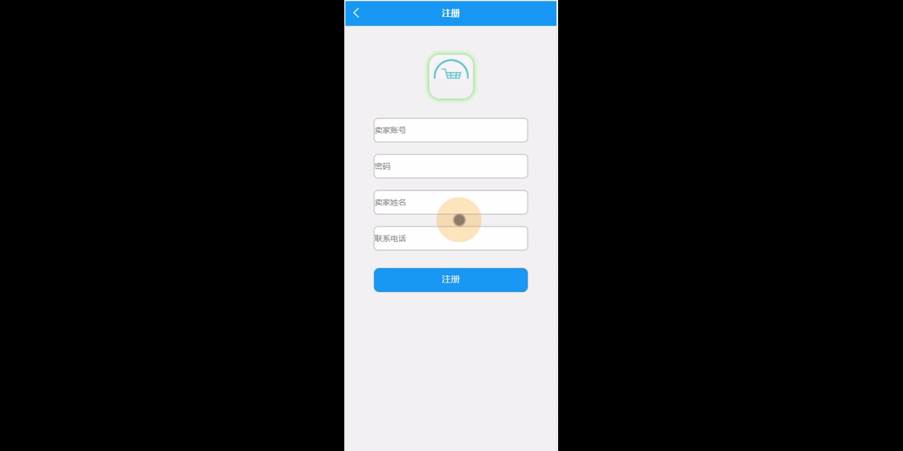
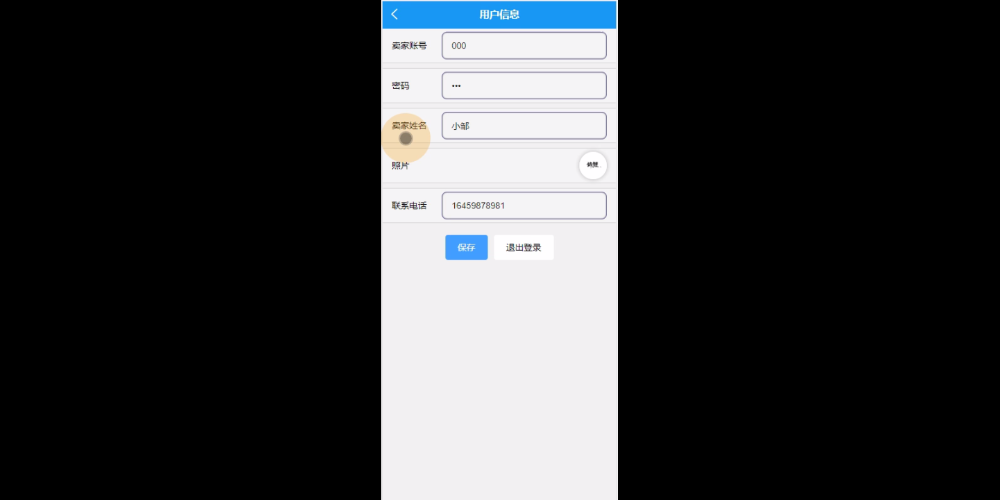

****本项目包含程序+源码+数据库+LW+调试部署环境，文末可获取一份本项目的java源码和数据库参考。****

## ******开题报告******

研究背景：
随着互联网的快速发展和智能手机的普及，二手交易市场逐渐兴起并蓬勃发展。二手交易平台为用户提供了一个便捷的购买和出售二手商品的渠道，满足了人们对于节约成本和资源利用的需求。然而，当前存在的二手交易系统还存在一些问题，如信息不透明、交易风险高等，因此需要进一步研究和改进。

研究意义：
二手交易系统的研究具有重要的现实意义。首先，通过构建一个高效、安全、可信赖的二手交易系统，可以促进二手商品的流通，提高资源利用效率，减少浪费。其次，二手交易系统的研究可以推动电子商务领域的发展，促进经济的增长和就业机会的创造。最后，通过解决二手交易系统中存在的问题，可以提升用户体验，增强用户对于二手交易平台的信任度，进一步推动二手交易市场的发展。

研究目的：
本研究旨在设计和开发一个完善的二手交易系统，以解决当前存在的问题，并提升用户体验。具体目标包括：提高交易信息的透明度，降低交易风险；优化系统功能，提供更便捷的交易流程；增强用户对于平台的信任感，促进用户参与和交易活动的增长。

研究内容： 本研究将围绕以下系统功能展开研究：

  1. 商品分类：设计合理的商品分类体系，使用户能够快速准确地找到所需商品。

  2. 卖家：建立卖家认证机制，提高卖家的可信度，并加强对卖家的管理和监督。

  3. 用户：优化用户注册、登录和个人信息管理功能，提供个性化的推荐服务，增强用户粘性。

  4. 商品信息：完善商品信息的录入和展示功能，提供详尽准确的商品描述和图片，增加用户对商品的了解。

  5. 订单信息：优化订单生成和管理功能，确保订单信息的准确性和及时性。

  6. 订单配送：建立高效的物流配送系统，提供多种配送方式，确保商品能够安全快速地送达买家手中。

  7. 收货评价：建立用户评价系统，鼓励用户对交易进行评价，提供参考信息，增加交易的可信度。

拟解决的主要问题：
本研究拟解决的主要问题包括：信息不透明、交易风险高、用户体验差等。通过优化系统功能和流程，提供更准确、安全、便捷的二手交易服务，解决用户在二手交易过程中遇到的问题。

研究方案和预期成果：
本研究将采用综合研究方法，包括需求分析、系统设计、系统开发和实验评估等环节。预期成果包括一个完善的二手交易系统原型，并通过实验评估验证其功能的有效性和可行性。同时，预计通过优化系统功能和流程，能够提升用户体验，增加用户参与和交易活动的数量，推动二手交易市场的发展。

进度安排：

2022年9月至10月：需求分析和规划，进行用户需求调研和分析，确定系统功能和目标。

2022年11月至2023年1月：系统设计和开发，完成系统架构设计和技术选型，并开始编写代码。

2023年2月至3月：测试和优化，进行单元测试和集成测试，修复问题并优化系统性能。

2023年4月至5月：文档编写和培训，编写用户手册和系统文档，并进行相关人员的培训。

2023年5月：上线部署和维护，将系统部署到生产环境中，并定期进行维护和升级。

参考文献：

[1]王振华.SpringBoot在教学效果评估系统中的应用[J].电子技术,2023,(05):67-69.

[2]王明泉.基于SpringBoot远程热部署的探索和应用[J].信息与电脑(理论版),2023,(07):1-4.

[3]王亚东,李晓霞,陈强强,剡美娜.基于SpringBoot的需求发布平台设计[J].信息与电脑(理论版),2023,(01):105-107.

[4]陈新府豪.基于SpringBoot和Vue框架的创新方法推理系统的设计与实现[D].导师：黄静.浙江理工大学,2022.

[5]霍福华,韩慧.基于SpringBoot微服务架构下前后端分离的MVVM模型[J].电子技术与软件工程,2022,(01):73-76.

[6]韩策,张娜,王松亭,张凯,何方,袁峰.SpringBoot OPC客户端设计与研究[J].电子世界,2021,(19):25-26.

****以上是本项目程序开发之前开题报告内容，最终成品以下面界面为准，大家可以酌情参考使用。要源码参考请在文末进行获取！！****

## ******本项目的界面展示******

