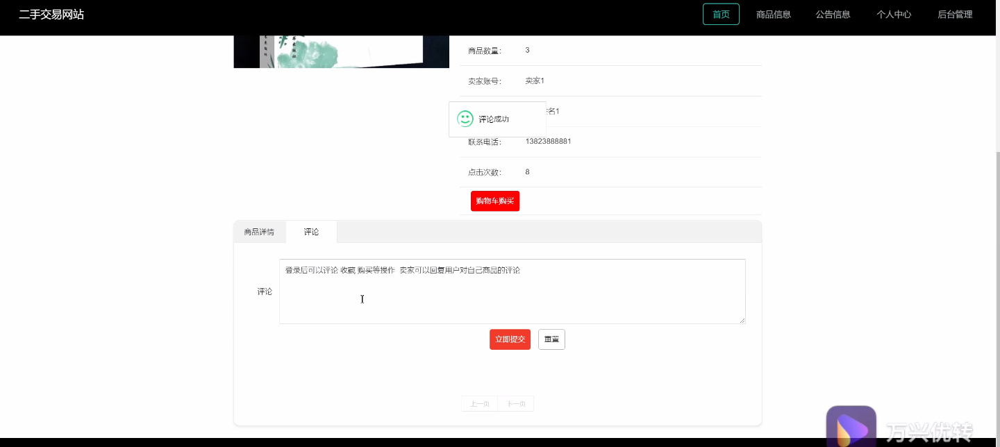
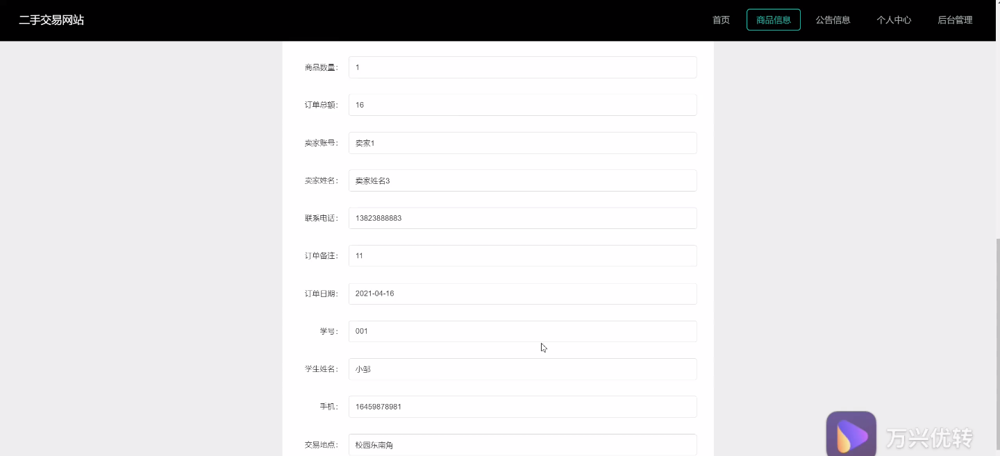
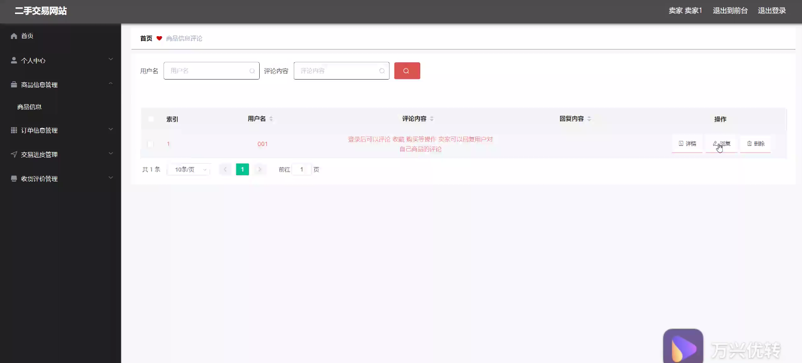
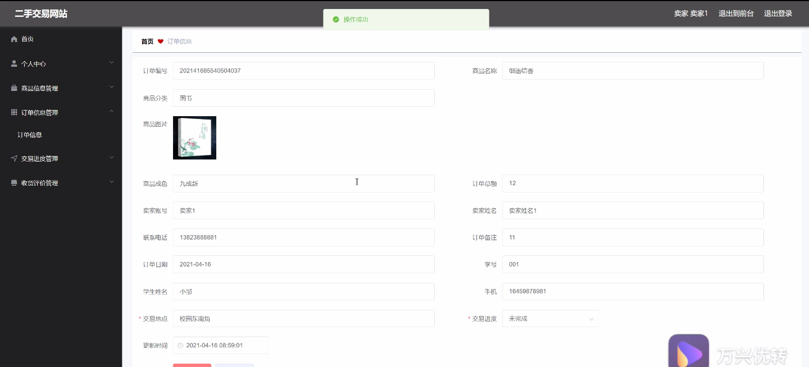
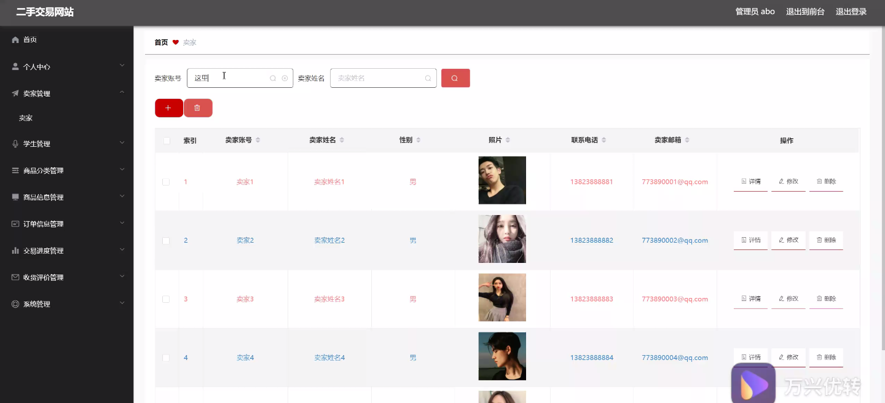
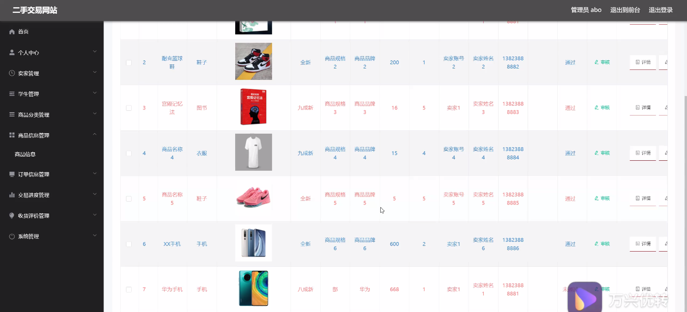
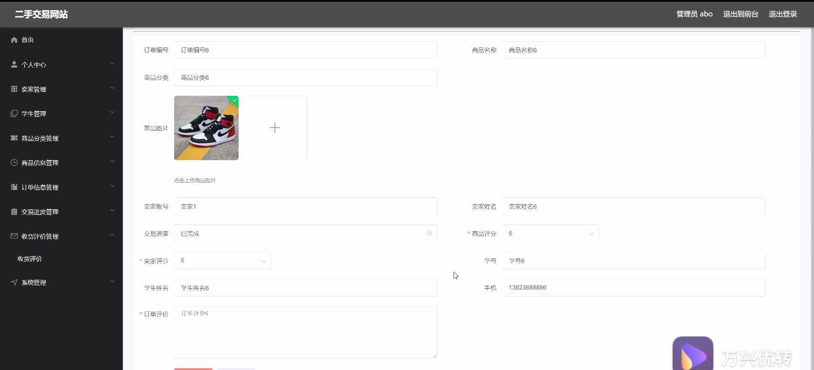

****本项目包含程序+源码+数据库+LW+调试部署环境，文末可获取一份本项目的java源码和数据库参考。****

## ******开题报告******

研究背景：
随着互联网的快速发展，二手交易市场逐渐成为人们购买和出售物品的重要渠道之一。传统的线下二手交易存在信息不对称、安全风险高等问题，而二手交易网站的兴起为解决这些问题提供了新的可能性。二手交易网站通过提供一个在线平台，使买家和卖家能够方便地进行交流和交易，从而改善了传统二手交易的不便之处。

研究意义：
二手交易网站的兴起对于社会经济发展具有重要意义。首先，它促进了资源的再利用，减少了浪费，有助于环境保护和可持续发展。其次，二手交易网站提供了一个更加便捷和安全的交易方式，为消费者提供了更多选择，并且可以帮助他们获得更好的价格。此外，二手交易网站还可以促进经济活动，推动市场的繁荣。

研究目的：
本研究旨在探索二手交易网站的发展和应用，分析其对社会经济的影响，并提出相应的改进措施。通过深入研究二手交易网站的功能和特点，我们可以更好地理解其在市场中的作用，并为相关政策制定提供参考。此外，本研究还旨在提高二手交易网站的用户体验，增强其安全性和可信度，促进二手交易市场的健康发展。

研究内容： 本研究将重点关注二手交易网站的以下系统功能：卖家、学生、商品分类、商品信息、订单信息、交易进度和收货评价。具体研究内容包括但不限于以下几个方面：

  1. 卖家功能：分析卖家在二手交易网站上的行为和需求，探索如何提供更好的卖家服务，如增加商品发布渠道、优化商品管理等。

  2. 学生功能：针对大学生群体的特点和需求，研究如何提供更适合学生的二手交易平台，如推出校园专区、提供学生认证等。

  3. 商品分类和商品信息：研究如何设计更合理的商品分类体系，提高商品搜索和浏览的效率；同时，探索如何提供准确、详尽的商品信息，以增加买家的购买决策依据。

  4. 订单信息和交易进度：研究如何提供清晰的订单信息和交易进度跟踪功能，方便买家和卖家了解交易状态，减少交易纠纷的发生。

  5. 收货评价：分析收货评价对于二手交易网站的重要性，研究如何设计合理的评价体系，提高用户对于评价的参考价值。

拟解决的主要问题：
在研究过程中，我们将重点解决以下问题：如何提高二手交易网站的用户体验和安全性；如何增加买家和卖家的信任度；如何提高商品搜索和浏览的效率；如何减少交易纠纷的发生等。

研究方案和预期成果：
本研究将采用综合性的研究方法，包括文献调研、案例分析、实地调查等。通过对二手交易网站的功能和特点进行深入研究，我们将提出相应的改进方案，并进行实证研究和评估。预期成果包括但不限于：提出针对二手交易网站的优化建议，改善用户体验和安全性；为相关政策制定提供参考；推动二手交易市场的健康发展等。

进度安排：

2022年9月至10月：需求分析和规划，明确系统功能和目标，制定项目计划。

2022年11月至2023年1月：系统设计和编码，完成详细的系统设计并开始编写代码。

2023年2月至3月：用户界面开发和数据库开发，开发用户友好的界面和设计数据库结构。

2023年4月至5月：功能测试、文档编写和上线部署，对系统进行全面的功能测试并编写用户手册。

2023年5月：维护和升级，定期对系统进行维护和升级，修复bug和添加新功能。

参考文献：

[1]邱小群,邓丽艳,陈海潮.基于B/S的信息管理系统设计和实现[J].信息与电脑(理论版),2022,(20):146-148.

[2]谢霜.基于Java技术的网络管理体系结构的应用[J].网络安全技术与应用,2022,(10):14-15.

[3]宋锦华.高职院校Java程序设计课程改革研究[J].科技视界,2022,(20):133-135.

[4]曹嵩彭,王鹏宇.浅析Java语言在软件开发中的应用[J].信息记录材料,2022,(03):114-116.

[5]朱澈,余俊达.武汉东湖学院.基于Java的软硬件信息管理系统V1.0[Z].项目立项编号.鉴定单位.鉴定日期:

****以上是本项目程序开发之前开题报告内容，最终成品以下面界面为准，大家可以酌情参考使用。要源码参考请在文末进行获取！！****

## ******本项目的界面展示******

