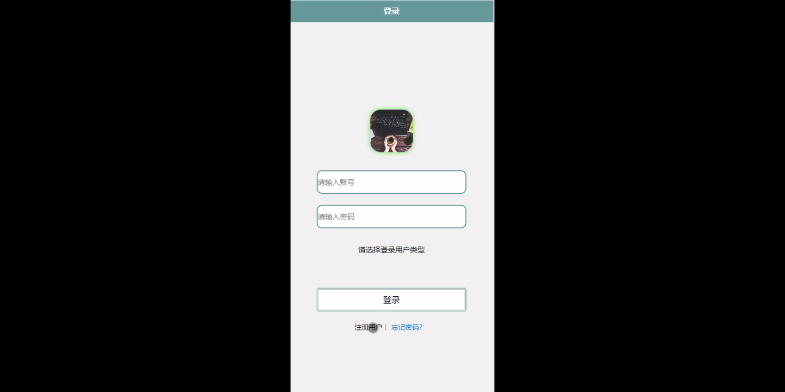
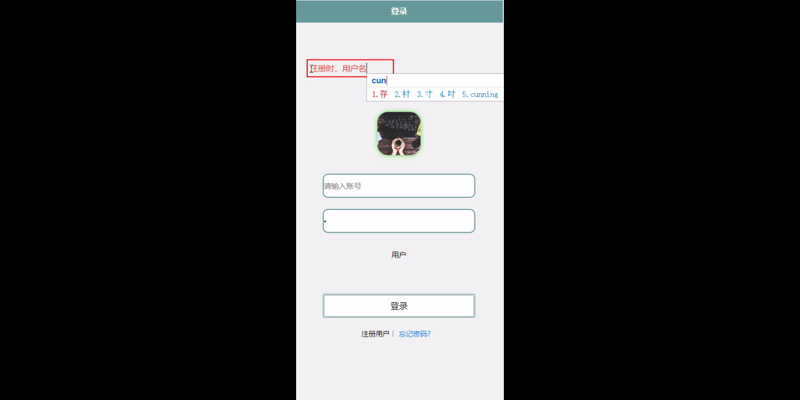
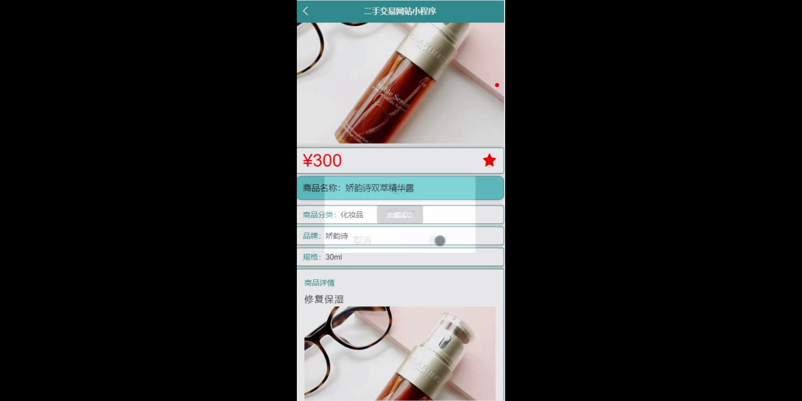
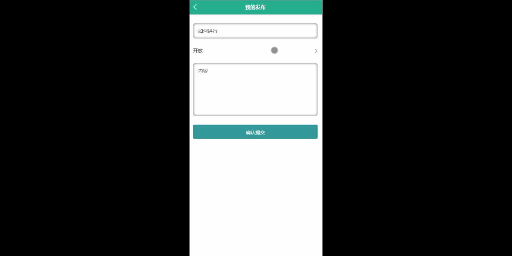
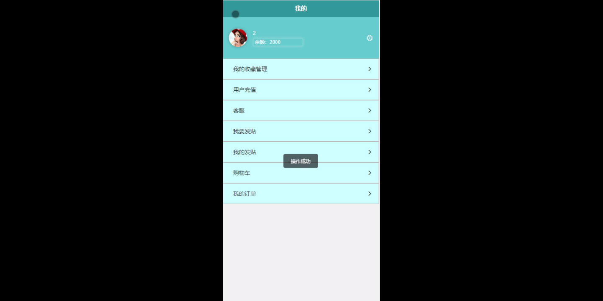
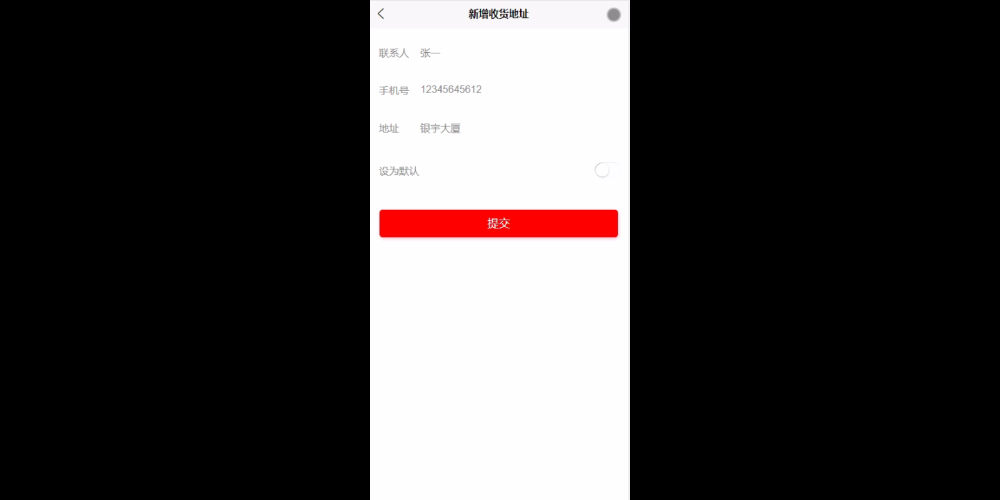
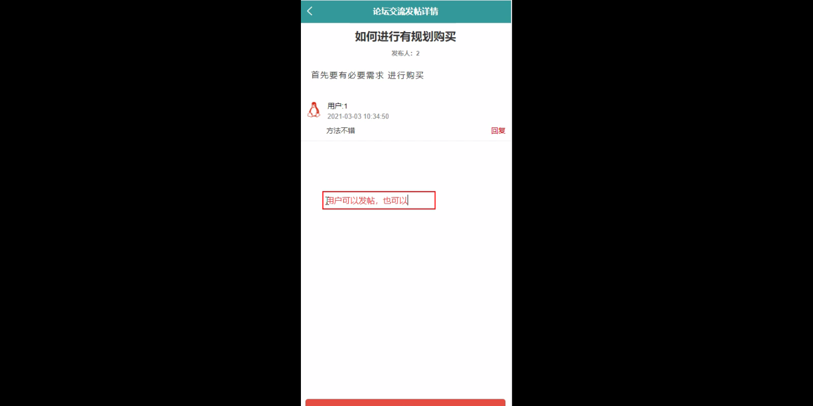

****本项目包含程序+源码+数据库+LW+调试部署环境，文末可获取一份本项目的java源码和数据库参考。****

## ******开题报告******

研究背景：
随着互联网的快速发展，二手交易市场逐渐成为人们购买和出售物品的重要渠道之一。二手交易网站作为这一市场的主要平台，为用户提供了便捷的交易环境和广泛的商品选择。然而，目前存在的问题是，由于信息不对称、信任度低以及交易安全性等方面的考虑，许多用户在进行二手交易时仍然感到不放心。因此，研究如何提高二手交易网站的用户体验和交易安全性，具有重要的现实意义。

研究意义：
本研究旨在探索并解决二手交易网站中存在的问题，提高用户的满意度和信任度，促进二手交易市场的健康发展。通过深入分析用户需求和行为特征，优化系统功能和设计，提供更好的用户体验和交易保障，将有效推动二手交易市场的繁荣，并为用户和商家创造更多的价值。

研究目的：
本研究的目的是通过对二手交易网站的研究，探索和改进现有的系统功能，提高用户的使用体验和交易安全性。具体目标包括：1.深入了解用户的需求和行为特征，为用户提供个性化的服务和推荐；2.优化商品分类和信息展示，提高用户的搜索效果和购买决策；3.加强交易安全措施，减少虚假信息和欺诈行为；4.建立良好的信任机制，增强用户对平台的信任感。

研究内容： 本研究将围绕二手交易网站的系统功能展开研究，主要包括以下方面：

  1. 用户：通过分析用户的需求和行为特征，设计个性化的用户界面和推荐系统，提高用户的使用体验和满意度。同时，建立用户评价和信誉体系，增加用户对交易伙伴的信任度。

  2. 商品类别：优化商品分类和标签体系，提高商品搜索的准确性和效率。根据用户的历史行为和兴趣偏好，推荐相关的商品类别和热门商品，提升用户的购买决策。

  3. 商品信息：改进商品信息的展示方式，增加详细的描述和真实的图片，提供更全面、准确的信息给用户。同时，加强对商品信息的审核和监管，减少虚假信息和欺诈行为。

拟解决的主要问题：
本研究旨在解决二手交易网站中存在的信息不对称、信任度低以及交易安全性等问题。通过优化系统功能和设计，提高用户的满意度和信任度，减少欺诈行为和虚假信息，促进二手交易市场的健康发展。

研究方案和预期成果：
本研究将采用综合研究方法，包括文献调研、用户调研、数据分析等，深入探索二手交易网站的问题和潜在解决方案。预期成果包括：1.针对用户需求和行为特征的分析报告；2.优化的系统功能和设计方案；3.改进后的二手交易网站原型；4.用户满意度和交易安全性的提升效果评估报告。

进度安排：

2022年9月至10月：需求分析和规划，明确系统功能和目标，制定项目计划。

2022年11月至2023年1月：系统设计和编码，完成详细的系统设计并开始编写代码。

2023年2月至3月：用户界面开发和数据库开发，开发用户友好的界面和设计数据库结构。

2023年4月至5月：功能测试、文档编写和上线部署，对系统进行全面的功能测试并编写用户手册。

2023年5月：维护和升级，定期对系统进行维护和升级，修复bug和添加新功能。

参考文献：

[1]邱小群,邓丽艳,陈海潮.基于B/S的信息管理系统设计和实现[J].信息与电脑(理论版),2022,(20):146-148.

[2]谢霜.基于Java技术的网络管理体系结构的应用[J].网络安全技术与应用,2022,(10):14-15.

[3]宋锦华.高职院校Java程序设计课程改革研究[J].科技视界,2022,(20):133-135.

[4]曹嵩彭,王鹏宇.浅析Java语言在软件开发中的应用[J].信息记录材料,2022,(03):114-116.

[5]朱澈,余俊达.武汉东湖学院.基于Java的软硬件信息管理系统V1.0[Z].项目立项编号.鉴定单位.鉴定日期:

****以上是本项目程序开发之前开题报告内容，最终成品以下面界面为准，大家可以酌情参考使用。要源码参考请在文末进行获取！！****

## ******本项目的界面展示******

