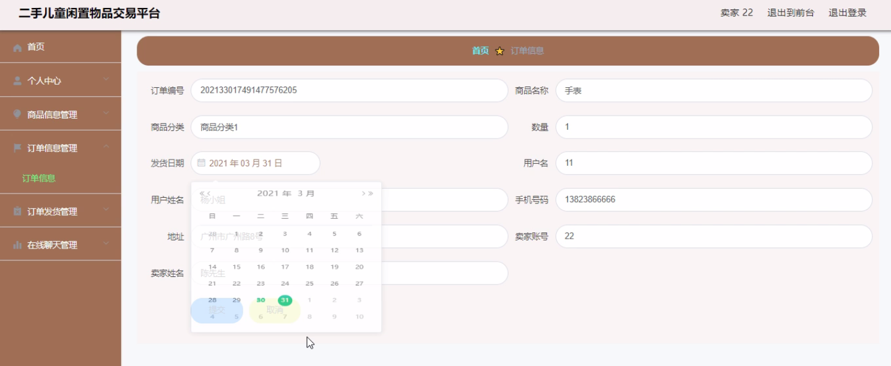

****本项目包含程序+源码+数据库+LW+调试部署环境，文末可获取一份本项目的java源码和数据库参考。****

## ******开题报告******

研究背景：
随着社会经济的发展和人们生活水平的提高，儿童闲置物品交易市场逐渐兴起。越来越多的家庭意识到，孩子们在成长过程中使用的许多物品，如玩具、衣物、书籍等，在一段时间后就会被闲置。同时，也有很多家庭希望能够以较低的价格购买到高质量的二手儿童物品。因此，建立一个专门的二手儿童闲置物品交易平台具有重要的现实意义。

研究意义：
二手儿童闲置物品交易平台的建立可以解决家庭中闲置物品的积压问题，减少资源的浪费。通过将这些闲置物品重新流通起来，不仅可以为其他家庭提供实惠的购物选择，还可以促进资源的共享和再利用，降低环境污染的风险。此外，该平台还可以为卖家提供一个便捷的销售渠道，增加家庭收入，提高生活质量。

研究目的：
本研究旨在探索二手儿童闲置物品交易平台的建设和运营模式，以满足家庭对于儿童闲置物品交易的需求。通过研究平台的功能设计、用户体验、安全性等方面的问题，提出相应的解决方案，为二手儿童闲置物品交易市场的发展做出贡献。

研究内容： 本研究将围绕二手儿童闲置物品交易平台的系统功能展开研究。具体包括以下几个方面：

  1. 用户管理：研究如何实现用户注册、登录、信息管理等功能，确保用户信息的安全和隐私保护。

  2. 卖家管理：研究如何实现卖家身份认证、商品发布、价格设置等功能，提高交易的可信度和透明度。

  3. 公告信息管理：研究如何实现平台公告的发布、展示和更新，及时向用户传达重要信息。

  4. 商品分类和信息管理：研究如何设计合理的商品分类体系，方便用户快速搜索和筛选所需商品；同时，研究如何管理商品信息，确保信息的真实性和准确性。

  5. 订单信息管理：研究如何实现用户下单、支付、退款等功能，保障交易的顺利进行。

  6. 订单发货和物流管理：研究如何实现订单发货、物流跟踪等功能，提供便捷的配送服务。

  7. 在线聊天功能：研究如何实现买家与卖家之间的在线沟通，促进交易双方的信息交流和信任建立。

拟解决的主要问题：
在二手儿童闲置物品交易平台的建设过程中，可能会面临用户信任度低、信息真实性难以保证、交易安全性不足等问题。本研究将针对这些问题提出相应的解决方案，通过技术手段和管理措施，提高平台的可信度和用户满意度。

研究方案和预期成果：
本研究将采用文献研究、案例分析和实证研究等方法，结合市场需求和用户反馈，设计并构建一个完善的二手儿童闲置物品交易平台。预期成果包括系统功能的完善和优化，用户体验的提升，交易安全性的增强，为家庭提供一个安全、便捷、高效的二手儿童闲置物品交易平台。同时，该研究还将为相关政策的制定和市场的规范发展提供参考依据。

进度安排：

2022年9月至10月：需求分析和规划，进行用户需求调研和分析，确定系统功能和目标。

2022年11月至2023年1月：系统设计和开发，完成系统架构设计和技术选型，并开始编写代码。

2023年2月至3月：测试和优化，进行单元测试和集成测试，修复问题并优化系统性能。

2023年4月至5月：文档编写和培训，编写用户手册和系统文档，并进行相关人员的培训。

2023年5月：上线部署和维护，将系统部署到生产环境中，并定期进行维护和升级。

参考文献：

[1]王振华.SpringBoot在教学效果评估系统中的应用[J].电子技术,2023,(05):67-69.

[2]王明泉.基于SpringBoot远程热部署的探索和应用[J].信息与电脑(理论版),2023,(07):1-4.

[3]王亚东,李晓霞,陈强强,剡美娜.基于SpringBoot的需求发布平台设计[J].信息与电脑(理论版),2023,(01):105-107.

[4]陈新府豪.基于SpringBoot和Vue框架的创新方法推理系统的设计与实现[D].导师：黄静.浙江理工大学,2022.

[5]霍福华,韩慧.基于SpringBoot微服务架构下前后端分离的MVVM模型[J].电子技术与软件工程,2022,(01):73-76.

[6]韩策,张娜,王松亭,张凯,何方,袁峰.SpringBoot OPC客户端设计与研究[J].电子世界,2021,(19):25-26.

****以上是本项目程序开发之前开题报告内容，最终成品以下面界面为准，大家可以酌情参考使用。要源码参考请在文末进行获取！！****

## ******本项目的界面展示******

