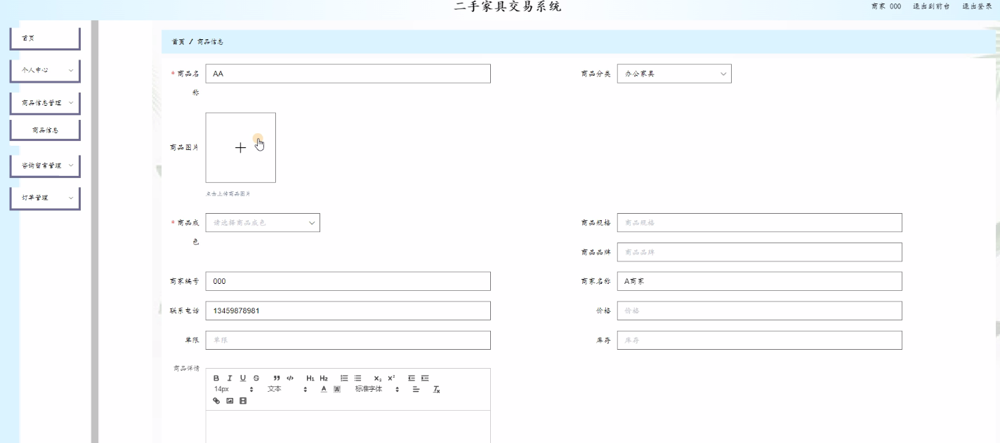
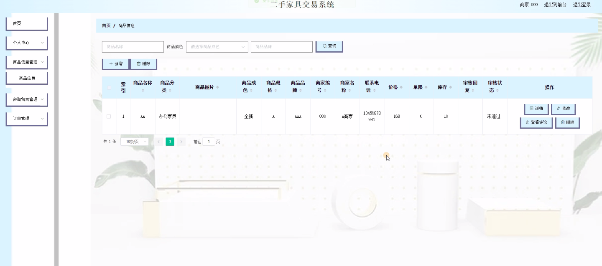
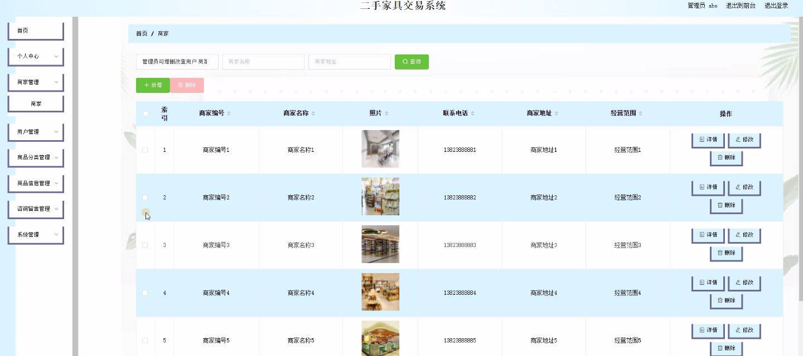
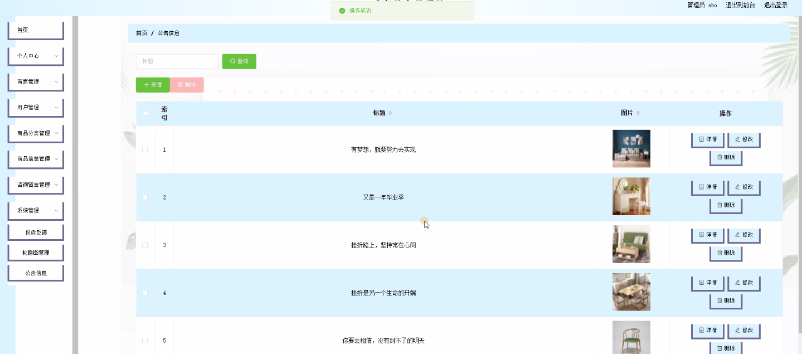

****本项目包含程序+源码+数据库+LW+调试部署环境，文末可获取一份本项目的java源码和数据库参考。****

## ******开题报告******

研究背景：
随着社会经济的发展和人们生活水平的提高，二手家具交易市场逐渐兴起。越来越多的人选择购买二手家具，以满足自己的实际需求并节约开支。然而，当前的二手家具交易系统存在一些问题，如信息不对称、信任度低、交易流程复杂等，这给用户带来了困扰。因此，建立一个高效、安全、便捷的二手家具交易系统成为迫切需要解决的问题。

研究意义：
通过研究二手家具交易系统，可以有效促进二手家具市场的发展和规范化运作。该系统可以提供更准确、全面的商品信息，增加用户对交易方的信任度，简化交易流程，提高交易效率。同时，该系统还可以促进资源的合理利用，减少环境污染，推动可持续发展。

研究目的：
本研究旨在设计和开发一个功能完善的二手家具交易系统，以解决当前存在的问题，并提升用户体验。通过该系统，商家和用户可以方便地发布和搜索二手家具信息，进行交流和洽谈，完成交易过程。同时，系统还将提供分类管理功能，方便用户根据自己的需求快速找到所需的家具。

研究内容： 本研究的主要内容包括商家管理、用户管理、商品分类管理、商品信息管理和咨询留言管理等系统功能。

  1. 商家管理：实现商家入驻、商家资质审核、商家信息管理等功能，确保商家的合法性和信誉度。

  2. 用户管理：实现用户注册、登录、个人信息管理等功能，为用户提供个性化的服务和推荐。

  3. 商品分类管理：建立完善的商品分类体系，使用户能够快速准确地找到所需的二手家具。

  4. 商品信息管理：商家可以发布二手家具的详细信息，包括图片、描述、价格等，用户可以通过搜索和筛选功能找到符合自己需求的商品。

  5. 咨询留言管理：用户可以对感兴趣的商品进行咨询和留言，商家可以及时回复，促进交流和洽谈。

拟解决的主要问题：

  1. 信息不对称：通过完善的商品信息管理和咨询留言管理功能，减少买卖双方之间的信息不对称，提高交易效率和信任度。

  2. 交易流程复杂：简化交易流程，提供一站式的服务，方便用户进行交易操作。

  3. 信任度低：通过商家资质审核和用户评价系统，提高商家和用户之间的信任度，减少交易风险。

研究方案和预期成果：
本研究将采用软件工程的方法，结合用户需求分析、系统设计和开发等技术手段，设计和实现一个二手家具交易系统。预期成果包括一个功能完善、界面友好、安全可靠的二手家具交易系统，并通过实际应用验证其效果和可行性。

进度安排：

2022年9月至10月：需求分析和规划，进行用户需求调研和分析，确定系统功能和目标。

2022年11月至2023年1月：系统设计和开发，完成系统架构设计和技术选型，并开始编写代码。

2023年2月至3月：测试和优化，进行单元测试和集成测试，修复问题并优化系统性能。

2023年4月至5月：文档编写和培训，编写用户手册和系统文档，并进行相关人员的培训。

2023年5月：上线部署和维护，将系统部署到生产环境中，并定期进行维护和升级。

参考文献：

[1]王振华.SpringBoot在教学效果评估系统中的应用[J].电子技术,2023,(05):67-69.

[2]王明泉.基于SpringBoot远程热部署的探索和应用[J].信息与电脑(理论版),2023,(07):1-4.

[3]王亚东,李晓霞,陈强强,剡美娜.基于SpringBoot的需求发布平台设计[J].信息与电脑(理论版),2023,(01):105-107.

[4]陈新府豪.基于SpringBoot和Vue框架的创新方法推理系统的设计与实现[D].导师：黄静.浙江理工大学,2022.

[5]霍福华,韩慧.基于SpringBoot微服务架构下前后端分离的MVVM模型[J].电子技术与软件工程,2022,(01):73-76.

[6]韩策,张娜,王松亭,张凯,何方,袁峰.SpringBoot OPC客户端设计与研究[J].电子世界,2021,(19):25-26.

****以上是本项目程序开发之前开题报告内容，最终成品以下面界面为准，大家可以酌情参考使用。要源码参考请在文末进行获取！！****

## ******本项目的界面展示******

