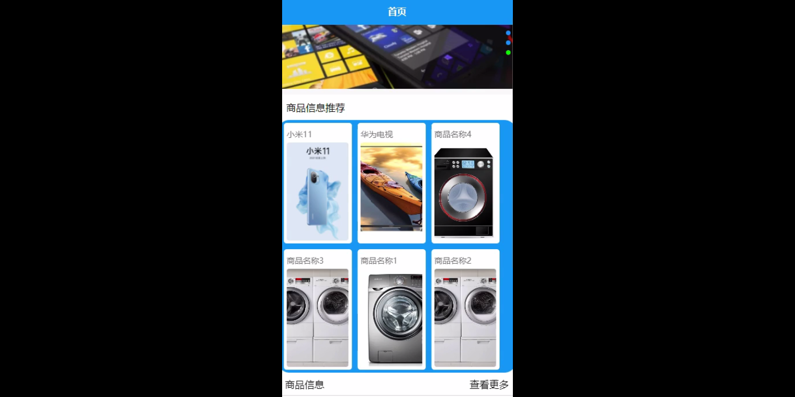
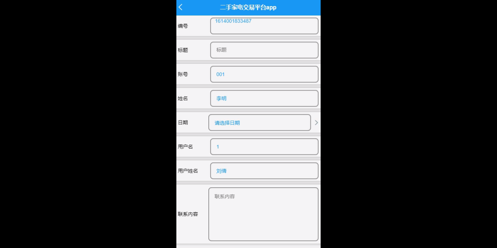
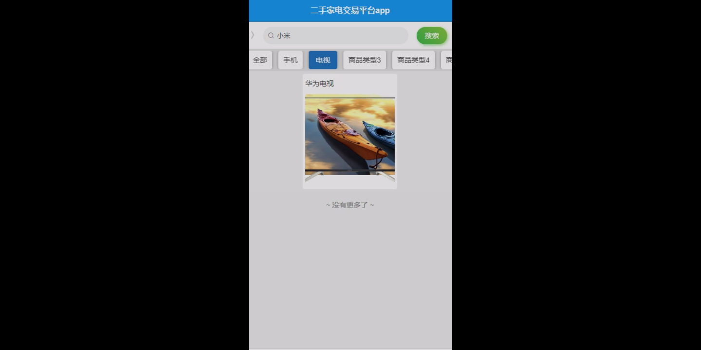
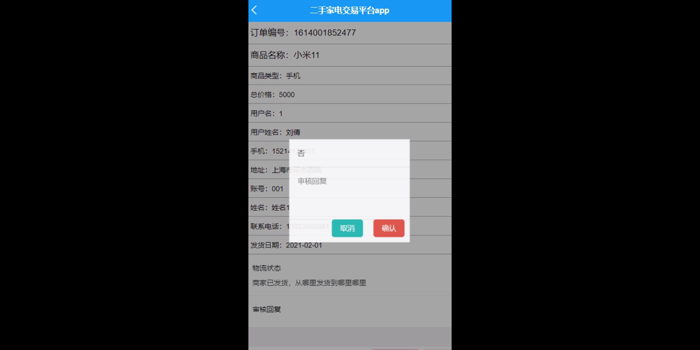

****本项目包含程序+源码+数据库+LW+调试部署环境，文末可获取一份本项目的java源码和数据库参考。****

## ******开题报告******

研究背景：
随着社会经济的发展和科技的进步，二手家电交易市场逐渐兴起并蓬勃发展。二手家电交易平台作为其中的重要组成部分，为用户提供了一个便捷、高效的交易平台，使得买卖双方能够更加方便地进行交流和交易。然而，目前存在的问题是，由于信息不对称、信任度低等因素，用户在使用二手家电交易平台时面临一些困扰和风险。因此，有必要对二手家电交易平台进行深入研究，以提高其安全性、可靠性和用户体验。

研究意义：
二手家电交易平台的研究具有重要的现实意义。首先，通过研究二手家电交易平台，可以促进二手家电市场的规范化和健康发展，为用户提供更好的购买和销售体验。其次，研究二手家电交易平台可以探索信息技术在传统产业中的应用，推动数字经济的发展。最后，研究二手家电交易平台还可以为相关政策制定和监管提供参考，保护消费者权益，维护市场秩序。

研究目的：
本研究旨在深入分析二手家电交易平台的功能和特点，探讨其存在的问题和挑战，并提出相应的解决方案，以提高用户体验和交易安全性。具体而言，我们的目标是优化系统功能，提升用户、商家和商品信息管理的效率和准确性，改善订单处理和评价体系，加强用户与商家之间的沟通和信任，从而促进二手家电交易平台的健康发展。

研究内容：
本研究将重点关注以下系统功能：用户管理、商家管理、商品类型管理、商品信息管理、订单信息管理、订单发货管理、订单评价管理、联系卖家、联系回复等。通过对这些功能的深入研究和分析，我们将提出相应的优化方案和技术支持，以解决当前存在的主要问题，提高系统的可用性和用户满意度。

拟解决的主要问题：

  1. 信息不对称：用户在购买二手家电时往往难以获取到准确、全面的商品信息，导致购买风险增加。
  2. 信任度低：由于缺乏有效的信任机制，用户对商家的信任度较低，不愿意进行交易。
  3. 交易安全性：存在一些不法分子利用二手家电交易平台进行欺诈行为的情况，给用户带来损失和困扰。

研究方案：
本研究将采用综合性的研究方法，包括文献调研、实地调查、数据分析等。首先，我们将对现有的二手家电交易平台进行调研和分析，了解其功能和特点，找出存在的问题和挑战。然后，我们将结合用户需求和技术支持，提出相应的改进方案和优化策略。最后，我们将通过实地调查和数据分析，评估所提出方案的有效性和可行性。

预期成果：
通过本研究，我们期望能够提出一套完善的二手家电交易平台系统，解决当前存在的问题，提高用户体验和交易安全性。具体而言，我们希望能够优化系统功能，提升用户、商家和商品信息管理的效率和准确性，改善订单处理和评价体系，加强用户与商家之间的沟通和信任。同时，我们也希望通过本研究的成果，为相关政策制定和监管提供参考，推动二手家电市场的规范化和健康发展。

进度安排：

2022年9月至10月：需求分析和规划，进行用户需求调研和分析，确定系统功能和目标。

2022年11月至2023年1月：系统设计和开发，完成系统架构设计和技术选型，并开始编写代码。

2023年2月至3月：测试和优化，进行单元测试和集成测试，修复问题并优化系统性能。

2023年4月至5月：文档编写和培训，编写用户手册和系统文档，并进行相关人员的培训。

2023年5月：上线部署和维护，将系统部署到生产环境中，并定期进行维护和升级。

参考文献：

[1]王振华.SpringBoot在教学效果评估系统中的应用[J].电子技术,2023,(05):67-69.

[2]王明泉.基于SpringBoot远程热部署的探索和应用[J].信息与电脑(理论版),2023,(07):1-4.

[3]王亚东,李晓霞,陈强强,剡美娜.基于SpringBoot的需求发布平台设计[J].信息与电脑(理论版),2023,(01):105-107.

[4]陈新府豪.基于SpringBoot和Vue框架的创新方法推理系统的设计与实现[D].导师：黄静.浙江理工大学,2022.

[5]霍福华,韩慧.基于SpringBoot微服务架构下前后端分离的MVVM模型[J].电子技术与软件工程,2022,(01):73-76.

[6]韩策,张娜,王松亭,张凯,何方,袁峰.SpringBoot OPC客户端设计与研究[J].电子世界,2021,(19):25-26.

****以上是本项目程序开发之前开题报告内容，最终成品以下面界面为准，大家可以酌情参考使用。要源码参考请在文末进行获取！！****

## ******本项目的界面展示******

