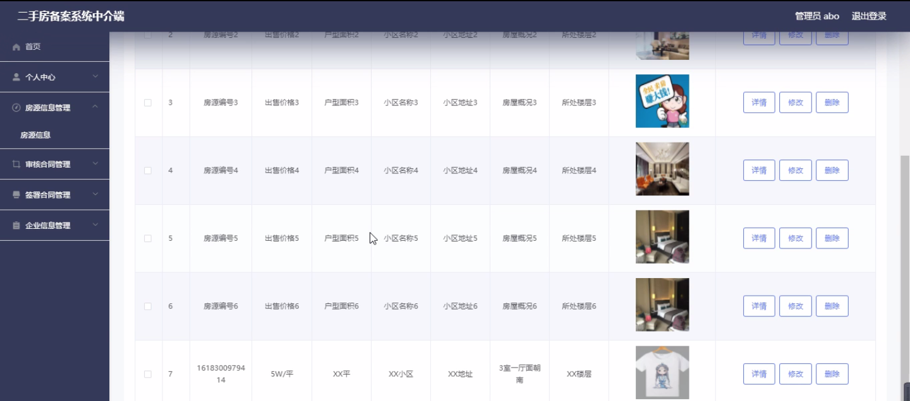
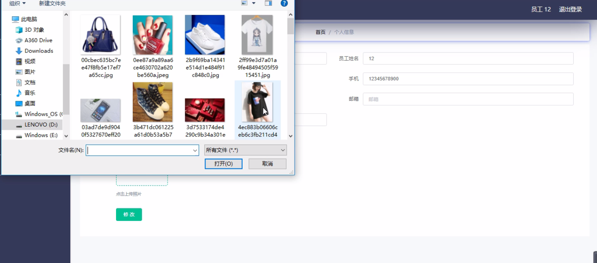
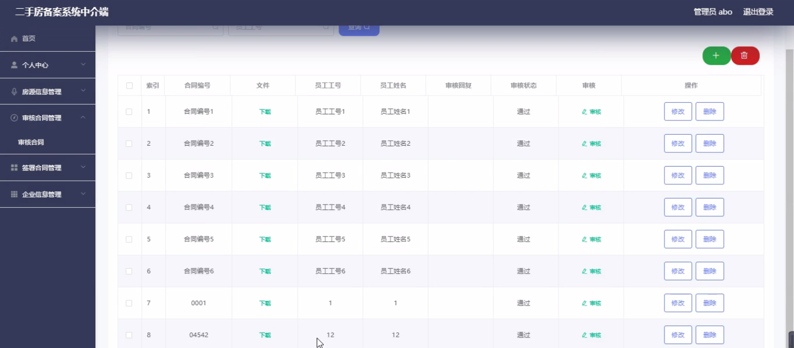
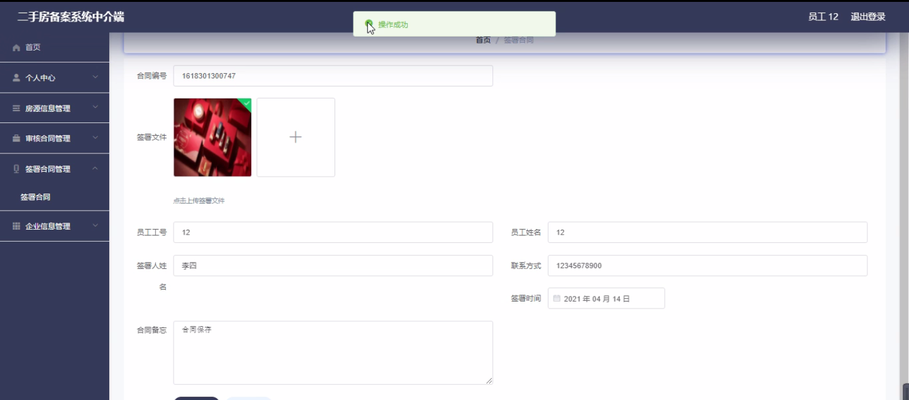

****本项目包含程序+源码+数据库+LW+调试部署环境，文末可获取一份本项目的java源码和数据库参考。****

## ******开题报告******

研究背景：
随着城市化进程的不断推进，二手房交易市场逐渐成为我国房地产市场的重要组成部分。然而，在二手房交易过程中，由于信息不对称、合同风险等问题，给买卖双方带来了很多困扰和风险。为了保护消费者的权益，提高交易的透明度和效率，建立一个完善的二手房备案系统是非常必要的。

研究意义：
二手房备案系统作为中介端的重要工具，可以有效整合和管理员工、房源信息、审核合同、签署合同、企业信息等系统功能，为二手房交易提供全方位的支持和服务。通过研究该系统，可以更好地理解和掌握二手房交易的运行机制，为相关从业人员提供科学的指导和规范，促进二手房市场的健康发展。

研究目的：
本研究旨在深入分析二手房备案系统中介端的功能和特点，探索其在二手房交易中的应用价值和作用，为相关从业人员提供科学的指导和规范，促进二手房市场的健康发展。通过对系统功能的研究，可以为二手房交易提供更加便捷、高效、安全的服务，提升买卖双方的交易体验和满意度。

研究内容： 本研究将围绕二手房备案系统中介端的员工管理、房源信息管理、审核合同、签署合同、企业信息等系统功能展开深入研究。具体包括以下几个方面：

  1. 员工管理：研究如何科学合理地分配和管理中介机构的员工资源，提高员工的工作效率和服务质量。
  2. 房源信息管理：研究如何完善房源信息的录入、更新和查询功能，提高房源信息的准确性和可靠性。
  3. 审核合同：研究如何建立合同审核机制，确保合同的合法性和有效性，降低交易风险。
  4. 签署合同：研究如何实现线上签署合同的功能，提高交易的便捷性和效率。
  5. 企业信息管理：研究如何管理中介机构的企业信息，包括资质认证、信用评级等，提高市场竞争力。

拟解决的主要问题： 在二手房备案系统中介端的研究过程中，主要解决以下问题：

  1. 如何提高员工管理的科学性和有效性？
  2. 如何确保房源信息的准确性和可靠性？
  3. 如何建立合同审核机制，降低交易风险？
  4. 如何实现线上签署合同的功能，提高交易效率？
  5. 如何管理中介机构的企业信息，提高市场竞争力？

研究方案和预期成果： 本研究将采用文献研究、案例分析、问卷调查等方法，结合实际情况进行综合分析和探索。预期的研究成果包括：

  1. 提出一套完善的员工管理模式，提高员工的工作效率和服务质量。
  2. 设计一个高效的房源信息管理系统，提高房源信息的准确性和可靠性。
  3. 建立合同审核机制，确保合同的合法性和有效性，降低交易风险。
  4. 开发一个便捷的线上签署合同功能，提高交易的效率和便利性。
  5. 提供一套科学的企业信息管理方案，提高中介机构的市场竞争力。

进度安排：

2022年9月至10月：开题报告编写和提交，完成开题报告的撰写并提交给指导教师进行审核。

2022年11月至2023年1月：系统设计和开发，根据开题报告的要求，进行系统设计和编码工作。

2023年2月至3月：论文撰写和初稿完成，开始撰写论文，并在这个阶段完成论文的初稿。

2023年4月至5月：论文修改和最终定稿，根据指导教师的意见对论文进行修改，并完成最终的定稿。

2023年5月：论文答辩和提交，参加论文答辩并根据答辩结果进行修改，最后将论文提交给学院或学校。

参考文献：

[1]喻佳,吴丹新.基于SpringBoot的Web快速开发框架[J].电脑编程技巧与维护,2021,(09):31-33.

[2]李鹏.基于SpringBoot快速开发平台的实现[J].电子技术与软件工程,2021,(12):36-37.

[3]叶开平,蔡维晟,陈家敏,邓斯妮.基于SpringBoot的综测可视化管理系统的研究与设计[J].电脑知识与技术,2021,(12):100-104.

[4]江健锋,徐振平.Springboot最小系统的设计与实现[J].电脑知识与技术,2021,(04):62-63.

[5]赵炯,司圣杰,周奇才,熊肖磊.通用信息获取系统设计与实现[J].起重运输机械,2020,(16):89-97.

[6]吴英宾.一种内外网数据交互系统的设计与实现[J].软件工程,2020,(08):25-27.

****以上是本项目程序开发之前开题报告内容，最终成品以下面界面为准，大家可以酌情参考使用。要源码参考请在文末进行获取！！****

## ******本项目的界面展示******

