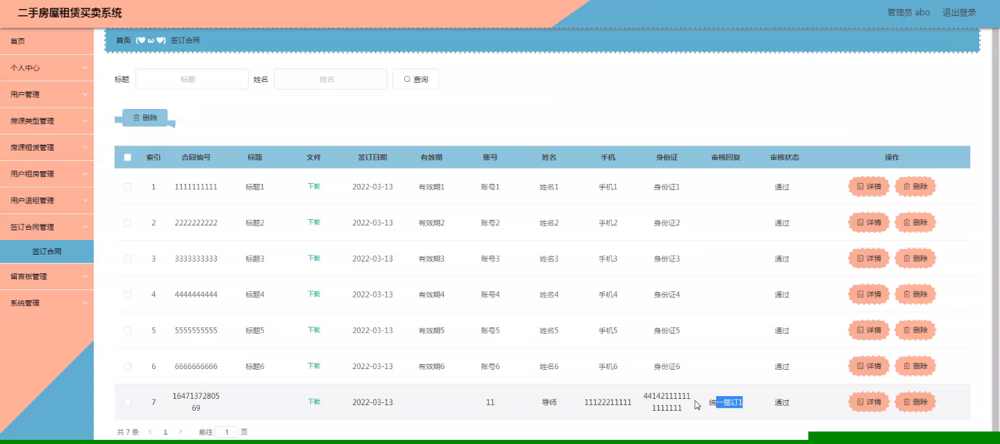

****本项目包含程序+源码+数据库+LW+调试部署环境，文末可获取一份本项目的java源码和数据库参考。****

## ******开题报告******

研究背景：
随着城市化进程的加快和人口的不断增长，房地产市场成为一个重要的经济领域。在这个过程中，二手房屋租赁买卖系统的建立和发展变得尤为重要。传统的房屋租赁买卖方式存在信息不对称、交易成本高等问题，给用户和市场带来了很多不便和风险。因此，建立一个高效、安全、透明的二手房屋租赁买卖系统具有重要的现实意义。

研究意义：
二手房屋租赁买卖系统的建立可以有效解决传统方式存在的问题，提供更好的服务和保障，促进房地产市场的健康发展。通过系统的搭建，可以实现房源信息的集中管理和共享，提高信息的透明度，减少信息不对称带来的交易风险。同时，系统还可以提供更多的选择和便利，提高用户的满意度和体验，推动房屋租赁买卖市场的规范化和专业化。

研究目的：
本研究旨在设计和开发一套完整的二手房屋租赁买卖系统，通过引入先进的信息技术和管理模式，解决传统方式存在的问题，提高交易效率和质量。具体目标包括：提供用户友好的界面和操作流程，方便用户进行房源查询、租赁和购买等操作；建立完善的房源信息管理机制，确保信息的真实性和准确性；设计合理的合同签订和履约机制，保障交易双方的权益；提供退租和售后服务，增加用户的信任和满意度。

研究内容： 本研究的主要内容基于二手房屋租赁买卖系统的功能，包括以下方面：

  1. 用户管理：设计用户注册、登录、个人信息管理等功能，确保用户身份的真实性和安全性。
  2. 房源类型管理：建立房源分类体系，包括公寓、别墅、商铺等，方便用户按需求进行筛选。
  3. 房源信息管理：实现房源信息的发布、修改、删除等功能，确保信息的及时更新和准确性。
  4. 用户租房：提供用户查看房源、预约看房、在线支付租金等功能，简化租房流程。
  5. 签订合同：设计合同模板和电子签名功能，确保合同的合法性和有效性。
  6. 用户退租：提供用户申请退租、退还押金等功能，简化退租流程。
  7. 用户购房：提供用户查看房源、预约看房、在线支付购房款等功能，方便用户进行购房操作。

拟解决的主要问题：
通过建立二手房屋租赁买卖系统，我们将解决传统方式存在的信息不对称、交易成本高等问题。系统的引入可以提高信息的透明度和准确性，降低交易风险；同时，系统的智能化设计和操作流程的优化，可以提高交易效率和用户满意度。

研究方案和预期成果：
在研究方案上，我们将采用软件工程的方法，包括需求分析、系统设计、开发实现和测试等环节，逐步完成二手房屋租赁买卖系统的建设。预期成果包括一个完善的系统原型，并在实际应用中得到验证和改进。通过该系统的推广和应用，我们期望能够提高房地产市场的交易效率和质量，促进城市经济的可持续发展。

进度安排：

2022年9月至10月：需求分析和规划，明确系统功能和目标，制定项目计划。

2022年11月至2023年1月：系统设计和编码，完成详细的系统设计并开始编写代码。

2023年2月至3月：用户界面开发和数据库开发，开发用户友好的界面和设计数据库结构。

2023年4月至5月：功能测试、文档编写和上线部署，对系统进行全面的功能测试并编写用户手册。

2023年5月：维护和升级，定期对系统进行维护和升级，修复bug和添加新功能。

参考文献：

[1]邱小群,邓丽艳,陈海潮.基于B/S的信息管理系统设计和实现[J].信息与电脑(理论版),2022,(20):146-148.

[2]谢霜.基于Java技术的网络管理体系结构的应用[J].网络安全技术与应用,2022,(10):14-15.

[3]宋锦华.高职院校Java程序设计课程改革研究[J].科技视界,2022,(20):133-135.

[4]曹嵩彭,王鹏宇.浅析Java语言在软件开发中的应用[J].信息记录材料,2022,(03):114-116.

[5]朱澈,余俊达.武汉东湖学院.基于Java的软硬件信息管理系统V1.0[Z].项目立项编号.鉴定单位.鉴定日期:

****以上是本项目程序开发之前开题报告内容，最终成品以下面界面为准，大家可以酌情参考使用。要源码参考请在文末进行获取！！****

## ******本项目的界面展示******

