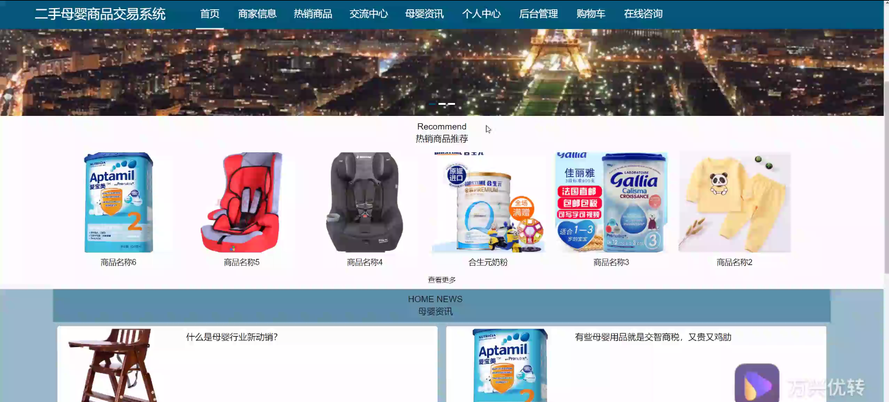
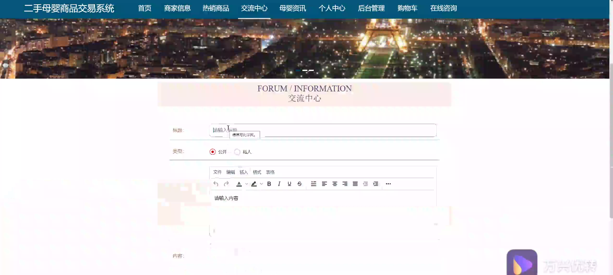
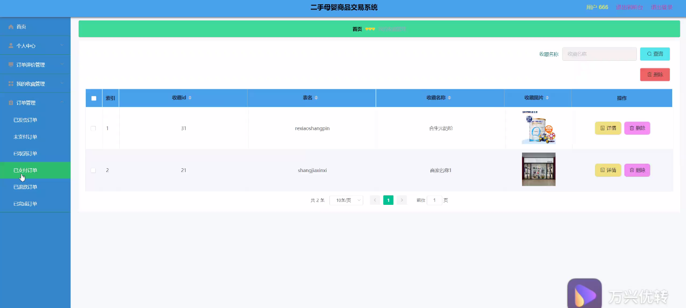
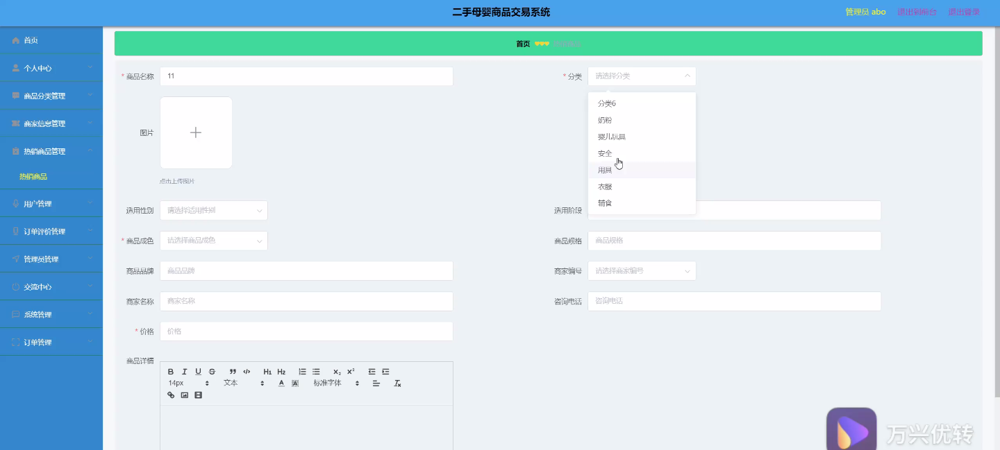
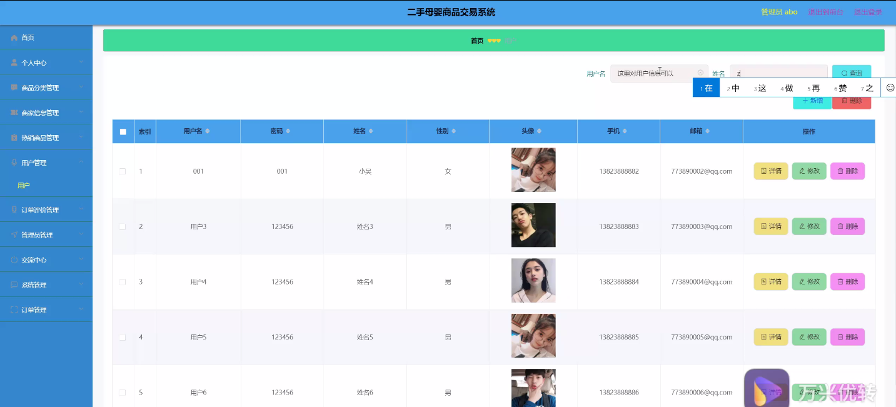
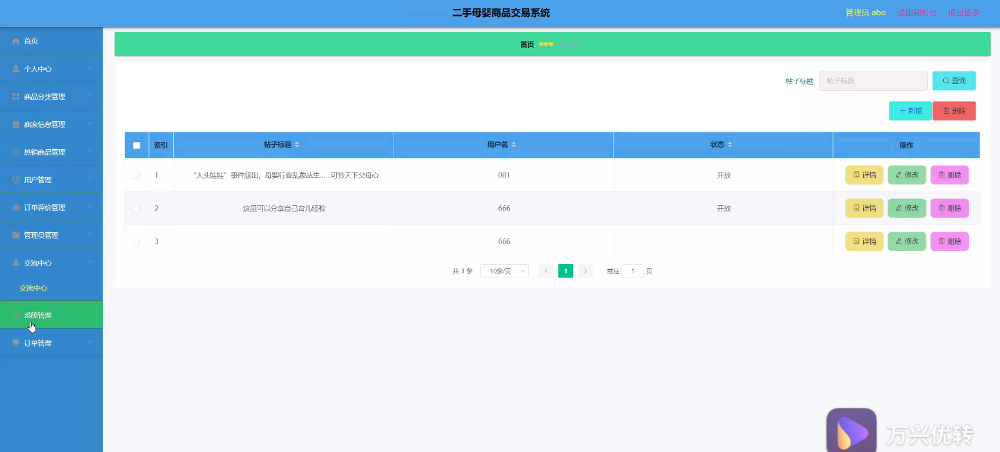
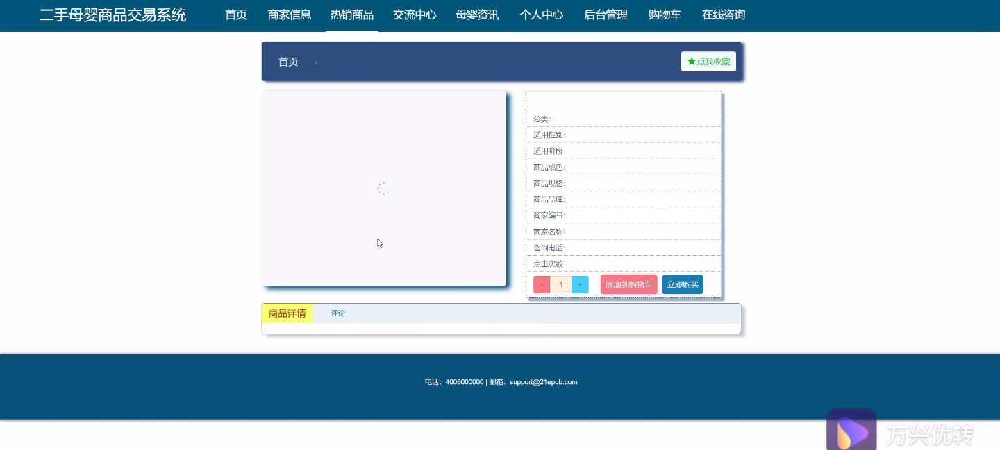

****本项目包含程序+源码+数据库+LW+调试部署环境，文末可获取一份本项目的java源码和数据库参考。****

## ******开题报告******

研究背景：
随着社会经济的发展和人们生活水平的提高，母婴商品的需求逐渐增加。然而，购买全新的母婴商品往往价格昂贵，对于一些家庭来说是一个负担。与此同时，许多家庭在孩子长大后，也面临着处理闲置母婴商品的问题。因此，二手母婴商品交易系统的建立具有重要的现实意义。

研究意义：
二手母婴商品交易系统可以为家庭提供一个便捷、安全的交易平台，使得闲置的母婴商品能够得到合理的再利用。通过这个系统，家庭可以以较低的成本购买到高质量的二手母婴商品，满足孩子成长过程中的需要。同时，卖家也可以通过这个系统将闲置的母婴商品变现，减少资源浪费，实现资源的有效利用。

研究目的：
本研究旨在设计和开发一个二手母婴商品交易系统，通过该系统提供商品分类、热销商品、商家信息、用户、订单评价等功能，以满足家庭对于二手母婴商品的需求。通过该系统，用户可以方便地浏览和搜索二手母婴商品，与卖家进行交流，并进行安全、可靠的交易。

研究内容： 本研究的主要内容包括以下几个方面：

  1. 商品分类：设计合理的分类体系，将二手母婴商品按照不同的类型进行分类，以方便用户查找和选择。

  2. 热销商品：根据用户的购买行为和评价信息，分析和推荐热销的二手母婴商品，提供给用户参考。

  3. 商家信息：建立商家信息数据库，收集和展示各个商家的信誉和评价信息，帮助用户选择可靠的卖家。

  4. 用户管理：实现用户注册、登录、个人信息管理等功能，保障用户的个人隐私和账户安全。

  5. 订单评价：为用户提供订单评价功能，让用户可以对购买的二手母婴商品进行评价和反馈，提高交易的透明度和可信度。

拟解决的主要问题： 在设计和开发二手母婴商品交易系统的过程中，我们将重点解决以下问题：

  1. 如何设计一个简洁直观、易于使用的用户界面，提升用户体验。

  2. 如何确保交易的安全性和可靠性，防止欺诈行为的发生。

  3. 如何提供准确、及时的商品信息，满足用户对于商品质量和描述的需求。

  4. 如何建立商家信誉评价体系，帮助用户选择可靠的卖家。

  5. 如何保护用户个人隐私和账户安全，防止信息泄露和盗用。

研究方案和预期成果：
我们将采用用户需求调研、系统设计和开发、功能测试等方法，逐步完成二手母婴商品交易系统的建设。预期的成果包括一个完善的系统平台，能够提供商品分类、热销商品、商家信息、用户、订单评价等功能，并且具备良好的用户体验和安全性。通过该系统，用户可以方便地进行二手母婴商品的交易，实现资源的再利用，减少浪费，促进可持续发展。

进度安排：

2022年9月至10月：开题报告编写和提交，完成开题报告的撰写并提交给指导教师进行审核。

2022年11月至2023年1月：系统设计和开发，根据开题报告的要求，进行系统设计和编码工作。

2023年2月至3月：论文撰写和初稿完成，开始撰写论文，并在这个阶段完成论文的初稿。

2023年4月至5月：论文修改和最终定稿，根据指导教师的意见对论文进行修改，并完成最终的定稿。

2023年5月：论文答辩和提交，参加论文答辩并根据答辩结果进行修改，最后将论文提交给学院或学校。

参考文献：

[1]喻佳,吴丹新.基于SpringBoot的Web快速开发框架[J].电脑编程技巧与维护,2021,(09):31-33.

[2]李鹏.基于SpringBoot快速开发平台的实现[J].电子技术与软件工程,2021,(12):36-37.

[3]叶开平,蔡维晟,陈家敏,邓斯妮.基于SpringBoot的综测可视化管理系统的研究与设计[J].电脑知识与技术,2021,(12):100-104.

[4]江健锋,徐振平.Springboot最小系统的设计与实现[J].电脑知识与技术,2021,(04):62-63.

[5]赵炯,司圣杰,周奇才,熊肖磊.通用信息获取系统设计与实现[J].起重运输机械,2020,(16):89-97.

[6]吴英宾.一种内外网数据交互系统的设计与实现[J].软件工程,2020,(08):25-27.

****以上是本项目程序开发之前开题报告内容，最终成品以下面界面为准，大家可以酌情参考使用。要源码参考请在文末进行获取！！****

## ******本项目的界面展示******

